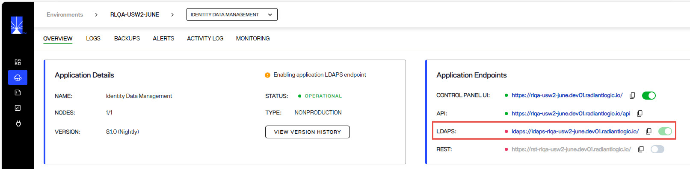
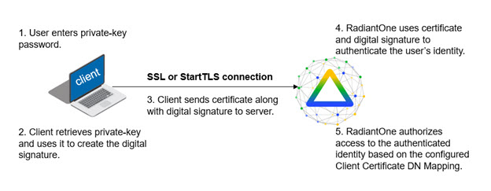
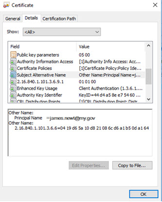
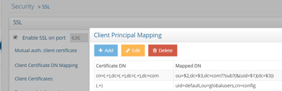

## Overview

The RadiantOne platform offers a variety of methods to ensure a secure service that has been hardened against threats can be deployed. These methods include:
-  Access Controls
-  Access Tokens
-  Attribute Encryption
-  SSL/TLS Communication to the RadiantOne Service.
-  SSL/TLS Communication to backend Identity Data Sources
-  Support for External OIDC Token Validators
-  Password Policies

## Access Controls

Authorization on the RadiantOne namespace is enforced with LDAP Access Controls. LDAP Access Control Lists (ACLs) specify which users or groups have permission to perform specific actions on the RadiantOne namespace. These dictate who can see, modify or delete data within the RadiantOne namespace. Permissions are checked every time a user tries to perform an action on the object. If a user doesn't have permission, the operation is denied and an error message is returned.

LDAP ACLs work by combining both access control rules and access control instructions. Access control rules are used to define which users or groups have permission to perform specific actions on objects within the directory. Access control instructions provide detailed information about the type of access that is granted or denied for each rule.

See [Managing RadiantOne Access Controls](./access-controls) for details.

## Access Tokens

Access tokens are used by applications to make API requests on behalf of a user. The access token represents the authorization of a specific application to access specific parts of a user’s data. Access tokens can be created to call the RadiantOne configuration API, or the data management APIs (via SCIMv2 or the RadiantOne Restful Web Service named ADAP).

See [Managing Access Tokens](./access-tokens) for details.

## Attribute Encryption

RadiantOne Identity Data Management supports encryption for attributes at-rest stored in RadiantOne Directory stores and data exported in LDIF files.
For RadiantOne Directory stores, a security key must be configured and the list of attributes to encrypt must be defined.
For LDIF file encryption, a security key must be configured and the LDIFZ file type must be selected when managing LDIF files for export or import.

See [Managing Attribute Encryption](./attribute-encryption) for details.

## SSL/TLS Communication to the RadiantOne Service

For SaaS deployments, you can enable the LDAPS endpoint in the Environment Operations Center.
Expand your environment and click on the Identity Data Management application.
In the Application Endpoints section, toggle on the LDAPS endpoint. This takes about 10 minutes to activate.

For self-managed deployments, you need to map the interal LDAPS service port for external traffic using your ingress configuration.

### Mutual Authentication: Certificate-based Authentication

>[!warn] To enable mutual authentication (mTLS) in self-managed deployments of Identity Data Management, you must configure your ingress/load balancer to pass through the TLS certificate from the client. Mutual authentication can be enabled upon request in SaaS deployments. Contact the Radiant Logic support team if you would like to request enabling this feature in your SaaS tenant. 

A certificate is an electronic document that identifies an entity which can be an individual, a server, a company, or some other entity. The certificate also associates the entity with a public key.

For normal SSL communications, where the only requirement is that the client trusts the server, no additional configuration is necessary (if both entities trust each other). For mutual authentication, where there is a reciprocal trust relationship between the client and the server, the client must generate a certificate containing his identity and private key in his keystore. The client must also make a version of the certificate containing his identity and public key, which RadiantOne must store in its truststore. In turn, the client needs to trust the server; this is accomplished by importing the server's CA certificate into the client truststore.

>[!note] Certificate-based authentication (mutual authentication) requires the use of SSL for the communication between the client and RadiantOne.

The diagram below shows how certificates and the SSL protocol are used together for authentication.

There are three options for mutual authentication and this can be set from the Classic Control Panel > Settings Tab > Security section > SSL > Mutual Auth. Client Certificate drop-down menu: Required, Requested and None (default value). If mutual authentication is required, choose the Required option. If this option is selected, it forces a mutual authentication. If the client fails to provide a valid certificate which can be trusted by RadiantOne, authentication fails, and the TCP/IP connection is dropped.

If mutual authentication is not required, but you would like RadiantOne to request a certificate from the client, choose the Requested option. In this scenario, if the client provides a valid/trusted certificate, a mutual authentication connection is established. If the certificate presented is invalid, the authentication fails. If no certificate is presented, the connection continues (using a simple LDAP bind) but is not mutual authentication.

If you do not want RadiantOne to request a client certificate at all, check the None option.

If the client certificate is not signed by a known certificate authority, it must be added in the [RadiantOne client truststore](#client-certificate-truststore).

**Requiring Certificate-based Authentication**

If you want to require certificate-based authentication:

1. The client must trust the RadiantOne server certificate (import the RadiantOne public key certificate into the client truststore, unless the server certificate has been signed by a certificate authority known/trusted by the client).

2. The RadiantOne service must trust the client (import the client’s public key certificate into the [RadiantOne client truststore](#client-certificate-truststore), unless the client certificate is signed by a known/trusted certificate authority).

3. From the Classic Control Panel > Settings Tab > Security section > SSL, make sure SSL is enabled.

4. From the Classic Control Panel > Settings Tab > Security section > SSL > Mutual Auth. Client Certificate drop-down menu, select Required.

5. From the Classic Control Panel > Settings Tab > Security section > SSL, click **Change** next to Client Certificate DN Mapping and define your mappings.

>[!warn] The Client Certificate DN Mapping is only accessible by a member of the Directory Administrator role/group.

6. Click **Save** and restart the RadiantOne service. 

**Client Certificate DN Mapping**

To authorize a user who authenticates using a certificate (e.g. SASL External) you must set a client certificate DN mapping. This maps the user DN (Subject or Subject Alternate Name from the certificate) to a specific DN in the RadiantOne namespace. After, the DN in the RadiantOne namespace determines authorization (access controls). 

>[!note] To avoid problems with special characters, RadiantOne normalizes the certificate subject prior to applying the certificate DN mapping.

To set the client certificate DN mapping:

1. Go to the Classic Control Panel > Settings Tab > Security Section > SSL sub-section.

2. Click **Change** next to the Client Certificate DN Mapping property.

>[!warn] The Client Certificate DN Mapping is only accessible by a member of the Directory Administrator role/group.

There are different ways to determine the DN from the subject or subject alternative name in the certificate (using regular expression syntax).

Setting a specific subject or subject alternative name to DN in the RadiantOne namespace:

`cn=lcallahan,dc=rli,dc=com (the user DN in the certificate) -> (maps to) cn= laura Callahan,cn=users,dc=mycompany,dc=com`

Specify a Base DN, scope of the search, and a search filter to search for the user based on the subject or subject alternative name received in the certificate:

`uid=(.+),dc=rli,dc=com -> dc=domain1,dc=com??sub?(sAMAccountName=$1)`

If RadiantOne received a certificate subject of uid=lcallahan,dc=rli,dc=com then it would look for the virtual entry based on:

`dc=domain1,dc=com??sub?(sAMAccountName=lcallahan)`

Then, authorization would be based on the user DN that is returned.

As another option, multiple variables can be used (not just 1 as described in the previous example). Let’s take a look at an example mapping that uses multiple variables:

`cn=(.+),dc=(.+),dc=(.+),dc=com -> (maps to) ou=$2,dc=$3,dc=com??sub?(&(uid=$1)(dc=$3))`

If RadiantOne received a subject from the certificate that looked like: cn=laura_callahan,dc=ny,dc=radiant,dc=com, the search that would be issued would look like:

`ou=ny,dc=radiant,dc=com??sub?(&(uid=laura_callahan)(dc=radiant))`

RadiantOne uses the DN returned in the search result to base authorization on. 

If the subject in the SSL certificate is blank, you can specify that a Subject Alternative Name (SAN) should be used. You can use an alternative name in the mapping by specifying {alt} before the regular expression. For example: {alt}^(.+)$ uses the first alternative name found. You can be more specific and specify which alternative name in the certificate that you want to match by specifying the type [0-8]. For example: {alt:0}^(.+)$ uses the otherName alternative name. The type number associated with each is shown below.

otherName                         [0]
 rfc822Name                       [1]
  dNSName                          [2]
  x400Address                      [3]
  directoryName                   [4]
  ediPartyName                    [5]
  uniformResourceIdentifier  [6]
  iPAddress                           [7]
  registeredID                        [8]

For example, {alt:0}^(.+)@my.gov$ defined as the Certificate DN captures "james.newt" for the certificate shown below.

 
If all mapping rules fail to locate a user, anonymous access is granted (if anonymous access is allowed to RadiantOne).

>[!note] As an alternative to anonymous access, it is generally recommended that you create a final mapping that results in associating the authenticated user with a default user that has minimum access rights. An example is shown below where the last mapping rule matches to a user identified in RadiantOne as “uid=default,ou=globalusers,cn=config”.

## Client Certificate Truststore

RadiantOne supports SSL/TLS to ensure secure connections are made to identity data sources (backends) and support mutual authentication from clients (frontend). The certificates in the Client Certificate Trust Store are used by RadiantOne to establish these secure connections. Therefore, the appropriate client (public key) certificate (associated with the server certificate of the backend) needs imported into the Client Certificate Trust Store (unless they are signed by a trusted/known Certificate Authority).

See [Managing Client Certificates](./client-cert-truststore) for details.

## External Access Token Validators

Externally-managed OIDC access tokens can be used to query the RadiantOne Restful Web Service (ADAP). To support this, an external token validator must be configured for the provider that will issue the access tokens. This would be an alternative to using the RadiantOne internally-issued access tokens described above.

See [Managing External Token Validators](./external-token-validators) for details.

## Password Policies

Password policies include a set of rules that control how passwords are used and managed in RadiantOne Identity Data Management. RadiantOne support policies that address password expiration, failed login attempts, and password quality rules.  These policy rules ensure that users change their passwords periodically, use passwords that meet the organization's password quality requirements, and that accounts are locked after a defined number of invalid authentication attempts.

RadiantOne offers a default password policy that controls all RadiantOne Directory stores and persistent cached identity views. However, custom password policies can be defined for fine-grained control.

See [Managing Password Policies](./password-policies) for details.

