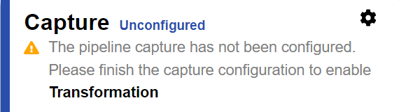
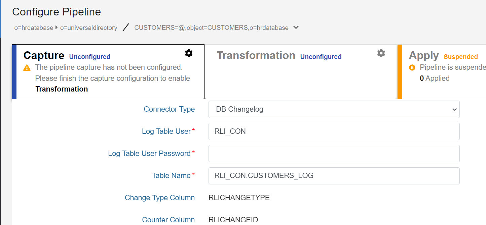
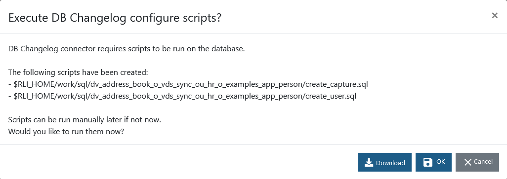
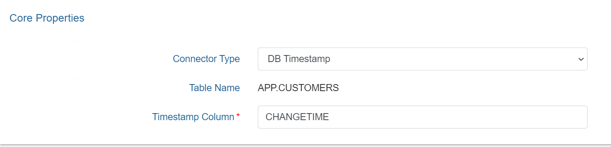
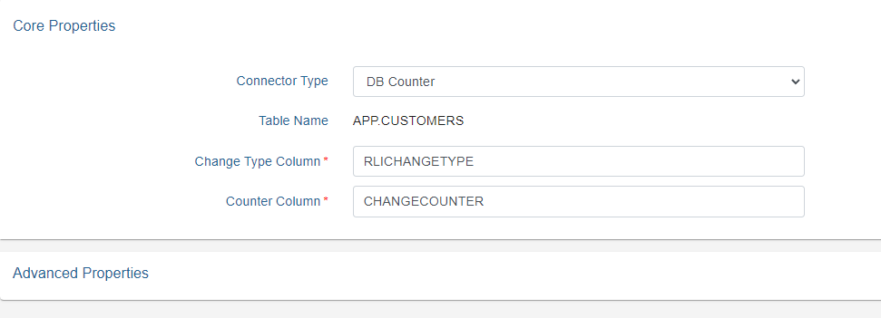
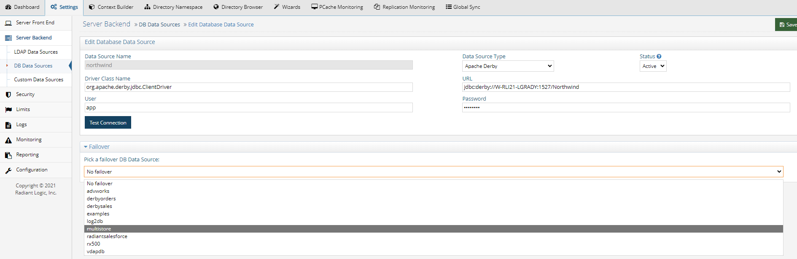
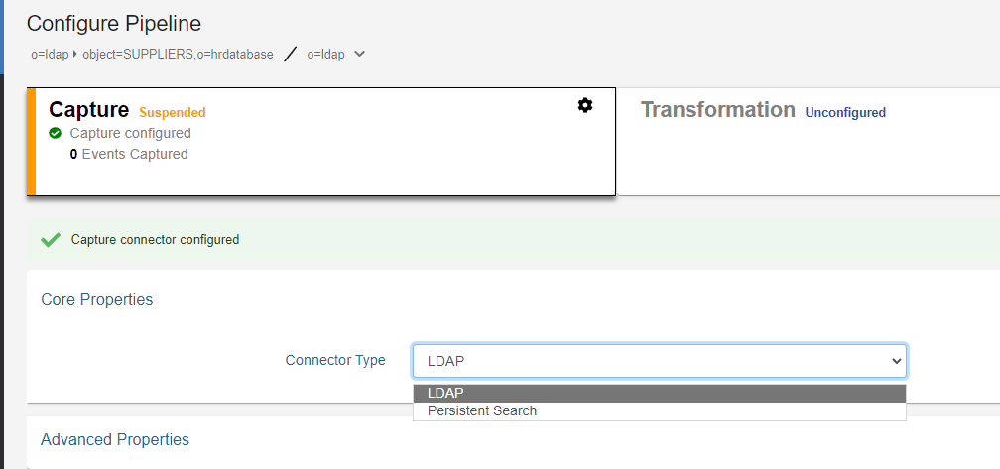
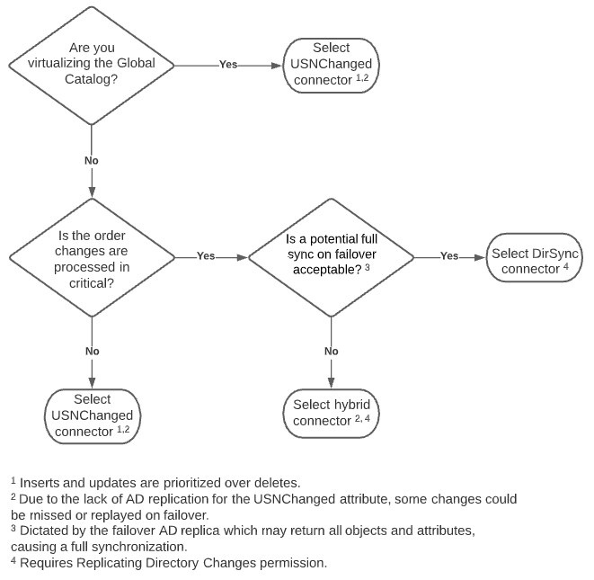
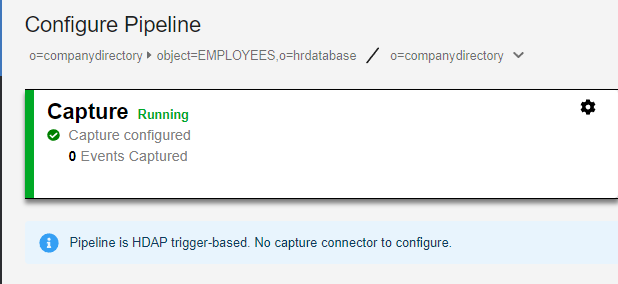
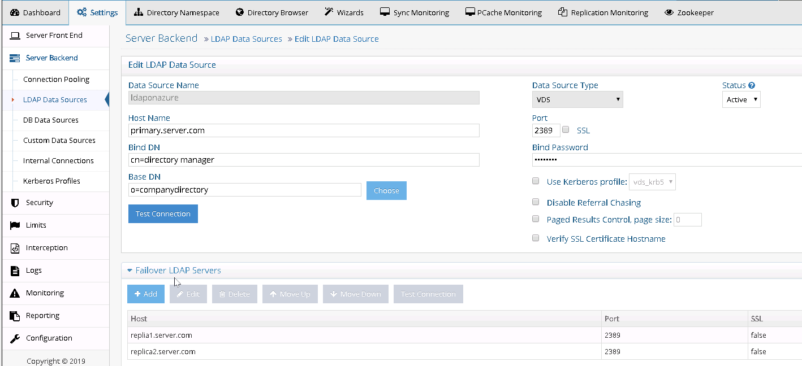

## Introduction

RadiantOne Synchronization is an advanced set of tools for synchronization and identity management. This component allows you to synchronize objects distributed across disparate data sources (directories, databases or applications): a change in an object in one source, at the attribute level, or for the whole object can be reflected into many other connected objects. Using a publisher/subscriber approach, any object can publish events (creation, deletion or modification for the whole object, or any attributes of this object) and propagate them to subscriber objects. User-defined attribute mappings and transformations can be applied during synchronization.

### Architecture

The synchronization architecture is comprised of Agents, Queues, Sync Engine, Attribute mappings and transformation scripts.

Agents manage Connectors which are components used to interface with the data sources. Changes flow to and from the Connectors asynchronously in the form of messages. This process leverages queues to temporarily store messages as they flow through the synchronization pipeline. The attribute mappings and/or transformation scripts are processed by the Sync Engine prior to the events being sent to the target endpoints.

>[!warning]
>All sources must have views mounted in the RadiantOne namespace to complete the synchronization configuration. To simplify management of the synchronization flows, it is recommended to have a dedicated section of the namespace for all source identity views. Once a view has been configured as a source for synchronization, no further changes should be made to the view (e.g. no object/attribute mapping changes, no adding/removing persistent cache, etc.). 

See the figure below for a high-level architecture of the synchronization process.

<a name="global-synchronization-architecture-figure"></a>


## Pipelines
Pipelines are automatically created when topologies are configured. There are two prerequisite steps for configuring synchronization topologies: mount the objects you want to synchronize in the RadiantOne directory namespace and extend the RadiantOne LDAP schema with any new/custom object definitions. These steps are described below. After these steps are finished, you can create topologies.

### Mount virtual views of objects

All synchronization source and target endpoints must be represented in the RadiantOne namespace, meaning that virtual views containing all source and target objects should be mounted below a root naming context. The virtual views can be created using the Control Panel > Setup > Directory Namespace > Namespace Design.

>[!warning]
>Make sure primary keys/unique identifiers are defined for all objects that will play a role in synchronization. You can manage the attributes defined for objects using Control Panel > Setup > Data Catalog > Data Sources > Schema tab.

### Extend RadiantOne LDAP schema 

After virtual views have been mounted into the RadiantOne directory namespace, extend the LDAP schema with all needed object definitions that are not currently included. The object definitions are used in attribute mappings for synchronization. The RadiantOne LDAP schema can be extended from Control Panel > Setup > Directory Namespace > Directory Schema > Extend from ORX tab. Select the schemas associated the objects in your identity views and click **+**  to move the schema into the column on the right. Then click **GENERATE**. You can verify the objects defined in the RadiantOne LDAP schema from the Control Panel > Setup > Directory Namespace > Directory Schema > LDAP Schema tab.

### Create topologies

After all synchronization source and target objects are represented in the RadiantOne directory namespace and the LDAP Schema contains all object definitions, synchronization topologies can be configured from the Classic Control Panel > Synchronization tab.

To load the Classic Control Panel, click the logged in account profile in the upper-right and click Switch to Classic Control Panel.

1. Navigate to the Synchronization tab.
1. Select **New Topology**.
1. Select **Browse for the Source Naming Context** and select the location in the RadiantOne namespace that contains the source objects you want to detect change events on.
1. Select **Browse for the Destination Naming Context** and select the location in the RadiantOne namespace that contains the destination objects that you want to synchronize change events to. In the example shown below, the source objects are located in `o=companydirectory` (representing an LDAP directory backend) and the target is `object=EMPLOYEES,o=hrdatabase` (representing a table named `EMPLOYEES` in an HR database).
    
1. Select **OK**. The topology is added to the list on the left and the pipelines associated with the selected topology are shown on the right where the components can be configured.
This section focuses on configuring the connector type. For details on the behavior of and properties for database connectors (Timestamp, Counter, Changelog), LDAP connectors (changelog or persistent search), and Active Directory connectors (usnChanged or DirSync), please see the RadiantOne Connector Properties Guide.
1. A pipeline represents a synchronization flow from a given source object and a target object endpoint. Each pipeline in the selected topology must be configured.
1. Select **CONFIGURE** next to the pipeline. There are two components that need configured per pipeline: Capture Connector and Transformation. Apply Connectors do not require configuration.


## Capture Connectors Overview

The capture connector configuration dictates the process for detecting changes on the source objects. The type of data source determines which capture methods are available.

This section focuses on configuring the connector type. For details on the behavior of and properties for database connectors (Timestamp, Counter, Changelog), LDAP connectors (changelog or persistent search), and Active Directory connectors (usnChanged or DirSync), please see the RadiantOne Connector Properties Guide.

Once you have determined the connector type you want to use, select the Capture section in the pipeline to display the configuration options.

>[!note]
>Connectors associated with RadiantOne Directory stores or persistent caches are automatically configured when the stores are used as sources in a pipeline.



### Database (JDBC-accessible) 
For database backends (JDBC-accessible), the connector change detection options are:

- [Changelog](#db-changelog) – This connector type relies on a database table that contains all changes that have occurred on the base tables (that the RadiantOne virtual view is built from). This typically involves having triggers on the base tables that write into the log/changelog table. However, an external process may be used instead of triggers. The connector picks up changes from the changelog table. If you need assistance with configuring triggers on the base tables and defining the changelog table, see [Create scripts to generate triggers and changelog table](#create-scripts-to-generate-triggers-and-changelog-table).
- [Timestamp](#db-timestamp) – This connector type has been validated against Oracle, SQL Server, MySQL, MariaDB, PostgreSQL, and Apache Derby. The database table must have a primary key defined for it and an indexed column that contains a timestamp/date value. This value must be maintained and modified accordingly for each record that is updated. 
    
  For Oracle databases, the timestamp column type must be one of the following: `TIMESTAMP`, `DATE`, `TIMESTAMP WITH TIME ZONE`, `TIMESTAMP WITH LOCAL TIME ZONE1. 
    
  For SQL Server database, the timestamp column type must be one of the following: `SMALLDATETIME`, `DATETIME`, `DATETIME2`
    
  For MYSQL or MariaDB databases, the timestamp column type must be one of the following: `TIMESTAMP`, `DATETIME`  
    
  For PostgreSQL databases, the timestamp column type must be one of the following: `TIMESTAMP`, `timestamp without time zone` (equivalent to timestamp), `TIMESTAMPTZ`, `timestamp with time zone` (equivalent to timestamptz)
    
  For Derby databases, the timestamp column type must be: `TIMESTAMP`  
    
  The DB Timestamp connector leverages the timestamp column to determine which records have changed since the last polling interval. This connector type does not detect delete operations. If you have a need to detect and propagate delete operations from the database, you should choose a different connector type like DB Changelog or DB Counter.
- [Counter](#db-counter) - This connector type is supported for any database table that has an indexed column that contains a sequence-based value that is automatically maintained and modified for each record that is added/updated. This column must be one of the following types: `BIGINT`, `DECIMAL`, `INTEGER`, or `NUMERIC`. If `DECIMAL` or `NUMERIC` are used, they should be declared without numbers after dot: `DECIMAL(6,0)` not as `DECIMAL(6,2)`. The DB Counter connector leverages this column to determine which records have changed since the last polling interval. This connector type can detect delete operations as long as the table has a dedicated "Change Type" column that indicates one of the following values: insert, update, delete. If the value is empty or something other than insert, update, or delete, an update operation is assumed.

### Directory (LDAP-accessible) 
For directory backends (LDAP-accessible), the connector change detecion options are:
- [Changelog](#LDAP-Directory-Connectors) - leverages the cn=changelog naming context in the LDAP directory to detect changes.
- [Persistent Search](#LDAP-Directory-Connectors) - leverages the LDAP persistent search control to detect changes.
- [DirSync](#Active-Directory-Connectors) - leverages Active Directory DirSync to detect changes.
- [USNChanged](#Active-Directory-Connectors) - leverages the USNChanged attribute managed by Active Directory to detect changes.
- [Hybrid](#Active-Directory-Connectors) - leverages capabilities of both Active Directory DirSync and USNChanged values to detect changes.
  
### Custom data sources

A custom data source is one that is not queried via LDAP or JDBC. Examples include Entra ID (formerly Azure AD), Okta Universal Directory and any SCIM-accessible source. Virtual views of these data sources should be configured with persistent cache in RadiantOne prior to using as a source for synchronization. Once cached, the source/capture connector for synchronization is based on Triggers and is automatically configured in pipelines.

## Database Changelog Connector

RadiantOne can generate the SQL scripts which create the configuration needed to support the DB Changelog Connector. The scripts can be generated in the Main Control Panel. The following scripts are generated and can be download from Main Control Panel > Settings > Configuration > File Manager.  The are located in the /work/sql folder.

- create_user.sql - Creates the log table user and the log table schema.
- create_capture.sql - Creates the log table and the triggers on the base table.
- drop_capture.sql - Drops the triggers and the log tabl1. 
  Note: for some databases the file is empty.
- drop_user.sql - Drops the log table user and schem1. 
  Note: for some databases the file is empty.

This section describes generating and executing the scripts in the Classic Control Panel > Synchronization tab. The following steps assume the database backend has a changelog table that contains changed records that need to be propagated to destinations. The changelog table must have two key columns named `RLICHANGETYPE` and `RLICHANGEID`. `RLICHANGETYPE` must indicate insert, update or delete, dictating what type of change was made to the record. `RLICHANGEID` must be a sequence-based, auto-incremented `INTEGER` that contains a unique value for each record. The DB Changelog connector uses `RLICHANGEID` to maintain a cursor to keep track of processed changes.

If you need assistance with configuring triggers on the base tables and defining the changelog table, see [Create scripts to generate triggers and changelog table](#create-scripts-to-generate-triggers-and-changelog-table).

To configure DB Changelog connector:

>[!note]
>These instructions assume you want to apply the SQL scripts immediately.

1. From the Main Control Panel > Global Sync Tab, select the topology.
1. On the right, select the sync pipeline to configure.
1. Select a Capture component and the configuration displays.
1. Select **DB Changelog** from the **Connector Type** drop-down list.
1. Indicate the user name and password for the connector's dedicated credentials for connecting to the log table. If you do not have the user name and password, contact your DBA for the credentials.
1. Enter the log table name using the proper syntax for your database (e.g. `{USER}.{TABLE}_LOG`).

>[!warning]
>Change the value for this property only if you are creating the log table manually and the capture connector does not calculate the log table name correctly. Be sure to use the [correct syntax](#log-table-name-syntax) if you change the value.



7. Select **Save**.
8. A message is displayed that asks if you want to apply the scripts to configure the log table immediately or not. You can also download the scripts to the local machine. 
    
9. To apply now, select **OK**. Otherwise, select **NO**.

>[!note]
>Selecting **OK** creates and executes the SQL scripts on the database server. If you choose to apply later, the scripts are created but not executed. They must be run on the database manually. You can download the sql scripts from here or from Main Control Panel > Settings > Configuration > File Manager. Any DBA can configure the connector by selecting the **NO** option and running the scripts manually on the database server. For most databases, this is also sufficient to apply the configuration directly selecting the **OK** option. However, for Oracle databases, you must connect as either the SYS user or a non SYS user that has the SYSDBA role assigned to them. If you choose to use a non SYS user, you must use the syntax userid as sysdba for the user name in the connection. An example would be scott as sysdba.

10. After the capture connector is configured, configure the transformation in the pipeline.

**Log table name syntax**

Proper syntax for the Log Table Name must include both the schema name and the table name separated with a period. Values for this property may contain quote marks as required by the database. In most cases, the double quote mark (") is used, but some databases use a single quote (') or back quote (`). The following examples explain the property's syntax and usage.

*Example 1:*

For Postgres, if the schema is `rli_con`, and log table name is `test_log`, the property should be one of the following.

>[!note]
>By default, Postgres uses lower-case table names.

`rli_con.test_log`

Or with optional quoting:

`"rli_con"."test_log"`

*Example 2:*

For SQL Server, if the schema is `RLI_CON`, and log table name is `TEST_LOG`, the property should be one of the following.

>[!note]
>By default, many DBs, including SQL Server, use upper-case table names.

`RLI_CON.TEST_LOG`

Or with optional quoting:

`"RLI_CON"."TEST_LOG"`

>[!note]
>If this name is the same as the log name in the database, leave the property empty.

*Example 3:*

If schema and/or table name contain mixed-case characters, they must be quoted. For example, if the schema is `Rli_Con`, and log table name is `Test_Log`, the property should be as follows.

`"Rli_con"."Test_log"`

## Database Timestamp Connector

The following steps assume your backend database table has a primary key defined and contains a timestamp column. The timestamp column name is required for configuring the connector. The timestamp column database types supported are described in the [Database connectors](#database-connectors) section.

>[!warning]
>This connector type does not detect delete operations. If you have a need to detect delete operations from the database, you should choose a different connector type.

1. From the Main Control Panel > Global Sync Tab, select the topology on the left.
1. On the right, select the sync pipeline to configure.
1. Select a Capture component and the configuration displays.
1. Select **DB Timestamp** from the **Connector Type** drop-down list.
1. Indicate the column name in the database table that contains the timestamp. An example is shown below.
    
1. Select **Save**.
1. You can configure connector properties in the Advanced Properties section.
1. After the capture connector is configured, configure the transformation.

>[!warning]
>If you need to make changes to the timestamp column name, you must manually restart the connector and reset the cursor. The pipeline can be stopped on the Global Sync tab when the topology is selected on the left. Then select **Configure** next to the pipeline. In the configuration screen, select the Capture section. Change the timestamp column name and select **Save**. In the bottom left of the Capture configuration screen, select **Reset Cursor**. Go back to the Global Sync topologies page and select **Start** to start the pipeline components.

## Database Counter Connector

The following steps assume your database backend table contains an indexed column that contains a sequence-based value that is automatically maintained and modified for each record that is added, updated or deleted. The DB Counter connector uses this column to maintain a cursor to keep track of processed changes. The counter column database types supported are described in the [Database connectors](#database-connectors) section.

1. From the Main Control Panel > Global Sync Tab, select the topology on the left.
1. On the right, select the sync pipeline to configure.
1. Select the Capture component and the configuration displays.
1. Select **DB Counter** from the **Connector Type** drop-down list.
1. Enter a value in the Change Type Column field. This value should be the database table column that contains the information about the type of change (insert, update or delete). If the column does not have a value, an update operation is assumed.
1. Enter the column name in the database table that contains the counter. An example is shown below.
1. Select **Save**
1. You can configure connector properties in the Advanced Properties section.
1. After the capture connector is configured, configure the transformation in the pipeline.



>[!warning]
>If you need to make changes to the Counter Column name, you must manually restart the connector and reset the cursor. The pipeline can be stopped on the Global Sync tab when the topology is selected on the left. Then select **Configure** next to the pipeline. In the configuration screen, select the Capture section. Change the counter column name and select **Save**. In the bottom left of the Capture configuration screen, select **Reset Cursor**. Go back to the Global Sync topologies page and select **Start** to start the pipeline components.

## Database connector failover

This section describes the failover mechanism for the database connectors.

>[!warning]
>The backend servers must be configured for multi-master replication. Please check the vendor documentation for assistance with configuring replication for your backends.

The database connectors leverage the failover server that has been configured for the data source. When you configure a data source for your backend database, select a failover database server from the drop-down list. The failover server must be configured as a RadiantOne data source. See the screen shot below for how to indicate a failover server for the Data Sources from the Main Control Panel.

 

If a connection cannot be made to the primary server, the connector tries to connect to the failover server configured in the data source. If a connection to both the primary and failover servers fails, the retry count goes up. The connector repeats this process until the value configured in "Max Retries on Connection Error" is reached. There is no automatic failback, meaning once the primary server is back online, the connector does not automatically go back to it.


## LDAP Directory Connectors

For LDAP backends that support both Changelog and Persistent Search, you can configure the connector from the Main Control Panel > Global Sync tab. Select the topology and configure the pipeline. Select the Capture component to modify the connector type and advanced properties.

Choose either the **LDAP** option (for Changelog) or **Persistent Search** and **Save**.



### Changelog

The connector leverages a changelog that has been enabled on the backend directory. The connector picks up changes from the `cn=changelog` naming context based on a polling interval. The `changenumber` attribute in the changelog entries is used to keep track of the processed changes. The changelog must be enabled in the backend directory. Please check with your directory vendor for instructions on how to enable the changelog.

### Persistent search

Any LDAP directory that offers a persistent search mechanism can use the Persistent Search connector type. Novell eDirectory is an example of an LDAP source that supports persistent search. Others include Red Hat Directory, IBM TDS, CA Directory and RadiantOne Universal Directory. The connector issues a persistent search and gets notified by the directory server when information changes. If the connector is shut down (either deliberately or due to failure), the delete operations that occurred in the directory are lost. Once the connector is back online there is no way to detect the delete operations that occurred while it was down. The only exception to this is for IBM TDS directories. It stores deleted entries and the capture connector is able to read them, and based on timestamp, determine if the change occurred while the connector was offline.

## Active Directory Connectors

There are three change detection mechanisms: USNChanged, DirSync and Hybrid. If you are virtualizing and detecting changes from a Global Catalog, then you must use the USNChanged changed connector because the DirSync and Hybrid connectors cannot detect change events on sub-domains.

The flowchart below helps to decide which change detection mechanism to use.



### DirSync

This connector type retrieves changes that occur to entries by passing a cookie that identifies the directory state at the time of the previous DirSync search. The first time the DirSync capture connector is started, it stores a cookie in a cursor file. At the next polling interval, the connector performs a DirSync search to detect changes by sending the current cookie. To use the DirSync control, the Bind DN connecting to the directory must have the DS-Replication-Get-Changes extended right, which can be enabled with the "Replicating Directory Changes" permission, on the root of the partition being monitored. By default, this right is assigned to the Administrator and LocalSystem accounts on domain controllers.

>[!warning]
>To detect delete events, the service account used by RadiantOne to connect to the backend Active Directory (configured in the connection string of the RadiantOne data source) must have permissions to search the tombstone objects. Usually, a member of the Administrators group is sufficient. However, some Active Directory servers may require a member of the Domain Admins group. Check with your Active Directory administrator to determine the appropriate credentials required.  
  
If you are virtualizing and detecting changes from a Global Catalog, then you must use the Active Directory USNChanged changed connector because the DirSync connector cannot detect change events on sub-domains.

### USNChanged

This connector type keeps track of changes based on the `uSNChanged` attribute for the entry. Based on a configured polling interval, the connector connects with the user and password configured in the connection string/data source and checks the list of changes stored by Active Directory. The connector internally maintains the last processed change number (`uSNChanged` value) and this allows for the recovery of all changes that occur even if the connector is down (deliberately or due to failure).

If capturing the sequence of events is critical, use the DirSync connector instead of USNChanged because it processes events in the order in which they occur instead of prioritizing and processing inserts and updates before deletes.

### Hybrid

This connector type uses a combination of the uSNChanged and DirSync change detection mechanisms. The first time the connector starts, it gets a new cookie and the highest uSNchanged number. When the connector gets a new change (modify or delete), it makes an additional search using the DN of the entry and fetches the entry from AD. The fetched entry contains the `uSNChanged` attribute, so the connector updates the cursor values for both for the cookie and the last processed uSNchanged number.

>[!warning]
>If you are virtualizing and detecting changes from a Global Catalog, then you must use the Active Directory USNChanged changed connector because the Hybrid connector cannot detect change events on sub-domains.

When the connector restarts, uSNChanged detection catches the entries that have been modified or deleted while the connector was stopped. The LDAP search uses the last processed uSNChanged number to catch up. After the connector processes all entries, it requests a new cookie from AD (not from the cursor) and switches to DirSync change detection.

## RadiantOne Directory Connector

If you are using the RadiantOne Universal Directory (HDAP store), a persistent cache on a proxy view of a local HDAP store, or a nested persistent cache view (a cached view used in another cached view), the connector type is noted as HDAP trigger automatically and cannot be changed. This is a special trigger mechanism that publishes changes directly into the queue to invoke the synchronization as opposed to requiring a connector component to detect the change.



## Directory connector failover

This section describes the failover mechanism for the LDAP (changelog), Persistent Search and Active Directory connectors.

>[!warning]
>The backend servers must be configured for multi-master replication. Please check the vendor documentation for assistance with configuring replication for your backends.

The directory connectors leverage the failover servers that have been configured for the data source. When you configure a data source for your backend directory, you need to indicate the list of failover servers in order of priority. When the connector fails over, it uses the failover servers in the order they are listed. See the screen shot below for how to indicate a failover server for the Data Sources from the Main Control Panel.

 

If a connection cannot be made to the primary server and the maximum number of retry attempts has been exhausted, the connector connects to the failover servers in the order they are listed. There is no automatic failback, meaning once the primary server is back online, the connector does not automatically go back to it.

This failover mechanism is supported for Active Directory, OpenDJ, Oracle Directory Server Enterprise Edition (Sun Directory v7), Oracle Unified Directory (OUD). In addition, any LDAP directory implementing `cn=changelog` and `replicationCSN` attribute or the persistent search control is also supported.

>[!warning]
>When the Active Directory DirSync connector fails over to another DC replica, the current cursor (cookie) is used. The connector may receive all objects and attributes from the replica instead of just the delta from its last request. Therefore, you may notice the number of entries published by the connector is more than you were expecting. This behavior is dictated by the Active Directory server and is out of the control of the connector. Keep this in mind when you define the Max Retries and Retry Intervals for the connector properties. The smaller the numbers of retries, the higher the chance the connector will fail over and possibly receive all objects and attributes (a full sync) from the domain controller.

For the Active Directory USNChanged connector, the failover logic leverages the Active Directory replication vectors `[replUpToDateVector]`, and the failover servers configured at the level of the RadiantOne data source associated with Active Directory, in order to determinate which server(s) the connector switches to in case of failure. Since the replication vector contains all domains, in addition to some possibly retired domains, the connector narrows down the list of possible failover candidates to only the ones listed as failover servers in the RadiantOne data source associated with the Active Directory backend. If there are no failover server defined for the data source, all domains in the replication vector are possible candidates for failover.

>[!warning]
>When defining the RadiantOne data source associated with Active Directory, do not use Host Discovery. You must use the fully qualified machine names for the primary server and failover servers. Do not use IP addresses. Also, it is highly recommended that you list your desired failover servers at the level of the data source. Not only does this make the failover logic more efficient, but it also avoids delays in synchronization.

`[replUpToDateVector]` definition: The non-replicated attribute `replUpToDateVector` is an optional attribute on the naming context root of every naming context replica. If this vector is unavailable, the connector is suspended.

The `ReplUpToDateVector` type is a tuple with the following fields:

- `uuidDsa`: The invocation ID of the DC that assigned `usnHighPropUpdate`.
- `usnHighPropUpdate`: A USN at which an update was applied on the DC identified by uuidDsa.
- `timeLastSyncSuccess`: The time at which the last successful replication occurred from the DC identified by uuidDsa; for replication latency reporting only.

`[replUpToDateVector]` example:

```
01ca6e90-7d20-4f9c-ba7b-823a72fc459e @ USN 2210490 @ Time 2005-08-21 15:54:21

1d9bb4b6-054a-440c-aedf-7a3f28837e7f @ USN 26245013 @ Time 2007-02-27 10:17:33

24980c9d-39fa-44d7-a153-c0c5c27f0577 @ USN 4606302 @ Time 2006-08-20 23:33:09
```

At run-time, the connector retrieves the entire list of servers defined in the replication vector and reduces the number of possible failover candidates based on failover servers defined in the RadiantOne data source. The list of potential failover servers is stored at each polling interval. When the current server fails, the connector decides to switch to the closest candidate by selecting the server with the maximum timestamp from the up-to-dateness vector. The capture connector's cursor will be assigned the value from the up-to-dateness vector for the failover server. If the closest candidate fails as well, the connector tries with a second closest candidate and so on.

>[!warning]
>Due to the lack of Active Directory replication for the `USNChanged` attribute, some changes could be missed or replayed on failover.

For the AD Hybrid connector, the failover process starts when the number of exceptions exceeds either the Maximum Retries on Error or Maximum Retries on Connection Error value. The failover servers are specified in the data source associated with Active Directory. The Active Directory up-to-date vector is used to determine the failover server and the value of the new cursor. If the up-to-date vector is unavailable from the current server, failover is not possible. If this happens, verify that AD replication is correctly configured. After the failover server is found, uSNChanged detection catches the entries that have been modified or deleted since the connector's failure. The LDAP search uses the last processed uSNChanged number to catch up.

>[!warning]
>Due to the lack of Active Directory replication for the `USNChanged` attribute, some changes could be missed or replayed on failover.

After the connector processes all entries, it requests a new cookie from Active Directory and switches to DirSync change detection.

## Transformations

### Script

### Attribute Mappings

### Rules-based
### Approvers

Any user located in the RadiantOne virtual namespace that is a member of the *Approvers* group can be an approver. In the following example, the ICS Admin user is made an approver.  
To manage the Approvers group: 
1.	In the Main Control Panel, go to the **Directory Browser** tab.  
1.	Expand cn=config,ou=globalgroups. 
1.	Select cn=approvers. 
1.	Click the **Manage Group** button. The Manage Group window displays. 
1.	Click the **Add Member(s)** button.  
1.	Click the **Expand Tree** button. The RadiantOne namespace displays on the right. 
1.	In the namespace, navigate to the location of the user that you want to approve events. In this example, the location cn=config,ou=globalusers is selected.  
1.	Click the **Find Now** button.  
1.	Select the entry you want to approve events and click the **Move selected entry down** button. In this example, uid=icsadmin,ou=globalusers,cn=config is selected. <br>
1.	Click the **Confirm** button. The member is displayed in the cn=approvers group.  
1.	Click **Confirm** again to commit the change. 


>[!warning]
>If you want the approver to receive an email alert when they have pending approvals, the user account must have a valid email address (mail attribute).


### Email Notifications

To enable email alerts for approvers, SMTP must be configured. 
1. Navigate to the RadiantOne Main Control Panel > Settings tab > Monitoring > Email Alerts Settings.
2. Enter your SMTP settings (host, port, user, password, from email and to email) in the Email Alerts (SMTP Settings) section.
3. Click **Save**.
4. If you would like to test your settings, click **Send Test Email**. 

>[!note]
>For security and audit purposes, it is not advised to connect to your mail server anonymously (leaving user and password >properties blank in the Email Alert Settings). 


### Insights, Reports and Administration Portal

The RadiantOne Insights, Reports and Administration portal is designed for power users and administrators that are in charge of identity management tasks such as approving synchronization events (e.g. creation of new accounts in target systems) or auditing group memberships.

To access the portal, navigate in a web browser to your Control Panel endpoint appended with /portal and enter your login credentials. <br> 
e.g. https://cp-rli-qa.dc.federated-identity.com/portal/ 
>[!note] 
>User to DN mapping must be properly configured so that the approver can login with their user ID and not require their full DN.


The applications currently available in this portal are *Approvals* and *Global Identity Viewer*. A brief description of each application is provided below. 

### Performing Approvals 
When a change associated with a rule that requires approval is detected in a source, the instance is published into the approvals queue and awaits action. Approvers use the Approvals application to accept or reject events.

Approvers log into the Insights, Reports and Administration Portal and click the Approvals icon.


The pending events assigned to the approver are displayed.


The user must approve or reject the event. This can be done using the  to reject an event or the  to accept an event. <br>
Check boxes in the column on the far left can also be used. If you check the box in the column header, options include “Select Current Page”, “Select Everything”, “Unselect Current Page”, and “Unselect Everything”. Then select an option from the Select Bulk Action drop-down menu (*Approve All* or *Reject All*).

>[!note] 
>To fetch additional pending modifications, click the **Refresh** button.

After acting on all events, click **Submit Changes** and then **Yes** to confirm the updates. 

Approved events are processed by the sync engine and applied to the target.

#### Approval Audit Log
The actions taken by approvers is logged. Logging is enabled by default and the log file is: `<RLI_HOME>/logs/approvals_audit.log`

### Global Identity Viewer 
RadiantOne includes an easy-to-use, web-based application named the Global Identity Viewer that facilitates searching for identities and/or groups across all data sources that have been integrated in a Global Identity Builder project. When a query returns an identity, a list of tabs display for the selected user based on how many identity sources the user has an account in. If the identity is found in the global profile list, the attributes corresponding to this account display on the Global Profile tab. The names of the other tabs indicate the identity source’s “friendly name” as configured in the Global Identity Builder project. When a tab is selected, the identity attributes and group membership associated with the user’s account in that particular identity source are displayed. In the diagram below, a user identified as Brian Carmen has an account in the RadiantOne global profile store, and accounts in identity sources named adpartnerdomain, ldap, and azuread. The example shows the adpartnerdomain tab selected and Brian’s attributes from that particular data source returned. 
For more details on the Global Identity Viewer, see the [RadiantOne Global Identity Viewer Guide](/global-identity-viewer-guide/01-introduction).


## Queue Time to Live
  

