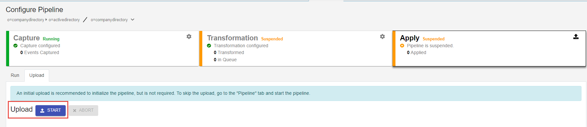

## Uploads

If the target/destination needs populated with entries before starting synchronization, perform an initial upload. Uploads can be performed from the Control Panel.

## Upload from the Control Panel

1. Go to the Classic Control Panel > Synchronization Tab.
1. Select the desired topology from the list of topologies on the left.
1. Select **Configure** next to the pipeline on the right.
1. Select the **Apply** component.
1. Select **START** next to **Upload**. Once the upload is finished, the synchronization components are automatically started.

