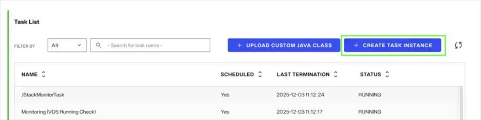
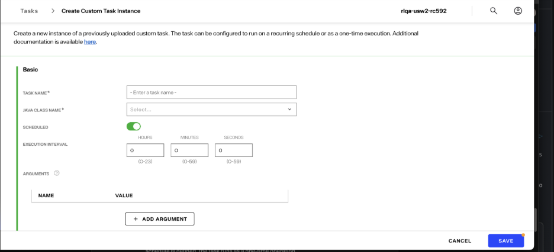
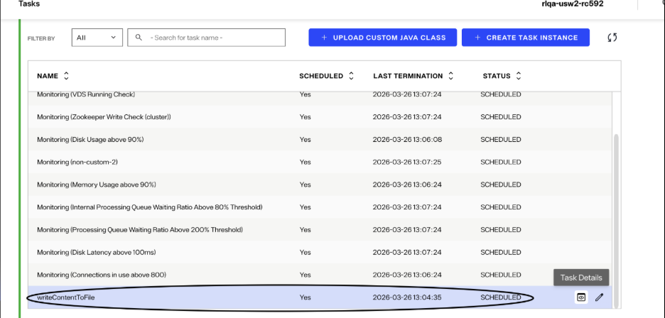
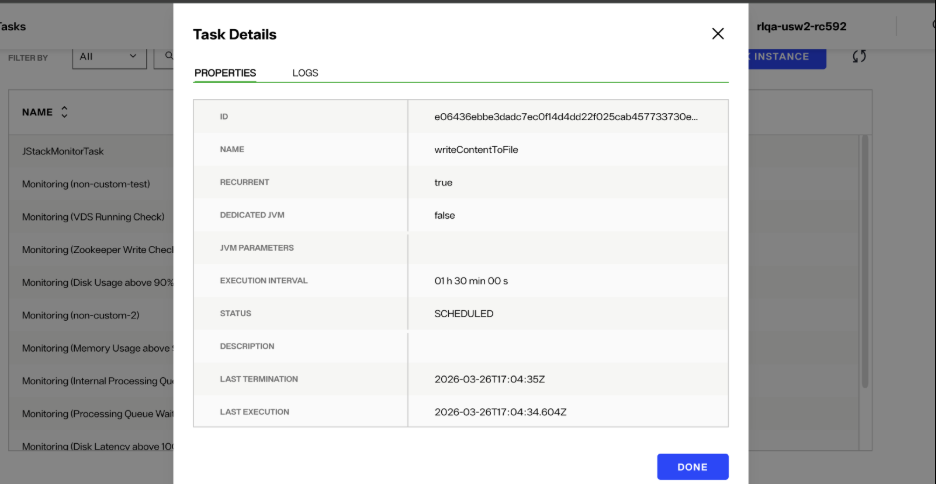
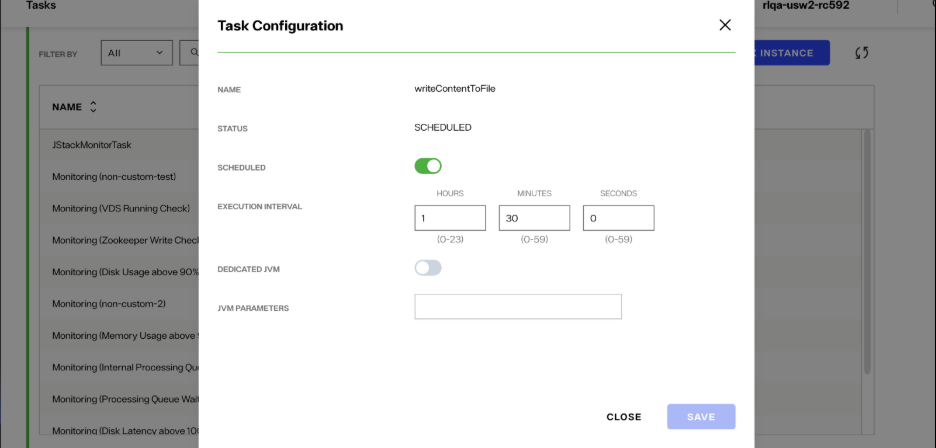
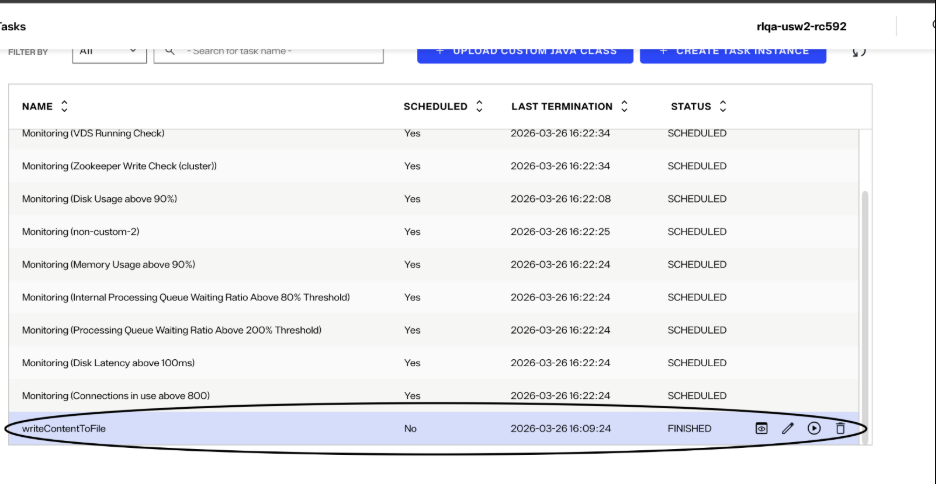

## Create Custom Task Instance

The steps below create a custom task instance that will execute an uploaded Java class.

1. Navigate to the **Tasks** page and click ***Create Task Instance***.

   

2. Fill out properties in the form below:

   

   At a minimum, ***Task Name*** (the display name of the task) and ***Java Class Name*** (the name of the uploaded class) must be provided. Depending on the task's Java class implementation and preferred runtime configuration, other properties may also need to be filled out. For more information about these properties, view the [Custom Task Instance Configuration](configuration.md) document.

3. Review the configuration details and click **Save**.

## View and Manage the Custom Task

- After creating a custom task instance, the task should appear in the ***Task List***. The custom task can be managed from the ***Task List***.

  

- Click on the *Task Details* icon to view information about the task and to get the task logs. If the *Status* is an error state, the task logs should contain information about the cause of the error.

  

- Click on the ***Edit*** icon to update the schedule or JVM details for the custom task.

  

- The task status provides crucial information about the state of the task. Common statuses are listed below:

  | Status | Meaning |
  |---|---|
  | `SCHEDULED` | The task is scheduled to run. |
  | `RUNNING` | The task is currently running. |
  | `FINISHED` | The task is completed and is not scheduled to run again. |
  | `ERR_SCHEDULED` | The previous run of a scheduled task resulted in an error. The task will run again as scheduled. |
  | `ERROR` | A one-time task resulted in an error. The task will not run again. |
  | `INTERRUPTED` | The task was stopped before it was finished. |

- A task that's in the *FINISHED*, *ERROR*, or *INTERRUPTED* state can be started and deleted:

  
