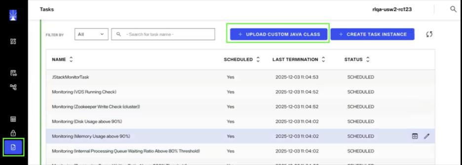
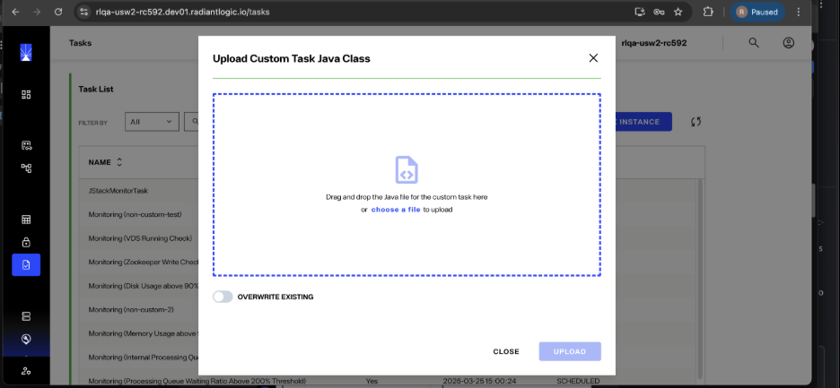
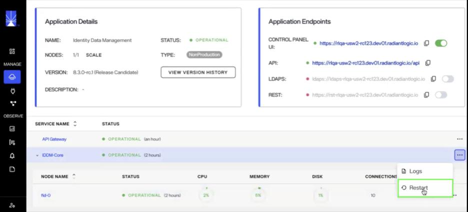

## Overview

The Identity Data Management task scheduler allows the creation of custom tasks that execute custom logic in your Radiant Logic deployment. Custom tasks support specialized operations such as performing delta cache refreshes, running data quality checks, etc.

Custom tasks can either be configured to run on a schedule, or they can be one-time tasks that run immediately.

Creating a custom task involves the following steps, each of which is described in more detail below:

1. Implement a Java class for the custom task
2. Upload the Java class and restart Identity Data Management
   - Create a custom task instance to execute the uploaded class
3. View and manage the custom task

## Implement a Custom Task Java Class

1. Download one of the custom task templates as the starting point for the custom task:

   - [**PerNodeCustomTaskTemplate**](../custom-tasks/custom-tasks-templates.md#run-on-all-nodes-pernodecustomtask) : For a custom task that should only be executed on the leader node.
   - [**PerClusterCustomTaskTemplate**](../custom-tasks/custom-tasks-templates.md#run-on-one-node-perclustercustomtask) : For a custom task that should be executed on all nodes.
   
   For detailed information on the two templates, view the [Custom Task Templates](../custom-tasks/custom-tasks-templates.md) document.

2. Fill out the custom task template:

   - Implement the required methods:

     i. **`readArgs`**: Process arguments required by the task and store them as instance variables so that they can be used in `processTask`.

     ii. **`processTask`**: Contains the logic for the task.

     iii. **`getId`**: Provides the internal ID used for the task.

   - Update the class name and its references in the `main` method. Ensure that the name of the Java file containing the class is the same as the class name.
   - Verify that all required imports are present.

   For examples and additional information, review the [Writing a Custom Task Java Class](../custom-tasks/custom-task-java-class.md) document.

## Upload Custom Task Java Class

After writing the custom task Java class, follow the steps below to upload the Java class to Identity Data Management and make it available for use.

1. Navigate to the **Tasks** page and click ***Upload Custom Java Class***.

   

2. Select your Java class (`.java`) file and click **Upload**.

   

   - To replace an existing custom task Java class, enable the ***Overwrite Existing*** option.
   - Multiple Java classes can be uploaded one after the other.

3. After uploading the Java class(es), restart your Identity Data Management instance via the Environment Operations Center before proceeding. **If Identity Data Management is not restarted, then the custom class will not be available to the task scheduler.**

   

## Next Steps

Once the custom Java class has been implemented and uploaded, you can proceed with [creating the custom task instance](../custom-tasks/create-a-custom-task.md).
