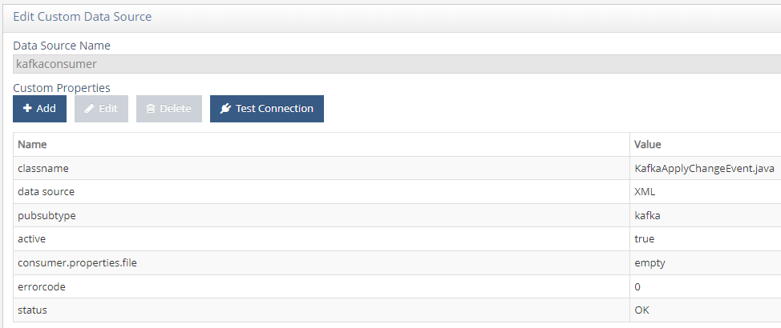
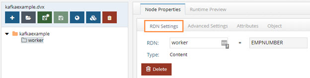
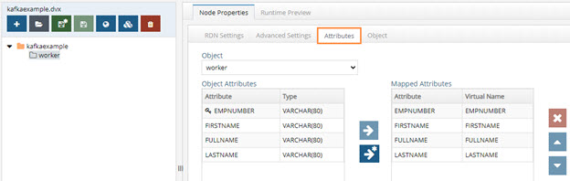
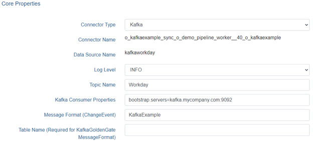
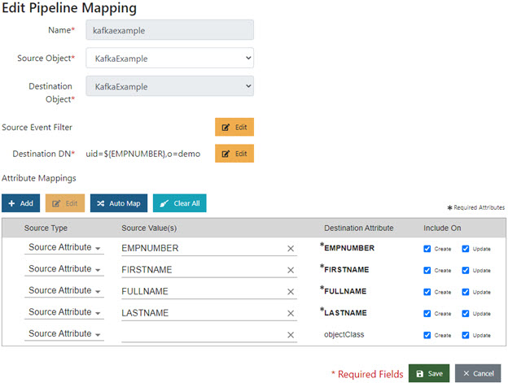

# Kafka Consumer Connector 

The RadiantOne Kafka capture connector leverages the Apache Kafka Consumer API to subscribe to topics and process streams of records produced by them.

The Kafka capture and apply connectors are independent, meaning that they do not need to be deployed together. The source(s) and target(s) could be any combination of Kafka topics, LDAP-accessible data stores, JDBC-accessible data stores, or web-services (SCIM or REST accessible).

This section assumes that you have access to an existing Kafka instance that you can connect to. Once you gain access, follow the instructions in this section.

To sync between RadiantOne and Kafka topics, you need to configure the following. 

- [Data source](#configuring-the-consumer-data-source)
- [Schemas](#configuring-the-schema) 
- [Views](#mounting-the-virtual-view)
- [Sync topologies](#configuring-global-sync-as-a-kafka-consumer)

## Configuring the Consumer Data Source

A data source is required for the Consumer connector.

To configure the Consumer data source:

1. In the Main Control Panel, navigate to Settings > Server Backend > Custom Data Sources.

1. Click Add Custom.

1. Name the data source. In this example, the data source is named kafkaconsumer. 

1. Under Custom Properties, click **Add**. 

1. Add each of the following properties and accompanying values. After you define a property, click OK and then click Add to start adding the next property until the properties in the table below are defined. 

  	|Property Name | Value|
    -|-
	Classname| KafkaApplyChangeEvent.java
	consumer.properties.file | (Enter any value here; a value for this property is required but ignored.)
	pubsubtype | kafka

    

    Figure 1: Kafka Consumer Data Source

    >[!note] Additional data source settings are configured in [Configuring Global Sync as a Kafka Consumer](#configuring-global-sync-as-a-kafka-consumer). 

1. Click Save. 

	>[!note] If a note displays stating that the connection to the data source failed, click Yes to save anyway.

## Configuring the Consumer Schema

If you use the same schema for both your consumer and producer, no further schema configuration is required. If you plan to use a different message format for publishing to Kafka, that schema must also be created. See [Configuring the Producer Schema](kafka-producer#configuring-the-producer-schema) for more information.

## Mounting the Virtual View

In this section, a new naming context representing the incoming Kafka Consumer is added. If you plan to publish identity data to a Kafka topic, a separate view is required. If you use both a consumer and producer, and have already setup your producer schema, no further schema configuration is required.

1. In the Main Control Panel, navigate to the Context Builder tab. 

1.	On the View Designer tab, click .

1.	Name the view. In this example, the schema is named kafkaExample.

1. Select the schema you created in [Configuring the Schema](#configuring-the-schema). Click OK. 

1.	In the pane on the left, select the view’s folder icon and click New Content.

1.	Select your table name and click OK.

    

    Figure 2: New View Definition

1.	Make any updates you need for the RDN and Attribute settings.

    

    Figure 3: New View with Attributes

1.	Click Save. 

1.	Navigate to the Directory Namespace tab. 

1.	Click . 

1.	Enter a context name, i.e. o=kafkaexample.

1.	Choose Virtual Tree and click Next.

1.	Select **Use an existing view**.

1. 	Click Browse. Navigate to the saved .dvx file for the view you created. Click OK.

1.	Click OK.

1.	Click OK to acknowledge the alert that your virtual tree has been created. 

If you’re configuring Global Sync to act as both a consumer and producer with Kafka, you need a separate mounted view with the appropriate schema.

## Configuring Global Sync as a Kafka Consumer

1.	In the Main Control Panel, navigate to the Synchronization tab. 

1.	Click .

1.	Select your source and destination naming contexts and click OK. 

1.	Click Configure. 

1.	Click the Capture tile and fill in the following fields. 

    Field Name | Description
    -|-
    Topic Name| The name of your topic (i.e. Workday).
    Kafka Consumer Properties |Contains bootstrap.servers= followed by the name and port number for your Kafka server. See note below for more information.
    Message Format |The name of your changeConvertor, such as GoldenGateJSONConvertor or KafkaExample (without .java on the end)
    Table Name | Required only if you are using KafkaGoldenGate formatting

    

    Figure 4: Capture connector properties using KafkaExample changeConvertor

>[!note] The minimum requirement for the Kafka Consumer Properties field is the bootstrap.servers property specifying your Kafka broker and port number. The example shown above is for an unencrypted session without authentication. If your Kafka broker requires encryption and/or authentication, additional properties can be added to the field in a comma-separated list. For example, the following string adds in the sasl.mechanism, security.protocol, and ssl.truststore.location to enable SSL. It alsocsets a value for sasl.jaas.config to use username and password to login into the broker. This method is also applicable when using a Client Token and Secret to authenticate.   
bootstrap.servers=kafka.mycompany.com:9094,sasl.mechanism=PLAIN,security.protocol=SASL_SSL,ssl.truststore.location=/radiantone/vds/vds_server/custom/truststore.jks,sasl.jaas.config=org.apache.kafka.common.security.plain.PlainLoginModule required username="accountname" password="password";

>[!note] For encrypted Kafka connections, the same Java truststore requirement applies as above for the producer.properties; you must specify the full path via the ssl.truststore.location property.     If you make changes to the Capture connector configuration once your pipeline has been started, you will need to stop and start the pipeline to pick up those changes.

1.	Click Save. 

1. 	Click the Transformation tile. Select a Transformation Type from the drop-down menu.

1. Expand the Mappings section and map attributes as required.

    

    Figure 5: Sample Mappings

1. 	Click the Apply tile and start your pipeline.
