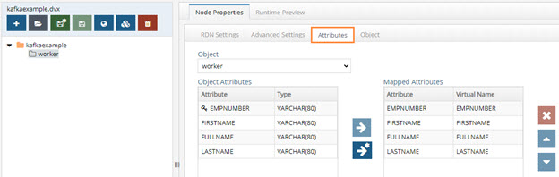

# Kafka Producer Connector 

The RadiantOne Kafka apply connector leverages the Apache Kafka Producer API to publish a stream of records to one or more Kafka topics. 

The Kafka capture and apply connectors are independent, meaning that they do not need to be deployed together. The source(s) and target(s) could be any combination of Kafka topics, LDAP-accessible data stores, JDBC-accessible data stores, or web-services (SCIM or REST accessible).

This section assumes that you have access to an existing Kafka instance that you can connect to. Once you gain access, follow the instructions in this section.

To sync between RadiantOne and Kafka topics, you need to configure the following. 

- [Properties file](#configuring-the-properties-files)
- [Data source](#configuring-the-producer-data-source)
- [Schemas](#configuring-the-producer-schema) 
- [Views](#mounting-the-virtual-view)
- [Sync topologies](#configuring-global-sync-as-a-kafka-producer)

## Configuring the Properties File

You can configure the properties file either for unencrypted, anonymous connections, or for connections where encryption and authentication are required. This section describes how to configure both versions of the properties file.

### Configuring the Properties File for Unencrypted Anonymous Connections

In a text editor, enter the path on your RadiantOne server containing the bootstrap.servers value with the name and port of your Kafka server. i.e. kafka.mycompany.com:9092.

Figure 1: Producer.properties text file for unencrypted anonymous connections

### Configuring the Properties File for Encryption and Authentication

In cases where encryption and authentication are required, additional properties must be included in the producer.properties file.

In this example, PLAIN SASL is used to specify a username and password for authentication. Because the connection is encrypted, you must create a Java truststore containing the trusted CAs which issued the certificate used by the Kafka broker. The ssl.truststore.location needs to be the full path to the file on your RadiantOne server. It is recommended that you store both the producer.properties and truststore.jks file in your $RLI_HOME/vds_server/custom directory so that it replicates to follower nodes in your cluster.

Figure 2: Producer.properties text file for a Kafka broker requiring encryption and authentication

>[!note] Once you start using your Kafka producer to publish to a Kafka topic in a Global Sync topology, any changes you make to the producer.properties file require that you restart the RadiantOne FID service.

## Configuring the Producer Data Source

In this section, the producer data source is created. 

To configure the producer data source:

1. In the Main Control Panel, navigate to Settings > Server Backend > Custom Data Sources.

1. Click **Add Custom**.

1. Name the data source. In this example, the data source is named kafkaproducer. 

1. Under Custom Properties, click **Add**. 

1. Add each of the following properties and accompanying values. After you define a property, click OK and then click Add to start adding the next property until the properties in the table below are defined. 

  	|Property Name | Value|
    -|-
	Classname| com.rli.scripts.customobjects.KafkaApplyChangeEvent
	producer.properties.file | (the location of the properties file, i.e. $RLI_HOME/vds_server/custom/producer.properties).
	Topic name |(the name of the topic to which you wish to publish)
	Messageformat | (the name of the changeEventConvertor, such as GoldenGateJSONConvertor)

    

    Figure 3: Kafka Producer

1. Click Save. 

	>[!note] If a note displays stating that the connection to the data source failed, click Yes to save anyway. 

## Configuring the Producer Schema

Based on the JSON messages you expect to process with your Kafka connector, you need to define appropriate schema.

1. In the Main Control Panel, navigate to the Context Builder tab.

1.	On the Schema Manager tab, click .

1.	Select **Custom** and click OK. 

1.	Select the Kafka data source you created in [Configuring the Producer Data Source](#configuring-the-producer-data-source) and click Next. 

1.	Enter a name for your Kafka schema. In this example, the schema is named kafkaexample.

1. Click **Create Schema**. The new schema is displayed. 

1.	In the pane on the left, expand the Objects node in the tree view. 

1.	Right click on Tables and click **Add New Object**. 

    

    Figure 4: Adding a new table

1.	Name the table and enter an LDAP Object Class name. In this example, the table is named **worker**. Click OK. 

1.	In the pane on the left, expand the table you created in the previous step.

1.	Right click on Fields and select **Add New Attribute**.

1.	Complete the Add New Attribute dialog box.

1.	Repeat the above step for all fields which will be processed through your Kafka connector. 

    

    Figure 5: Kafka Schema

1.	Click **Save**.

## Mounting the Virtual View

In this section, a new naming context representing the incoming Kafka Producer is added. If you plan to publish identity data to a Kafka topic, a separate view is required.

1. In the Main Control Panel, navigate to the Context Builder tab. 

1.	On the View Designer tab, click .

1.	Name the view. In this example, the schema is named kafkaexample.

1. Select the schema you created in [Configuring the Producer Schema](#configuring-the-producer-schema). Click OK. 

1.	In the pane on the left, select the view’s folder icon and click New Content.

1.	Select your table name and click OK.

    

    Figure 6: New View Definition

1.	Make any updates you need for the RDN and Attribute settings.

    

    Figure 7: New View with Attributes

1.	Click Save. 

1.	Navigate to the Directory Namespace tab. 

1.	Click . 

1.	Enter a context name, i.e. o=kafkaexample.

1.	Choose Virtual Tree and click Next.

1.	Select **Use an existing view**.

1. 	Click Browse. Navigate to the saved .dvx file for the view you created. Click OK.

1.	Click OK.

1.	Click OK to acknowledge the alert that your virtual tree has been created. 

If you are configuring Global Sync to act as both a consumer and producer with Kafka, you need a separate mounted view with the appropriate schema.

## Configuring Global Sync as a Kafka Producer

Global Sync uses the settings you configured for your kafkaproducer data source to call the correct changeConvertor, connect to your Kafka endpoint, and publish to the specified topic.

1. In the Main Control Panel, navigate to the Global Sync tab.

1.	Click .

1.	Select your Source and Destination naming contexts (i.e. the destination should be the kafkaproducer data source configured in [Configuring the Producer Data Source](#configuring-the-producer-data-source)) and click OK.

1.	Click **Configure**. 

    >[!note] Assuming you are using an HDAP source, nothing is required to be configured on the Capture tile.

1.	Click the Transformation tile and configure your mappings.

1.	Click the Apply tile and start the pipeline.
