# Chapter 2: Concepts and Utilities

## Concepts
These sections describe some common terms you will find when using the Context Builder. 

### Data Source

A data source represents the connection to a backend identity store. Managing all data sources from one central location simplifies the migration process from a development environment to a production environment. Data sources are managed on the Settings Tab  Server Backend in the Main Control Panel. For details on creating data sources, see RadiantOne System Administration Guide.

><span style="color:red">**IMPORTANT NOTE – one of the main purposes of having a data source defining the connection is to isolate the connection string from the metadata files (.dvx and .orx). It is strongly recommended that you use generic data source names that can remain (be relevant) as you migrate from a development to production environment where you only need to change the connection information.**

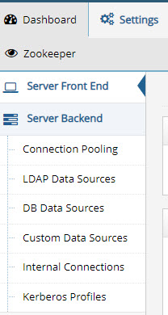
 
Figure 2. 1: The Server Backend Sub-tab 

After database, directory, or SCIMv2 data sources have been configured, the schema can be extracted and managed in the Schema Manager sub-tab. The data source must be configured prior to extracting the schema. 

### Joins 

Joins are used to extend entries from one object with attributes from another object.  Joins configured in RadiantOne can be either across objects from the same backend data source or objects from different backend data sources.  Each of these is described in more details below. 

#### Joins Between Heterogeneous Sources 

There are two types of joins possible to configure in the View Designer. One type is known as a regular join and the other is an extended join. Each is described below. 

##### Regular Join  

Use a Regular Join to add existing attribute(s) from another data source(s) to a virtual entry.   

The starting point for the join is known as the primary (or base/main) object. The data sources to be joined are known as secondary objects. Any object in the RadiantOne namespace can be a primary or secondary object. Entries representing the same user across all data sources must have a unique identifier (common key) in order to configure a regular join (a computed attribute may also be used to base a join on if more than one attribute is required to establish the common unique identifier). In the diagram below, the LDAP directory has been joined with Active Directory and a database based on a common value of employeeID matching employeeNumber in Active Directory and Emp_ID in the database. 

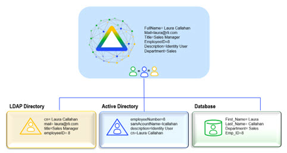
 
Figure 2.2: Regular Join Example

##### Configuring a Regular Join with Objects Existing in another Virtual View 

To configure a join, the virtual view built from the primary source must be open in the View Designer perspective. 

1.	With the virtual view opened on the View Designer tab, navigate to the primary object in the view definition (defined as either a Container or Content node) and, under the Node Properties tab on the right side, select the Object tab. 

2.	In the Join Profiles section, click New. 

3.	Select Regular join type and click Next. 

4.	Select the Join with Existing View type of association.  This means that you have already configured a virtual view that contains the secondary objects you want to join with.  Click Next. 

5.	Click Choose and select the virtual view (dvx file) that contains the secondary object(s) you want to join with. Click OK and then click Next. 

6.	The primary object join attribute is the one you want to base the join on. Select the attribute from the drop-down list, or click the Edit button to compute your own attribute to base the join on. Please see [Computed Attributes](#computed-attributes) for more information on how to configure a computed attribute. 

7.	The secondary object join attribute is the attribute from the object you are joining with that matches the primary source join attribute. Click Set to navigate to the location in the virtual view that contains the objects you want to join with and select the corresponding attribute. Click OK and then click Next. 

8.	Select the attributes to return from the secondary object. You can choose to either return them all, or only to return a few. To return them all, choose the Return all attributes option. To return a subset of attributes, choose the Return attributes listed below option and only list the attributes you want returned. Select the attributes you do not want returned and click Delete. If the attribute you want to return does not appear in the list, click Add and enter the attribute name. When finished, click Next. 

9.	Enter a unique ID for this join profile and click Finish. 

10.	If you need to [edit the join condition](#configuring-a-regular-join-with-objects-existing-in-an-external-ldap-server), select the join in the list of Join Profiles, click the Edit option and modify the relevant parameters. 

11.	Click OK. If you make any changes to the join condition, click **Save**.

##### Configuring a Regular Join with Objects Existing in an External LDAP Server 

This option should be used if you want to join with an external LDAP server directly (not joining with objects in the local RadiantOne namespace). 

To configure a regular join, the virtual view built from the primary source must be open in the View Designer perspective.  

1.	Navigate to the primary object in the view definition (defined as either a Container or Content node) and, under the Node Properties tab on the right side, select the Object tab. 

2.	In the Join Profiles section, click New. 

3.	Select Regular join type and click Next. 

4.	Select the Join with External Data Source type of association.  This means that you want to join with objects existing in an LDAP server other than the local RadiantOne service.  

5.	Click Next. 

6.	The primary object join attribute is the one you want to base the join on. Select the attribute from the drop-down list, or click the Edit button to compute your own attribute to base the join on.  

7.	In the secondary object section, select the data source that represents the LDAP server that contains the objects you want to join with from the data source drop-down list. If you don’t have a data source configured for your LDAP server, you must configure one before setting up the join. 

8.	The Target Base DN is the starting point in the LDAP directory to locate the entries for joining. To change this, click on the get DNs button. 

9.	The scope of search that should be performed on the LDAP directory to locate the entries for joining should be set in the scope drop-down parameter. 

10.	The number of matching entries to return from the LDAP directory (for each entry in the primary source) should be set in the size limit parameter. This is typically one. 

11.	The objectclass in the LDAP directory that is associated with the entries to be joined should be set in the Objectclass parameter. 

12.	The join attribute is the attribute from the secondary object you are joining with that matches the primary join attribute. Enter the attribute. 

13.	The join condition is the matching criteria (attribute from the primary source that matches in the secondary source) used to identify the entries to join is shown in the Join Condition parameter. Click Next. 

14.	Select the attributes to return from the secondary object. You can choose to either return them all, or only to return a few. To return them all, choose the Return all attributes option. To return a subset of attributes, choose the Return attributes listed below option and only list the attributes you want returned. Select the attributes you do not want returned and click Delete. If the attribute you want to return doesn’t appear in the list, click Add and enter the attribute name. When finished, click Next. 

15.	Enter a unique ID for this join profile and click Finish. 

If you need to edit the join condition, select the join in the list of Join Profiles, click the Edit option and modify the relevant parameters. 

If you make any changes to the join condition, click Save.

##### Extended Join 

An extended join is defined by adding new attributes (meaning these attributes don’t exist anywhere yet) to a virtual entry. This is primarily used to accommodate the storage of application-specific attributes. In the case of an extended join, the RadiantOne service handles the creation and management of the new attributes. The new attributes are stored in the RadiantOne namespace (either in a local Universal Directory store or some other backend that is represented in the namespace). The RadiantOne service joins the primary/main entries with these extended attributes as well as handles any modifications to these attributes accordingly (update, delete…etc.).   

The diagram below depicts an extended join. AuthzCode, lastLogon, and pwdreset are the application-specific extension attributes that are stored in RadiantOne.  RadiantOne manages the lifecycle (creation, modification, deletion) of these entries/attributes. 
 
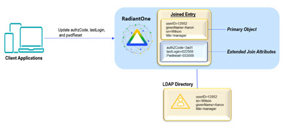

Figure 2.3: Extended Join Example 

When you configure the extended join, there are two settings you can choose from for storing the extension attributes. They are: 

-	Default – if this is chosen, RadiantOne stores the extension attributes below the cn=extendedxjoin naming context. This is a hidden naming context and is not seen when clients browse the root naming contexts. Hidden naming contexts are prefixed with the keyword hiddenContexts in the <RLI_HOME>/vds_server/conf/rootdse.ldif file.  

    The entries are created automatically, and the extension attributes are added, updated and deleted based on client requests. The only parameters to configure when using the default settings are the object class you want associated with the extension attributes, and the attribute names. 

-	Custom – if this is chosen, RadiantOne stores the extension attributes in the location of your choice. The location must first exist (create it in the RadiantOne namespace if you haven’t already). RadiantOne manages the creation of the entries and attributes as well as all modifications to these entries. The parameters you must configure are the target base DN (the location in the RadiantOne namespace where you want to store the extension attributes), the object class to associate the extension attributes with, and how to comprise the RDN attribute (name and attribute from the source to populate the target RDN with). 

    ><span style="color:red">**IMPORTANT NOTE – if your chosen location in the RadiantOne namespace is configured as something other than a local Universal Directory (HDAP) store, then the underlying backend must be capable of storing the extension attributes. For example, if the backend is a database table, then columns representing the extension attributes must exist. If the backend is an LDAP directory, the extension attributes should be defined in the schema (if schema checking is enforced) and the object class that is associated with the extension attributes should be set during the configuration described below.**

##### Configuring an Extended Join 

To configure an extended join, the virtual view built from the primary/main source must be open in the View Designer perspective.  

1.	In the View Designer, navigate to the primary object in the view definition (defined as either a Container or Content node) and, under the Node Properties tab on the right side, select the Object tab. 

2.	In the Join Profiles section, click New. 

3.	Choose Extended and click Next. 

4.	Choose whether you want the default data store settings or custom and click Next. For details on each, please see the [Extended Join](#extended-join) definition above. 

5.	If the custom setting was chosen in step 4, enter the Target Base DN.  The Target Base DN is the location in the RadiantOne namespace where you want the extension entries/attributes stored. In addition, enter the RDN value. This is how the RDN value for the extension entries is set. Enter an RDN name and select the attribute that you want to populate the RDN with.  If the default setting was chosen in step 4, then you only need to enter the object class that is associated with the extension attributes and the extension attribute names. The default object class that is used is extensibleObject.   

6.	Click Next. 

7.	Enter a unique name for configuration and click Finish to exit the wizard. 

If you need to modify the join condition, select the corresponding join profile and click Edit.

If you make any changes to the join condition, click Save.

#### Joins Between Objects of the Same Schema/Source 

To join objects from the same schema:

1.	Select the Container or Content node in the view definition and click the Attributes tab. 

2.	Click Add.  
 
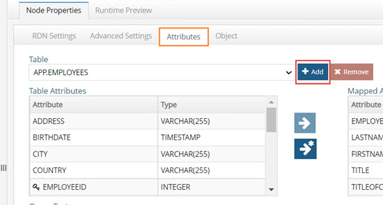

Figure 2.4: Use the Add Button to Join Objects from the Same Schema
 
3.	Navigate through the relationships to select the related object to join. The relationship must exist and be declared in the schema (using Schema Manager) before using it here.

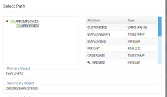

Figure 2.5: Accessing the Add Table Dialog

4.	Expand the table drop-down list on the Attributes tab. All tables in the join appear in the list, and you can select attributes from each to display at run time.  Choose the appropriate table from the drop-down list, select the attribute(s) and use the right-arrow button to declare them as attributes of the virtual entries. 

5.	If you want to join multiple tables, repeat steps 2-4.   
If you want to join objects from different data sources/schemas, please see [Joins between Heterogeneous Sources](#joins-between-heterogeneous-sources).

#### Editing a Join

On the Object tab, select the join in the list of Join Profiles and click the Edit option.
 
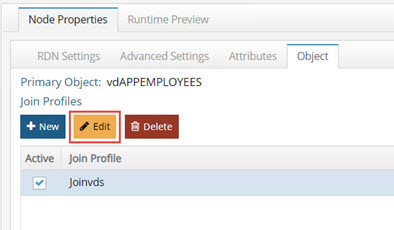

Figure 2. 6: Editing Joins

**Base DN** – On the Secondary Object tab, the DN associated with the secondary object you are joining with is shown in the base dn parameter. 

When editing an extended join, if the default data store settings are used, then the Base DN cannot be changed. If a custom data store is used, then you can change the Base DN (location in the RadiantOne namespace to store the extension attributes).

**Scope** – On the Secondary Object tab, the scope of search that should be performed to locate the entries to join with in the secondary source. 

**Join Condition** – On the Secondary Object tab, the matching criteria (attribute from primary source matching secondary source) used to identify the entries to join.

When editing an extended join, if the default data store settings are used, then the join condition cannot be changed.  If custom data store settings are used, then you can change the join condition.   

**Additional Filter** – On the Primary Object tab, additional criteria/filter to condition the primary source entries to join.  For example, if you only want to join entries that have a location of San Francisco, you could use (l=San Francisco) in the Conditional Join parameter. 

**Edit Manually** – If you are familiar with the syntax, you can click on the Edit Manually button on the Attributes tab

**Computed Attributes** – On the Attributes tab, if you are basing the join on a computed attribute and need to make changes, click on the Computed Attributes button. 

Attributes to return from the joined objects – On the Attributes tab, modify the list of attributes to return from the target object.   

**Extended Attributes to join to the main objects** – list of attributes.  This can be changed on the Attributes tab of the Edit window. This is only applicable for Extended Joins.

##### Join Syntax 

Examples of the join syntax are shown below. If you edit the join condition manually, follow this syntax. 

**Example 1 – Regular Join**

```
LDAP://[VDS]/ou=people,o=myviews?sn:1,cn:1,mail:255,title?sub?(uid=@[CID]) ##JOINTYPE=INNER##SIZELIMIT=1 
```

The [VDS] shown here indicates the RadiantOne service (as the server containing the branch you want to join). 

The ou=people,o=myviews section specifies the branch (known as the Target Base DN in the secondary source)  that should be joined.  

The attributes listed (sn, cn, mail, title) are the attributes to be returned from the secondary source.  The numeric value set after the attribute indicates the precedence level (0 being least authoritative, 255 being most authoritative. If no value is specified, an authority level of 128 is assumed). For more information, please see the section titled [Attribute Priority](#attribute-priority). 

A sub level search scope is specified to find the objects to join. 

The join takes place when uid from the ou=people,o=myviews branch matches the CID attribute in the base source. 

##JOINTYPE=INNER is set to specify that only primary entries that have a matching entry in a secondary source should be returned in the result.  Primary entries that do not have a matching entry are not returned.  The options for jointype are INNER and LEFT.  With LEFT join type, all entries from the primary source are returned. If the primary entry has a matching entry in a secondary source, those additional attributes comprise the virtual entry. 

##SIZELIMIT=1 is set to specify only one entry should be returned to join with.  In this case, it is assumed that only one entry should be returned from the ou=people,o=myviews branch for each primary entry. 

>**NOTE - If no sizelimit is specified, the default used is 1000.**

**Example 2 – Regular Join**

```
LDAP://198.123.123.444:389/dc=anotherldap,dc=com?sub?(&(sn=@[LASTNAME])(givenname=@[FIRSTNAME]))##USERID=cn=directorymanager##PASSWORD=secret##SIZELIMIT=1 
```

The IP address shown here indicates the server that you want to join to (also known as the secondary source). 

The dc=anotherldap,dc=com section specifies the branch (target base dn) in that server that contains the objects to be joined.   

Since no attributes are listed, all attributes from the secondary source are returned by default. 

A sub level search scope is specified to find the secondary objects to join. 

The join takes place when sn matches LASTNAME and givenName matches FIRSTNAME. 

##USERID specifies the user to connect to the server (198.123.123.444). 
##PASSWORD specifies the password for the user mentioned above. 

##SIZELIMIT=1 is set to specify only one entry should be returned to join with.  In this case, it is assumed that only one entry should be returned from the dc=anotherldap,dc=com branch. 
NOTE - If no sizelimit is specified, the default used is 1000.  

**Example 3 – Extended Join**

```
LDAP://[VDS]/xid=@[uid],cn=config?newattr1,newattr2?base?(objectclass=*)##EXTENDED =extensibleObject 
```

The [VDS] shown here indicates the RadiantOne service (as the server containing the branch you want to join). 

Xid=@[uid] is the RDN of the extension entry. The @[uid] part is substituted with the uid value from the primary source. This is the unique identifier between the primary entry and the extension entry and used by RadiantOne for the join. The cn=config suffix after the RDN makes up the entire DN for the extension entry.

Newattr1 and newattr2 are the extension attributes that are stored in the local default storage.  

A base search scope is specified to find the extension entries to join. 

(objectclass=*) is part of the source filter meaning that only entries that match this filter will be extended with the extension attributes during the join. 

##EXTENDED dictates that this is an extended type of join (as opposed to a regular join which would not have this keyword).  The value of EXTENDED is the object class to associate the extension entries/attributes with (e.g. extensibleObject).  

**Example 4 – Multiple Join Conditions**

To manually add more than one join condition, separate each LDAP URL with a semicolon (if you go through the wizard to setup multiple join conditions, then they will automatically be separated with a semicolon). 

```
LDAP://[VDS]/dv=activedirectory,o=vds?sAMAccountName,objectclass,cn?one?(employeeID=@[employeeNumber:VARCHAR(255)]);LDAP://[VDS]/dv=oracle,o=vds?EMPNO,ENAME?one?(EMPNO=@[employeeNumber:VARCHAR(255)]) 
```

##### Attribute Priority

The priority level is only needed when the attribute name returned from a secondary source is the same (or has been mapped to the same) as in the primary source. The default behavior of RadiantOne is to return a multi-valued attribute if a secondary object returns an attribute with the same name as the primary/main object (as long as the values are different). If you do not want the attribute to return as a multi-value, you can set a priority for the attributes. The default priority level set for all attributes is normal.  From the interface, you would use the priority levels shown below. The corresponding numeric values are also shown and would only be used if you edit the condition manually. 

| Priority Level | Numeric Value 
------------|------------
Lowest |	1
Low	| 64
Normal	| 128
High | 192
Highest |	255

To specify attribute priority, open the virtual view containing the primary/main objects and select the associated container or content level. On the right side select the Object tab. Here, you should see the entire list of attributes coming from the primary object, returned from any joined/secondary objects, and any computed attributes. Select the attribute name that has more than one source and then click **Edit Attribute**. The details for the attribute are shown. The origin of the attribute shows all sources the attribute comes from. Click in the Priority column to set the priority accordingly. The attribute with the higher priority is returned in the virtual entry. 

In addition to setting priority, you can also specify whether the attributes returned from joined sources are hidden (not visible in the virtual entry), searchable, or updateable.   

##### Marking Attributes as Hidden

You may want to define an attribute as hidden because you need it for a join (it may be the attribute you are basing your join on), but you don’t want the value to be in the final joined entry.  

To define an attribute as hidden, select the Object tab (for the appropriate container or content node) and select the attribute you want to hide. Click **Edit Attribute** and check the Hidden in Result box. These attributes are not returned in the joined entry. 

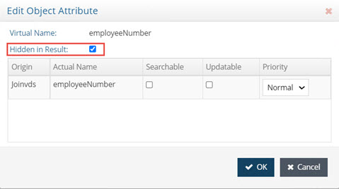

Figure 2.7: Marking Attribute as Hidden

><span style="color:red">**IMPORTANT NOTE – if you edit the join condition manually, and want to make an attribute returned from a joined object hidden, add a value of 1792 to the priority weight you have set. For example, if mail were an attribute returned from a join and you had it set with a priority value of 128 (NORMAL), then to make it hidden in the virtual entry, you would change the numeric value to be 1920 (128 + 1792). Mail:1920 is how it would appear in the join condition if you were to edit the join manually.**

Making Attributes Searchable

You may define attributes as searchable or not.  If an attribute from a joined source is defined as searchable, and a client uses the attribute in a search filter, RadiantOne attempts the join on all entries from the primary source and then applies the filter to see which ones match the client search filter. 

If an attribute from a secondary source is defined as non-searchable, RadiantOne applies the search filter on the primary objects (to narrow down the possible join candidates) and then only joins those entries.  The performance is better in this case because the join only needs to occur on a subset of the primary entries.  

To define an attribute as searchable, choose the Object tab (for the appropriate container or content node) and select the attribute you want to be searchable. Click **Edit Attribute** and check the Searchable box. If you do not want the attribute searchable, uncheck this option. When finished, click OK and save the virtual view. 

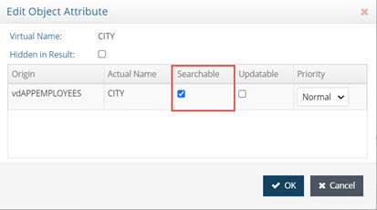

Figure 2.8: Making Attribute Searchable

IMPORTANT NOTE – if you edit the join condition manually, and want to make an attribute returned from a joined object non-searchable, add a value of 512 to the priority weight you have set. For example, if mail were an attribute returned from a join and you had it set with a priority value of 128 (NORMAL), then to make it non-searchable, you would change the numeric value to be 640 (128 + 512). Mail:640 is how it would appear in the join condition if you were to edit the join manually.  

##### Making Attributes Updateable

You may define attributes as updateable or not. If an attribute is updateable, clients may modify the value. If an attribute is not updateable, clients cannot modify the value. 

To define an attribute as updateable, choose the Object tab (for the appropriate container or content node) and select the attribute you want to be updateable. Click **Edit Attribute**  and check the Updateable box.  If you do not want the attribute updateable, uncheck this option.  When finished, click OK and save the virtual view. 

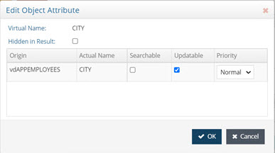

Figure 2.9: Making an Attribute Updateable

><span style="color:red">**IMPORTANT NOTE – if you edit the join condition manually, and want to make an attribute returned from a joined object not updateable, add a value of 1024 to the priority weight you have set. For example, if phone were an attribute returned from a join and you had it set with a priority value of 128 (NORMAL), then to make it not updateable, you would change the numeric value to be 1152 (128 + 1024). Phone:1152 is how it would appear in the join condition if you were to edit the join manually. If you didn’t want the phone attribute to be searchable or updateable, it would have a numeric value of 1664. (128 + 512 + 1024).**

#### How the Join is Performed 

If the filter in the client search involves attribute(s) that come from the primary (main) source only, RadiantOne pre-filters (applies that filter to the primary entries to reduce the number of entries that are required to join). If the filter in the client search involves attributes that can come from secondary (joined) sources and those attributes(s) are marked as searchable, then RadiantOne cannot pre-filter on those attributes and must join everything first and then apply the filter on the joined result. RadiantOne knows if attributes used in the filter could come from secondary sources if the attribute(s) are specifically requested in the join condition, or if * is used in the join condition to return everything from the joined source. 

If you require the attributes from the secondary sources to be searchable (used in a filter from a client search), you must specify them as such. If the filter received in the search contains any attributes that are defined as searchable from a secondary source, then RadiantOne does not pre-filter against the primary source for those attributes. The join is first performed (all entries are joined), and then the filter is applied on the result. For example, let’s say you have a backend pointing to a Sun Java Directory and you want to join with a virtual view of Active Directory. The following join condition could be defined: 

```
LDAP://[VDS]/dv=activedirectory,o=vds?sAMAccountName,objectclass,cn:640?one?(emplo yeeID=@[employeeNumber:VARCHAR(255)]) 
```

Since cn is listed in the join condition as searchable (numeric value of 640), RadiantOne knows that it should apply the filter after first joining the entries. The Sun entries are joined with the Active Directory entries (where employeeNumber=employeeID) and then the filter is applied to the result. Performance is slower if you want attributes from joined sources to be searchable (because of the requirement to first join all entries). 

However, if a filter also contains an attribute that is only defined in the main source (and not listed in any join condition), RadiantOne applies the filter on the main set of entries to reduce the number that needs to be joined. Then, the reduced number of entries is joined and the filter is applied on the joined result.   

For example, using the join condition defined above, if RadiantOne receives a filter like: (&(mail=lcallahan@rli.com)(cn=laura callahan)), it first searches the Sun Java Directory for entries matching mail=lcallahan@rli.com (because mail is not defined as an attribute to return from Active Directory). Then, it joins the entries that were returned with the corresponding entries in Active Directory. Finally, it applies the original filter on the joined entries and the ones that match are returned to the client. The final result sent back to the client depends on whether your join configured is set for a Left or Inner join. Each are described below. 

#### Join Types 

##### Left Join 

In a Left Join, all entries from the primary source are returned in the result and if they have a matching entry in a secondary source(s), those additional attributes comprise the main entry. If an entry in the primary source does not have a matching entry in a joined source it is still a possible candidate to be returned to the client (if it matches the original filter in the client request). 

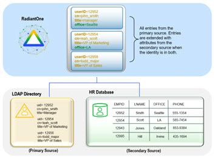

Figure 2.10: Example of a Left Join 

##### Inner Join 

In an Inner Join, the primary entries (from the starting point for the join) are joined with matching secondary objects. Only entries that can be joined (the intersection) are possible candidates to be returned to the client (if it matches the original filter in the client request). The entry(s) that are returned are comprised of attributes from the primary object and any joined secondary objects. 


Figure 2.11: Example of an Inner Join 

#### Behavior if a Secondary Source is Unavailable 

In cases where one or more of the secondary sources is unavailable, the behavior of RadiantOne depends on if the “[Process Joins and Computed Attributes Only when Necessary](04-view-designer.md#process-joins-and-computed-attributes-only-when-necessary)” optimization is enabled or not. 

If the Process Joins and Computed Attributes Only when Necessary optimization is enabled, and the filter coming from the client request only involves attributes from the primary source, and the attributes requested are only from the primary (main) source, RadiantOne does not need to perform the join. If one of the secondary backend sources is down, RadiantOne does not know in this case because the optimization indicates that it should only join if necessary, and in this example, a join is not necessary. Therefore, RadiantOne does not know if a secondary backend is down or not.  In this situation, the entry (with the specific attributes requested) is returned to the client. If the filter in the client request involves attributes that could come from a secondary source (and they are configured as searchable), or if the requested attributes from the client include attributes from secondary sources(s), the optimization is not possible and RadiantOne must join. In this case, the default behavior is to not return the entry at all. If the client issued a base search, they receive LDAP error code 32 along with the error message from the secondary backend that was unavailable. If the client issued a one level or subtree search, they receive error code 9 along with the error message from the secondary backend that failed. 

If you would prefer RadiantOne to return partial entries, then you must specifically indicate this in the external join condition. Manually edit the join condition and add the following: 

##ALLOW_PARTIAL_ENTRY=yes 

If partial entries are allowed, and the client issued a base search, they receive LDAP error code 0 (no error) along with the partial entry (whatever information RadiantOne was able to retrieve from available sources). Each returned entry contains an additional attribute of vsyspartialentry=true. If the client issued a one level or subtree search, they receive LDAP error code 9 along with the partial entry (whatever information RadiantOne was able to retrieve from available sources) and an error message from the secondary backend that was unavailable. Each returned entry contains an additional attribute of vsyspartialentry=true.   

Please see the diagram below for more details on the join behavior. 
 
##### Join Behavior Diagram 
  

 
Disabling Joins 

For testing and/or debugging purposes, you can disable joins. To disable a configured join, uncheck the Active checkbox next to the desired join directly from the Object tab. Save the virtual view. 

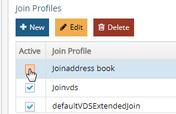

Figure 2. 12: Disabling Joins

Disabled/deactivated joins are not processed by RadiantOne. To enable the join condition, check the Active checkbox and save the virtual view.  

Bind Order 

If you have configured joins between multiple sources, RadiantOne can send the bind request (credential checking) to many backends (any that play a role in the join).  If you are not using joins, then bind order is irrelevant. 

After the join is configured, you can set the bind order (the backends to check in a particular order). The diagram below depicts an example. The database is configured with bind order 1. Therefore, RadiantOne attempts the bind there first. If the bind fails against the database, the LDAP directory receives the bind request (as per the configuration). If the bind were to fail again, Active Directory would receive the bind request. If all sources fail, the client receives a bind failure error from RadiantOne. 

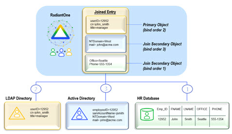

Figure 2.13: Bind Order Example 

To configure the bind order: 

1.	Have the virtual view built from the primary/main source open in the View Designer. 

2.	Select the primary/main object in the view definition (represented as a container or content) and click on the Object tab on the right side. 

3.	Click Edit next to the Define Bind Strategy property at the bottom. A list of all sources (the primary along with any sources you have joined with) is displayed.  

4.	Enable the source as a possible participant in the bind operation. Then, use the up and down arrow to determine the order RadiantOne should attempt the credential checking.  

5.	RadiantOne attempts to verify the credentials against the first enabled source in the list. If it fails, then the next is tried and so forth. If all enabled sources have been tried without success, RadiantOne returns a bind failed error to the client.

### Computed Attributes 

If the entries in virtual view should include attributes that are derived from existing attributes, you can use Computed Attributes. Computed attributes can be based on attributes from the primary object, secondary objects (from joins), and/or previously computed attributes.  

If you need to create a computed attribute from a previously computed attribute, that attribute must appear first in the list in the Computed Attributes window.   

><span style="color:red">**IMPORTANT NOTE – On the Object tab, attributes from the primary/main source are displayed with a blue square icon in the Origin column.  Attributes from Joined sources are displayed with a green square icon in the Origin column.  Computed Attributes are displayed with a orange square icon in the Origin column.**

The diagram below depicts a computed attribute named login that can be computed based on the attributes: givenName, sn, and uid. 

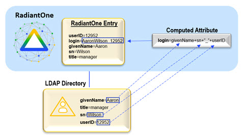
 
Figure 2. 14: Computed Attribute Example 

The diagram below depicts a computed attribute example where the value is comprised of attributes coming from both the primary and secondary objects. 
 
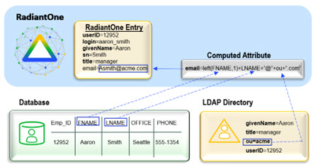

Figure 2. 15: Computed Attribute Example

To configure computed attributes: 

1.	Have the virtual view built from the primary source open in the View Designer tab. 
2.	Select the primary/main object (represented as a container or content) and select the Object tab on the right side. 
3.	On the bottom of the Object tab, click Edit next to Define Computed Attributes. 
4.	Click Add.  
5.	Enter the Computed Attribute name in the Name parameter. 
6.	Configure the needed expression to comprise the computed attribute. This is based on Java and if you are already familiar with the syntax, you can enter it directly for the value.   
7.	(Optional) For assistance with creating an attribute based on a constant, click the constant button and enter the value.  
8.	(Optional) For assistance with creating an attribute based on an existing attribute, click the Attribute button (a list of all attributes available in the virtual object displays).  

9.	(Optional) For assistance with creating an attribute based on a function, click the Function button for a list to display. 

10.	Click the Validate button to check the syntax of your expression.  

11.	Once your expression compiles properly (no errors in the Compilation Results window), click OK.  

12.	Click OK again to exit the Computed Attribute window.

13.	The computed attribute appears in the list of attributes (indicated with an orange square in the Origin column) and the value is populated based on your configured expression when RadiantOne returns virtual entries for the corresponding virtual view. An example is shown below.

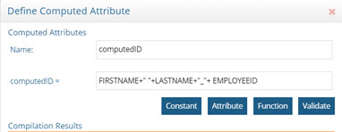

Figure 2. 16: Example – Computed Attribute Definition

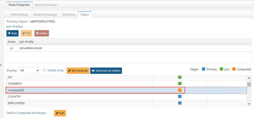
 
Figure 2. 17: Computed Attributes are Noted with an Orange-colored Square

### Interception Scripts 

Interception scripts are written in Java and are used to override the default behavior of the RadiantOne service to implement functionality to meet your needs. Examples of functionality you can introduce are: 

-	Complex mappings (concatenations, or string manipulations) 

-	Override the incoming query (pre-processing) 

-	Processing/changing a result (post processing) 
The interception script is triggered when a specific node (that has a script defined for it) in the virtual view (dvx file) is reached either through searching (one or sublevel search) or direct access (base search).  When this node is reached, the RadiantOne service suspends default processing and starts the script processing. The figure below depicts this at a high level. 
 
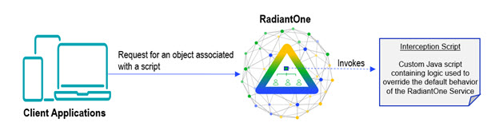

Figure 2. 18: Execution of Interception Scripts
 
For samples of interception scripts, please see the Radiant Logic Knowledge Base at: http://support.radiantlogic.com 

Only registered customers have access to the Knowledge Base.  If you are a customer and do not have access, please contact support@radiantlogic.com. 

**Default Behavior**

All operations performed by RadiantOne (authentication, update, insert, delete, search) can have custom logic applied with interception scripts. The following section describes the default behavior for processing authentication, select, update, delete and insert requests. If you require additional capability, an interception script may be used. 

>**Note – consult with a Radiant Logic Support Engineer or Solution Architect to discuss any interception scripts you need.**

**Authentication**

If the backend is a JDBC-accessible source, RadiantOne compares the password received in the bind request to the attribute that has been mapped to ‘userPassword’ in the virtual view from the database.  If the values match, the user is authenticated.  If the values do not match, then the user is not authenticated.   

If the backend is an LDAP (JNDI) accessible source, then RadiantOne delegates the bind request to the underlying directory. This process includes the following: 

1.	The user configured in the connection string (data source) of the virtual view definition file (.dvx file) is used to create a connection to the LDAP backend.  

2.	A search for the user who requested the bind operation is performed and the user’s DN is returned.  

3.	RadiantOne issues the bind request to the underlying directory (using the DN returned from the search request) along with the password received in the bind request. 

The three steps described above are transparent to the client that originally sent the bind request. The bind response (either successful or unsuccessful) is returned to RadiantOne from the backend, and then the RadiantOne service replies to the client. After the bind, the operations that the user is allowed to perform are configured in the Access Control Lists (ACL) within RadiantOne. This is only part of the authorization process (the first layer). Any operation that the user performs must also be allowed to be performed on the underlying directory with the user configured in the connection string/data source (the second layer). For example, if the user who binds successfully is allowed to change phone numbers (based on ACLs set up in RadiantOne), then the user configured in the data source associated with the virtual view definition must also be allowed to change phone numbers (based on ACLs set up in the underlying directory). For more information on setting access controls for RadiantOne, see the RadiantOne System Administration Guide. 

**Select**

The requested entry is retrieved from the underlying source(s). The entry contains the attributes specified in the view definition and translated based on the configured mappings before it is returned to the client.   

**Update**

The update request is forwarded to the underlying source. The attribute(s) that the client is requesting to update must be available in the virtual entry (specified in the view definition) and updateable in the underlying data store. It is assumed that the attribute to be updated resides in a single underlying store. 

**Delete**

The delete request is forwarded to the underlying source. The entry to be deleted must have a valid DN in the RadiantOne namespace. The entry that the client is requesting to delete must also be allowed to be removed from the backend data store, and only affect a single underlying object (i.e. only needs to be deleted from one database table or one entry in an LDAP directory). 

**Insert**

The insert request is forwarded to the underlying source. The entry to be inserted must only affect one underlying source (i.e. one database table or a single location in a directory).  All attributes that are required by the underlying source must be included in the new entry.  The required attributes are specified in the schema that is captured by the Schema Manager. If you open the schema (.orx file) in the Schema Manager and select the Fields node (for a specific object) the Nullable column on the right indicates which attributes are required. Attributes that have false in the Nullable column are required.  Attributes that have true in the Nullable column are optional. 

The following sections describe how to enable and customize interception scripts if you need to override the default behavior detailed above. 

#### Enabling an Interception Script 

To create an interception script: 

1.	Have the virtual view opened on the View Designer tab. Select the location in the view definition where you want the script to be applied. 

2.	On the right side, click on the Advanced Settings tab. 

3.	Check the Active check box to enable the script for the type(s) of operation(s) that you are interested in customizing.   

4.	Click the New button and enter a name for the script. 

5.	Click OK.   

6.	Save the virtual view. 
 
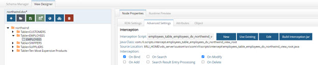

Figure 2. 19: Enabling Interception Script

#### Editing an Intercept Script 

After an interception script has been activated, click the Edit button next to the script, located on the Advanced Settings tab. This opens the script, which contains the default template. All interception scripts must implement the UserDefinedInterception2 interface.  More information regarding this can be found in the Javadoc. 

>**NOTE – on the file system, the file is located in <RLI_HOME>/vds_server/custom/src/com/rli/scripts/intercept/<name of script>.java.**

After you edit the script to include your custom logic, save the file. The appropriate class file is generated and stored in: <RLI_HOME>/vds_server/custom/classes/com/rli/scripts/intercept. 

#### Using Your Own Custom Classes in Interception Scripts 

To use your own custom class in an interception script: 

1.	Copy your .jar file into <RLI_HOME>/vds_server/custom/lib. 

2.	Restart the RadiantOne service and the Jetty service hosting the Control Panel to ensure the new jar file is loaded properly. If RadiantOne is deployed in a cluster, restart the services on all nodes. For details on restarting services, see the RadiantOne Deployment and Tuning Guide.

3.	Import the class at the beginning of the script. An example is shown below.  

    import com.rli.synsvcs.etl.BasicOperation; 
 
#### Deploying an Interception Script 

After the script has been customized and saved, the last step is to generate the appropriate jar file. This can be done by clicking the Build Interception Jar button on the Node Properties -> Advanced Settings sub-tab.

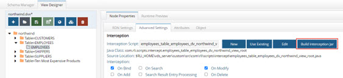
 
Figure 2.20: Building Intercept Jar

Jar files can be rebuilt from command line using ANT. An example is shown below (for simplicity, most of the output of the script has been excluded below).  This command rebuilds customobjects.jar, intercept.jar, fidsync.jar and changeMessageConvertors.jar.

C:\radiantone\vds\vds_server\custom>c:\radiantone\vds\ant\bin\ant.bat buildjars 

Buildfile: build.xml 
<br>.
<br>.
<br>[propertyfile] Creating new property file: C:\radiantone\vds\vds_server\custom\build.txt 
buildjars: 
<br>[jar] Building jar: C:\radiantone\vds\vds_server\custom\lib\customobjects.jar
<br>[jar] Building jar: C:\radiantone\vds\vds_server\custom\lib\intercept.jar 
<br>[jar] Building jar: C:\radiantone\vds\vds_server\custom\lib\fidsync.jar 
<br>[jar] Building jar: C:\radiantone\vds\vds_server\custom\lib\changeMessageConvertors.jar 
<br>BUILD SUCCESSFUL 
<br>Total time: 9 seconds

><span style="color:red">**IMPORTANT NOTE – every time you change the script/class, the JAR file MUST be rebuilt and the RadiantOne service must be restarted. If RadiantOne is deployed in a cluster, restart the service on all nodes.**

#### Disabling an Interception Script 

You can disable the interception script (and go back to the default behavior) by deactivating the operation(s).  In the View Designer, select the node in the view definition that represents the object a script is enabled for.  Select the Node Properties -> Advanced Settings sub-tab on the right side and uncheck all active operations.  Save the view. To “reactivate” the script, just check the Active checkboxes again and save the view.

### Hierarchy Builder 

The hierarchy builder utility builds a hierarchical virtual view based on attributes of an object.  Attributes from any object extracted using the Schema Manager can be used to build a hierarchical virtual view (as long as all entries have a value for this attribute). This is an easy way to turn a relatively flat LDAP directory tree or a database table into a hierarchical structure.  Having a hierarchical view can be useful for delegated administration. 

The following example describes how the hierarchy builder works. This example builds a virtual hierarchy based on attributes available in the LDAP object class inetOrgPerson.  

An LDAP directory contains an object class named inetOrgPerson. All user accounts are created with this object class. A sample entry is shown below. 

dn: uid=SBuchanan,ou=People,dc=domain1,dc=com 
<br>givenName: Steve 
<br>telephoneNumber: 111-111-5000 
<br>sn: Buchanan 
<br>mail: stevebuchanan@rli.net 
<br>carLicense: CX4398 
<br>objectClass: top 
<br>objectClass: person 
<br>objectClass: organizationalPerson 
<br>objectClass: inetorgperson 
<br>uid: SBuchanan 
<br>postalCode: 94954 
<br>cn: Steve Buchanan 
<br>title: big sales guy 
<br>employeeNumber: 26568 
<br>description: This is the description for Steve Buchanan 
<br>businessCategory: Sales 

The LDAP directory has a flat structure with all user accounts located below ou=People,dc=domain1,dc=com. The diagram below has been simplified to show two user accounts for this example. 

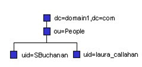

Figure 2.21: Example of an Existing LDAP Hierarchy
Let’s say for delegated administration, the desired LDAP hierarchy would be: 

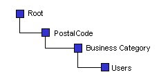

Figure 2.22: Desired Hierarchy
The following steps can be used to build the new virtual hierarchy. This example describes building a hierarchy from an LDAP directory backend. 

1.	Extract the object class from the LDAP directory using the Schema Manager. If you need help with this, see section on [Capturing Metadata from LDAP Backends](03-schema-manager.md#ldap-accessible-backend). 

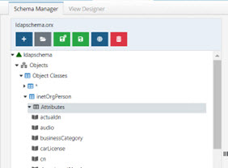

Figure 2.23: Example LDAP Schema 
2.	On the View Designer tab, click Hierarchy Builder.  

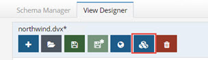
 
Figure 2.24: Hierarchy Builder

3.	Select the Schema by clicking Browse.

4.	Click OK.  

5.	Select the LDAP object class from the list of schema objects.  

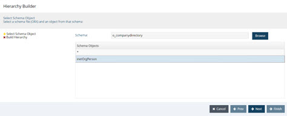

Figure 2.25: Hierarchy Builder 

6.	Click Next.  

7.	The available attributes from the object class selected on the previous screen are displayed in the column on the left. Use the > button to move the attribute into the hierarchy on the right. 

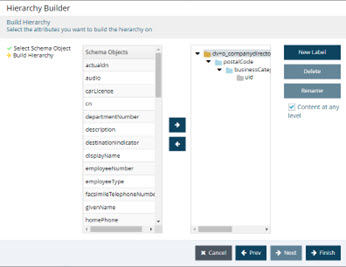

Figure 2. 26: Hierarchy Builder 

8.	If you want to change the RDN name for the node, select the node and click the Rename button on the right.  

9.	You can also create additional labels (using the New Label button) to organize the tree if needed (optional). 

10.	Click Finish. 

11.	Provide a name for the virtual directory view file and click OK.  

12.	After the process completes, you can open this view in the View Designer. 

13.	Click on the Runtime Preview tab to test the new hierarchy.    

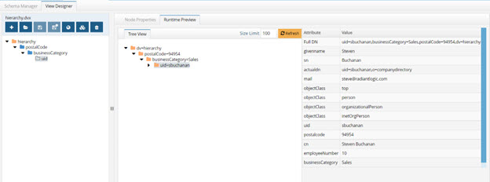

Figure 2.27: Example Virtual View Created with Hierarchy Builder 

As shown in the example above, the Hierarchy Builder tool allows you to take an existing flat LDAP tree and virtualize it into a complex hierarchy. The same steps could be used to take a database table and build a hierarchical view based on its columns. 

><span style="color:red">**IMPORTANT NOTES – All attributes used to comprise the hierarchy should have VALUES for each entry, and the attributes should be indexed in the underlying data source.  It is also recommended that if there are many entries (500,000+) that no more than 3-4 levels of hierarchy be used (otherwise performance could be a problem with dynamic access because RadiantOne must perform the “select distinct” operation on all entries to properly build the hierarchy). If persistent cache is used, then performance shouldn’t be a problem – but building the persistent cache could take some time. For details persistent cache, please see the RadiantOne Deployment and Tuning Guide.**
