# Chapter 3: Schema Manager

The Schema Manager tool is used to extract the metadata from every source that you want to integrate identity data from.  

A wizard process in Schema Manager helps you connect to your data sources and inventory the different objects, attributes and relationships.  After the schema is extracted, you can manage/modify the metadata by setting mappings for object classes and attributes, declaring keys, and even relationships between objects.  

This section presents the Schema Manager concepts and procedures.

## Concepts

### Primary Key 
In a well-designed relational database, every table has a column, or combination of columns, known as the primary key of the table. These values uniquely identify each row in the table. Occasionally you will find tables that were created in the database, but the uniquely identifying column(s) were not documented in the system catalog as the primary key. Declaring implicit primary keys is one of the database refining processes you perform using Schema Manager.   

>**IMPORTANT NOTE – All objects you want to virtualize must have a primary key defined, and any attribute that you declare as the primary key in the Schema Manager must be unique for all entries in your table.**

In a directory, there is a notion of a “unique identifier” which is an attribute in each entry that uniquely identifies it from the sibling entries. This is not something that is explicitly documented in the directory schema; therefore, you must declare the primary key for the object class in the Schema Manager. Typically, the unique identifier in the directory comprises the RDN. For example, if a user DN were: uid=lcallahan,dc=ldap,dc=com, the unique identifier for the person objectclass would be uid.

The yellow key next to the attribute in the Fields list denotes it as the primary key for the object (see screen shot below). If no primary key is defined, you can use the right-click menu to edit/define one. For more information see [Declaring Primary Keys](#declaring-primary-keys). 
 
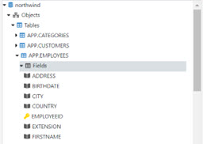

Figure 3.1: Primary Key of the Object is Shown with a Yellow Key Icon

### Display Name 

With Schema Manager, you can create a RDN Attribute and Value Name, or alias/display name, for a Primary Key. This allows the user browsing the directory to be shown more useful information. For example, if the Primary Key of a Customer table is CustID with an integer attribute type, then a list of numbers is displayed in the virtual view at run time.  Chances are, the person who created the database is the only one for whom those numbers mean anything. Therefore, a display name could be created using the customer’s first name and last name. Instead of the user seeing a number, they now see a more meaningful customer name. The display name is a combination of the primary key and one or more attributes. Because it is comprised of the Primary Key, an RDN Attribute and Value Name is always unique and can qualify as a candidate key. For more information, see [Declaring RDN Attribute Name and Value](#declaring-rdn-attribute-name-and-value). 

### Derived View 

Derived views result from queries to a base object. These views are built by promoting one of the attributes of the base object to the entity level. Once the view is created, it is added into the schema and this new relationship can be used to create more detailed, flexible views of information.   

For example, let’s say your database includes a table that lists Customers and related attributes, including Country. You need a list of all countries in which you have customers.  Derived views allow you to create a view that lists all applicable countries. Derived views contain summary data. For example, in the Customers.Countries derived view shown below all occurrences of one country are combined into one record.  

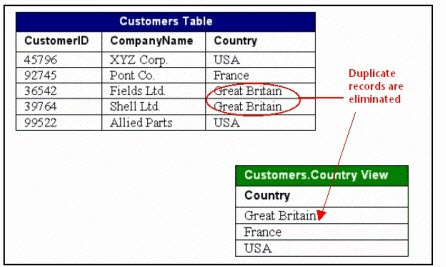

Figure 3.2: Base Table and the Derived View on Country

You can create derived views by using the right-click menu on the object that contains the attribute you want to create a derived view from.  

 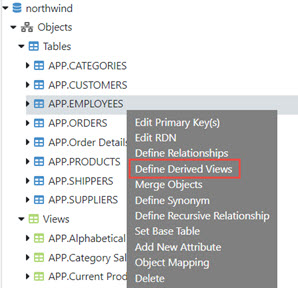

Figure 3. 3: Define Derived Views

For more information on derived views, see [Creating Derived Views](#creating-derived-views). 

### Relationships 

If relationships exist in a database and are not explicitly declared in the system catalog, then the schema extraction process does not capture them. Some relationships are created implicitly (exist in the application, but are not recorded within the database dictionary). This is fine if you do not need to build a virtual view based on the relationships. On the other hand, if you want to use the existing relationships to build virtual views, then you must establish the relationships in the Schema Manager.   

To evaluate missing relationships in the Schema Manager, you need a working knowledge of the underlying database application on which the schema is based. Once you have determined which relationships are missing, you can declare them by using the Define Relationships option from the right-click menu available when an object is selected. For more information, see [Declaring Implicit Relationships](#declaring-implicit-relationships). 

### Connection String 

Connection strings contain the information required for RadiantOne to establish a connection to the backend data source. The connection information is established when the data source is configured.

If connection information to the backend changes, the connection strings must be updated accordingly. For more information on editing the connection string, see [Modifying Connection Strings](#modifying-connection-strings). 

### Recursive Relationships 

A recursive relationship is an object related to itself. For example, an employee may be managed by another employee. Therefore, an Employee table would have a recursive relationship with itself. Please see [Declaring Recursive Relationships](#declaring-recursive-relationships) to see how this can be accomplished with the Schema Manager. 

## Using the Schema Manager 

This section describes how to use the Schema Manager to extract schemas and manage metadata from backend sources. 

The toolbar on this tab allows for creating a new schema, opening a schema (orx file), saving a schema file, defining global relationships (relationships between objects from different schemas), and deleting a schema file. 

Figure 3. 4: Schema Manager Tab

### Displaying Objects and Relationships 

When you open a schema (orx) file, the Schema Manager displays the objects in alphabetical order. Objects are tables and views (for databases), or object classes (for LDAP directories). As you select an object, information about that object appears on the right side.  

>**NOTE – If you select the Fields (for database objects) or Attributes (for LDAP objects) node (below a specific object) the Nullable column on the right side indicates which attributes are required. Attributes that have a ‘false’ value in the Nullable column are required. Attributes that have a ‘true’ value are optional. This is important to know if you want to insert users into the backend. Make sure that all required attributes are populated for the new entry or else the insert operation will fail in the underlying source.**

Relationships between database objects are displayed below the relationships node. 

The figure shown below displays all tables, views and relationships from the sample Northwind.orx file installed with RadiantOne. Notice that the top level is the name of the file followed by a section named Objects. When the objects node is selected, the Properties tab on the right side displays important summary information. A blue icon designates Tables. A green icon designates Views, and Relationships are designated by the relationship icon (two connected tables). 
 
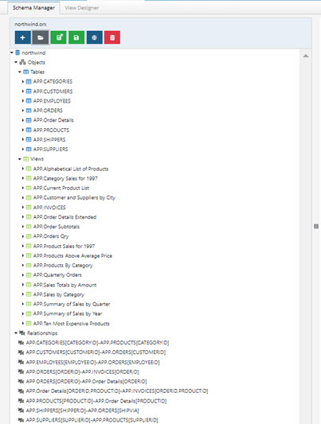

Figure 3.5: Schema Manager View of Objects and Relationships

### The Schema Manager Process 

The Schema Manager captures the metadata from different data sources, including databases and directories, and stores it in canonical format (XML). Once captured, the metadata can be translated and mapped into object classes and attributes for the RadiantOne namespace. The step of mapping from metadata to RadiantOne object classes and attributes has a default behavior that can be overridden to further refine the mapping process. The Schema Manager also gives you the tools to improve and manage the metadata that has been captured.  The process is outlined in the illustration below.   
 
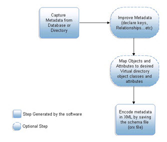

Figure 3.6: The Schema Manager Process

#### Capturing Metadata  

The first step in using the Schema Manager is capturing the metadata for each of the sources you want to build virtual views from. The Schema Manager provides a set of wizards that can extract the schema from any JDBC, LDAP or SCIMv2 compliant data source. 

##### LDAP-Accessible Backend 

Examples of LDAP-accessible backends are Sun Java Directory, Microsoft Active Directory, IBM Tivoli Directory, eDirectory, Red Hat Directory, and OpenLDAP.  The LDAP data source must be created before completing the schema extraction steps below. See the RadiantOne System Administration Guide for details on creating LDAP data sources.

1.	In the Schema Manager click the Create button (Plus sign).

2.	Choose the LDAP option and click Next. 

3.	Select a data source and click Get DNs. Select the DN that contains the identities needed for your use case and click OK.

4.	Click Next.

5.	Select the object classes to be extracted and click Next. 

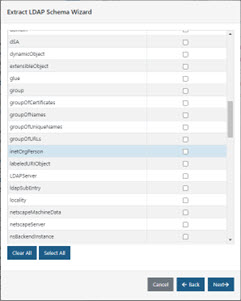

Figure 3.7: Extract LDAP Schema Wizard

6.	Enter a name for the file and click Create Schema. A schema file is generated and contains the metadata about the selected objects. This schema file is stored on the file system at <RLI_HOME>\vds_server\lod\<schema name>.orx. An LDIF formatted file containing the schema is also saved in the lod folder (with the same name as the .orx file) and is used to retrieve object class and attribute definitions if the metadata is used to extend the RadiantOne LDAP schema. For details on extending the schema, see the RadiantOne System Administration Guide.  

>**IMPORTANT NOTE - DO NOT USE HYPHENS (-) IN FILE NAMES. 
You can view and modify this schema by opening the .orx file in the Schema Manager tab. Any changes made do not affect the underlying schema.**

###### Handling Auxiliary Object Classes from LDAP Backends 

Sometimes, an LDAP entry in a directory is comprised of more than one object class where the object classes do not necessarily inherit from each other. This is referred to as an auxiliary class. For example, a person entry in the directory can be a part of an object class such as inetOrgPerson and also contain attributes from a custom object class like rliuser (this is the auxiliary class).  During the schema extraction, since the object classes do not inherit from each other, they are displayed as two separate objects each having their own list of attributes.  To retrieve the proper information from the directory in the virtual view, you must merge the objects together in the Schema Manager. 

To merge object classes together: 

1.	Right-click on the structured object class in the list and select Merge Objects.   

2.	Select the auxiliary object class from the list that you would like to merge with (RLIUser for example) and click OK.  

3.	Enter a unique name for the merged object and click OK. 

4.	A new object is created below the Views branch and contains all attributes from both object classes.  The virtual view can be created from this merged object and the virtual entries can contain attributes from either of the object classes. 

Figure 3.8: Merging LDAP Object Classes

>**IMPORTANT NOTE – The direction in which you merge the objects is significant because the ‘base’ object (the structured object class) is used in the filter for the query that is sent to the backend directory. You can see this in the View Designer, Attributes tab for the node in the view definition that is built from the merged object. This can be seen in the screen shot below. Note that the attributes defined for this virtual node come from both the structured objectclass inetorgperson (uid, cn, displayName) and the auxiliary objectclass, RLIUser (rliuserattribute2, rliuserattribute3).**

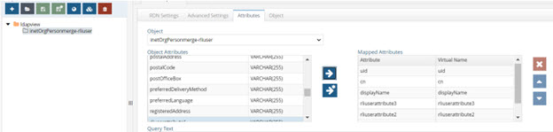

Figure 3.9: Sample Virtual View Built from Merged Object Class

##### JDBC-Accessible Database Backend 

Any data source that supports a JDBC driver can be extracted using the Schema Manager. Examples of JDBC-accessible backends are Microsoft SQL Server, Oracle, DB2, and Sybase. RadiantOne also includes a JDBC driver for accessing Salesforce. The driver name is radiantsalesforce and it appears in the Description drop-down list when extracting a database schema. 

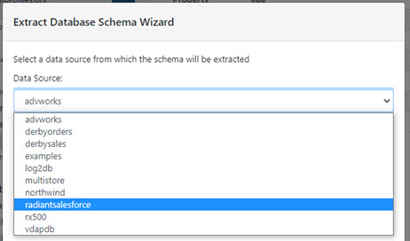

Figure 3.10: RadiantOne Salesforce JDBC Driver

The database data source must be created before completing the schema extraction steps below. See the RadiantOne System Administration Guide for details on creating database data sources.
1.	In the Schema Manager click the Create button (Plus sign).
2.	Select the Database option and Click Next. 
3.	Select a data source and click Next. 
4.	Include Schema Name and User Authentication Information if needed.  You can limit the types of objects to be returned by selecting tables, views, system tables, or synonyms.  If you would like all types of objects returned, then select all options.  If you only want a subset of the selected objects returned, then you can enter a pattern for the Table Pattern parameter using the “%” for a wildcard character.  For example, if you want to return only tables that start with “N”, then for the Table Pattern you can enter N%.  

>**NOTE – The ANSI standard syntax for naming relational database tables is catalog.schema.table. Therefore, if you are authenticating as a user who has access to multiple different schemas, and want to narrow the search, you can enter in the specific schema name.**

5.	Click Next to proceed and select the desired Tables and Views from the list.   
 
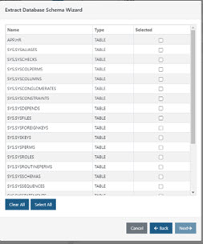

Figure 3.11: Sample Table and View List 

6.	Click Next, then enter the name of the new .orx file. 

    >**NOTE – DO NOT USE HYPHENS (-) IN FILE NAMES.** 

7.	Click Create Schema to start the database schema extraction process.  This generates the schema (orx) file, an XML representation of the schema. 

You can view/modify this schema by opening the .orx file in the Schema Manager tab. Any changes made (such as declaring primary keys or creating relationships), do not affect the underlying schema. 

###### Adding JDBC Drivers 

RadiantOne includes the following database drivers: 
-	Sun JDBC-ODBC bridge 
-	Oracle (both oci and thin) 
-	SQL Server JDBC 
-	HSQL 
-	MySQL 
-	Sybase 
-	Apache Derby 
-	RadiantOne Salesforce 

You have the option to use one of the above drivers, however, it is recommended that you use the driver that was delivered with the database that you want to connect to.  To add a JDBC driver, you must make sure that the driver libraries are added in the <RLI_HOME>/lib/jdbc directory. Restart the RadiantOne service and the Jetty service that hosts the Control Panel to load the new driver files. If deployed in a cluster, restart the services on all nodes. For details on restarting these services, see the RadiantOne Deployment and Tuning Guide.  

##### SCIMv2 Backends

The SCIMv2 data source must be created before completing the schema extraction steps below. See the RadiantOne System Administration Guide for details on creating SCIMv2 data sources.

1.	In the Schema Manager click the Create button (Plus sign).
2.	Select the SCIMv2.0 option and click OK. 
3.	Select a SCIM data source from the drop-down list and click Next. 
4.	Select the SCIM resource types from the list and click Next.

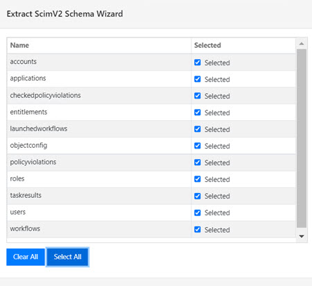
 
Figure 3.12: SCIM Schema Objects

5.	Enter a schema file name and click Create Schema. This generates the schema (orx) file, an XML representation of the schema. 

You can view/modify this schema by opening the .orx file in the Schema Manager tab. 

#### Enhancing the Captured Metadata 

Once the metadata has been captured, the next step is to improve it in a way that best serves your needs. This may involve declaring primary keys, relationships and RDN names, mapping object classes and attributes, creating synonyms, and/or removing objects, attributes and relationships.  Each of these topics is discussed in more details below. 

>**NOTE – Changes made in the Schema Manager do not affect the underlying schema.**

##### Declaring Primary Keys 

Primary keys that are implicit, but not declared in the data dictionary, are not included in objects and relationships file (.orx) unless you declare them.   

>**IMPORTANT NOTE – All objects you want to create virtual views from must have a primary key defined, and any attribute that you declare as the primary key in the Schema Manager must be unique for all entries in your table.**

For directory schemas, declare the attribute that uniquely identifies each entry as the primary key. 
To declare and modify the primary keys: 

1.	Right-click on the desired object and choose Edit Primary Key.  

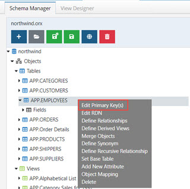

Figure 3.13: Editing the Primary Key

2.	Choose the column(s) from the Attributes List that you want to use as the primary key and click the right arrow button. 

3.	To remove the column(s) from the key(s) list, choose the column(s) and click the left arrow button. 

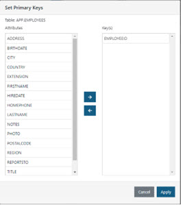
 
Figure 3.14: Primary Key Dialog Box

4.	Click Apply when finished. The key(s) you selected are now declared as the primary key. 

##### Declaring Implicit Relationships  

Sometimes a database schema does not contain all relationships that can exist between objects.  The Schema Manager cannot capture these implicit relationships that are known by the programmers but not declared in the database data dictionary. You should declare any relationships you will need for your virtual views. 

The Schema Manager provides the information and resources to help you identify, and then declare any relationships and primary keys that are not explicit in the database definition. The declaration process is a critical step as it affects the quality of the virtual views that are created using the View Designer tool. Any undeclared relationships or primary keys result in a meaningless path, directly affecting the quality or availability of information displayed in the virtual views.  

The Relationships dialog box requires source and destination tables (or views). When setting relationships, it does not matter which entity is the source and which is the destination. 

>**NOTE – Declaring implicit relationships relates to database schemas only.**

To set a relationship between two objects: 
1.	Right-click on the desired object and choose the Define Relationships option. The Relationships dialog box appears. 

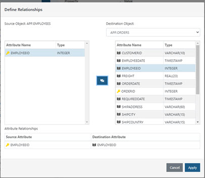

Figure 3.15: Relationships Dialog Box

2.	Select the destination object that has a relationship with the source object. 
3.	Choose the column(s) from the source and the matching column in the destination and then click the  
 button. 
4.	Click Apply when finished to establish the relationship. The relationships are created and appear at the bottom of the list of relationships. 

##### Declaring Recursive Relationships 

If a table has a relationship to itself, the Schema Manager can be used to establish this recursive relationship. 

To create a recursive relationship: 

1.	Right-click on the object that has a recursive relationship and select Define Recursive Relationship. 

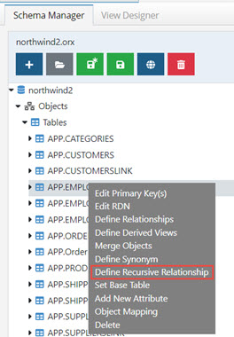

Figure 3.16: Define Recursive Relationship
2.	Select the foreign key and enter the number of recursions possible (the depth level).  

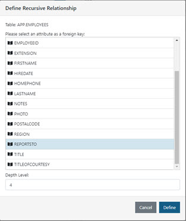

Figure 3.17: Select Foreign Key and Enter Depth Level 

3.	Click Define when finished.  

You should now see new views created corresponding to the depth level entered, and new relationships between these objects.  

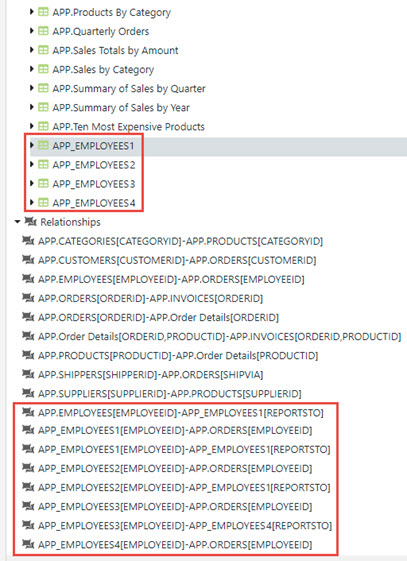

Figure 3.18: Example Relationships in a Database Schema

Once the recursive relationship is described in the schema file, a hierarchical virtual directory view can be created. For details on how to build virtual views, please see [Chapter 4](04-view-designer.md). 

>**NOTE – if you do not know the depth of recursion, there is a way to build a virtual view without first defining the recursive relationships in the Schema Manager. For detailed steps, please see the article titled Building a Hierarchical Virtual View Based on Recursive Relationships in a Database in the RadiantOne Knowledge Base at: http://support.radiantlogic.com**

You will need a user ID and password for accessing the knowledge base. If you do not have one, please contact Radiant Logic at support@radiantlogic.com.

##### Creating Synonyms 

For flexibility in modeling virtual views, you can create a synonym from any object in the schema. A synonym is a complete replica of the object with a new name. 

To create a synonym for an object: 

1.	Right-click on the object and select Define Synonym.  

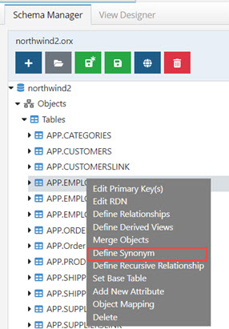

Figure 3.19: Define Synonym

2.	Enter a name for the Synonym when prompted. 

>**NOTE – Synonyms may NOT have the same name as an existing object in the schema.**

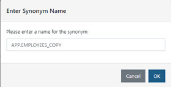

Figure 3.20: Enter Name for the Synonym

The new object appears under the list of Views.  This new object does not change the underlying schema but can be used when building virtual views.  For details on building custom virtual views, please see [Chapter 4: View Designer](04-view-designer.md). 

##### Declaring RDN Attribute Name and Value 

RDN Attribute Name and Display Columns are a combination of the primary key and at least one other attribute. You can also declare RDN Attribute Name and Display Columns using the View Designer, see Declaring an RDN Attribute Name and Value for more details.  

To declare or Modify RDN Attribute Name and Value: 

1.	Right-click on the desired table or view and choose the Edit RDN option. 

2.	Enter an RDN Name (the value that comprises the DN) and select the attributes that you want to comprise the RDN value (remember that these attributes are used in addition to the primary key). 

3.	Click Apply when finished. 

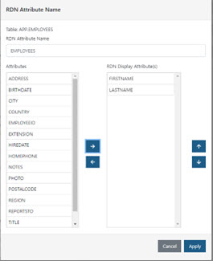

Figure 3.21: RDN Attribute Name and Value Dialog Box

>**IMPORTANT NOTE – the attributes that you select as the display attribute(s) should not allow NULL values.**

To remove attribute(s) from the RDN Display Attribute(s) list, choose the column(s) and click the left arrow button. 

This RDN attribute name becomes the default name (for a container or content object) when the corresponding object is used to build a virtual view in the View Designer.   

For example, if you set the RDN attribute name for the Employee table to equal Name, then when you access the Employee table to create a container or content level in the View Designer, the default RDN attribute name for that specific level will be Name. The RDN will be Name = First Name Last Name {Employee Primary Key value}.  An example of this is shown in the screen shot below. 

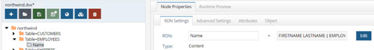
 
Figure 3.22: RDN Name and Value when Building a Virtual View

##### Removing Objects, Attributes or Relationships from the Schema 

Unwanted tables, views, attributes, or relationships can be removed from the schema.  Remember to save the schema after making any changes. 

###### Removing Objects

Objects in a database schema are tables or views. Objects in an LDAP schema are object classes. Right-click on the desired object and choose Delete. 

>**NOTE – If any of the objects are involved in a relationship, the corresponding relationship must be removed first.**

Figure 3.23: Deleting Objects

###### Removing Attributes

Some attributes can be removed from objects. Primary keys and attributes involved in relationships cannot be removed. Right-click on the attribute you want to remove and choose Delete. 

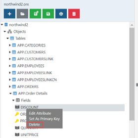
 
Figure 3.24: Deleting Attributes

###### Removing Relationships

To remove a relationship, right-click on the desired relationship and choose Delete. 
 
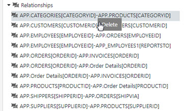
 
Figure 3.25: Deleting Relationships

##### Creating Derived Views

Derived views are created from a base table and consist of one attribute that contains normalized data, such as a single column table for countries, postal codes, city names, etc. Derived views are objects that are added to the schema file to allow for more flexibility when creating virtual views. 

See [Derived View](#derived-view) in the Schema Manager basic terms for more information. 

To create a derived view, follow the steps below. 
1.	Right-click on a table or view, select the Define Derived Views option. 
2.	Select the appropriate object from the drop-down list.   
3.	Select the column you want to use and click Define.  

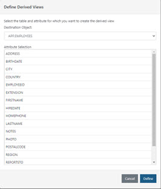

Figure 3.26: Define Derived View Dialog Box

The new derived view object appears in the list of views in the Schema Manager tab. This new object can be used when building virtual views in the [View Designer](04-view-designer.md). 

>**NOTE – A derived view may NOT be created from the same attribute twice.**

##### Mapping Metadata 

Mapping metadata into a common vocabulary is essential for facilitating a global search. Clients searching the RadiantOne service should be able to use one common naming structure to locate information no matter which backend source the data resides. This can only be achieved by properly mapping the metadata. 

Default LDAP object classes and attributes are generated for all database objects. This default object class is comprised of a “vd” prefix, followed by the name of the database (and/or schema/owner), and the name of the database object. The object class assigned to the database object is stored as an LDAP Object Class property in the .orx file. The default attributes are based on the attribute names as they exist in the database. 

In the example shown below, the LDAP object class generated by default is vdAPPCUSTOMERS. The attribute names in the entries built from the database schema matches the names as they exist in the database. 

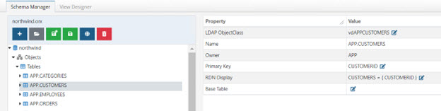

Figure 3.27: Default Object Class Generated

For LDAP backends, the object class(es) from the schema definition is the default value shown in the Schema Manager. The # sign is used to separate the class hierarchy. The default attribute names also match the underlying schema definition. 

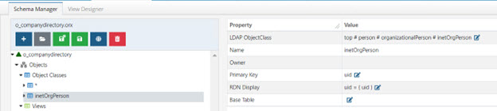

Figure 3.28: Default Object Class for LDAP Object 

The default object class can be changed if needed. Database and LDAP objects can be mapped to an existing object class definition or you can manually enter your own custom one.  

###### Mapping Database Objects to LDAP Object Classes and Attributes

1.	Open the database schema containing the objects you want to map in the Schema Manager tab. 
2.	Right-click on the database object you want to map and choose Object Mapping. 

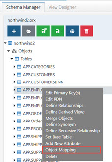

Figure 3.29: Change Mapping for Objects

3.	Select the object class from the drop-down list that you want mapped to the database object. 
4.	When mapping database columns to LDAP attributes, you can apply a [default mapping](#applying-the-default-mapping), map each attribute individually based on the object class definition selected in step 3, or manually enter your own mapped attribute name. To map to an existing LDAP attribute, select the corresponding LDAP attribute from the drop-down list. The attribute list is based on the definition of the LDAP object class selected in step 3. In the example shown in the screen shot below, inetOrgPerson has been selected and two attributes have been mapped to LDAP attributes of the inetOrgPerson class. 

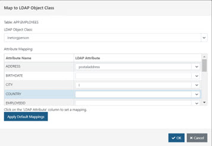

Figure 3.30: Mapping to an Existing LDAP Object Class

5.	If you prefer to enter your own custom object class name, you can type it in the LDAP Object Class parameter. 
6.	If you prefer to enter your own custom attribute names, type them in the LDAP attribute parameter next to the database attribute name.
7.	Click OK when finished. 

##### Mapping LDAP Objects to New Object Classes and Attributes

To map LDAP object classes and attribute to other LDAP object classes and attributes:

1.	Open the LDAP schema containing the object classes you want to change the mapping for in the Schema Manager tab. 

2.	Right-click on the LDAP object class you want to map and choose Object Mapping. 

3.	Select the object class from the drop-down list that you want to map to. 

4.	When mapping attributes, you can apply a [default mapping](#applying-the-default-mapping), map each attribute individually based on the object class definition selected in step 2, or manually enter your own mapped attribute name. To map to an existing LDAP attribute, select the corresponding LDAP attribute from the drop-down list. The attribute list is based on the definition of the LDAP object class selected in step 2. In the example shown in the screen shot below, inetOrgPerson has been selected and two attributes have been mapped to LDAP attributes of the inetOrgPerson class.

5.	If you prefer to enter your own custom object class name, you can type it in the LDAP Object Class parameter. 

6.	If you prefer to enter your own custom attribute names, type them in the LDAP attribute parameter next to the source attribute name.

7.	Click OK when finished. 

###### Applying the default mapping

The default attribute mapping is defined in a schema file named defaultmapping.orx.
1.	On the Schema Manager tab, open defaultmapping.orx. This file is located on the LDAP Schemas tab.
2.	Expand the object named DefaultMapping.
3.	Expand the Fields section to see a list of source attribute names. 
4.	To view the default LDAP attribute mapping, right-click on the attribute name and choose Edit Attribute. The alias defined for the attribute is the LDAP attribute name that is used in the default mapping. In the example shown below, any source schema that contains an attribute named LastName would have this attribute mapped to sn if the Default Mapping option was used.
 
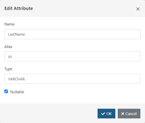

Figure 3.31: Alias is the Default LDAP Attribute Mapping

5.	To view all default mappings, right-click on Fields and choose Attribute Mapping.

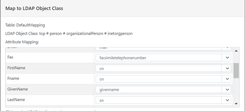

Figure 3.32: Default Attribute Mappings

6.	To define a new attribute mapping, right-click on Fields and choose Add New Attribute. 
7.	Enter the source attribute name and the LDAP attribute mapping in the alias property. The example shown below defines a mapping for attributes named “City” to be mapped to the LDAP “l” attribute.

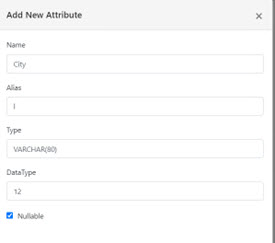
 
Figure 3.33: Add Default LDAP Attribute Mapping

8.	To apply the default mapping, open the source schema file on the Schema Manager tab. 

9.	Right-click on the Fields node below the database object containing the attributes you want to map and choose Object Mapping.

10.	In the Map to LDAP Object Class window, click the Apply Default Mappings button. This establishes the attribute mapping based on a pre-defined list in the defaultmapping.orx file. 

11.	For attributes that are not mapped by the default mapping, you can choose an attribute from the drop-down list which is populated with the attributes available from the LDAP object class that the object is currently mapped to.

12.	Click OK when finished. 

13.	Save the schema file.

Mappings configured in schema files do not impact the underlying data source schema.

##### Merging Schema Files

Merging schema files is helpful if you have extracted and enhanced (declared keys, relationships, mapping…etc.) a very large schema and you need to bring in new objects from that same server. You can extract just these new objects and merge them with the existing schema. This saves time over having to extract and enhance the entire schema again. 

To merge schema files:  

1.	Extract the new objects on the Schema Manager tab. 
2.	Open the existing schema file in Schema Manager. 
3.	Right-click at the top node of the schema and choose Merge with Other Schema. 

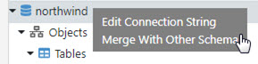

Figure 3.34: Merge Schema Option

4.	Browse to the schema file that you extracted/saved in step 1 above. 

5.	Check the objects you want to merge with the schema. You can use the Select All button to save time if there are many. Click OK. 

6.	The newly merged objects appear in the opened schema. 

7.	Save the schema file. 

##### Modifying Connection Strings 

Use this procedure to redefine the Connection String to the data source. If the connection to the data source has changed (driver, server, port...etc.), then you must change the connection string. You can edit data sources from the Main Control Panel -> Settings -> Server Backend section. There is also a command line utility available for data sources. For details on this utility, see the RadiantOne Command Line Configuration Guide. 
To edit the connection string:  

1.	On the Schema Manager tab, open a schema associated with the data source you want to update. 

2.	Select the top node of the schema and the connection information appears on the right-side. 

3.	Update the required values. 

4.	Click Test Connection to confirm the changes. 

5.	Click Save.

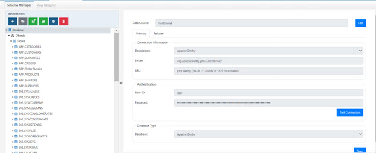

Figure 3.35: Edit Connection String

##### Deleting Schema Files 

Schema files (.orx files) should be deleted using the Context Builder. It is not recommended to manually remove files from the file system. 

To delete a schema file: 

1.	Open the schema file on the Schema Manager tab.

2.	Click the delete button on the toolbar. 

3.	Select the schema file you want to delete.

4.	Click OK. 

5.	Click OK again to confirm the deletion. 

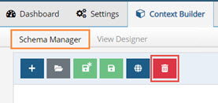

Figure 3.36: Deleting Schema Files
