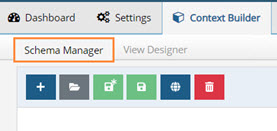
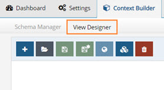
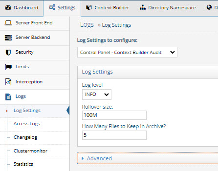

# Introduction

This document provides step-by-step instructions on using the Context Builder.
>[!note] 
>If you have a RadiantOne license that entitles you to use the Context Builder, you will see a Context Builder tab in the Main Control Panel. Otherwise the tab doesn't show. 

The Context Builder is used to extract metadata from backend sources and model virtual directory views. The views can be flat or hierarchical and comprised of an aggregation of many views. This provides greater flexibility for view design than creating simple proxy views from the Main Control Panel > Directory Namespace tab. 

To access the Context Builder, in the Main Control Panel, click the Context Builder tab. It includes two main tabs where tasks are accomplished: Schema Manager and View Designer.

The two main tools in Context Builder are the Schema Manager and the View Designer.

### Schema Manager 

The Schema Manager is used for extracting and managing schemas from backend sources. See [Schema Manager](schema-manager.md) for details on Schema Manager.
 

Figure 1: Schema Manager

### View Designer 

The View Designer is used for building custom views from schemas that have been extracted with the Schema Manager. See [view designer](view-designer.md) for details on View Designer.
 

Figure 2: View Designer

### Logging/Debugging

Context Builder logging is enabled by default. All errors that occur while using Context Builder have a popup with an error message or have an entry in web.log. This log file is located in <RLI_HOME>\vds_server\logs\jetty. 

For auditing purposes, <RLI_HOME>/logs/contextbuilder_audit.log can be used. This log contains details about when the Context Builder was started/stopped, the files that were saved/created/deleted, the date/time the change occurred, and the user that was using Context Builder.

The log level is configurable from Main Control Panel > Settings > Logs > Log Settings.

Select the Control Panel – Context Builder Audit option from the “Log Settings to configure” drop-down list.

 

Figure 3: Context Builder Log Settings
