# View Designer

The View Designer tab is used to build virtual views from backend sources whose schemas have been extracted on the Schema Manager tab. This modeling tool allows you to design and try out multiple views of data. Views can be designed from backend LDAP directories, databases accessible via JDBC, and any data source accessible through SCIMv2, or a Java API (web service…etc.). Data used to populate the virtual views at runtime is dynamic, meaning that the query is sent to the backend server on-the-fly as data is requested from a client. 

To access the tool, click the View Designer sub-tab in the Main Control Panel > Context Builder tab.
 
 

Figure 1: View Designer

The following sections describe how to work with the View Designer tab.

## Concepts 

When designing your views and namespace, you can use different kinds of node types to build your model. 
-	Global Catalog 
-	Container
-	Label 
-	Content 
-	Link 

Each of these is described in more details below. 

### Global Catalog 

The Global Catalog is a virtual view named rootdv.dvx that aggregates other virtual views. The global catalog virtual view is mounted below the o=vds root naming context in the RadiantOne namespace. In other words, when you add a virtual view into the global catalog you will see it as a branch below the o=vds root naming context in the RadiantOne namespace. 

All virtual views (.dvx files) can be aggregated in the Global Catalog; however, this is not a requirement. You can mount your virtual views under new root naming contexts that you define. First, setup the new root naming context and then mount your virtual view (.dvx file) below it. Creating new root naming contexts and mounting virtual views are done in the Main Control Panel > Directory Namespace tab. For detailed steps, please see the RadiantOne Namespace Configuration Guide. 

If you want to mount your virtual view below the default o=vds root naming context, open your view in the View Designer and click the Add to Global Catalog button on the toolbar.

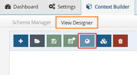

Figure 2: Add to Global Catalog

As mentioned, the Global Catalog is a .dvx file also. You can view the contents (the aggregated list of virtual views) of the rootdv.dvx file in the View Designer, however, DO NOT delete it. You can remove .dvx files that have been added to the Global Catalog by selecting the (link) to the specific view and clicking the Delete button on the Properties tab shown on the right. This does not delete the .dvx file itself, but it removes the view from the Global Catalog. To delete a .dvx file completely, please see [Deleting Virtual Views](#deleting-virtual-views).

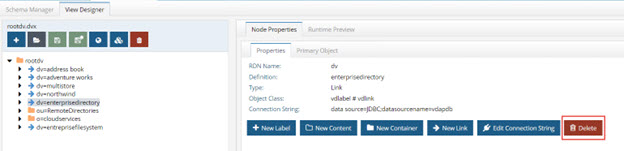

Figure 3: Removing Virtual Views from the Global Catalog 

### Container 

A container object is a node that can have descendants. A container can include other containers or content objects.

You can think of a container as a directory similar to a “directory inside a file system”, where a directory can contain other directories or files. However, the comparison should stop there, because a container is an object represented in a virtual view. When you create a container, you base it on an object that has been extracted/created in the Schema Manager and this information is used to populate the entries at run time. The container automatically inherits the primary key attribute of the underlying objects. You can also expose other attributes that belong to the underlying object into the virtual entries. 

For more information, see [Working with Container Objects](#working-with-container-objects). 

### Label 

A label node is a container object whose default attribute is a text label. The name of the label is defined during the creation and can be updated on the Properties tab. Other attributes can be defined for labels on the Primary Object tab. 

Use labels when you want to separate different types of information for display. In this respect, a label acts as an ad hoc way to aggregate objects from the same schema. However, when combined with links, you can aggregate objects coming from different schemas as well. 

When a label is used as an intermediate link between two objects, it acts as a “pass-through” for the underlying relationship. The label does not affect the value of the keys that are propagated from the parent to the descendant. The objects are still linked by the same relationships. 

For instance, if you have the following configuration in your view definition, at run time it depicts that Customer X purchased Product Y: 

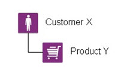

Figure 4: Example View Without a Label

Now, if the model of the tree were changed and a label were introduced (see the new design below), you still get Product Y below Customer X. The key of Customer X is passed through the label to condition products (to only show products purchased by Customer X). 

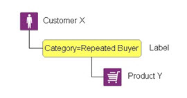

Figure 5: Example View Using a Label to Organize the Tree 

When you want to categorize a collection of data from objects or resulting from combined objects (through joins), you can use labels to categorize these sub-levels of information. For each label, you are saying that this sub-level of information will reside under this category.

You can create an unlimited number of labels, depending on how many categories of information you need to define.

For more information, see [Working with Labels](#working-with-labels). 

### Content

A Content Object is a node that has no descendants. It is a “leaf” or “terminal” node in the view.

A content node represents an object in a virtual view. When you create a content node, you base it on an object that has been extracted/created in the Schema Manager and this information is used to populate the entries at run time. The content automatically inherits the primary key attribute of the underlying objects. You can also expose other attributes that belong to the underlying object in the entries. 

For more information, see [Working with Content Objects](#working-with-content-objects). 

### Link 

Links are a special kind of node that allows you to point to a specific sub tree defined in an existing virtual view (.dvx file) or a new sub tree that you design on-the-fly based on objects from other schemas. Using this mechanism in conjunction with a label (although a label is not necessary) you can aggregate information from different schemas (simple objects or whole sub trees). Links allow you to transparently navigate from schema to schema in an ad hoc way. 

There are two different types of links: Standard and Merge. Each is described in more details below. 

#### Standard Link 

A standard link offers a simple way to aggregate virtual views. Each view file has a top node named with the following syntax: `dv=<file name>`. When aggregating virtual views using standard links, the “dv” label level remains and becomes part of the naming in the hierarchy. 

Let’s take a look at an example. Assume there are three data sources: a database, an Active Directory, and an LDAP directory. This is represented in the diagram below.

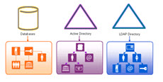

Figure 6: Example Data Sources

Next, a virtual view from each is configured. This is represented by the three views shown below. 

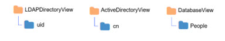

Figure 7: Virtual Views from Each Source

Finally, standard links are used to aggregate the views. This is represented in the virtual view model shown in the screen shot below. The runtime preview shows what the populated view looks like. Notice that the “dv” level comprises the runtime view. 


Figure 8: Virtual View Model and Runtime Tree using Standard Links

#### Merge Link 

A merge link offers more flexibility than a standard link because the “dv” label level is suppressed (making the tree simpler for browsing). In addition, with merge links, a link parameter can be configured to condition the subtree based on the parent view. Details on the link parameter can be found below. 

##### Link Parameter 

Merge links can have a parameter that conditions the subtree based on an attribute of the parent object. This is optional but offers flexibility by allowing you to build a context-driven virtual view that navigates across multiple data sources.

A link parameter is based on a unique key of the parent entry. The value of this key must match an attribute in the view to be mounted. Two examples are used to describe the benefits of using a merge link with a parameter. One example is based on the attribute in the parent object being single-valued and the other example is based on a multi-valued attribute.

##### Linking on a Single-Valued Attribute

The following diagram depicts two databases. One database maintains project information while the other database stores employee information including department and location. 

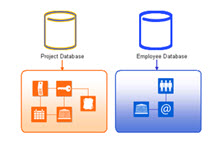

Figure 9: Two Sample Databases 

Let’s assume the desired virtual hierarchy should represent projects, followed by the department associated with the project, followed by the location of the employee, and finally the employees working on the project. Since the information is maintained in two separate databases, a virtual view can be built from each. This is depicted in the diagram below. One view is built for projects while the other is a view of employees based on departments and location.


Figure 10: Two Example Virtual Views 

A merge link (noted with the blue arrow) is used to aggregate the virtual views. This is depicted in the diagram below. 


Figure 11: Example Linking Two Existing Views

In the linked view shown above, the sub-branch (view named EmpByDeptView) can be conditioned by setting a linking attribute. In this example, all projects are associated with a department (there is a one-to-one relationship based on the project ID), so the project ID can be established as the linking attribute. By adding a condition to the link based on the project ID attribute, the subtree shown at runtime is dependent upon the project (the parent node). The link parameter syntax is: 
`<childobject.attribute>=@[<parentobject_attribute>:<datatype>]`

An example value is: 
APP.EMP.PROJECTID=(@[projectid:INTEGER])

Without this link condition, all departments would be shown below each project and the hierarchy would not make sense. The difference between using a link parameter and not using one are shown in the following two figures. 


 
Figure 12: Example – Using Merge Links with No Parameter

As the figure above shows, the subtree is not conditioned by the parent object which is why all departments are shown below each project. This does not accurately depict the context needed. The ideal virtual view would show each project and then below each project show the department working on that project followed by location and employees accordingly. 

Since the department object has a relationship with projects (the project ID is available in the department entry), the project ID can be used as the link parameter to condition the subtree. This is shown in the figure below. 
 


Figure 13: Example – Using Merge Links with a Parameter to Condition the Subtree

Based on the examples shown above, a link parameter is required for the virtual view to represent the proper context of showing projects per department.

##### Linking on a Multi-Valued Attribute

In the previous example, the link condition was based on a single-valued attribute in the parent entry. This is the primary use case for a link parameter. However, if the attribute in the parent entry contains multiple values you can use it to configure the link parameter.

>[!warning] 
>There are limitations when working with link parameters involving multi-valued attributes from parent objects. The link is limited to one multi-valued parent attribute. If there are too many values in the parent node, the query might fail due to the limit on LDAP filter size or SQL statement size.

The example in this section describes using a multi-valued attribute in the parent object to condition the child object(s). The following diagrams depicts two objects. One object contains identity information including a list of entitlements the user has, while the other object contains entitlements information including which application the entitlement is associated with. 


Figure 14: Example – Source Entries

Let’s assume the desired virtual view should represent identities followed by a list of entitlements associated with the identities. Since the information is maintained in two separate objects, a virtual view can be built from each. This is depicted in the diagram below. One view is built for identities while the other is a view of entitlements. 


Figure 15: Two Example Virtual Views 

A merge link (noted with the blue arrow) is used to aggregate the virtual views. This is depicted in the diagram below. 

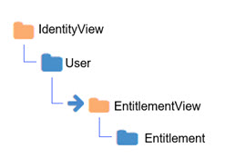

Figure 16: Example Linking Two Existing Views

In the linked view shown above, the sub-branch (view named EntitlementView) can be conditioned by setting a linking attribute. In this example, all identities are associated with entitlements, so the entitlements attribute in the identity can be established as the linking attribute to the idlink attribute of the entitlement view. By adding a condition to the link based on the entitlements attribute, the subtree shown at runtime is dependent upon the entitlements associated with parent identity. However, since the value of the entitlements attribute in the parent identity is multi-valued, the link condition must be manually altered to include a special syntax. If the link parameter is associated with a child node from an LDAP backend, the syntax to handle a multi-valued parent attribute is: 

```
<childobject.attribute>~=@[<parentattribute>:<datatype>] 
```

An example value is:

```
vdentitlements.idlink~=@[entitlements:VARCHAR(255)] 
```

If the link parameter is associated with a child node from a database backend, the syntax to handle a multi-valued parent attribute is: 

```
<childobject.attribute> IN (@[<parentattribute>:<datatype>]) 
```

An example value is: 

APP.IDENTITY.IDLINK IN (@[entitlements:VARCHAR(255)] 

>[!warning] 
>For child nodes from database backends, make sure in the link parameter value there is a `<space>` between the “IN” and the following open parenthesis. Also, performance can be negatively impacted because the “IN” operator does not benefit from prepared statements.
 
An example depicting the model of the virtual view and the runtime view leveraging the link parameter between the two virtual views described in this section is shown below. 

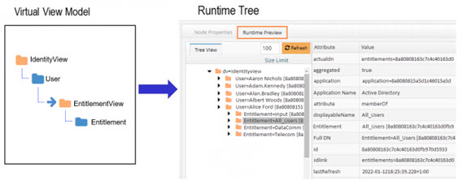

Figure 17: Example – Using Links with a Parameter to Condition the Subtree

##### Merge Links without a Link Parameter

This section describes a scenario where linking is used to aggregate objects from different schemas where a link parameter is not needed. In this example, three data sources are used. One data source is an LDAP directory storing partner information. One data source is Active Directory storing employee information. The third data source is a database storing customer information. Each data source is depicted below with objects representing their schemas. 


Figure 18: Three Example Data Sources

In this example, the desired virtual view is one that aggregates people (employees, partners and customers) into one complete list to be used for authentication. 

First, three virtual views (one from each source) are created. This is depicted in the figure below. 


Figure 19: Three Example Virtual Views

Finally, links are used to aggregate the virtual views into one common hierarchy. The virtual view will consist of employees from Active Directory, partners from an LDAP directory, and customers from a database. Both the virtual view model and the runtime view are depicted below.

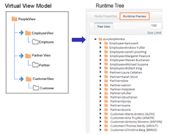

Figure 20: Example Virtual View using Merge Links with No Parameters

This example described how links can be used to aggregate a list of people from three different data sources. Since there is no overlap of users in this scenario, using merge links is a simple way to create a union of all user accounts across three different data sources. Since the subtrees linked do not need to be conditioned by a parent attribute, a link parameter was not required to achieve the desired result. 

>[!note] 
>The intermediate virtual view names (EmployeeView, PartnerView and CustomerView respectively) are suppressed in the final runtime view because merge links were used.

Configuration steps for using links can be found in the [Working with Links](#working-with-links) section.

## Using the View Designer 

The View Designer sub-tab is located on Context Builder tab in the Main Control Panel.

When you open a .dvx file here, the name of the virtual view appears on the tab and the model of the virtual view is shown.

As you select a node in the view definition, the Node Properties and the Runtime Preview tabs appear on the right. To configure the node, use the options available on the Node Properties tab. To populate the model with data and see what the entries look like to a client, you can click the Runtime Preview tab 
View Designer commands can be accessed in any of the following ways:

### Toolbar

The toolbar contains the View Designer buttons that can be used in designing the model of the virtual tree.
 
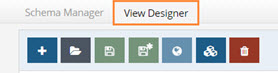

Figure 21: View Designer Toolbar

-	New View Definition  
-	Open DVX File 
-	Save 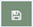
-	Save As 
-	Add to Global Catalog 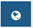
-	Hierarchy Builder 
-	Delete 

### Node Properties tab

As you select a node in the view definition, the Node Properties tab is activated. This tab includes all parameters needed to customize the virtual view. The parameters are spread across 2-4 sub-tabs (depending on the type of node) each of which is described below.

#### RDN Settings Tab

The RDN Settings tab displays summary information about the node you have selected. If the node type is Content or Container, the RDN Settings tab has the RDN name and value, and type of node. For Container nodes, you also have buttons to add a label, content, container and link.

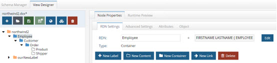

Figure 22: Node Properties Tab for Containers

For details on creating an alias for the primary key, see [Declaring RDN Attribute Name and Value](#declaring-an-rdn-attribute-name-and-value).

If the node type is a label, a Properties tab replaces the RDN Settings tab. On the Properties tab, you can view the RDN attribute name and value (neither are editable), You can change the object class by clicking the change button. There are also buttons to add a label, content, container and link. Use the delete button to remove the label.

If the node type is a link, a Properties tab replaces the RDN Settings tab. On the Properties tab you can see the RDN Name, definition, type, object class, and connection string associated with the linked view. You also have buttons to add a label, content, container, and link, in addition to an option to edit the connection string for the linked view. There is also a button to delete the link.

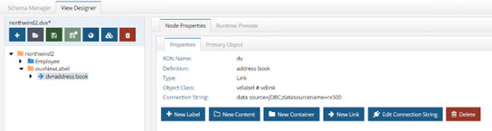

Figure 23: Properties for a Link Node

#### Advanced Settings Tab

The Advanced Settings tab is available when you select Content or Container nodes. From this tab you can configure Interception scripts and set optimizations for your virtual view. You can also customize how to handle case-sensitive databases and define SQL filters from here (this is irrelevant if the backend is an LDAP source).


Figure 24: Advanced Settings Tab

#### Attributes Tab

The Attributes tab is available when you select Content or Container nodes. 
For Content and Container nodes, the Attributes tab allows you to select and modify (remap) the attributes from the primary source that you want the entries to be comprised of.

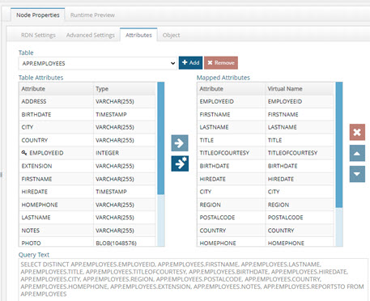

Figure 25: Attributes Tab

For procedures on defining output, see [Working with Container Objects](#working-with-container-objects) and [Working with Content Objects](#working-with-content-objects).

For creating filters, see [Adding Filters to Condition Virtual Views](#adding-filters-to-condition-virtual-view-content).

For combining tables, see [Joins](concepts-and-utilities.md#joins-between-objects-of-the-same-schemasource) (this is only relevant for database backends). 

##### Re-mapping Attribute Names

By setting a mapping for an attribute name, you are defining the name that appears in the virtual entries for this view. The value shown in the Virtual Name column is the name of the attribute in the virtual entries. If you would like to map an attribute to a different name, click in the Virtual Name column and set the name you would like to use. 

>[!note] 
>If the view you are modifying the attribute mapping for is joined to other virtual views, and the attribute you are changing the mapping for is configured to be returned in the joined view, you must update the external join condition in the joined view to reflect the newly mapped attribute name.

##### Object Tab

The Object tab is available when you select Content or Container nodes. Objects may consist of attributes from the primary object, secondary objects (from joins), or ones that are computed. From the Object tab, you can manage all attributes that will comprise the virtual entries, configure computed attributes, configure joins, and establish a bind order.

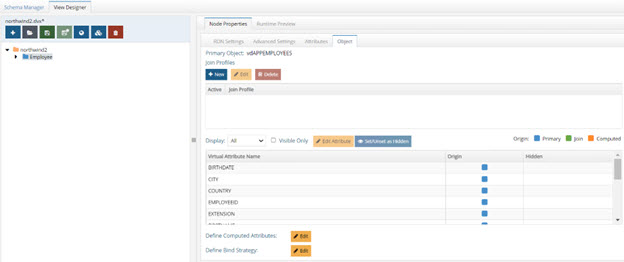

Figure 26: Object Tab

### Runtime Preview tab

The Runtime Preview tab is used for quickly viewing the contents of the virtual view to make sure the data looks as you expect. The view definition is the model of the virtual view and the runtime preview shows what the model will look like to an LDAP client.

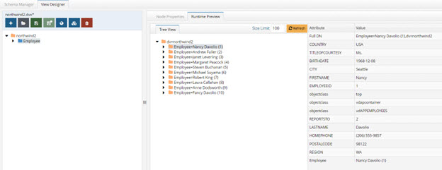

Figure 27: Runtime Preview Tab

## The View Designer Process

The View Designer is a modeling tool used to create virtual views. The schemas that were extracted with the Schema Manager tool are used as a basis to start designing the views. Many different views can be created and tested before committing to a design.

### Working with Labels

You can create labels below an existing label or container. Labels are used as a way to categorize the virtual view. Unlike containers and contents, labels are not populated from objects in an underlying source. Therefore, you can add any attributes you want to labels.

To create a label:

1.	Select a Label or Container object in the pane on the left.

2.	Click the New Label button in the pane on the right.

3.	Select or enter a “level type” (RDN name).

4.	Enter a value for the type you selected in step 3.

5.	Click OK.

To modify a label:

1.	On the Properties tab, you can change RDN name and value.

    >[!note] 
    >DO NOT name a label with “dv”. The dv syntax is reserved for RadiantOne and labels should not contain it.

2.	On the Primary Object tab, you can manage (add/delete) the attributes of the label. All attributes defined here are returned when a client requests label entries in the virtual view. 

### Working with Content Objects 

Use a Content object when you want to create flat views that do not contain sub-branches.

To create content objects:

1.	Select a Label or Container node in the view definition. 

2.	Click the **New Content** button on the right.

3.	In the Select Path dialog box, navigate below root and select the object/object class that contains the information you want to populate this node. 

4.	Click OK. 

This places the new Content object under the selected Label or Container object in the view definition.

The name of the Content object appears on the Node Properties > RDN Settings tab. 

To modify content objects:

1.	In the View Definition, select the Content node and click the Attributes tab. The fields available in the object appear in the column list on the left.

2.	Select the attribute that you want to expose in the virtual entries and use the  button to move it over to the column on the right.

3.	To remove an attribute from the virtual entry definition, highlight the column name and click the  button.

For more information on configuring content objects, please see the following sections:
-	Joins with objects from the same schema. 
-	Joins with heterogeneous objects (objects from other sources/schemas). 
-	Using filters to condition the entries that populate the content object. 
-	Search options for case-sensitive databases. 
-	Advanced Options. 
-	Interception scripts to customize operations performed against the content object. 
-	Performance optimizations. 

### Working with Container Objects 

Use a Container object when you want to create hierarchical virtual views containing many sub-levels. 

To create container objects:

1.	Select a Label or Container object in the pane on the left. 
2.	Click the **New Container** button in the pane on the right. 
3.	Expand below the root node and select the desired object that contains the information you want to populate the node from. 
4.	Click OK. 

To modify container objects: 

1.	In the View Definition, select the container node and click the Attributes tab. The attributes available in the object appear in the Column list on the left. 
2.	Select the attribute that you want to expose in the virtual entries and use the  button to move it over to the column on the right. 
3.	To remove an attribute from the virtual entry definition, highlight the column name and click the  button. 

For more information on configuring container objects, please see the following sections: 
-	Joins with objects from the same schema. 
-	Joins with heterogeneous objects (objects from other sources/schemas). 
-	Using filters to condition the entries that populate the content object. 
-	Search options for case-sensitive databases. 
-	Advanced Options. 
-	Interception scripts to customize operations performed against the content object. 
-	Performance optimizations.

### Working with Links 

Use links when you want to build your virtual view with objects from different schemas. The link is a way to aggregate different virtual views into a common hierarchy/view.

Labels can be used as a way to organize the tree before you configure a link (although adding labels is optional). If you like the idea of having a label to separate the two trees, you can enter a Label and then have a link below it. In the example below, the label Category=Orders has been created as a way to organize the “jump” to the order view. 

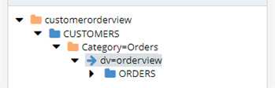

Figure 4.28: Link Below a Label

To create a link: 

1.	Have the virtual view you want to add the link to open in the View Designer tab. 

2.	Navigate to the parent node in the view definition (where you want the link below). Click the parent node and click the **New Link** button on the right. 

3.	Choose either **Standard Link** or **Merge Link**. 

4.	If Standard Link is selected, choose the virtual view to link to.

5.	If Merge Link is selected, choose to either link to an existing virtual view (if you already have an existing virtual view that you want to mount in the view definition) or a new view (if you want to build your own sub tree based on objects from a different schema) and click Next. 

6.	If you chose to link to an existing view, navigate to the existing virtual view, select it and click Finish. If you chose to link to a new view, enter a view name and select the schema file that contains the objects you want to use to build the sub tree. 

7.	Click Finish. 

8.	If you chose the Merge Link option and then selected to link to a new virtual view, you can begin to model the new view in the view definition (below the location where you have declared the link). The new view can be comprised of labels, containers or content as needed. 

9.	If you have created a Merge Link, a link parameter can be set if required. See the section below for steps on creating a link parameter. 

To create a link parameter: 

A link parameter can be used to condition the subtree based on the primary key of the parent node. 

1.	Select the merge link node in the view definition and choose the Node Properties -> Properties tab. 

2.	Click Edit next to the Link Parameters. 

3.	Navigate to the first node in the linked virtual view and select the attribute that matches the primary key of the parent node. 

4.	>[!note] 
>If the link attribute in the parent node is multi-valued, manually edit the link parameter condition as described in [Linking on a Multi-Valued Attribute](#linking-on-a-multi-valued-attribute). 

5.	Click OK. 

6.	Save the virtual view. 

At runtime, RadiantOne evaluates the link and builds the appropriate subtree conditioned based on the link parameter. 

### Declaring an RDN Attribute Name and Value 

You can create or modify an RDN attribute value in the View Designer tab. 

To declare an RDN attribute value: 
1.	In the View Definition, select the node and then click the Node Properties -> RDN Settings tab. 

2.	The RDN name and value are displayed here. Click the Edit button to select the attribute(s) that should comprise the RDN value. The attribute(s) that you select is combined with the primary key to comprise the RDN value. 

    >[!warning] 
    >The column(s) that you select as the RDN attribute value should not allow NULL values.


Figure 29: Configuring RDN Name and Value

### Adding Filters to Condition Virtual View Content 

Filters allow you to condition the node to only have entries that contain specific information. You can set the filter conditions at any Container or Content nodes.

The interface for setting filters differs between LDAP and database backends. Each process is described in more details below. 

To create filters for database backends: 

1.	On the View Designer tab, select the Container or Content object and then choose the Advanced Settings tab. 

2.	Click Assist next to SQL Filter. 

3.	From the drop-down menu, select the attribute you want to work with.

4.	Select an operator. The comparison operator default is "equal". The drop-down list includes all available comparison operators. 

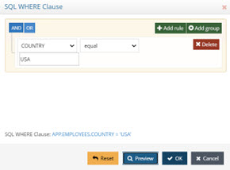

Figure 30: Filter for SQL-accessible Backend Dialog Box

5.	Enter a value in the blank field if applicable.
6.	Using the Add Rule and Add Group buttons, repeat steps 2-4 for each attribute you want to use in the filter. 

For example, in the following illustration, the query is for Service Managers in the United States. The inferred operation for the condition in this example is “AND”. This means that the result displays information where Title = Service Manager AND Country = United States. You can see an example of the Where Clause that is generated below the list of columns by clicking the Preview button.

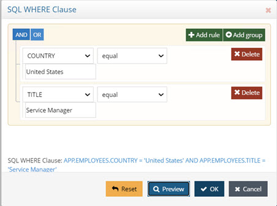

Figure 31: Add Filter Dialog Box

7.	To enter an additional filter, click the Add Rule button. You can choose to either use an AND or OR condition. The example below uses an OR condition. For example, if “Operations Manager” were entered in the Condition 2 column for the Contact Title attribute, the results would include information where Contact Title = Service Manager OR Contact Title = Operations Manager AND Country = United States Therefore, all service and operation managers in the United States are included in the virtual view at runtime. 

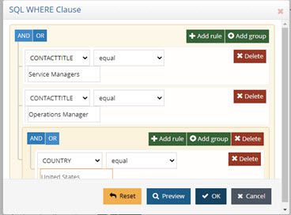

Figure 32: Additional Condition for Filter

8.	If more customization is required for the filter than is provided by this interface, then you can use the Additional Clause feature to manually create your own. For more information, please see the [Additional Clause](#additional-clause).

To create filters for LDAP backends: 

1.	On the View Designer tab, select the Container or Content object and then choose the Advanced Settings tab.

2.	Click **Assist** next to LDAP Filter. 

3.	Enter a valid LDAP filter in the LDAP Filter parameter. There is a built-in syntax checker to verify the LDAP filter you have entered. For assistance with building your filter you can use the buttons along the right side. For example, if your filter should contain an AND condition, click on the New AND Operator button and then click New Condition. Enter one of the conditions you would like to filter on and click OK. Click on Next Condition button again and enter the next condition. In the screen shot below, the virtual view is conditioned by only returning entries that have l=Novato and postalCode=94947. 
 
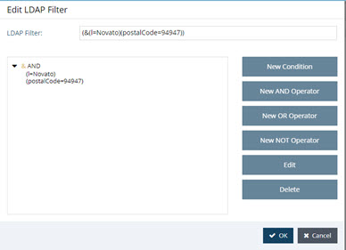

Figure 33: Sample LDAP Filter

4.	To add an OR operation, click the New OR Operator button. Then click **New Condition** to indicate what the OR operation should contain. 

5.	To add a NOT operation, click the New NOT Operator button. Then click the New Condition button to indicate what the OR operation should contain. 

6.	To edit a condition, select it and click Edit. 

7.	To delete a condition, select it and click Delete.

### Configuring Optimizations 

For certain use cases, there are additional parameters that may be enabled to improve processing/performance. They are located on the Node Properties tab > Advanced Settings sub-tab. The optimizations available are dependent upon the type of backend that is accessed. Each is described below. 

#### Virtual Views from Database Backends 

There are two optimizations available for virtual views from database backends.
-	Request Attributes Only When Necessary 
-	Process Joins and Computed Attributes Only When Necessary 

##### Request Attributes Only When Necessary 

Requesting certain types of attributes like binary/BLOB, can significantly decrease performance. When this option is enabled, RadiantOne requests attributes from the backend only if they are specifically requested by the client.

Use caution when enabling this parameter if an interception script is defined (which may need such attributes even if they are not requested by the client).

>[!warning] 
>Do not enable this option if a memory entry cache is going to be enabled for this virtual view (as the whole virtual entry is needed, including the BLOBs).

##### Process Joins and Computed Attributes Only When Necessary 

The default behavior of RadiantOne is to process associated joins and build computed attributes whenever a virtual object is reached from a query regardless of whether the attributes requested come from a secondary source or computation.

If you enable this option, RadiantOne does not perform joins or computations if a client requests or searches for attributes from a primary object only. If a client requests or searches for attributes from secondary objects or computed attributes, then RadiantOne processes the join(s) and computations accordingly. For more details, please see the [How the Join is Performed](02-concepts-and-utilities.md#how-the-join-is-performed). 

Use caution when enabling this option if you have interception scripts defined on these objects, or access controls based on filters are being used (both of which may require other attributes returned from secondary sources or computations regardless of whether or not the client requested or searched for them).

>[!warning] 
>Do not enable this option if a memory entry cache is going to be enabled for this virtual view (as the whole entry is needed for the cache).

#### Virtual Views from LDAP Backends 

There are two optimizations available for virtual views from LDAP backends.
-	Process Joins and Computed Attributes Only When Necessary 
-	Max Requested Attributes 

Process Joins and Computed Attributes Only When Necessary

The default behavior of RadiantOne is to process associated joins and build computed attributes whenever a virtual object is reached from a query regardless of whether the attributes requested come from a secondary source or computation.

If you enable this option, RadiantOne does not perform joins or computations if a client requests or searches for attributes from a primary object only. If a client requests or searches for attributes from secondary objects or computed attributes, then RadiantOne processes the join(s) and computations accordingly. For more details, please see the [How the Join is Performed](concepts-and-utilities.md#how-the-join-is-performed). 

Use caution when enabling this option if you have interception scripts defined on these objects, or access controls based on filters are being used (both of which may require other attributes returned from secondary sources or computations regardless of whether or not the client requested or searched for them).

>[!warning] 
>Do not enable this option if a memory entry cache is going to be enabled for this virtual view (as the whole entry is needed for the cache).

#### Max Requested Attributes 

If more than 30 attributes are configured to be returned for a container or content node (indicated on the Node Properties -> Attributes sub-tab), RadiantOne optimizes the query by requesting `(*)` instead of requesting each attribute explicitly. If your virtual view is required to include operational attributes (computed by the backend server when requested), and you have more than 30 attributes declared in the view definition, the default behavior to translate the query to use `(*)` can cause problems resulting in the operational attributes not being returned from the backend server because they are not explicitly requested. You can adjust the maximum number of attributes to determine the usage of the `(*)` translation in the Max Requested Attributes property. If this property is set to zero, all attributes specified on the Attributes tab are requested. 

#### Setting Advanced Configuration Parameters 

The View Designer allows for advanced parameters to be set for each virtual view. Customization options include the following: 

-	Being able to modify the default SQL query to remove the UPPER that is generated for comparison or adding a complex filter (Link Parameters, Additional Clause, and Stored Procedure Tabs). 

-	Customize the base DN from where to start searching from in a virtual view built from an LDAP backend (Parent DN Settings Tab). 

-	Advanced parameters are set on the Node Properties > Advanced Settings sub-tab. Click the Change button next to Configuration Parameters. The configuration tabs available differ depending on the type of backend the virtual view is built from. All options are described below. 

##### Link Parameters 

The Link Parameters Tab is only relevant when the view definition has more than one level because this is the parameter that is used to link the entry to the parent. If there is only one level in the tree, this parameter is irrelevant. If RadiantOne has generated UPPER, you can remove it from here if needed. The UPPER is generated here for case sensitive databases. If your database is not case sensitive, then the UPPER can be removed (along with the corresponding set of parentheses). If your database is case sensitive, then you must make sure that the attribute that is indexed (and is used in the link parameter) uses UPPER case. Otherwise, performance of the virtual view is unpredictable. 

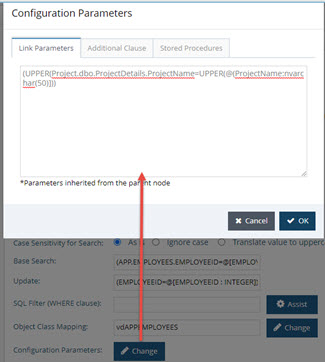
 
Figure 34: Link Parameters Tab

##### Additional Clause 

The Additional Clause is available for both database and LDAP backends. 
If your backend is a database, you must be precise and use the proper syntax for your database (RadiantOne sends the filter to the backend database exactly the way you type it in). The additional clause would generally be used to add an ORDER BY to the SQL Query. This could be required for situations where you need the result from the database to be returned in a specific order (indicated by the attribute you want to ORDER BY). RadiantOne can automatically merge backend entries containing the same RDN value, only if the response is in alphabetical/numerical order. Otherwise, it returns the entries in the virtual view in the order in which the backend server returns them, and this could result in duplicate entries with the same RDN returned. Generally, this is only a risk if the RDN you defined in the Schema Manager for the database object is not unique. The attribute to order by doesn’t have to be the RDN attribute. You can order the results by any attribute in the virtual view definition. An example of adding an ORDER BY clause to a virtual view of a database backend is shown in the screen below. This additional clause indicates to return the entries from the backend ordered by the value in the “L” attribute. 

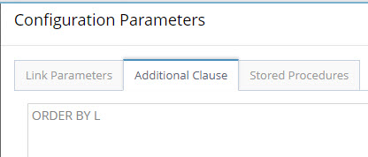

Figure 35: Example Order By Additional Clause for Database Backend

>[!note] 
>Use the actual database attribute name in the additional clause, not the remapped virtual name.

If your backend is an LDAP server, the value in the additional clause should be the specific LDAP filter that RadiantOne should send prefixed with filter:. For example, if the virtual view should be restricted to entries with employeenumber of 11 and a givenName of henry, the following would be the value entered for the additional clause: filter:(&(employeenumber=11)(givenname=henry)) 

>[!warning] 
>When entering an LDAP filter in the Additional Clause, keep in mind the following: 1) If there are some re-mapped attributes in your view, use the non-remapped name in the filter 2) Only attributes from the main (primary/source) object can be filtered (attributes from joined/secondary sources cannot comprise the filter).

##### Stored Procedures

Database views can call stored procedures instead of using the default functionality for handling inserts, updates, and deletes.

>[!warning] 
>Once you have declared stored procedures for a database, the standard functionality for inserts, updates, and deletes is no longer used; only the stored procedures are called.

To add a stored procedure:

1.	Create a container or content node.

2.	In the view definition, select the container or content node.

3.	On the Node Properties > Advanced Settings sub-tab, click the Change button next to Configuration Parameters. The Configuration Parameters screen is displayed.

4.	Select the Stored Procedures tab.

5.	Select Insert, Update, or Delete from the Event drop-down menu.

6.	Click Add.

7.	(Optional) Specify a catalog and/or schema name.

8.	Click Search.

9.	Select a stored procedure and click Next. 

10.	Select parameters from the drop-down menu and click Finish. You are returned to the Configuration Parameters screen.

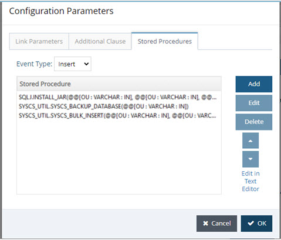

Figure 36: Stored Procedures Tab

##### Base Search Parameter

Another customization is available for database backends. The Base Search parameter is located on the Node Properties > Advanced Settings sub-tab. This parameter allows you to remove UPPER (that is generated by default) for base searches and updates. The UPPER is generated here for case sensitive databases. If your database is not case sensitive, then the UPPER can be removed. If your database is case sensitive, then you must make sure that the attribute that is indexed (and is used in the base parameter) uses the UPPER case. Otherwise, performance of the virtual view (during a base search) is unpredictable.

Since some databases are case sensitive, RadiantOne transforms primary key attribute values to upper case before comparing. This is only applicable when the database key is a character data type. “UPPER” is generated automatically for the following databases: Oracle, SQL MX, MS SQL Server, Sybase, Interbase, and DB2. If you do not want UPPER to be used for searches and updates (because your database is not case sensitive), you can use the Base Search parameter to remove it.

>[!warning] 
>Using the UPPER can slow down performance because the indexes in the database may not be used. IF your database has an index on an attribute and it stores the value in upper case, then you have the option of removing the UPPER generated on the left side of the parameter.

Below is an example of the parameter that is generated for a database (for the search). If the database is case sensitive and the CN attribute is indexed (and the index stores the value in upper case), then the UPPER generated on the left side of the “=” can be removed and performance is improved (also remove the leading and ending parentheses). 

(UPPER(SCOTT.PEOPLE.CN)=UPPER(@@[cn : VARCHAR2(60)])) 

If you are not able to remove the UPPER then you should consider using cache at the level of RadiantOne to improve performance. RadiantOne queries the database the first time (the UPPER is used), the result is cached and future queries receive the information from cache.

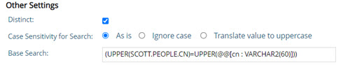

Figure 37: Base Search Example

### Defining the View Structure 

In addition to using the View Designer to manually build virtual views, Context Builder also includes the Hierarchy Builder tool. With Hierarchy Builder, you can take a flat structure (either a flat LDAP tree or a database table) and build a complex hierarchy based on attributes existing in the entries. Hierarchy Builder is described in [Concepts and Utilities](concepts-and-utilities.md). The rest of this section is devoted to using the View Designer to build virtual views from LDAP and database backends. 

#### Building Virtual Views from LDAP Backends 

There are three main types of virtual views you can build from LDAP backends. 
-	Virtualize the whole directory tree (based on existing relationships). 

>[!warning] 
>If you want to keep the entire existing tree structure intact and expose it in the RadiantOne namespace, it is recommended that you configure an LDAP backend from the Main Control Panel > Directory Namespace instead of using Context Builder which is typically for building virtual views that reflect a new directory hierarchy than the one that exists. For details on configuring LDAP backends from the Main Control Panel, please see the RadiantOne Namespace Configuration Guide.

-	Flat virtual directory views.
-	New hierarchical virtual view based on attributes available in an object class.

Each type of virtual view is discussed in more details below. 
 
##### Flat Virtual Views 

Flat virtual views are based on an object class in the LDAP Backend. For example, if an existing LDAP directory tree is hierarchical and entries (associated with the inetOrgPerson object class) are spread across many branches, the virtual view can contain the complete list of users consolidated into one flat list. All entries associated with the configured class appear in the virtual view no matter where the entry exists in the actual LDAP backend. For example, the diagram below depicts an existing LDAP tree. User entries are spread across multiple branches.

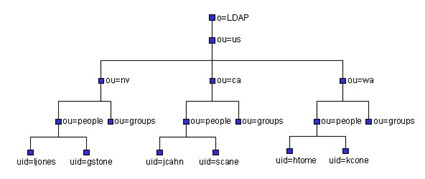

Figure 38: Sample LDAP Hierarchy

The hierarchy shown above can be flattened in a virtual view based on the object class associated with the users (e.g. inetOrgPerson). The sample flat virtual view structure is shown in the figure below.

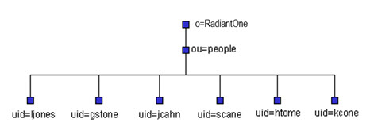

Figure 39: Sample Flat Virtual View Built from an Existing LDAP Hierarchy (depicted in the figure above)

To build a flat virtual view based on an LDAP Object class:
1.	On the View Designer tab, click  and enter a virtual view name. If a view with the same name already exists, it is overwritten.

2.	Click **Select** to choose the schema file (.orx file) that stores the LDAP directory schema (on the LDAP tab). All .orx files containing directory schemas are stored in the directory of <RLI_HOME>\<instance_name>\lod. 

3.	Click the top node and, on the right, click New Content.

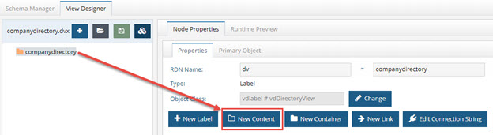

Figure 40: New Content Option

4.	Select the object class associated with the entries that should populate this node and click OK. 

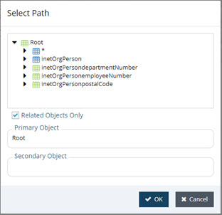

Figure 41: Object Class Associated with Entries that will Populate the Node

5.	On the Node Properties > Attributes sub-tab, define the attributes that should comprise the entries by moving them from the list on the left to the list on the right.

6.	Click on “Runtime Preview” to see the instantiated view. The figure below depicts an example. 

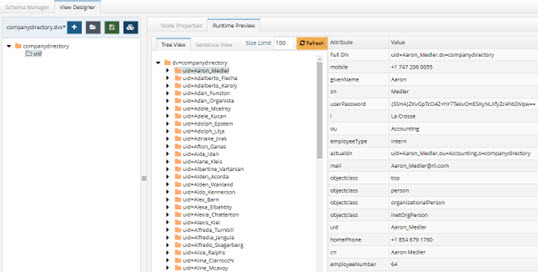

Figure 42: Flat Virtual View from Existing LDAP Directory Object class InetOrgPerson

The Base DN that was entered when the directory schema was extracted is the starting point that the RadiantOne service uses to search for entries and populate the virtual view. Therefore, all entries associated with the chosen object class below the base DN defined in the data source comprise the virtual view. You can change the starting point by modifying the base DN in the data source. 

After the virtual view is complete, it can be mounted in the RadiantOne namespace. Use the Main Control Panel -> Directory Namespace tab for this. For details on this process, please see the RadiantOne Namespace Configuration Guide.

##### Hierarchical Virtual View Based on Attributes of an Object Class 

Hierarchical virtual views can be built using the Hierarchy Builder utility and are based on attributes available in an object class. The following four figures provide an example of the process. For specific details on the configuration steps, see [Hierarchy Builder](concepts-and-utilities.md#hierarchy-builder). 

The hierarchy shown below is an example of an LDAP directory tree. 

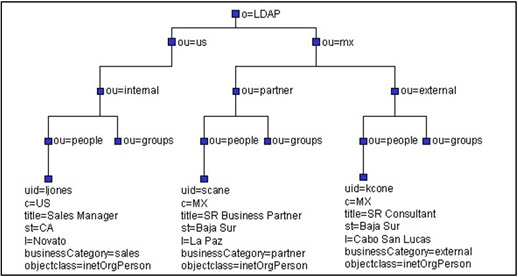

Figure 43: Sample Existing LDAP Hierarchy

The first step in building a virtual view is to extract the schema information using Schema Manager. The schema from the LDAP hierarchy shown in the figure above is shown in the figure below. 

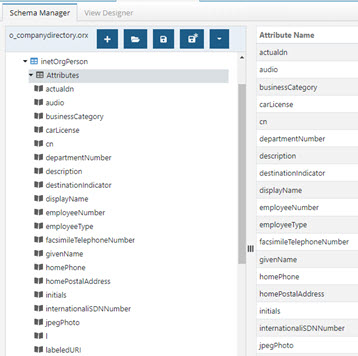

Figure 44: LDAP Schema Extracted with Schema Manager

The next step is to load the schema into Hierarchy Builder and follow the wizard to model your virtual view. On the View Designer tab, click the Hierarchy Builder button. The figure below depicts this process. 

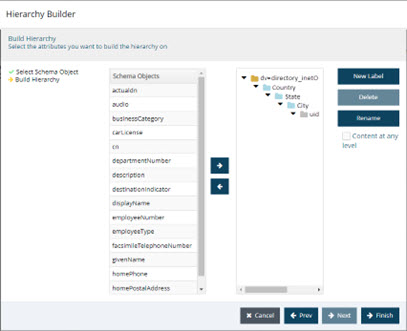

Figure 45: Hierarchy Builder

Finally, the virtual view built in the hierarchy builder can be viewed and modified (if needed) in the View Designer tab.

The figure below shows the Runtime view of the virtual tree created with the hierarchy builder. 

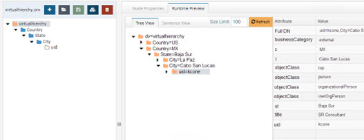

Figure 46: Example Virtual View Created with Hierarchy Builder

After the virtual view is complete, it can be mounted in the RadiantOne Namespace. Use the Main Control Panel > Directory Namespace tab. For details on this process, please see the RadiantOne Namespace Configuration Guide. 

##### Returning the Actual DN from LDAP Entries 

By default, only the virtual (remapped) DN is returned for virtual entries. If you would like the actual DN of the LDAP entry to be returned to clients requesting information from the virtual view, then expose the attribute named “actualdn” in the virtual view. This attribute is automatically added to object class definitions in the schema file. This does NOT affect the underlying schema. 

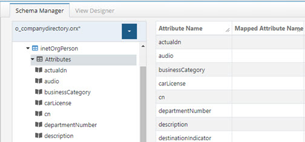

Figure 47: Actualdn Attribute

In the View Designer, move the actualdn attribute to the list of attributes to comprise the virtual entries from. This is done on the Attributes tab after creating your container or content node. Below is an example of a content node built from inetOrgPerson and exposing the actualdn attribute. 

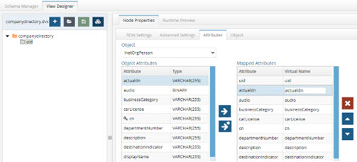

Figure 48: Exposing the Actualdn Attribute

When the virtual entries are returned, the entry contains both the virtual DN (where the entry is located in the RadiantOne namespace), and the actual DN (where the entry is literally located in the underlying directory). The example in the figure below shows Aaron Medler’s virtual DN (the “dn” attribute) and the “actualdn” from the underlying directory. 

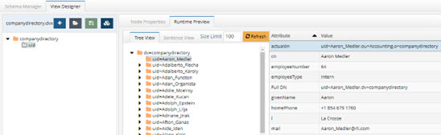

Figure 49: Results Showing Virtual DN and Actual DN

>[!warning] 
>Although the “actualdn” attribute is returned for each entry, it is NOT a searchable attribute.

#### Building Virtual Views from Database Backends 

There are three main types of virtual views you can build from a database schema. They are:
-	Relationship-driven virtual views based on existing relationships between the database objects.
-	Flat virtual directory views.
-	Hierarchical views based on attributes of a database object.

Each type of virtual view is discussed in more details below. 

##### Relationship-Driven Hierarchical Virtual Views 

Relationship-driven hierarchies use the underlying schema to build the hierarchy. The relationship between the existing objects drives the structure. Relationship-driven hierarchies are composed of Container objects, and optionally, Content objects.

The following diagram illustrates a relationship-driven hierarchy composed of Containers in the sample Northwind database.
 
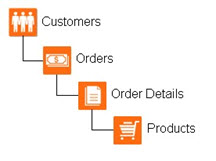

Figure 4.50: Relationship-driven Hierarchy Builder with Containers

Another example of a relationship-driven hierarchy is one that uses a recursive relationship. In the sample Northwind database, the Employees table has a recursive relationship with itself. Therefore, you could build an organization hierarchy depicting the different levels of management. An example is shown in the figure below. 

If you need help on defining recursive relationships for your database schema, please see the recursive relationships section in [Schema Manager](schema-manager.md). 

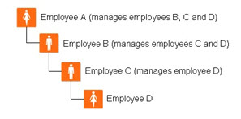

Figure 51: Recursive Relationship-driven Hierarchy Built with Containers

**Steps to Build a Relationship-driven Hierarchy from a Database Schema**

It is assumed that the database schema has already been extracted (and all relationships defined). If you need help with this process, please see [Schema Manager](schema-manager.md) on the Schema Manager. The steps below describe the process using the default Northwind schema that is included with RadiantOne. 

1.	On the View Designer tab, click  and enter a virtual view name. If a view with the same name already exists, it is overwritten.

2.	Click Select to choose a schema file. On the Database Schemas tab, select the Northwind file and click OK. 

3.	Select the Northwind label in the view definition and click the New Container button on the right. 

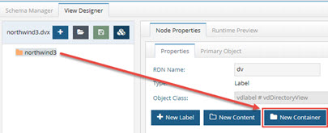

Figure 52: New Container

4.	Expand below the root node and select the APP.CUSTOMERS object and click OK.

5.	In the view definition, select the Customers container and click the New Container button on the right. 

6.	Expand below APP.CUSTOMERS and choose APP.ORDERS and click OK. 

7.	In the view definition, select the Orders container and click the New Content button on the right. 

8.	Expand below APP.ORDERS and then expand below APP.Order details. Select the APP.PRODUCTS node and click OK. In this example, the order details does not represent a virtual node, it is just used implicitly to reach the related products. At this point, the virtual view should resemble the structure shown below. 

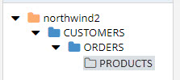

Figure 53: Virtual View Model Based on Database Relationships

Now that the main structure has been defined, each node in the tree can be refined (optional) by exposing relevant attributes, configuring advanced parameters, search options for case sensitive databases, filters, interception scripts and joins. 

Once configured, the virtual view can be tested from the Runtime Preview tab. Make sure the RadiantOne service (and the Derby database – if building a virtual view from the sample database included with RadiantOne), is running before trying to view the tree. The default runtime virtual view can be seen in the figure below. 

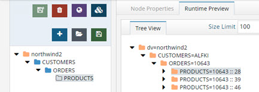

Figure 54: Runtime Virtual View Built from Database Relationships

After the virtual view is complete, it can be mounted in the RadiantOne namespace. Use the Main Control Panel > Directory Namespace for this. For details on this process, please see the RadiantOne Namespace Configuration Guide. 

##### Flat Virtual Views 

Flat virtual views are based on a database table (or a combination of tables if relationships are present). For example, if a virtual view were built from a database table, all records in the table could become an entry in the RadiantOne namespace. Attributes of the virtual entry could come from columns in the database table or any related table (according to the schema definition). The diagram below depicts an example database with three related tables.

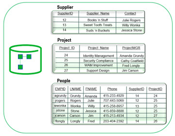

Figure 55: Sample Database Schema

The information available in the related database objects can be used to build the virtual directory entries. The virtual view below depicts an example virtual view based on the database schema/data shown above. 

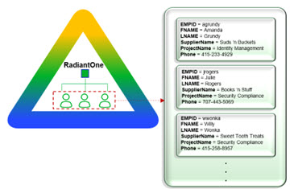

Figure 56: Sample RadiantOne Entries Based on Database Objects

Using the example above, the following steps describe how to build a flat virtual view from a database schema. It is assumed that the database schema has already been extracted, and all needed relationships are defined. If you need assistance extracting a database schema, please see [Schema Manager](schema-manager.md). 

1.	On the View Designer tab, click  and enter a virtual view name. If a view with the same name already exists, it is overwritten.

2.	Click the Select button to choose a schema. Select the database schema file from the Database Schemas tab and click OK. Click OK again.

3.	On the left side, select the top and click the New Content button on the right. 

4.	Expand below the root node and select the primary object (the People table in this example) and click OK. 

5.	On the Node Properties -> Attributes sub-tab, attributes from the People table can be selected to comprise the virtual entry (like EMPID, FNAME, LNAME, and PHONE in this example). 

6.	Click the Add button next to the table drop-down list. 

7.	All objects that have a relationship to the People table are accessible from here. 

8.	Select the secondary table (the Suppliers table in this example) and click OK. 

9.	Click the Add button next to the table drop-down list selecting the Projects table this time. Click OK.

All joined tables should appear in the drop-down list on the Attributes tab. Attributes from any of the tables can comprise the virtual entry. Select the table in the drop-down list and move the attribute that you want in the virtual entry into the column list on the right (using the  button). 

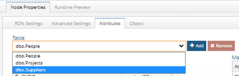
 
Figure 57: Database Tables for the Join

10.	In the screen shot below, the EMPID, FNAME, LNAME, and Phone attribute are mapped from the People table. The ProjectName and ProjectMGR are mapped from the Projects table and the SupplierName is mapped from the Suppliers table. 

11.	Save the virtual view. Below is an example of the Runtime Preview.

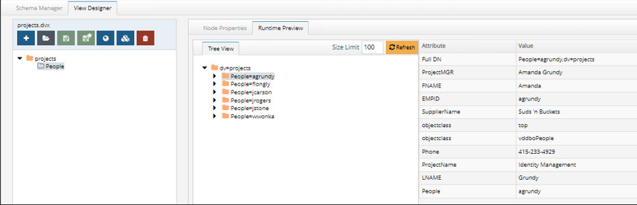

Figure 58: Runtime Preview Example

After the virtual view is complete, it can be mounted in the RadiantOne Namespace. Use the Main Control Panel > Directory Namespace tab for this. For details on this process, please see the RadiantOne Namespace Configuration Guide. 

##### Hierarchical Virtual View Based on Attributes of an Object 

Hierarchical virtual views can be built using the Hierarchy Builder utility and are based on attributes available in an object. The following four figures provide an example of the process. For specific details on the configuration steps, see [Hierarchy Builder](concepts-and-utilities.md#hierarchy-builder). 

The first step is to extract the database schema. If you need help with this process, see [Schema Manager](schema-manager.md). The figure below depicts an example of a database schema. 

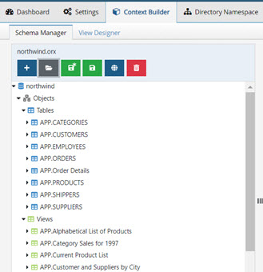

Figure 59: Sample Database Schema Shown in the Schema Manager

The next step is to use the Hierarchy Builder utility and construct a virtual tree based on the database schema. An example hierarchy is shown in the figure below. 

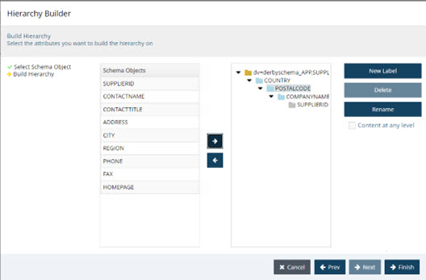

Figure 60: Example Virtual View Build with Hierarchy Builder

Finally, the virtual view can be tested from the Runtime Preview tab. The RadiantOne service must be running before trying to test the virtual view. The virtual view built in the example described above is shown below. 


Figure 61: Runtime Preview of Virtual View Built with Hierarchy Builder

After the virtual view is complete, it can be mounted in the RadiantOne namespace. Use the Main Control Panel > Directory Namespace tab for this. For details on this process, please see the RadiantOne Namespace Configuration Guide. 

##### Handling Searches Against Case-Sensitive Databases 

There are three options available for handling case sensitive databases. These options are related to how RadiantOne generates the query to send to the database. These options are available on the Node Properties > Advanced Settings sub-tab when the relevant container or content node is selected in the view definition.

**As Is**

If your database is not case sensitive, then you should choose the As Is option. With this option, RadiantOne forwards the search filter to the backend in the exact case it was received in the request from the client. This is the default option.

If your database is case sensitive and you choose this option, the case received in the filter from the client search request must match the case used in the database or else the entry will not be found. 

For example, if a database attribute named FIRSTNAME had a value of Nancy, and RadiantOne received a search request with a filter of (firstname=nancy), the entry is not returned. The client must use a filter of (firstname=Nancy) for the entry to be properly returned from the database. 

**Ignore Case**

If your database is case sensitive and you are not sure how the values are stored (mixed case, all upper, all lower…etc.), then you should choose the Ignore Case option. With this option, RadiantOne generates the SQL query so that both the filter that was received in the client request and the values from the backend are converted into uppercase before the search filter can be validated. For example, if a client sent a request with a filter of (firstname=Nancy), RadiantOne would generate the following where clause based on the filter received in the client request.
WHERE (UPPER(APP.EMPLOYEES.FIRSTNAME)=UPPER('Nancy')) 

The case used in the filter from the client is irrelevant and everything will be converted into uppercase. 

This option offers the least performance, so it should only be used when absolutely required. If the database is case sensitive and the values are stored in uppercase, you should use the Translate Values to Uppercase option (see #3 below) as it is more efficient. 

**Translate Values to Uppercase**

If your database is case sensitive and you know the values are stored in uppercase, you should choose the Translate Values to Uppercase option. With this option, RadiantOne translates the search filter value into uppercase before sending it to the backend database. This option is more efficient than the Ignore Case option mentioned above. 

##### Stored Procedures 

Database views can call stored procedures instead of using the default functionality for handling inserts, updates, and deletes.

>[!warning] 
>Once you have declared stored procedures for a database, the standard functionality for inserts, updates, and deletes is no longer used; only the stored procedures are called.

To add a stored procedure: 

1.	In the view definition, create a container or content node.

2.	In the view definition, select the container or content node.

3.	On the Node Properties > Advanced Settings tab, click the Change button next to Configuration Parameters.

4.	Select the Stored Procedures tab.

5.	Select Insert, Update, or Delete from the Event drop-down menu.

6.	Click Add.

7.	(Optional) Specify a catalog and/or schema name. 

8.	Click Search.

9.	Select a stored procedure and click Next.

10.	Select parameters from the drop-down menu and click Finish. You are returned to the Configuration Parameters screen.


Figure 62: Configuration to Call Database Stored Procedures

###### Logging Stored Procedure Values 

To log stored procedure values used at runtime, set the RadiantOne server log level to DEBUG or higher. You can set the log level from Main Control Panel > Settings > Logs > Log Settings. Select VDS – Server from the “Log Settings to Configure” drop-down list. Set the “Log Level” to DEBUG (or TRACE). Stored procedure values used as runtime are logged in <RLI_HOME>/vds_server/logs/vds_server.log. 

#### Building Virtual Views from SCIMv2 Backends

>[!warning] 
>Do not use attribute mappings, computed attributes, or joins directly on the virtual view from the SCIM backend. Create a basic view with no attribute mappings, computed attributes or joins and then define the view with persistent cache. Initialize the persistent cache and then use Schema Manager and View Designer to point to the cached naming context in the RadiantOne namespace as an [LDAP backend](schema-manager.md#ldap-accessible-backend). Define the attribute mappings, computed attributes and joins on this virtual view.

It is assumed that the SCIMv2 schema has already been extracted. If you need help with this process, please see [Schema Manager](03-schema-manager.md#ldap-accessible-backend) on the Schema Manager. The steps below describe the basic of creating a virtual view from a SCIMv2 backend. 

1.	On the View Designer tab, click  and enter a virtual view name. If a view with the same name already exists, it is overwritten.

2.	Click Select to choose the schema. On the Custom Schemas tab, select the schema file and click OK. Click OK again.
3.	Select the top label in the view definition and click the New Label button on the right. 
4.	Enter a name (e.g. ou=Users) and click OK.
5.	Select the top label in the view definition and click the New Label button on the right. 
6.	Enter a name (e.g. ou=Accounts) and click OK.
7.	Select one of the labels in the view definition (e.g. ou=Users) and click the New Content button on the right.
8.	Select an object from the schema to populate this node (e.g.Users) and click OK.
9.	With this new content node selected, select the Node Properties > Attributes sub-tab.
10.	Use the  button to define some attributes in the virtual view.
11.	Select one of the labels in the view definition (e.g. ou=Accounts) and click the New Content button on the right.
12.	Select an object from the schema to populate this node (e.g. Accounts) and click OK.
13.	With this new content node selected, select the Node Properties > Attributes sub-tab.
14.	Use the  button to define some attributes in the virtual view.
15.	Save the virtual view. An example of the view definition and Runtime preview of a SCIMv2 backend is shown below.


 
Figure 63: Example Virtual View of a SCIMv2 Backend

After the virtual view is complete, it can be mounted in the RadiantOne Namespace and configured for persistent cache. Use the Main Control Panel > Directory Namespace tab for this. For details on this process, please see the RadiantOne Namespace Configuration Guide. For details on configuring a persistent cache, please see the RadiantOne Deployment and Tuning Guide. Once a persistent cache is defined, use the Schema Manager to extract the schema (LDAP type of backend now that the virtual view is in persistent cache). Make sure the SCIMv2 objects/attributes are in the RadiantOne schema before using Schema Manager. See the RadiantOne System Administration Guide for managing the schema. After the schema is extracted, create a virtual view where you can remap attribute names, configure joins and other customizations.

### Deleting Virtual Views 

Virtual view files (.dvx files) should be deleted using the Context Builder > View Designer sub-tab. It is not recommended to manually remove files from the file system. 
To delete a virtual view:

1.	On the View Designer menu, click . 

2.	Select the virtual view file you want to remove and click OK.

3.	Click Yes to confirm the deletion.
 
 

Figure 64: Deleting Virtual View Files
