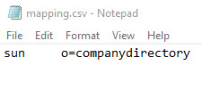
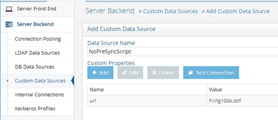
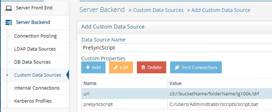

# Chapter 3: Installation & Configuration

This chapter outlines the installation and configuration of RadiantOne Worker nodes for one-way synchronization from directory backends into a RadiantOne Universal Directory store. The synchronization process can use either a direct connection to the backend, or an LDIF file generated from the LDAP backend. If you choose the LDIF file option, you are responsible for periodically generating the file(s) from your LDAP source(s).

## Installation

1.	Install RadiantOne as a follower-only node that joins the existing cluster. For detailed installation steps, see the RadiantOne ReadMe. 

>**IMPORTANT NOTE - These nodes should not be accessible by consuming client applications, so do not add them to your front-end load balancer configuration. This separates the synchronization tasks from the RadiantOne nodes that are servicing client applications.**

2.	Locate the cloud ID associated with the RadiantOne follower-only node(s) from the Main Control Panel > Dashboard tab. Make a note of the Cloud ID as it is used in the next step.
3.	Unregister RadiantOne FID on the follower-only nodes since it is not used. To do so, on one of the core nodes in the cluster, run the following command (using cluster.bat on Windows, cluster.sh on Linux):

    `<RLI_HOME>/bin/advanced/cluster.bat unregister <instance name> <the follower-only node Cloud ID>`

You can use a value of vds_server as the instance name if you only have one RadiantOne instance.

## Directory Backend Configuration

This configuration uses RadiantOne’s LDAP Data Source option to connect directly to the backends as described below.

1.	All directory backends must be created as LDAP data sources on a core cluster node. The base DN configured in the data source must be the location in the source directory containing the entries applicable for synchronizing into the target RadiantOne Universal Directory store. LDAP data sources can be created from the Main Control Panel > Settings tab > Server Backend section. If you need assistance, see the RadiantOne System Administration Guide. If you have many LDAP data sources to define, using the command line utility is more efficient than using the Control Panel. For details, see the create-ldap-datasource command in the RadiantOne Command Line Configuration Guide.

2.	Create the naming context for the RadiantOne Universal Directory (HDAP) store on a core cluster node from the Main Control Panel -> Directory Namespace tab. If you need assistance, see the RadiantOne Namespace Configuration Guide.

3.	Define access controls from the Main Control Panel > Settings tab > Security section > Access Controls for the RadiantOne Universal Directory store making it read-only for clients. The capture process is a one-way sync from the LDAP backends into RadiantOne Universal Directory, meaning that the store must be a read-only replica to consuming clients. If you need assistance configuring access controls, see the RadiantOne System Administration Guide.

4.	Switch to [Expert mode](01-introduction#expert-mode) in the Main Control to display the Distributed Directories Aggregation tab for the selected RadiantOne Universal Directory (HDAP) store on the Directory Namespace tab.

5.	On the Distributed Directories Aggregation tab, check the option to enable the process.

6.	(Optional) Enter a validation threshold to validate the generated image prior to executing the sync process. The threshold is a percentage of the total entries. For example, if you set a value of 50 (meaning 50%), it means that if the generated image contains 50% more or 50% less entries than the current RadiantOne Universal Directory store image, the sync process is aborted for this refresh cycle. If a threshold is not configured (set to 0), the Worker sync process compares the generated image from the backend to the current RadiantOne Universal Directory image and updates the store based on the differences between the two.

7.	Configure the process schedule by either entering the number of seconds or using a CRON expression. Click the Assist button if you need help defining the CRON expression.

8.	(Optional) In some cases, certain attributes are not returned by the LDAP backend even if the Worker process requests all attributes. These attributes are typically known as operational attributes and you must ask for them specifically by name. If you would like the Worker process to always request specific operational attributes you can set them in Always Requested Attributes.

9.	(Optional) To exclude attributes from the LDAP backend prior to the comparison with the RadiantOne Universal Directory (HDAP) store, enter a comma-separated list of attributes in the Ignored Attributes setting. This is a post filtering where the attributes listed are excluded from the generated image before it is compared to the RadiantOne Universal Directory (HDAP) store.

10.	LDAP data sources were defined in step 1 of this section. All LDAP backends that contain data to be synchronized into the RadiantOne Universal Directory store must be added on the Distributed Directories Aggregation tab. Click ADD and enter the data source name along with the corresponding target based DN in the RadiantOne Universal Directory. If you have multiple data sources to add, copy and pasting the data source name along with target base DN mapping from a CSV file is more efficient. Create a CSV file (or basic text file) containing the LDAP data source name along with the corresponding target RadiantOne Universal Directory base DN. Use a <tab> between the data source name and target base DN. Below is an example of mapping a data source named sun to a base DN of o=companydirectory.

    
 
>**Note – Deleting a data source only removes the sync process from that backend. It does NOT delete the data in the RadiantOne Universal Directory. You must do this manually if you want the entries removed permanently. For details on deleting entries, see the RadiantOne Namespace Configuration Guide.**

11.		Click Save.

### Synchronizing User Passwords from Active Directory Backends

The steps outlined in the [previous section](#directory-backend-configuration) are also applicable for supporting Active Directory backends. The ability to get and sync passwords is supported for Active Directory 2008 R2(+) backends. RadiantOne must be deployed on a Windows OS. All Windows updates should be applied to both the machine hosting RadiantOne and the backend Active Directory machine. The credentials configured in the Active Directory data source for RadiantOne must have the following permissions:

Domain Level:

Read, Replicating Directory Changes, Replicating Directory Changes All, Replicating Directory Changes in Filtered Set.

Ou Level:

Read all properties.

In order for the CPLDS sync process to get the passwords from the Active Directory user accounts, the following firewall ports must be opened between the Active Directory server and the RadiantOne machine. Check with your Active Directory administrator to confirm these ports.

PORTS | PURPOSE | 
|---|---
TCP 135	| RPC | 
TCP 139	| NetBIOS
TCP and UDP 389	| LDAP    *This could be used by FID to get the user information. Some other port may be used.
TCP and UDP 445 | SMB over IP
TCP and UDP 464	| Kerberos change/set password
TCP 636	| LDAPS  *This could be used by FID to get the user information. Some other port may be used.
TCP 3268 and TCP 3269 | Global Catalog non SSL and SSL  *This could be used by FID to get the user information. Some other port may be used.
TCP 49152 through 65535	| Dynamic ports

## LDIF File Configuration

The LDIF file configuration uses RadiantOne’s Custom Data Source option to read the directory entries from an LDIF file as described below. 

>**Note – The LDIF export function is documented in the LDIF Utility Guide.**

1.	The core nodes and worker nodes all require access to the LDIF file, typically located on a network share. To make a network share accessible to the nodes, create a mapped drive on each node in the cluster pointing to the network share containing the LDIF file. Record the mapped network share path as it is required for the RadiantOne custom data source configuration.

>**Note – This mapped drive location, including drive letter, must match across all nodes in the cluster.** 

2.	A pre-sync script can be used, for example, to extract a compressed LDIF file, validate entries within the source LDIF file, filter, and edit the LDIF file. If your LDIF file is in a location inaccessible to the nodes in your cluster (such as the cloud), you must define a pre-sync script that copies the LDIF onto the worker node(s). Store a copy of the script on each worker node in the same location on each node. The worker node tasked with running the synchronization at the next sync interval runs the pre-sync script and downloads the LDIF file. If, in the next sync interval, another worker node is tasked with syncing the same datasource, it uses the script to download the LDIF file. 

>**Note – After processing, the script outputs the file to <RLI_HOME>/vds_server/ ldif/import/<customDataSourceName_processed>.ldif. This path cannot be modified.**

3.	All backends must be created as custom data sources on a core cluster node. Custom data sources can be created from the Main Control Panel  Settings tab  Server Backend section. If you are not using a pre-sync script, only the URL parameter is required for the custom data source. The value for the URL parameter must indicate the absolute path in the source directory to the LDIF applicable for synchronizing into the target RadiantOne Universal Directory store. 

 

If you do use a pre-sync script, two parameters are required for the custom data source. 

-	URL: the value for this parameter indicates the absolute path in the source directory to the LDIF (i.e. s3://bucketName/folderName/lg100k.ldif, or F://lg100k.ldif).

-	Presync script: the value for this parameter is the location of the pre-sync script on the worker node(s) (i.e. C:/Users/Administrator/scripts/script.bat). 

 

>**Note – For assistance with creating data sources, see the RadiantOne System Administration Guide. If you have many custom data sources to define, using the command line utility for this is more efficient than using the Control Panel. For details, see the create-custom-datasource command in the RadiantOne Command Line Configuration Guide.**

4.	Create the naming context for the RadiantOne Universal Directory store on a core cluster node from the Main Control Panel -> Directory Namespace tab. If you need assistance, see the RadiantOne Namespace Configuration Guide.

5.	Define access controls from the Main Control Panel  Settings tab  Security section  Access Controls for the RadiantOne Universal Directory store making it read-only for clients. The capture process is a one-way sync from the backends into the RadiantOne Universal Directory, meaning that store must be a read-only replica to consuming clients. For assistance configuring access controls, see the RadiantOne System Administration Guide.

6.	Switch to [Expert mode](01-introduction#expert-mode) in the Main Control to display the Distributed Directories Aggregation tab for the selected RadiantOne Universal Directory (HDAP) store on the Directory Namespace tab.

7.	On the Distributed Directories Aggregation tab, check the option to enable the process.

8.	(Optional) Enter a validation threshold to validate the generated image prior to executing the sync process. The threshold is a percentage of the total entries. For example, if you set a value of 50 (meaning 50%), it means that if the LDIF contains 50% more or 50% less entries than the current RadiantOne Universal Directory image, the sync process is aborted for this refresh cycle. If a threshold is not configured (set to 0), the Worker sync process compares the source LDIF to the current RadiantOne Universal Directory image and updates the store based on the differences between the two.

9.	Configure the process schedule by either entering the number of seconds or using a CRON expression. Click the Assist button if you need help defining the CRON expression.

10.	(Optional) In some cases, certain attributes are not returned by the custom backend even if the Worker process requests all attributes. These attributes are typically known as operational attributes and you must ask for them specifically by name. If you would like the Worker process to always request specific operational attributes you can set them in Always Requested Attributes.

11.	(Optional) To exclude attributes from the LDIF file prior to the comparison with the RadiantOne Universal Directory store, enter a comma-separated list of attributes in the Ignored Attributes field. This is a post filtering where the attributes listed are excluded from the generated image before it is compared to the RadiantOne Universal Directory store.

12.	Custom data sources were defined in step 1 of this section. All custom backends that contain data to be synchronized into the RadiantOne Universal Directory store must be added on the Distributed Directories Aggregation tab. Click ADD and enter the data source name along with the corresponding target base DN. If you have multiple data sources to add, copying and pasting the data source name along with target base DN mapping from a CSV file is more efficient. Create a CSV file (or basic text file) containing the custom data source name along with the corresponding target base DN. Use a <tab> between the data source name and target base DN. Below is an example of mapping a data source named sun to a base DN of o=companydirectory.
 
    

    >**Note – Deleting a data source only removes the sync process from that backend. It does NOT delete the data in the RadiantOne Universal Directory. You must do this manually if you want the entries removed permanently. For details on deleting entries, see the RadiantOne Namespace Configuration Guide.**

13.		Click Save.
 