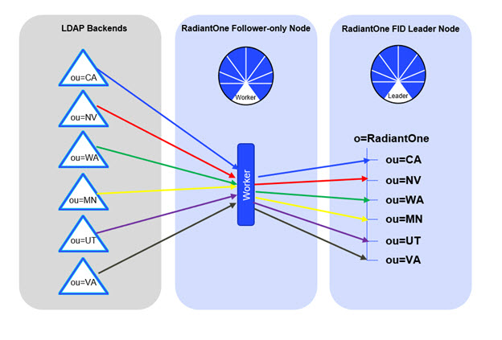

# Starting Synchronization

The worker process on each Follower-Only node can be started with <RLI_HOME>\bin\advanced\start_cplds_agent.bat (.sh on Linux).

When Workers start, they register with the RadiantOne FID leader. At this point, the RadiantOne FID leader knows which workers are available for synchronization. The first sync interval creates and populates the RadiantOne Universal Directory containers, so only the root naming context representing the store must be created prior to starting the synchronization workers. A high-level diagram of the synchronization process is shown below.

 
You can see all registered workers and active workers from the Main Control Panel > Directory Namespace tab > selected RadiantOne Universal Directory naming context > Distributed Directories Aggregation tab (requires [Expert Mode](introduction#expert-mode)). Registered workers are all workers that are started (thus “registered” with the RadiantOne FID leader). Active workers are those that are currently in the act of synchronizing the backends into the RadiantOne Universal Directory.

## Logs
Worker log files are located at: <RLI_HOME>\logs\sync_agents\agent_PID_<ID>cplds.log
