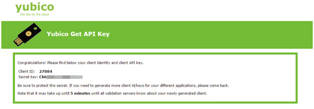
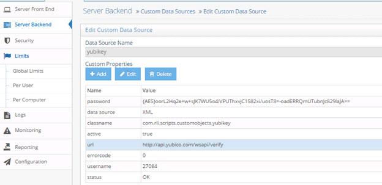
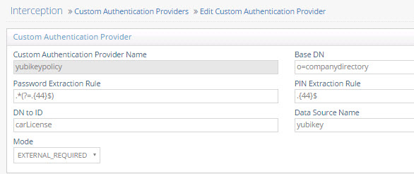
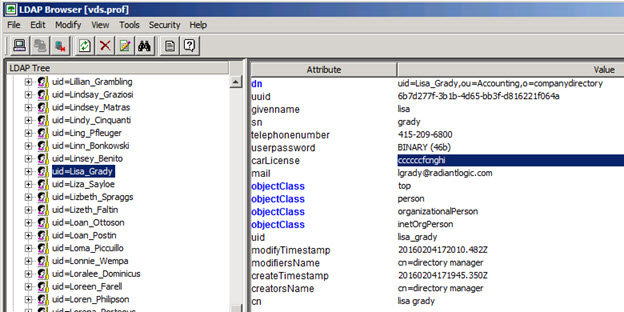
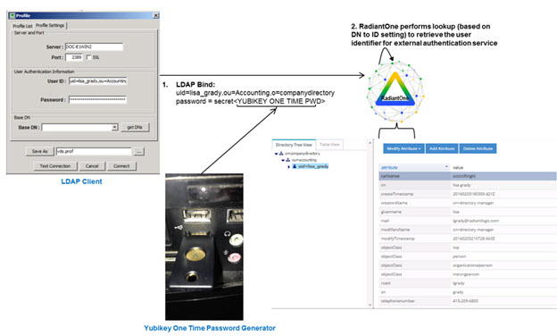
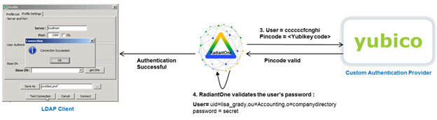

# Chapter 3: Yubikey

RadiantOne includes code to leverage Yubikey as a custom authentication provider. To use this example, follow the steps below.

1.	Plug your Yubikey device into your computer.

>**Note – the first time you plug your yubikey into your machine, a driver is installed/updated and generally takes a few minutes to setup.**
 
 

Figure 3. 1: Yubikey USB Driver Installation

2.	Navigate to https://demo.yubico.com/ to test your yubikey

3.	Touch the Yubikey button on your Yubikey which populates the code into the browser. A confirmation is returned. Take note of the “Yubico provisioned credential identity” that is returned as you need to populate this value in an attribute for the user virtual entry associated with this Yubikey device. The example used in this guide assumes this value is populated in the carLicense attribute of the user entry, but you can use any attribute.

4.	Navigate to https://upgrade.yubico.com/getapikey/ to get your API key if you don’t already have one.

5.	Enter email address and touch the Yubikey button on your Yubikey which populates the code into the browser.

Figure 3.2: Getting Yubico API Key

6.	Click Get API Key.

7.	Take note of the client ID and Secret Key values returned as they are needed when you create the custom data source in RadiantOne.

Figure 3.3: Client ID and Secret Key

8.	Navigate to the Main Control Panel > Settings tab > Server Backend section > Custom Data Sources.

9.	On the right, click ADD.

10.	Enter a unique data source name (e.g. yubikey).

11.	In the Custom Properties section, click Add.

12.	Enter the property name: url  (make sure to use all lowercase).

13.	For the value of the url property, enter: v2
RadiantOne automatically connects to the following Yubicloud services:
https://api2.yubico.com/wsapi/2.0/verify
https://api.yubico.com/wsapi/2.0/verify
https://api3.yubico.com/wsapi/2.0/verify
https://api4.yubico.com/wsapi/2.0/verify
https://api5.yubico.com/wsapi/2.0/verify

14.	Click OK.

15.	In the Custom Properties section, click Add.

16.	Enter the property name: classname 

17.	For the value of classname, enter: com.rli.scripts.customobjects.yubikey

To view the script logic to call Yubico, navigate to <RLI_HOME>\vds_server\custom\src\com\rli\scripts\customobjects\yubikey.java.

18.	Click OK.

19.	In the Custom Properties section, click Add. 

20.	Enter the property name: username

21.	For the value of username, enter the client ID returned in step 7.

22.	Click OK.

23.	In the Custom Properties section, click Add. 

24.	Enter the property name: password

25.	For the value of password, enter the Secret Key returned in step 7.

26.	Click OK.

27.	Click Save.

Figure 3.4: Yubikey Custom Authentication Service

>**IMPORTANT NOTE – if you edit the custom data source properties, you must restart RadiantOne FID. If deployed in a cluster, restart it on all nodes.**

28.	Navigate to the Main Control Panel > Settings tab > Interception section > Custom Authentication Providers (requires [Expert Mode](01-overview#expert-mode)).

29.	On the right, click on the ADD button.

30.	Enter a unique name for the custom authentication provider (e.g. yubikeypolicy).

31.	Enter the location/naming context in the virtual namespace where the custom authentication should be invoked in the Base DN property.

32.	Using regular expression syntax, enter the criteria to extract the password part from the password value received in the LDAP bind request. E.g.  .*(?=.{44}$)  which extracts everything before the last 44 characters from the fullpassword as the user’s password. 

33.	Using regular expression syntax, enter the criteria to extract the PIN/passcode part from the password value received in the LDAP bind request. E.g.   .{44}$  which extracts the last 44 characters from the fullpassword as the Yubikey code. 

34.	The DN to ID property is used by RadiantOne FID to lookup the user’s local virtual entry and retrieves the attribute to identify the user in the external authentication service. In the DN to ID property, enter the attribute name in the user entry that stores the value that uniquely identifies them in the external authentication service. In the example below, carLicense is the value entered in the DN to ID property. This means that the value of the carLicense in the user’s virtual entry is used to delegate the credentials checking to the external authentication service. 

Figure 3.5: Example Yubikey Custom Authentication Provider

Continuing with this scenario, in the example shown below, the unique ID of ccccccfcnghi is sent to the external authentication service when the user identified by a DN of uid=Lisa_Grady,ou=Accounting,o=companydirectory authenticates to RadiantOne FID.

Figure 3.6: Example Describing the Usage of the DN to ID Property

35.	In the Data Source Name property, enter the name of the custom data source you defined which contains the connection criteria for the custom authentication service. This was defined in step 10 above.

36.	Select the EXTERNAL_REQUIRED mode. The EXTERNAL_IGNORE mode can be used to disable the call to the custom authenticator, in which case RadiantOne FID processes the bind request using the default behavior. 

37.	Click Save.

38.	Restart RadiantOne FID. If a cluster is deployed, restart it on all nodes.

## Testing the Configuration

This example uses the Advanced LDAP browser as the client.
In the connection information, enter the userDN (User ID). For the password, enter the user password (accessible in HDAP or some backend virtualized by RadiantOne) and touch the Yubikey button on your Yubikey which appends the code to the password. This is shown in step 1 in the diagram below.

RadiantOne FID performs a lookup in its namespace to retrieve the identifier of user (associated with their account in the external authentication service). This is shown in step 2 in the diagram below.

Figure 3.7: High-level Authentication Flow

RadiantOne sends the external ID with the Yubikey code (extracted from the full password received in the LDAP Bind Request, based on the rules defined in the Custom Authentication Provider) to the service defined in the Custom Data Source. This is shown in step 3 in the diagram below.
After the pincode is validated, RadiantOne FID validates the user’s password (extracted from the full password received in the LDAP Bind Request, based on the rules defined in the Custom Authentication Provider). This is shown in step 4 in the diagram below.

Figure 3.8: Pincode Validation

If both password and pincode are valid, the LDAP authentication is successful.

