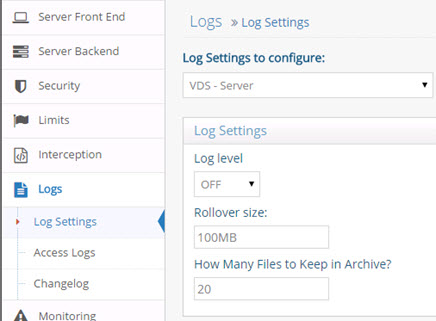

# Chapter 1: Global Tuning

Things to take into consideration when tuning RadiantOne:

-	What clients are accessing your server and what types of queries they are issuing with what kinds of filters.

-	What is considered adequate response time for the clients that are accessing RadiantOne.

-	The load that is expected on RadiantOne (number of clients, and what operations they are performing – read only, read/write…etc.).

By understanding the clients involved and the variables addressed above, you are better able to set appropriate values for the RadiantOne service such as search size limits, maximum connections, attributes to index, what information needs to be cached and what information can be accessed dynamically.

The RadiantOne namespace can be comprised of many branches, each of which can come from a different configuration and be combined below a common naming context or have their own. The following are the options that can comprise the namespace:

-	Virtual views created with Context Builder (Main Control Panel > Context Builder tab). The virtual views can be built from databases (anything JDBC/ODBC accessible), LDAP directories, or any data source reachable as a web service or through a Java API.

-	Virtual views created with the Main Control Panel > Directory Namespace. The virtual views can be built from databases (anything JDBC/ODBC accessible), or LDAP directories.

-	Local RadiantOne Universal Directory stores. When virtual views are stored as persistent cache, they leverage this storage.

This chapter describes the tuning parameters that are relevant at a global level and encompass any type of tree configuration unless otherwise noted.

## Tasks

The following operations are considered tasks and generate an event in the Task Scheduler when they occur: 

-	Initializing a persistent cache 
-	Initializing a RadiantOne Universal Directory store 
-	Re-indexing a cache
-	Exporting entries to an LDIF file
-	Importing entries from an LDIF file
-	Login Analysis (initiated from the Global Identity Builder)

By default, all tasks run in their own dedicated JVM and the memory allocated for the task automatically expands up to ¼ of the total machine memory. For example, if the machine where RadiantOne is installed has 16 GB of RAM, the task memory expands up to 4 GB to process a task. If you prefer, you can define a max Java heap size in the JVM parameters instead of leveraging this default expansion. Other custom settings can be entered in the JVM Parameters as well. From the Tasks Tab in the Server Control Panel, click on the pencil icon next to the task you want to edit. For a full list of possible behavioral and performance options, please see the link below. 

http://www.oracle.com/technetwork/java/javase/tech/vmoptions-jsp-140102.html

If the “Dedicated JVM” option is unchecked in the task settings, the task runs inside the JVM of the Task Scheduler.

 
Figure 1.1: Task Settings

## RadiantOne Service Settings

Service settings are related to how RadiantOne handles client activity. 

>[!warning] 
>Details about each of the parameters mentioned below can be found in the RadiantOne System Administration Guide. This document is only for pointing out these parameters as key to review when tuning.

### Maximum Connections

The maximum number of client connections the server can accept concurrently (connecting at the exact same time). This parameter is configured from the Main Control Panel -> Settings Tab -> Limits section -> Global Limits sub-section.

### Size Limit

The maximum number of entries a search operation can return. This allows for limiting the number of entries clients can receive from a query. By default this value is set to 0 which means there is no restriction on the size. This parameter is configured from the Main Control Panel -> Settings Tab -> Limits section -> Global Limits sub-section. The limit defined here is global for the RadiantOne service. To enforce finer-grained limits to specific users, configure limits in the Custom Limits section.

### Time Limit

The amount of time (in seconds) during which a search operation is expected to finish. If a search operation does not finish within this time parameter, the query is aborted. By default, this value is set to 0 which means there is no restriction on time. This parameter can be changed from the Main Control Panel -> Settings Tab -> Limits section -> Global Limits sub-section. The limit defined here is global for the RadiantOne service. To enforce finer-grained limits to specific users, configure limits in the Custom Limits section.

### Look Through Limit

The look through limit is the maximum number of entries you want the server to check in response to a search request. Use this value to limit the number of entries the server looks through to find an entry. This limits the processing and time spent by the server to respond to potentially bogus search requests (for example, if a client sends a search filter based on an attribute that isn’t indexed). This parameter can be changed from the Main Control Panel > Settings Tab -> Limits section > Global Limits sub-section. By default, this is set to 0, which means that there is no limit set for the number of entries that the server looks through. The limit defined here is global for RadiantOne. To enforce finer-grained limits to specific users, configure limits in the Custom Limits section.

### Idle Connection Timeout

The length of time to keep a connection open without any activity from the client. This is configured in seconds. The default is 15 minutes (900 seconds), which means an idle connection remains open for 15 minutes and is then automatically closed by RadiantOne. This parameter can be changed from the Main Control Panel > Settings Tab > Limits section > Global Limits sub-section. The limit defined here is global for RadiantOne. To enforce finer-grained limits to specific users, configure limits in the Custom Limits section.

### Number of Processing Queues

If you are running RadiantOne on a multi-processor machine, performance and efficiency of the server might improve by increasing the value for the Number of Processing Queues parameter. This parameter can be changed from the Main Control Panel > Settings Tab > Limits section > Custom Limits sub-section (requires [Expert Mode](00-preface#expert-mode)). The default value is 2 and is sufficient for most deployments. As a general guideline, this value should never exceed 3. 

>[!warning] 
>This parameter does not affect the actual number of physical processors that get used. However, it improves RadiantOne’s utilization of the available processors.

A better indicator for performance is the number of threads allocated for each processing queue. For each processing queue, the maximum number of concurrent worker threads is 4 by default. This value can be seen/changed in the [Max Concurrent Working Threads](#max-concurrent-working-threads) parameter.

After making changes, click Save. The RadiantOne service must be restarted for the changes to take effect. If deployed in a cluster, restart it on all nodes.

### Max Concurrent Working Threads

This is the number of threads RadiantOne uses for handling client requests. If there are backends involved (e.g. proxy views without persistent cache), then you must also consider how the backend handles the level of concurrency you define here as well because requests made to RadiantOne may directly result in concurrent requests sent to the backend(s).
The default value is 16, which means 16 worker threads allocated per processing queue defined in the Number of Processing Queues property. This property can be changed from the Main Control Panel -> Settings Tab -> Limits section -> Custom Limits sub-section (requires [Expert Mode](00-preface#expert-mode)). The default amount is sufficient for most deployments and generally should not be modified unless recommended by Radiant Logic. You might be able to increase this number if:

-	You are using a multiprocessor system - Multiprocessor systems can support larger thread pools than single processor systems. See the Number of Processors parameter above.

-	Clients connecting to RadiantOne perform many time-consuming operations simultaneously (like complex searches or updates).

-	RadiantOne needs to support many simultaneous client connections.

It is difficult to provide an exact formula for determining the optimal number of maximum concurrent working threads to set because it depends on the machine and environment where RadiantOne is running. Generally, the value for concurrent working threads should not be modified unless recommended by Radiant Logic. If it is modified, you must verify the value you set with testing. Incrementally change the value and retest. In the test results, you should start to see performance peak and then a decrease. The peak in the curve should represent the optimal setting.

### Max Pending Connection Requests

The max pending connection property represents a queue of server socket connections associated with requests from clients. This is not managed by the RadiantOne process. As soon as a TCP connection is established to RadiantOne, the connection is removed from the pending queue. A maximum number of pending client requests can be set in the Max Pending Connection Requests parameter. This parameter can be changed from the Main Control Panel > Settings Tab > Limits section -> Custom Limits sub-section (requires [Expert Mode](00-preface#expert-mode)). This parameter should not be changed unless advised by a Radiant Logic Support Engineer.

### Access Regulation

After a client connects to RadiantOne, the amount of activity they perform can be limited by configuring access regulation. The activity checking can be performed based on the user that connects to the server and/or what computer/client (IP address) they are connecting from.

The checking interval parameter indicated in the Per User section is the time frame in which the activity (max connections and max operations per connection) is monitored. Once the time interval is reached, the counts are reset. For example, if Special User checking is enabled, and the checking interval, max connections and max operations per second are set to 300, 30 and 10 respectively, during a 5 minute (300 secs) period, anyone who is a member of the special users group can make no more than 30 connections to RadiantOne and not perform more than 10 operations per second. This count resets every 5 minutes. If a user attempts to make more than the allowed number of connections, the server refuses the connections, and the client must wait until the checking interval resets.

#### Per User

The following groups of users found on the Main Control Panel > Settings tab > Limits section > Per User sub-section allow you to configure fine-grained activity control:

>[!note] 
>Members of the Administrators group specified on the Main Control Panel > Settings Tab > Server Front End > Administration section do not have any access limitations in terms of max connections or max operations per second.

**Anonymous**

An anonymous user is a client who connects anonymously (no username or password) to RadiantOne. To enable checking for this category of user, check the Enable Access Checking option in the Anonymous section of the Per User sub-section. Enter a number for the maximum connections anonymous users are allowed to create. Also enter a number for the maximum number of operations per second they are allowed to issue. Any parameters that are set to 0 have no limits applied. The restrictions checking interval dictates the number of seconds the server should wait before determining if these thresholds are reached.

**Authenticated Users**

An authenticated user encompasses any client who successfully authenticates no matter which group they are a member of. To enable checking for this category of users, check the Enable Access Checking option in the Authenticated Users section of the Per User sub-section. Enter a number for the maximum connections authenticated users are allowed to create. Also enter a number for the maximum number of operations per second they are allowed to issue. Any parameters that are set to 0 have no limits applied. The restrictions checking interval dictates the number of seconds the server should wait before determining if these thresholds are reached.

**Special Users Group**

Special Users are anyone who successfully binds and is a member of the special user group defined on the Main Control Panel -> Server Front End -> Administration section. To enable checking for this category of users, check the Enable Access Checking option in the Special Users Group section in the Per User sub-section. Enter a number for the maximum connections special users are allowed to create. Also enter a number for the maximum number of operations per second they are allowed to issue. Any parameters that are set to 0 have no limits applied. The restrictions checking interval dictates the number of seconds the server should wait before determining if these thresholds are reached.

<!--

#### Per Computer/Client

Computers/client applications are identified by their IP address. IP configurations are located on the Main Control Panel -> Settings Tab -> Limits Section -> Per Computer sub-section. These settings allow you to configure fine-grained activity control per computer/client machines.
**IP address**

All client machines fall into this category. To enable checking for this category of computer, check the Enable Access Checking option in the IP Address section of the Per Computer sub-section. Enter a number for the maximum number of connections all computers are allowed to create. Also enter a number for the maximum number of operations per second they are allowed to issue. Any parameters that are set to 0 have no limits applied. The restrictions checking interval dictates the number of seconds the server should wait before determining if these thresholds are reached.

**Special IP Address**

Any client who connects from one of the IP addresses listed in the Special IP Addresses parameter. 

Both IPv4 and IPv6 addresses are supported, and you can indicate a range of IP addresses using “/”. A mix of IPv4 and IPv6 can also be used. 

Example set for a range of IPv4 addresses: 

10.11.12.0/24  which represents the given IPv4 address and its associated routing prefix 10.11.12.0, or equivalently, its subnet mask 255.255.255.0, which has 24 leading 1-bits. This covers the range between 10.11.12.0 to 10.11.12.255.	

Example set for a range of IPv6 addresses:

2001:db8::/32  which covers the range between 2001:db8:0:0:0:0:0:0 to 2001:db8:ffff:ffff:ffff:ffff:ffff:ffff

To enable checking for this category of computer/client, check the Enable Access Checking option in the Special IP Address section on the Per Computer sub-section. Enter a number for the maximum number of connections all computers are allowed to create. Also enter a number for the maximum number of operations per second they are allowed to issue. Any parameters that are set to 0 have no limits applied. The restrictions checking interval dictates the number of seconds the server should wait before determining if these thresholds are reached.

>[!warning] 
>If you have enabled activity checking for both users (special users, authenticated and/or anonymous) and computers (IP address and Special IP), the activity per computer takes precedence over the user activity. The order of precedence is special IP addresses, IP addresses, special users, authenticated users, and then anonymous users. For example, let’s say that special user access checking, IP address access checking, and special IP address access checking have been enabled, and the max connections are set to 50, 30, and 40 respectively. Any user who connects that is a member of the special users group from a computer that is not a member of the special IP address group, is only allowed to make a maximum of 30 connections during the checking interval.

-->

## Logging

### Server Logs

To ensure optimal performance, the logging for RadiantOne should be reduced to the minimum level that meets your auditing needs. The log settings that should be considered are configured in the Main Control Panel > Settings Tab > Logs section > Log Settings and Access Logs sub-sections. 

In the Log Settings section, select VDS – Server from the drop-down list. The RadiantOne service log level is defined here. To turn off logging, set Log Level to OFF. The RadiantOne service does not need to be restarted when changing the log level unless you set it to OFF.

 
Figure 1. 2: Server Log Settings

<!--
In the Access Logs section, Advanced section (requires [Expert Mode](00-preface#expert-mode)), the Buffer Size for File logging property can be used for tuning. Increasing this value results in fewer writes by RadiantOne to the log file on disk. However, increasing this value requires more memory. Make sure the machine memory and amount allocated to the RadiantOne service can accommodate the buffer size you set.
-->

You should also put in place an effective log management strategy: location, rollover and archiving. For details on these options, please see the RadiantOne Logging and Troubleshooting Guide.

### Changelog

The changelog is one of the recommended approaches for other processes to detect changes that have happened to RadiantOne entries. 

The Changelog can be enabled from the Main Control Panel > Settings Tab > Logs section > Changelog sub-section. If enabled, the change log stores all modifications made to any entry in the RadiantOne namespace including entries that are stored in [persistent cache](02-tuning-tips-for-caching-in-radiantone#persistent-cache). The contents of the change log can be viewed below the cn=changelog suffix in the directory. 

For the RadiantOne service to maintain efficiency and performance (as well as save disk space), you should set a maximum age for changelog entries. The maximum age parameter specifies the number of seconds a changelog entry stays in storage. Records older than the maximum age are deleted automatically. Old change log numbers (from deleted records) do not get re-used. The default value is 3 days which means changelog records are automatically deleted after 3 days.

### Log Archiving

Depending on the log level configured for RadiantOne (the higher the log level, the faster log files grow), you should configure realistic log archiving (to avoid filling up available disk space with too many log files). For more information on log archiving, please see the RadiantOne Logging and Troubleshooting Guide.
