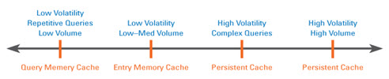

## Overview

This chapter provides guidelines on how to effectively use caching for optimal performance. The first part covers the different categories and levels of cache along with a quick review of the different use cases that justify a cache deployment. The second part provides details and describes the advantages and trade-off between “in-memory” and “persistent” cache. Finally, a description of cache refresh methods is reviewed. This is an essential and often overlooked aspect of cache management.

Persistent caching is only associated with the RadiantOne Federated Identity module and is irrelevant for [RadiantOne Directory](04-tuning-tips-radiantone-universal-directory.md).

## When and why do you need a cache?

There are many cases where RadiantOne is leveraged more for its flexibility rather than its pure speed. However, in most critical operations such as identification, authentication, and authorization, it needs to provide guaranteed fast access to information. In fact, in many cases RadiantOne needs to provide read operations that are faster than what can be delivered by the underlying sources. What is meant by “fast”, is a level of performance that is at least 3 to 5 times what can be derived from standard relational databases (RDBMS) – as an example. 

An additional requirement, in some situations, is a fast “write” capability. A typical case is when security information needs to be logged into the directory for audit purposes at authentication time. The problem is that most directories are a lot slower than RDBMS when it comes to write operations. In this case, RadiantOne can forward the writes to faster transactional data stores. 

The question then becomes: How can the RadiantOne FID service be faster than the underlying data sources despite the fact that it adds an extra layer of software and one more intermediate TCP/IP hop? 

The answer is unambiguous, without caching, the RadiantOne FID service is always slower than the sources it has virtualized. In terms of overhead, the additional TCP/IP hop (an application talks to RadiantOne first and then it talks to the underlying sources) by itself, divides the throughput of the virtualized source by approximately half. If you include the dynamic transformations, the joins, and the reorganization of the underlying namespaces to this overhead (in short, all the value added by RadiantOne through on-the-fly processing), it is difficult to imagine how this service can be faster than the underlying sources with dynamic access alone. 

For all the above reasons, a flexible and efficient cache strategy and cache refresh mechanism is an absolute necessity. In most sizeable identity and access management deployments, caching is not only required, but also depending on volume, scalability, resilience to failure, etc…different levels and types of cache (in-memory and/or persistent) are needed.

To better understand the different aspects of performance and cache for RadiantOne, we need to look at the architecture. At a high level, the architecture can be divided into two main layers: 

-	A front-end layer which handles the protocol (LDAP or other standard protocols such as a Web Services, SPML, or SAML).

-	A back-end layer that oversees mapping/transforming the result set from the “virtualized” data sources (directories, databases and/or applications). 

The performance of the RadiantOne service depends on a front-end layer that shares most of the logic of an LDAP server and as such can leverage the same optimization strategies. However, performance also depends even more on the back–end layer, which really represents the virtualization. This is where the secret for performance and scalability resides and, where a solid and scalable caching mechanism is indispensable.

## Front-end performance

The RadiantOne front-end shares most of the layers of a “classic” LDAP directory and the same “potential” bottlenecks. They are essentially at: 
-	The TCP/IP server (and client) connections 

-	The first level of query parsing

### TCP/IP Connections and Connection Pooling

The first bottleneck is common to any TCP/IP based server and not specific to LDAP servers. Even if a server could set aside resources (memory and handles) for an arbitrarily large number of connections, what the server can really support (the effective number of concurrent connections) is dictated by the underlying hardware platform, bandwidth and operating system. Once this level is reached, no matter how powerful the underlying hardware is (in terms of processing throughput), the server is idle and waiting for the establishment of the connections. In this case the only possible optimization at the TCP layer would be by using specific hardware such as TCP offload engines, more bandwidth, better routers and/or scaling out by load balancing.

The latency of a TCP/IP client connection is another point to consider in the terms of performance. The latency of a TCP/IP client connection, compared to the speed of the processor is extremely high. As a result, multiple connections and disconnections hamper the apparent throughput of any directory server. (An easy way to verify this fact is to run the “search rate” utility (as described in [Chapter 5](05-testing-radiantone-performance.md)) against any LDAP directory with or without keeping the connection open after each search). With multiple connections/disconnections the search rate of a server drops to a quarter or a third of the normal throughput. At the same time the CPU of the server shows a lot of idle cycles. Most of the time is spent waiting for the establishment or re-establishment of the client TCP/IP connection. Since the RadiantOne service must connect to many distributed sources, it acts as a client to many TCP/IP servers, and so the cumulated latencies could be quite high. The solution to this problem consists in pooling the different connections by class of connected servers to reuse existing connections as much as possible. It is essentially a form of cache for an already open structure needed for a connection. Therefore, support for connection pooling is an important feature for RadiantOne in dynamic access mode (without caching any data at the level of the server). For details on connection pooling, please see [Chapter 3](03-tuning-tips-for-specific-types-of-backend-data-sources.md).

### First Level of Query Parsing

The second issue is the overhead generated by the parsing of incoming queries. Although a lot less expensive than TCP/IP overhead, the parsing time is not negligible. To optimize, RadiantOne couples a query cache with an entry cache. The idea is that by caching a frequently issued query and its result set (entry cache), significant server time can be saved. This strategy works well when information is not too volatile. The cache is equipped with a LRU (least recently used) eviction policy and TTL (time-to-live) marker for both queries and entries. 

However, query cache and entry cache are not the panacea to addressing performance issues. Query cache is relatively blind and based essentially on syntax and not semantics: two queries yielding equivalent results but using a slightly different syntax are represented twice in the cache. Another limitation is the size of these caches. As volume increases, many factors start to negate the value of the approach. The cache refresh strategy is more complex, and latency in case of failure and cold restart (the cache needs to be re-populated before providing its performance boost) can be stumbling blocks. For these reasons, these categories of caches in RadiantOne are used essentially as a performance enhancer rather than the base for server speed. If correctly sized, such a cache brings a 15 to 30% performance boost to a server (unless the whole dataset is quite small and could fit entirely in memory). The next section explains that the key to scalability and sustainable performance for a directory with significant volume rests upon its indexing strategy for entries and access paths.

## Back-end Performance

**The “Secret” of LDAP Directory Speed**

The beginning of this chapter referred to the speed of a directory being primarily focused on reads. So, how fast is fast? Between 1500 to 2000 queries per second/per GHZ/per processor (Pentium IV class machine on a Windows Server or Linux) for LDAP (Sun or Netscape 4.x to 5.x) versus 150 to 300 queries per second for a RDBMS (Oracle, DB2, or SQL Server) for a standard entry search with fully indexed queries. The size of an entry for these performance numbers is about 512 bytes, and the number of entries in the LDAP directory was 2 million. These numbers reflect a search operation for identification purposes (login). This performance is quite stable, even if the volume of entries goes up to 80 to 100 million entries. However, the size of an entry is a factor in terms of performance. At 2 KB or more per entry the search rate starts to drop quickly.

The performance secret of an LDAP server when it comes to read and search operations is a relatively simple structure for queries and operations, which yields a much simpler access method and storage strategy (nothing to be compared with the richness and capabilities of SQL, but also none of the optimizations and complexity required of a full RDBMS). Essentially, an LDAP directory can be implemented very efficiently with a classic approach of fully indexed data files based on B+ trees (RDBMS uses the same kind of storage and access methods, however their access plans are a lot more complex, involve a lot of processing, many indexes and optimizations for full support of relational operations).

Due to their relative simplicity, LDAP directories fully benefit from the classic advantages of B+ tree indexing. Searching for an entry based on a fully indexed attribute can be delivered in a guaranteed time and scale quite well. Even without page caching, a B+ tree index can retrieve an indexed attribute (in the worst case) in no more than log N disk accesses, N being the number of entries. This simple and robust structure explains the performance and stability of LDAP directories when it comes to read even with a significant number of entries (100 million entries or more). More importantly, this level of speed can be guaranteed even with a relatively modest amount of main memory, again one of the strong points for B+Trees. However, the story in terms of writes is not as good. Writing is an expensive operation, which does not scale well when the volume of entries increases. If this constraint is added, the fact that an LDAP directory must maintain many indexes (ideally as many as potentially “searchable” attributes), you can see that the number of updates is the key factor that limits the scalability of a classic directory. As is well documented, a directory is optimized for read with a modest amount of writes.

**The Different Caching Strategies**

Where are the bottlenecks for the RadiantOne service? As described in this chapter, when it comes to the front-end layer read/search speed, RadiantOne is comparable to a classic directory. The optimizations at this level are also similar. The target is essentially to optimize the TCP/IP connections and to re-use the previous queries and corresponding results sets (Query cache and entry cache - see previous sections) when and where possible.

**The major bottleneck is at the level of the back-end**

By definition, a federated identity layer does not own any specialized back-end like a classic LDAP server (which as we have seen is the secret to speed and scalability with modest memory requirements). By construction, a federated identity layer needs access to the underlying “virtualized” data sources. Without a caching strategy, a federated identity layer acts simply as a proxy and forwards the calls to the underlying sources. Without caching, even with the best optimization at the front-end, RadiantOne FID can only deliver a fraction of the speed of the underlying sources. If the “virtualized” sources are fast in terms of read operations and if the virtualization overhead is acceptable then dynamic access alone to the source data may be a viable strategy.

However in most cases (e.g. when databases and/or Web Services are involved and volume is significant), a back-end caching mechanism is a requirement. A complete federated identity layer needs to offer different levels of cache with different cache refresh implementation strategies matching different use cases. 

There are essentially two forms of cache:
-	In-memory cache

-	Disk-based cache also called “persistent cache”

Each of these caching mechanisms can be refreshed using different methods. 

Cache refresh strategies can be divided into two main categories:

-	Polling the changes either periodically or based or an expiration of a “time-to-live“ value assigned to a cache entry
-	Detecting the change events directly at the sources (triggers or other methods)

RadiantOne offers different caching options to accommodate a variety of deployment needs.
-	Memory Cache (Entry Cache and Query Cache)

-	Persistent Cache

The diagram below provides a general “rule of thumb” as to what type of cache to implement. 

* Low volatility during the life of the cache (the time to live).

** Repetitive Queries – a query having exactly the same syntax (same user, same filter, same ACL).

*** Low Volume – The size of the cache as measured by (Nb entries * entry size * 2.5) cannot exceed the amount of memory allocated for cache.

For persistent cache, there is no limitation in terms of number of entries since everything is stored on disk. When fully indexed, the persistent cache provides performance levels comparable to the fastest “classic” LDAP directory.

### Memory Cache

In this approach, cached entries are stored solely in memory. In terms of implementation, this approach has the advantage of simplicity. However in practice, this solution may present many potential issues depending on the use case. In most cases, memory cache works when the volume of entries and the complexity of the queries are modest. However, with sizeable volume (and often the flexibility of a federated identity service tends to yield many use cases which quickly add an increased demand in terms of memory) and the variable latencies and volatility (update rates) of the virtualized data sources, it is difficult to guarantee the performance of a memory cache solution. The greatest risks with a memory cache result when the query pattern is not predictable and the data set volume exceeds the size of memory. Furthermore, some categories of directory views are not good candidates for caching because the operation can never guarantee that all possible observable results are retrieved at the right time. If the volatility of the underlying data store is high, and the volume of data is significant, then a memory cache with a time-to-live refresh strategy alone is very difficult to put in place and will not guarantee an accurate “image” or will generate excessive refresh volume negating the advantages of the cache. As a result, providing guaranteed performance is difficult if not impossible. Moreover, as volume increases or when queries needed to build the virtual image are more complex, the latency incurred by accessing the underlying sources just to rebuild the memory cache after a cold restart becomes more and more problematic. As a consequence, memory cache provides performance improvements only in very specific cases. Memory cache needs to be considered more like a partial/incremental improvement boost rather than a complete solution to guaranteed performance.

### Persistent Cache

In this approach, images of the virtual entries are stored in the local RadiantOne Directory. This approach allows for fast recovery in case of failure. The whole virtual tree could be cached this way and a large volume of entries can be supported (hundreds of millions entries - essentially no practical limit if combined with partitioning and clusters). 

The challenge then becomes how to access this disk cache selectively at the level of each entry and at the same speed than the fastest classic LDAP server. The answer is pretty straightforward even if its implementation is not: build a persistent cache, which is a full LDAP V3 server. All the advantages described for the classic LDAP directory speed apply here. The persistent cache becomes the equivalent of what in the RDBMS world we would call a “materialized” view of a complex directory tree stored in an LDAP format and transparently refreshed by polling or pushing events (triggers or logs) at the level of the data sources. In fact, the complexity here resides essentially in the cache refresh mechanism. The good news is that by leveraging good abstraction and representation (data modeling and metadata) of the different data sources, a completely automated solution is possible. One can say that in this case, a bit paradoxically, good abstraction and virtualization ends up into an always “synchronized” and persistent directory view. The major difference though with classic synchronization resides in the simplicity and the ease of deployment. Virtualization and good data modeling yield an automated solution where transformation, reconciliation, joins, caching, and synchronization is totally transparent to the RadiantOne administrator and reduced to a fairly simple configuration. 

The diagram below provides a general “rule of thumb” as to what type of cache to implement.

Figure 2.1: Cache implementation diagram
 
* Low volatility during the life of the cache (the time to live)
** Repetitive Queries – a query having exactly the same syntax (same user, same filter, same ACL)
*** Low Volume – The size of the cache as measured by (Nb entries * entry size * 2.5) cannot exceed the amount of memory allocated for cache

>[!note] 
>For persistent cache, there is no limitation in terms of number of entries since everything is stored on disk. When fully indexed, the persistent cache provides performance levels comparable to the fastest “classic” LDAP directory and even better performance when it comes to modify operations.

