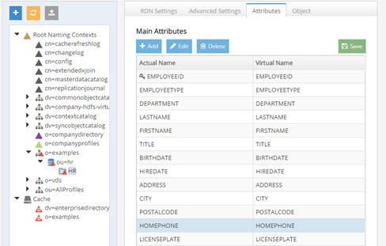
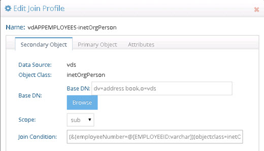
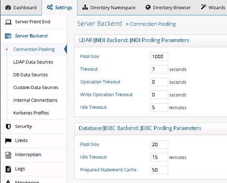
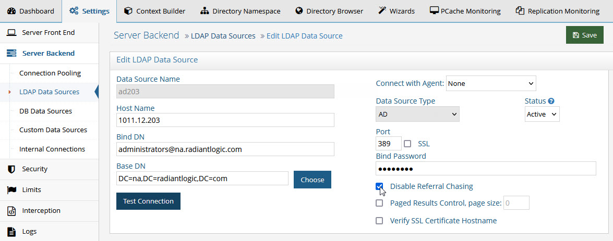
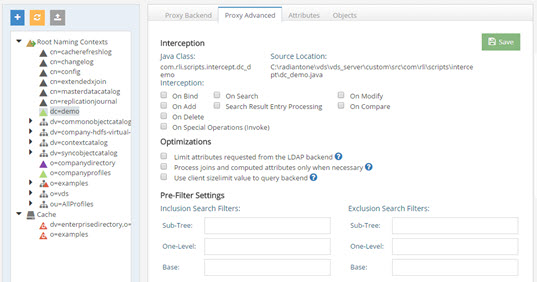
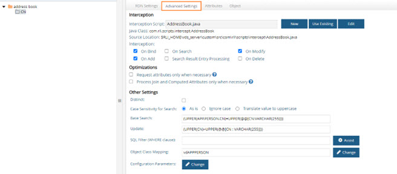
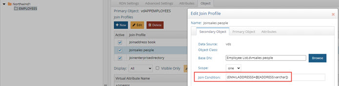
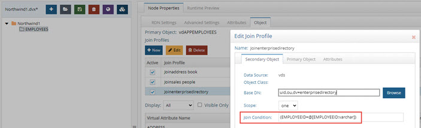
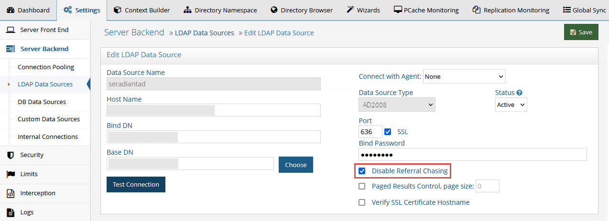

# Tuning Tips for Specific Types of Backend Data Sources in the RadiantOne Federated Identity Service

There are three approaches to creating virtual views from the Main Control Panel. The Wizards tab, the Context Builder tab, and the Directory Namespace tab. Although the tuning parameters are typically the same no matter which tab you use, the location to set the parameter may be different. This chapter describes the possible tuning parameters and how to configure them depending on which tool you used to create the virtual views.

## Virtual Views Created in the Main Control Panel > Directory Namespace or Wizards tabs

Details about the parameters mentioned below can be found in the [RadiantOne System Administration Guide](/sys-admin-guide/01-introduction). This document is only for pointing out these parameters as key to review when tuning.
### Database Backends

Database backends are any source accessed via JDBC or ODBC. This includes Oracle, SQL Server, and IBM DB2 among others.
#### Optimize the View Definition

##### Case Sensitivity for Searches

There are three options available for handling case sensitive databases. These options are related to how RadiantOne FID generates the query to send to the database. These options are available on the Main Control Panel -> Directory Namespace Tab. Select the container/content node in a virtual view below Root Naming Contexts and on the right side, select the Advanced Settings tab. 

1)	As Is

	If your database is not case sensitive, then you should choose the As Is option. With this option, RadiantOne FID forwards the search filter to the backend in the exact case it was received in the request from the client. This is the default option.

	If your database is case sensitive and you choose this option, the case received in the filter from the client search request must match the case used in the database or else the entry will not be found.
	For example, if a database attribute named FIRSTNAME had a value of Nancy, and RadiantOne FID received a search request with a filter of (firstname=nancy), the entry would not be returned. The client must use a filter of (firstname=Nancy) in order for the entry to be properly returned from the database.
2)	Ignore Case

	If your database is case sensitive and you are not sure how the values are stored (mixed case, all upper, all lower…etc.), then you should choose the Ignore Case option. With this option, RadiantOne FID generates the SQL query so that both the filter that was received in the client request and the values from the backend are converted into uppercase before the search filter can be validated. For example, if a client sent a request with a filter of (firstname=Nancy), RadiantOne FID would generate the following where clause based on the filter received in the client request.

	WHERE (UPPER(APP.EMPLOYEES.FIRSTNAME)=UPPER('Nancy'))
	The case used in the filter from the client is irrelevant and everything is converted into uppercase.
	This option offers the least performance, so it should only be used when absolutely required. If the database is case sensitive and the values are stored in uppercase, you should use the Translate Values to Uppercase option (see #3 below) as it is more efficient.
3)	Translate Values to Uppercase

	If your database is case sensitive and you know the values are stored in uppercase, you should choose the Translate Values to Uppercase option. With this option, RadiantOne FID translates the search filter value into uppercase before sending it to the backend database. This option is more efficient than the Ignore Case option mentioned above.
##### Modify the Exposed Attributes

To improve the performance of the view, you should only expose the required attributes. The default behavior of RadiantOne FID is to request all attributes from the underlying source (no matter what specific attributes a client may have requested). Having unnecessary attributes in the output can slow down the performance of the query (because it makes the query string much longer). On the Main Control Panel > Directory Namespace tab, select the container/content node in the virtual view below Root Naming Contexts and on the right side, select the Attributes tab. Only list the attributes on the Attributes tab that you want RadiantOne FID to request from the backend (delete all others).

 
Figure 3.1: Modifying the attributes in the View Definition

##### Index Attributes Used in Joins

If joins are configured, verify that all attributes conditioning the join are indexed in the underlying sources. In the example shown below, the join is based on employeeID in the source matches employeeNumber in the target. This means employeeID should be indexed in the source and employeeNumber should be indexed in the target.
 

Figure 3.2: Join Profile

#### Other Possible Optimizations

Depending on your specific use case and virtual view, two other optimizations are possible. These are configured on the Main Control Panel > Directory Namespace Tab. Select the container/content node in the virtual view below Root Naming Contexts and on the right side, select the Advanced Settings tab. Both options are described below.

##### Request Binary/BLOB Attributes Only When Necessary

Requesting BLOB attributes can significantly decrease performance. When this option is enabled, RadiantOne FID requests binary/BLOB attributes from the backend only if they are specifically requested by the client.

Use caution when enabling this parameter if an interception script is defined (which may need such attributes even if they are not requested by the client).

>[!warning]
>Do not enable this option if a memory entry cache is used (as the whole virtual entry is needed, including the BLOBs).

##### Process Joins and Computed Attributes Only When Necessary

The default behavior of RadiantOne FID is to process associated joins and build computed attributes whenever a virtual object is reached from a query regardless of whether the attributes requested come from a secondary source or computation.

If you enable this option, RadiantOne FID does not perform joins or computations if a client requests or searches for attributes from a primary object only. If a client requests or searches for attributes from secondary objects or computed attributes, then RadiantOne FID processes the join(s) and computations accordingly.

Use caution when enabling this option if you have interception scripts defined on these objects, or access controls based on filters are being used (both of which may require other attributes returned from secondary sources or computations regardless of whether or not the client requested or searched for them).

>[!warning]
>Do not enable this option if a memory entry cache is used (as the whole virtual entry is needed for the cache).

#### Connection Pooling

Connection pooling improves performance because a connection to the underlying source does not need to be created every time data needs to be retrieved.

Connection pooling for database sources is automatically enabled by default and the settings can be modified in the Main Control Panel > Settings tab > Server Backend section, under the Connection Pooling sub section (requires [Expert Mode](00-preface#expert-mode)).

 
Figure 3.3: Connection Pooling Settings

The possible settings are described in more details below.

**Pool Size**

The maximum number of connections that are held in the pool for each JDBC data source. The default is 20.

**Idle Timeout**

This is the maximum number of minutes to keep an idle connection in the pool. The default is 15. Setting this value to “0” means the opened connection stays in the pool forever.

**Prepared Statement Cache**

RadiantOne uses parameterized SQL statements and maintains a cache of the most used SQL prepared statements. The default is 50. This improves performance by reducing the number of times the database SQL engine parses and prepares SQL. 

This setting is per database connection.

>[!warning]
>Use caution when changing this default value as not all databases have the same limits on the number of 'active' prepared statements allowed.

### LDAP Backends

LDAP backends are any source accessed via LDAP. This includes Sun Java Directory, IBM Directory Server, and Active Directory among others.

#### Disable Referral Chasing

By default, RadiantOne FID does not attempt to chase referrals that have been configured in the underlying LDAP server.

 
Figure 3.4: Disabling Referral Chasing

Chasing referrals can affect the overall performance because if the referral server is not responding (or responding slowly) RadiantOne FID could take a long time to respond to the client. For example, in the case of querying an underlying Active Directory (with a base DN starting at the root of Active Directory) you may get entries like the following returned:

ldaps://ForestDnsZones.na.radiantlogic.com:636…  ldaps://DomainDnsZones.na.radiantlogic.com:636…

If RadiantOne FID attempts to “chase” these referrals, this can result in an extreme degradation in response times. Therefore, it is recommended that referral chasing is disabled, especially if you need to connect to Active Directory starting at the root of the tree.

#### Excluded Attributes for Active Directory Backends

This parameter is for Active Directory backends. It excludes specific attributes from being returned from the backend. Certain “system” attributes (e.g. dscorepropagationdata) returned from Active Directory (even for non-admin users) can cause problems for building persistent cache because the data type is not handled properly, and these attributes need to be added to the RadiantOne schema for the local HDAP storage to handle them in the cache. Also, these attributes cause problems for the change capture connector needed for real-time persistent cache refresh to work properly. Attributes that are not required by client applications, should be added to this list to ensure they are not returned in the view from Active Directory. By default, the AD attributes that are excluded are ds*, acs*, ms* and frs* (* is a wildcard meaning that any attributes with those prefixes are excluded). Any attributes that you do not want returned from the backend Active Directory can be added to the Attributes excluded from search results (support for Active Directory) list which is found on the Main Control Panel > Settings tab > Server Front End section > Attributes Handling sub-section. Make sure a space separates the attributes listed.

#### Optimize the View Definition

##### Include & Exclude Filters

Multiple different LDAP backends can be configured below the same root naming context. Therefore, client applications have the ability to perform searches from the root which could result in querying numerous backend directories. Sometimes, this can affect performance. In order to have more control over which LDAP queries get sent to which LDAP backends, RadiantOne offers inclusion and exclusion search filters.

-	Inclusion Filters: Allow you to specify which filters are allowed to be sent to the backend LDAP directory.

-	Exclusion Filters: Allow you to specify which filters are not allowed to be sent to the backend LDAP directory.

Typically you would specify one or the other (inclusion filters or exclusion filters). The filter can be in the form of any valid LDAP filter. Also, different filters can apply on different search scopes (base, one level, or subtree).	

##### Index Attributes Used in Joins

If joins are configured, verify that all attributes conditioning the join are indexed in the underlying sources.

#### Other Possible Optimizations

Depending on your specific use case and virtual view, two other optimizations are possible. These are configured on the Main Control Panel > Directory Namespace Tab. Select the virtual view below the Root Naming Contexts node. On the right side, select the Advanced Proxy tab. Both options are described below.

 
Figure 3.5: Optimizations for LDAP Backends

##### Limit Attributes Requested from the LDAP Backend

Whenever RadiantOne FID queries a backend LDAP, the default behavior is to ask for all attributes (although ONLY the attributes requested in the query are returned to the client). This default behavior is for the following reasons:

-	Joins have been configured and the filter in the search request involves attributes from both the primary and secondary sources (i.e. the query filter contains conditions on both primary and secondary objects). 

-	Interception scripts that involve logic based on attributes from the backend. These attributes may not be specifically requested or searched for by the client. However, RadiantOne FID must retrieve them from the backend in order for the script logic to be valid.

-	ACL checking. You can setup ACLs on attribute/values of an entry (i.e. mystatus=hidden), so RadiantOne FID may need the whole entry to check the authorization.

-	For entry caching. The entire entry needs to be in the entry cache.

If your virtual view does not require any of the conditions mentioned above, you can enable this option for better performance. If this option is enabled, RadiantOne FID queries the backend server only for attributes requested from the client in addition to attributes set as 'Always Requested' on the Attributes tab.

##### Process Joins and Computed Attributes Only When Necessary 

The default behavior of RadiantOne FID is to process associated joins and build computed attributes whenever a virtual object is reached from a query regardless of whether the attributes requested come from a secondary source or computation. 

If you enable this option, RadiantOne FID does not perform joins or computations when a client requests or searches for attributes from a primary object only. If a client requests or searches for attributes from secondary objects or computed attributes, then RadiantOne FID processes the join(s) and computations accordingly. 

Use caution when enabling this option if you have interception scripts defined on these objects, or access controls based on filters are being used (both of which may require other attributes returned from secondary sources or computations regardless of whether or not the client requested or searched for them). 

>[!warning]
>Do not enable this option if a memory entry cache is used (as the whole virtual entry is needed for the cache).

##### Use Client Size Limit Value to Query Backend

Whenever RadiantOne FID queries a backend LDAP, the default behavior is to ask for all entries (sizelimit=0) even if the client indicates a size limit. 

This default behavior is because the entries returned by the backend are possible candidates, but may not be retained for the final result that is sent to the client. For example, if an ACL has been defined in RadiantOne, not all entries from the backend may be authorized for the user (connected to FID) to access. Other cases are when joins or interception scripts are involved with the virtual view, these may also alter the entries that match the client’s search.

To limit the number of entries from the backend, using paging is the recommended approach. If the backend supports paging, RadiantOne FID will not get all the results at once, only one page at a time (page size indicated in the configuration). In this case, if RadiantOne FID has returned to the client the size limit required, it will not go to the next page.

If your virtual view does not require any of the conditions mentioned above (joins, interceptions, ACL), and using paging between RadiantOne FID and the backend is not possible, you can enable this option to limit the number of entries requested from the backend. If this option is enabled, RadiantOne FID uses the size limit specified by the client instead of using sizelimit=0 when querying the backend.

##### Use Client Time Limit Value to Query Backend

Whenever RadiantOne FID queries a backend LDAP, the default behavior is to request no time limit (timelimit=0) even if the client indicates a time limit.

If you want RadiantOne FID to utilize the time limit value it receives from the client request when it queries the backend directory, set enableLdapServerTimeLimit = true; in ZooKeeper.

1.	From the Main Control Panel, switch to [expert mode](00-preface#expert-mode) and then go to the Zookeeper tab. 
2.	On the Zookeeper tab, navigate to radiantone/v1/cluster/config/vds_server.conf.

3.	Click **Edit Mode**.

4.	Search for "enableLdapServerTimeLimit" : false, and change false to true.

5.	Click **Save**.

If enableLdapServerTimeLimit is set to true, RadiantOne FID uses the time limit specified by the client instead of using timelimit=0 when querying the backend.

####Connection Pooling

JNDI connection pooling to a backend LDAP source is enabled by default.

To change the maximum connections to maintain in the pool, the idle timeout, or connection timeout, simply change the setting from the Main Control Panel > Settings tab >S erver Backend section > Connection Pooling sub-section (requires [Expert Mode](00-preface#expert-mode)).

**Pool Size**

Default is 1000. This is the maximum number of concurrent connections by RadiantOne FID to each LDAP source. For example, if you have four LDAP sources and your maximum connections value is set to 200, then you could have up to a total of 800 LDAP connections maintained by RadiantOne FID.

**Timeout**

Default is 7. This is the maximum number of seconds RadiantOne FID waits while trying to establish a connection to the backend LDAP server. There are two attempts to create a connection (7 seconds per attempt).

**Operation Timeout**

Default is 0 (no timeout). This is the maximum number of seconds RadiantOne FID waits to receive a response from to the backend LDAP server. After this time, RadiantOne FID drops the request and tries to send the request again. After two failed attempts to get a response back, RadiantOne FID returns an error to the client.

**Write Operation Timeout**

The default is 0 (no timeout). This is the maximum number of seconds RadiantOne FID waits to receive a response from to the backend LDAP server for a write operation. After this time, RadiantOne FID drops the request and attempts to send the request again. After two failed attempts to get a response back, RadiantOne FID returns an error to the client.

**Idle Timeout**

Default is 5. This is the maximum number of minutes to keep an idle connection in the pool. Setting this value to “0” means the opened connection stays in the pool forever.

## Virtual Views Created in the Main Control Panel > Context Builder Tab

Details about the parameters mentioned below can be found in the [RadiantOne Context Builder Guide](/context-builder-guide/introduction). This document is only for pointing out these parameters as key to review when tuning RadiantOne FID.

### Database Backends

Database backends are any source accessed via JDBC or ODBC. This includes Oracle, SQL Server, and IBM DB2 among others.

#### Optimize the View Definition

##### Case Sensitivity for Searches

There are three options available for handling case sensitive databases. These options are related to how RadiantOne FID generates the query to send to the database and are available on the Advanced Settings tab when the relevant database object node is selected in the view definition of the View Designer perspective.

 
Figure 3.6: Search Options for Virtual Views of Database Backends

1)	As Is

	If your database is not case sensitive, then you should choose the As Is option. With this option, RadiantOne FID forwards the search filter to the backend in the exact case it was received in the request from the client. This is the default option.

	If your database is case sensitive and you choose this option, the case received in the filter from the client search request must match the case used in the database or else the entry is not found.

	For example, if a database attribute named FIRSTNAME had a value of Nancy, and RadiantOne FID received a search request with a filter of (firstname=nancy), the entry is not returned. The client must use a filter of (firstname=Nancy) for the entry to be properly returned from the database.
2)	Ignore Case

	If your database is case-sensitive and you are not sure how the values are stored (mixed case, all upper, all lower…etc.), then choose the Ignore Case option. With this option, RadiantOne FID generates the SQL query so that both the filter that was received in the client request and the values from the backend are converted into uppercase before the search filter can be validated. For example, if a client sent a request with a filter of (firstname=Nancy), RadiantOne FID would generate the following where clause based on the filter received in the client request.

	WHERE (UPPER(APP.EMPLOYEES.FIRSTNAME)=UPPER('Nancy'))

	The case used in the filter from the client is irrelevant and everything is converted into uppercase.

	This option offers the least performance, so it should only be used when absolutely required. If the database is case sensitive and the values are stored in uppercase, you should use the Translate Values to Uppercase option (see #3 below) as it is more efficient.

3)	Translate Values to Uppercase

	If your database is case sensitive and you know the values are stored in uppercase, you should choose the Translate Values to Uppercase option. With this option, RadiantOne FID translates the search filter value into uppercase before sending it to the backend database. This option is more efficient than the Ignore Case option mentioned above.

##### Modify the Exposed Attributes

To improve the performance of the virtual view, you should only expose the required attributes on the Attributes tab of the View Designer perspective. The default behavior of RadiantOne FID is to request all attributes exposed on the Attributes tab from the underlying source (no matter what specific attributes a client may have requested from RadiantOne FID). Having unnecessary attributes in the output can slow down the performance of the query (because it makes the query string much longer).

On the Attributes tab, remove any attributes (from the column on the right side) that are not relevant/required.

 
Figure 3.7: Attributes Defined for the Virtual View

##### Index Attributes Used in External Joins

If joins are configured, verify that all attributes conditioning the join are indexed in the underlying sources.

For example, in the virtual view shown in the three screen shots below, three external joins are configured. The attributes conditioning the joins are cn, mail, and employeeID. These attributes must be indexed in their respective sources. Otherwise, performance can be unpredictable.

Figure 3.8: Join Based on CN Attribute Matching the FULLNAME Attribute

 
Figure 3.9: Join Based on EMAILADDRESS Attribute Matching the ADDRESS Attribute

Figure 3.10: Join Based on EMPLOYEEID Attribute

#### Other Possible Optimizations

Depending on your specific use case and virtual view, two other optimizations are possible. These are configured on the Advanced tab for the selected database object in the View Definition of the View Designer perspective. Both options are described below.

 
Figure 3.11: Optimizations for Virtual Views

##### Request Attributes Only When Necessary

For database backends, requesting BLOB attributes can significantly decrease performance. When this option is enabled, RadiantOne FID requests binary/BLOB attributes from the backend only if they are specifically requested by the client.

Use caution when enabling this parameter if an interception script is defined (which may need such attributes even if they are not requested by the client). 

>[!warning]
>Do not enable this option if a memory entry cache is used (as the whole virtual entry is needed, including the BLOBs).

##### Process Joins and Computed Attributes Only When Necessary 

The default behavior of RadiantOne FID is to process associated joins and build computed attributes whenever a virtual object is reached from a query regardless of whether the attributes requested come from a secondary source or computation.

If you enable this option, RadiantOne FID does not perform joins or computations when a client requests or searches for attributes from a primary object only. If a client requests or searches for attributes from secondary objects or computed attributes, then RadiantOne FID processes the join(s) and computations accordingly.

Use caution when enabling this option if you have interception scripts defined on these objects, or access controls based on filters are being used (both of which may require other attributes returned from secondary sources or computations regardless of whether the client requested or searched for them).

>[!warning]
>Do not enable this option if a memory entry cache is used (as the whole virtual entry is needed for the cache).

#### Connection Pooling

Connection pooling improves performance because a connection to the underlying source does not need to be created every time data needs to be retrieved.

Connection pooling for database sources is automatically enabled by default and the settings can be modified in the Main Control Panel > Settings tab > Server Backend section > Connection Pooling sub-section (requires [Expert Mode](00-preface#expert-mode)).

**Pool Size**

The maximum number of connections that are held in the pool for each JDBC data source. The default is 20.

**Idle Timeout**

This is the maximum number of minutes to keep an idle connection in the pool. The default is 15. Setting this value to “0” means the opened connection stays in the pool forever.

**Prepared Statements Cache**

RadiantOne FID uses parameterized SQL statements and maintains a cache of the most used SQL prepared statements. The default is 50. This improves performance by reducing the number of times the database SQL engine parses and prepares SQL. 

This setting is per database connection.

>[!warning]
>Use caution when changing this default value as not all databases have the same limits on the number of 'active' prepared statements allowed.

### LDAP Backends

LDAP backends are any source accessed via LDAP. This includes Oracle ODSEE (legacy Sun Java Directory), IBM Directory Server, and Active Directory among others.

#### Disable Referral Chasing

By default, RadiantOne FID does not attempt to chase referrals that have been configured in the underlying LDAP server. To confirm chasing referrals is disabled, ensure that the Disable Referral Chasing property is checked when you define the LDAP data source.

 
Figure 3.12: Disabling Referral Chasing

Chasing referrals can affect the overall performance of RadiantOne FID because if the referral server is not responding (or responding slowly) it could take a long time to respond to the client. For example, in the case of RadiantOne FID querying an underlying Active Directory (with a base DN starting at the root of Active Directory) you may get entries like the following returned:

ldaps://ForestDnsZones.na.radiantlogic.com:636…  ldaps://DomainDnsZones.na.radiantlogic.com:636…

If RadiantOne FID attempts to “chase” these referrals, this can result in an extreme degradation in response times. Therefore, it is recommended that referral chasing is disabled if you need to connect to Active Directory starting at the root of the tree.

#### Optimize the View Definition

##### Modify the Exposed Attributes

To improve the performance of the virtual view, you should only expose the required attributes on the Attributes tab. The default behavior of RadiantOne FID is to request all attributes exposed on the Attributes tab from the underlying source (no matter what specific attributes a client may have requested from RadiantOne FID). Having unnecessary attributes in the output can slow down the performance of the query (because it makes the query string much longer).

In the Context Builder, View Designer tab, on the Attributes tab, remove any attributes (from the column on the right side) that are not relevant/required.

 
Figure 3.13: Attributes Defined for the Virtual View on the Attributes Tab

##### Index Attributes Used in Joins

If joins are configured, verify that all attributes conditioning the join are indexed in the underlying sources.

##### Process Joins and Computed Attributes Only When Necessary

The default behavior of RadiantOne FID is to process associated joins and build computed attributes whenever a virtual object is reached from a query regardless of whether the attributes requested come from a secondary source or computation. You can change this behavior on the Advanced Settings tab with the relevant LDAP object selected in the view definition of the View Designer tab.

If you enable this option, RadiantOne FID does not perform joins or computations when a client requests or searches for attributes from a primary object only. If a client requests or searches for attributes from secondary objects or computed attributes, then RadiantOne FID processes the join(s) and computations accordingly.

Use caution when enabling this option if you have interception scripts defined on these objects, or access controls based on filters are being used (both of which may require other attributes returned from secondary sources or computations regardless of whether the client requested or searched for them).

>[!warning]
>Do not enable this option if a memory entry cache is used (as the whole virtual entry is needed for the cache).

#### Connection Pooling

JNDI connection pooling to an underlying LDAP source is enabled by default. 
The maximum connections to maintain in the pool, the idle timeout, or connection timeout, can be set from the Main Control Panel > Settings tab > Server Backend section, select the Connection Pooling sub-section (requires [Expert Mode](00-preface#expert-mode)).

**Pool Size**

Default is 1000. This is the maximum number of concurrent connections by RadiantOne FID to each LDAP source. For example, if you have four LDAP sources and your maximum connections value is set to 200, then you could have up to a total of 800 LDAP connections maintained by RadiantOne.

**Timeout**

Default is 7. This is the maximum number of seconds RadiantOne FID waits while trying to establish a connection to the underlying LDAP server. There are two attempts to create a connection (7 seconds per attempt).

**Operation Timeout**

Default is 0 (no timeout). This is the maximum number of seconds RadiantOne FID waits to receive a response from to the underlying LDAP server. After this time, it drops the request and tries to send the request again. After two failed attempts to get a response back, RadiantOne FID returns an error to the client.

**Write Operation Timeout**

The default is 0 (no timeout). This is the maximum number of seconds RadiantOne FID waits to receive a response from to the backend LDAP server for a write operation. After this time, RadiantOne FID drops the request and attempts to send the request again. After two failed attempts to get a response back, RadiantOne FID returns an error to the client.

**Idle Timeout**

Default is 5. This is the maximum number of minutes to keep an idle connection in the pool. Setting this value to “0” means the opened connection stays in the pool forever. 
