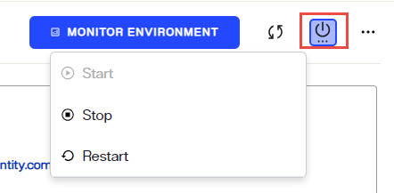

# Starting and Stopping Components and Services

This chapter describes how to start and stop the RadiantOne service and the web server hosting the Control Panels.

## RadiantOne Service

You can restart the RadiantOne service from the [Environment Operations Center](/environment-operations-center-guide/environments/environment-details/environment-overview/). Select the environment and use the options shown when clicking on  to start/stop/restart the service.

## Global Synchronization

Global Synchronization pipelines can be started from the Main Control Panel > Global Syn tab. Select the topology from the list on the left. Click **RESUME** to start synchronization for all pipelines. 

Figure 6.1: Starting Global Sync for All Pipelines in a Topology

If a topology has more than one pipeline, you can start synchronization for each independently. To resume a single pipeline, click CONFIGURE and select the APPLY component. Click RESUME.

 
Figure 6.2: Starting Global Sync for a Specific Pipeline in a Topology

