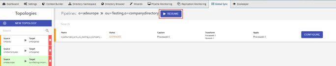
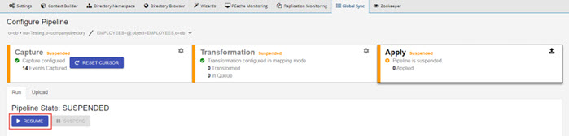
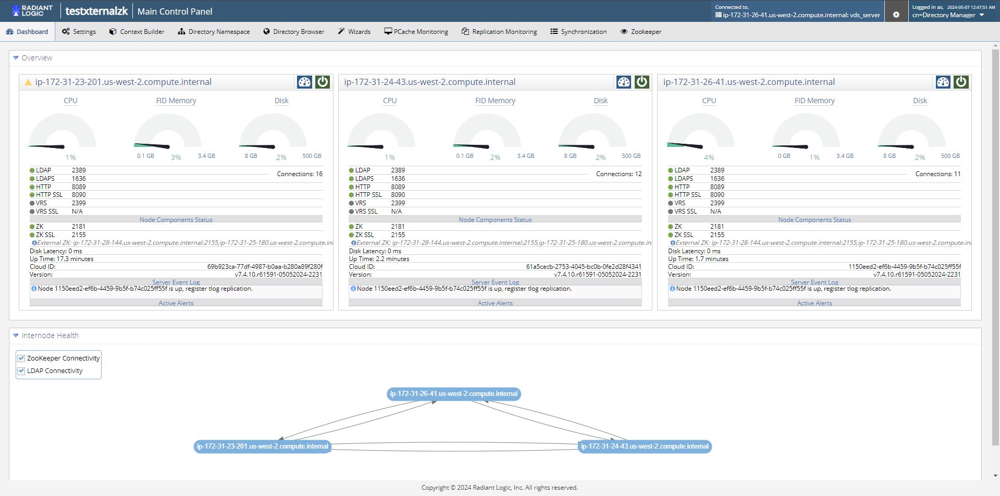

# Starting and Stopping Components and Services

This document covers how to start, stop, restart, and uninstall RadiantOne Identity Data Management and the Jetty web server hosting the Control Panels. It includes details for both Windows and Linux platforms.  

## Starting RadiantOne 

You can start RadiantOne Identity Data Management manually using the Control Panel web application or the included shell scripts. Alternatively, you can configure RadiantOne to run as an operating system service or daemon (Windows/Linux) by following the steps outlined in this document.  
 
We recommend setting up RadiantOne Identity Data Management as an operating system service (Windows service or Linux daemon/service) in production environments to automate its lifecycle (stopping, starting, etc.). 

### Starting via Control Panel

Launch the Control Panel web application and log in with the super user or admin account (default: cn=directory manager or  cn=directory administrators) using the password set during installation. 

From the Dashboard tab, start RadiantOne Identity Data Management by clicking the power button icon, and selecting the “Start” action from the context menu. 

>[!warning]
> Starting RadiantOne from the Dashboard tab will cause it to stop when you log off your device. To keep it running, start RadiantOne as a OS-managed service instead. When it is set up that way, it cannot be started or stopped via the Control Panel. This prevents manual intervention and ensures the service manager alone controls its startup and shutdown. 

### Starting via Shell scripts 

To start RadiantOne Identity Data Management manually, navigate to the bin folder in your RLI_HOME directory and execute the following script:

* `startVDSServer.bat` (on Windows) or `runVDSServer.sh` (on Linux). 

### Starting as a Windows Service 

To start RadiantOne Identity Data Management as a Windows service, follow the steps outlined below. For clustered environments, perform these steps on **each node**.

1. Navigate to the `\bin\windows.service` directory. You will find two batch files:
   - `fid-server-service-install.bat`: Installs RadiantOne Identity Data Management as a Windows service.
   - `fid-server-service-uninstall.bat`: Uninstalls the RadiantOne Identity Data Management Windows service.

2. Execute `fid-server-service-install.bat`.  
   To do this, **right-click the file** and select **Run as administrator**.

3. A command window will appear briefly and then close automatically.

4. Open or refresh the **Services** window.  
   You should now see a new service listed for **RadiantOne Identity Data Management**.

5. Start RadiantOne Identity Data Management using the newly created service.

> Repeat steps 1–5 on all nodes if deployed in a **cluster**, or on all applicable servers in a **classic deployment**.

### Starting as a Linux Daemon 
  
To configure and start RadiantOne Identity Data Management as a Linux service, use either init.d or systemd scripts provided with the installed product. 

* For init.d scripts: 

    ```
    sudo cp $RLI_HOME/bin/rc.d/vds /etc/init.d/ 
    sudo chmod +x /etc/init.d/vds 
    sudo chkconfig --add vds 
    sudo service vds start 
    ps -ef | grep vds  # Confirm RadiantOne runs under the correct user
    ```
      

* For systemd scripts: 

    ```
    sudo cp $RLI_HOME/bin/system.d/vds.service /etc/systemd/system/ 
    sudo systemctl enable vds.service 
    sudo systemctl start vds.service
    ```

## Stopping RadiantOne

### Stopping via Control Panel

Launch the **Control Panel** web application and log in with the super user or admin account  
(default: `cn=directory manager` or `cn=directory administrators`) using the password set during installation.

From the **Dashboard** tab, stop RadiantOne Identity Data Management by clicking the **power button icon**, and selecting the **“Stop”** action from the context menu.

> When RadiantOne Identity Data Management is set up as an **OS-managed service**, it cannot be started or stopped via the Control Panel.  
> This prevents manual intervention and ensures the service manager alone controls its startup and shutdown.


### Stopping the Windows Service

If RadiantOne Identity Data Management is installed as a **Windows service**:

1. Open the **Services** console.
2. Locate the **RadiantOne Identity Data Management** service.
3. Right-click and select **Stop** to stop the service.

### Stopping the Linux Daemon

Use the appropriate command based on your Linux system’s service manager:

* For init.d: `/etc/init.d/vds stop`

* For systemd: `systemctl stop vds.service`
  

## Uninstalling RadiantOne Service 

### Uninstalling Windows Service  

1. [Stop](#stopping-the-windows-service) the RadiantOne Identity Data Management service. 

2. Run the Uninstall script: `%RLI_HOME%\bin\windows.service\fid-server-service-uninstall.bat` 

3. Update ZooKeeper’s asAService Property. Uninstalling the service doesn’t update ZooKeeper, which may cause the Control Panel to incorrectly show service options. To resolve this, select the appropriate option and follow the related steps: 

**Option A: Using the Control Panel** 

1. Switch to Expert Mode. Go to Settings → Server Front End → Advanced. 

2. Uncheck Run as a Windows Service and save. 

3. Restart the Control Panel. 

**Option B: Using Command Line** 

1. Run: `%RLI_HOME%\vds\bin\vdsconfig.bat set-property -name asAService -value false`
 

2. Next, restart the Control Panel. 
 
	 
### Uninstalling Linux Service  

1. [Stop](#stopping-the-linux-daemon) the RadiantOne Identity Data Management service.  

2. Run one of the following scripts (init.d or system.d) depending on your requirements. 

* For init.d: 

   ```
   chkconfig --del vds 
   chkconfig --del control_panel 
   rm /etc/init.d/vds 
   rm /etc/init.d/control_panel 
   ```

* For systemd: 

   ```
   systemctl disable vds.service 
   systemctl disable control_panel.service 
   rm /etc/systemd/system/vds.service 
   rm /etc/systemd/system/control_panel.service 
   ```


## Global Synchronization

Global Synchronization can be started in one of two ways: via the **Main Control Panel** or from the **command line**. Both methods are outlined below.

### Starting via Main Control Panel

1. Navigate to **Main Control Panel > Global Sync** tab.
2. Select the desired topology from the left panel.
3. Click **RESUME** to start synchronization for all pipelines.

   

4. To start synchronization for an individual pipeline:
   - Click **CONFIGURE**
   - Select the **APPLY** component
   - Click **RESUME**

   


### Starting via Shell scripts 

Use the `change-pipeline-state` [command](../../command-line-configuration-guide/21-global-sync-commands/#change-pipeline-state) in the `vdsconfig` utility to start (resume) or stop (suspend) a pipeline:

```
change-pipeline-state -pipelineid <ID> -state <resume|suspend>
```

- Use the `list-topologies` command to find the pipeline ID.
- Set `-state` to `resume` to start synchronization or `suspend` to stop it.


## Control Panel

RadiantOne’s Main Control Panel and Server Control Panel are hosted in a **Jetty web server**. The Server Control Panel is accessible from the **Dashboard** tab in the Main Control Panel.

> In production environments, run Control Panel as a service for reliability and persistence across sessions.

### Starting the Control Panel

#### Starting via Shell scripts

**On Windows**

  ```
  <RLI_HOME>\bin\openControlPanel.bat
  ```

**On Linux**

  ```
  $RLI_HOME/bin/openControlPanel.sh
  ```

> If started manually, Jetty will stop when the user logs off. Use the service approach in production.

#### Starting as a Windows Service

1. Ensure Jetty is not already running:
   - Visit: `http://localhost:7070`
   - If running, stop it:

     ```
     <RLI_HOME>\bin\stopWebAppServer.bat
     ```

2. Go to: `%RLI_HOME%\bin\windows.service`
3. Run `control-panel-service-install.bat` (as Administrator).
4. Verify **RadiantOne FID Management Console** appears in the Services window.
5. Confirm Jetty is running at `http://localhost:7070`.

> If using a different port, use that instead. Repeat these steps on each node in a cluster.

#### Starting as a Linux Daemon

**Using `init.d`:**

```
sudo cp $RLI_HOME/bin/rc.d/control_panel /etc/init.d/
sudo chmod +x /etc/init.d/control_panel
sudo chkconfig --add control_panel
sudo service control_panel start
```

**Using `systemd`:**

```
sudo cp $RLI_HOME/bin/system.d/control_panel.service /etc/systemd/system/
sudo systemctl enable control_panel.service
sudo systemctl start control_panel.service
```

> Repeat on each node if using a cluster.


### Stopping the Control Panel

**On Windows**

- To stop manually via shell script, run:

  ```
  <RLI_HOME>\bin\stopWebAppServer.bat
  ```

- If running as a service, stop **RadiantOne FID Management Console** from the Services window.

**On Linux**

- To stop manually via shell script, run:

  ```
  $RLI_HOME/bin/stopWebAppServer.sh
  ```

- If running as a daemon:

  - `init.d`:

    ```
    sudo service control_panel stop
    ```

  - `systemd`:

    ```
    sudo systemctl stop control_panel.service
    ```


## Restarting RadiantOne Components

Restarts are typically required for maintenance, upgrades, or configuration changes.

### Rolling Restart (Recommended)

Restart nodes **sequentially** to maintain cluster availability.

1. Stop RadiantOne and all components:

   - **On Linux:**

     ```
     $RLI_HOME/vds/bin/advanced/stop_servers.sh
     ```

   - **On Windows:**

     ```
     %RLI_HOME%\vds\bin\advanced\stop_servers.bat
     ```

2. [Start](#starting-the-control-panel) the Control Panel web server.
3. [Start](#starting-radiantone) RadiantOne.
4. Wait for the node to rejoin the cluster before proceeding to the next node.

> If you are using local Zookeeper (Zookeeper included in RadiantOne), it must be running on at least half the nodes.

### Cluster-wide Restart

1. Stop all RadiantOne components on each node:

   - **On Linux:**

     ```
     $RLI_HOME/vds/bin/advanced/stop_servers.sh
     ```

   - **On Windows:**

     ```
     %RLI_HOME%\vds\bin\advanced\stop_servers.bat
     ```

2. [Start](#starting-the-control-panel) web server on all nodes.
3. [Start](#starting-radiantone) RadiantOne on all nodes.
4. Verify all components are running:

   ```
   monitoring.sh -d node-status
   ```

> If successful, the **Dashboard > Overview** section will reflect the updated status.




### Best Practices for Stopping Nodes

While not mandatory, it is recommended when possible to stop the follower nodes first and the leader node last. This approach helps minimize stress on the cluster.

You can identify the leader node by running the following script:

**On Windows**

   ```
   monitoring.bat -d node-monitor | FINDSTR isVdsLeader
   ```

**On Linux** 

   ```
   monitoring.sh -d node-monitor | grep isVdsLeader
   ```

