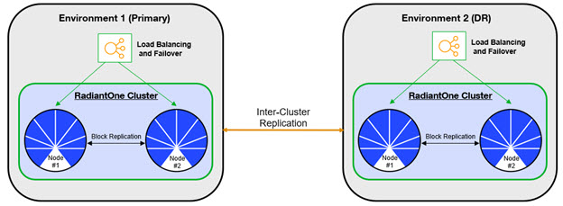
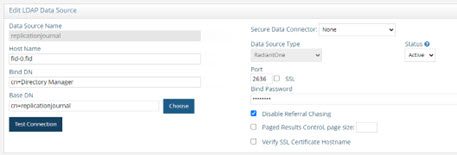
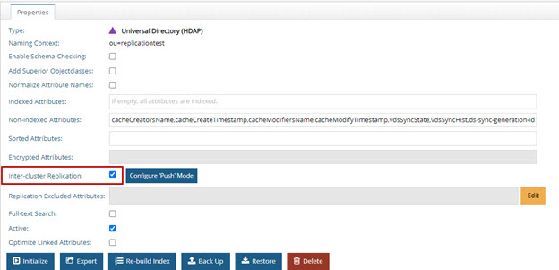

## Overview

Deployment options will be discussed with your Radiant Logic Account Representative and a Solution Consultant.  This chapter provides high-level details about the most common deployment architecture.

For details on creating environments and installing RadiantOne, see the [Environment Operations Center](/environment-operations-center-guide/environments/environment-overview/environments/).

For details on integrating with on-premise data sources through a Secure Data Connector, see the [Secure Data Connector Deployment Guide](/environment-operations-center-guide/secure-data-connectors/data-connectors-overview/).

## Basic Architecture

A basic architecture for a production deployment of the RadiantOne platform consists of two or more environments. One primary cluster/environment and one for disaster recovery (which could be a client-consuming cluster as well, and not just reserved for DR).

 
Figure 7.1: Basic Deployment Architecture

Once the primary and DR environments are created, configure RadiantOne in the primary environment. Then, use the migration tool to export the configuration and import it into the DR environment. Finally, configure inter-cluster replication for all RadiantOne Directory stores that need to be kept in sync across both environments.

>[!note]
>Configuration changes are not automatically synchronized across cluster. These must be manually migrated. 

If the data sources integrated in the RadiantOne platform are accessible in the cloud, no extra components are needed. If the data sources are deployed on-premises or inside a different network than the SaaS service, use a Secure Data Connector. These options are depicted in the diagram below. See the Secure Data Connector Deployment Guide for details.

>[!note]
>Site-to-Site VPN or VPC Peering can be alternatives to using the Secure Data Connector. Speak with your Radiant Logic Solution Consultant about these options.

 
Figure 7.2: Secure Data Connector for Accessing Data Sources in a Different Network

### Inter-cluster Replication for RadiantOne Directory Stores

After RadiantOne is configured in each environment, configure inter-cluster replication for all applicable directory stores.

>[!warning]
>When installing multiple clusters, use different cluster names. Inter-cluster replication relies on the names to identify replication events.  

 
Figure 7.3: Replication Flow within a Cluster (intra-cluster) and Across Cluster (inter-cluster)

Each RadiantOne leader node in the cluster plays the role of a “writer” in the replication and publishes their changes into a journal. Each leader is also responsible for periodically checking the journal for changes that they need to apply locally. Should conflicting change events occur, a combination of timestamps and sequence numbers associated with the conflicting events are used to resolve the conflict.

>[!note]
>On startup, the RadiantOne service first applies any missed change events from the replication journal and only after these changes have been applied is it able to serve as an active server.

A data source named replicationjournal is included in the RadiantOne install and plays the role of the journal. This data source points to the default cn=replicationjournal store installed with RadiantOne and should not be deleted or deactivated. 

The default *replicationjournal* LDAP data source (and cn=replicationjournal naming context) are associated with the default super user account (e.g. cn=Directory Administrator). This user allows access controls checking to be avoided for inter-cluster replication events. If you do not want the super user account associated with the replication journal data source (and inter-cluster replication events), you can set a different Bind DN/user account for the replicationjournal LDAP data source and add this user as a member of the Directory Replicators group. Members of this group have the privilege of by-passing ACI checking when used to establish the connection for inter-cluster replication.

The group entry is located in the RadiantOne namespace at:
cn=Directory Replicators,ou=globalgroups,cn=config

 
Figure 7.17: The Journal Leveraged by Multi-master Replication

To configure multi-master replication for RadiantOne Universal Directory stores, follow the steps below.

Modify the replicationjournal Data Source

For inter-cluster replication, the replicationjournal data source for all clusters must be configured to point to the same journal. For example, if there are three RadiantOne clusters, and the first cluster is where the journal is located, the replicationjournal data source in all other clusters must point to the cn=replicationjournal naming context in the first cluster.

Figure 7. 18: Configuration of Multi-Master Replication

To modify the replicationjournal data source, launch the Main Control Panel associated with the server and login as the super user (e.g. cn=directory manager). From the Settings Tab-> Server Backend section -> LDAP Data Sources sub-section, click the replicationjournal data source and click Edit. Modify the hostname and port to point to the replicationjournal running in site one. The base DN should be cn=replicationjournal.

**Configure the Directory Store in Each Cluster**

The same naming context and Universal Directory store must be configured in each cluster. If the store did not exist prior to the initial migration/cloning of the additional clusters, you must define the store in each cluster with the steps below.

To create a new Universal Directory store:

1.	On one of the RadiantOne nodes, go to the Main Control Panel > Directory Namespace Tab and click  .

2.	Enter the new naming context (e.g. ou=replication_test) and select the Universal Directory (HDAP) Store option. 

3.	Click Next.

4.	Click OK.

5.	Click OK again to close the New Store window.

6.	Repeat these steps on one node in each RadiantOne cluster/environment.

**Initialize the Replicas**

Before enabling replication, all replicas must have the same initial image: either an empty store or an initialized store based on the export of the Universal Directory store at the primary data center. When you export the store on the primary data center, you must have the option “Export for Replication” checked to ensure the uuid attribute is properly included in the export and handled during the import into the replica cluster.

To initialize a replica:

1.	On the RadiantOne primary cluster where the Universal Directory store was exported, go to the Main Control Panel > Settings tab > Configuration > File Manager. Navigate to RLI_HOME/vds_server/ldif/export and download the ldif file that was exported.

2.	On the RadiantOne target (replica) cluster, go to Main Control Panel > Settings tab -> Configuration > File Manager. Navigate to RLI_HOME/vds_server/ldif/import and upload the ldif file that was downloaded from the primary cluster in step 1.

3.	Go to the Main Control Panel > Directory Namespace tab and below the root naming context node click the naming context representing the Universal Directory store.

4.	In the Properties tab on the right, click the Initialize button at the bottom of the screen and choose the “From a file from the server” option as the location for the LDIF you want to initialize your store with. Select the LDIF file that you uploaded in step 2.

5.	Click OK and the initialization is launched as a Task which can be viewed from the Sever Control Panel > Tasks tab. Once the task completes, the store is initialized.

6.	Repeat these steps on all other RadiantOne clusters in the needed environments.

**Enable Inter-cluster Replication**

After the Universal Directory stores are initialized in each cluster, inter-cluster replication must be enabled. 

To enable inter-cluster replication for a Universal Directory store:

1.	On one of the RadiantOne clusters, go to the Main Control Panel > Directory Namespace tab and below the root naming context node click the naming context representing the Universal Directory store.

2.	On the Properties tab on the right, check the box for Inter-cluster Replication as shown in the screenshot below. 

Figure 7. 19: Enabling a Universal Directory Store for Inter-Cluster Replication

3.	Click Save.

4.	Repeat these steps on one RadiantOne node in each cluster.

>[!note]
>Monitor inter-cluster replication from Main Control Panel > Replication Monitoring tab.

>[!warning]
>It is recommended to NOT start the persistent cache refresh process on the primary cluster until you have the Universal Directory stores in the new cluster(s) properly setup (as exact replicas of the persistent cache). This ensures the stores will have the current image of the persistent cache from the primary cluster initially and no changes are logged into the replication journal yet for this “domain” (naming context).
