# Chapter 7: Deployment Architectures

Deployment guidelines:

1.	Determine the architecture to deploy in production and perform the installation. The most common architectures are described in this chapter.

2.	Migrate your tested configuration from Development/QA to production. This is detailed in the Migration to Production section.

3.	Make additional configuration to your production machine as needed.

4.	Deploy additional clusters as needed (different sites/data centers). 

>[!warning] Although variants are possible, below are the most deployed architectures. If you would like to discuss an alternative approach that you think would meet your needs, please contact support@radiantlogic.com.

## Basic Architecture

A basic architecture for the RadiantOne platform consists of a ZooKeeper ensemble of at least 3 nodes and a RadiantOne cluster consisting of at least 2 nodes. This is the basic architecture that should be deployed in each data center. To install this basic architecture in production, follow the steps in the RadiantOne External Zookeeper Install Guide. Once the ZooKeeper ensemble is installed, follow the steps in the RadiantOne Installation Guide to setup the RadiantOne cluster nodes. 

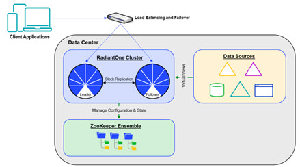
 
Figure 7.1: Basic Deployment Architecture

### Configuration

During the installation of the first RadiantOne node, the cluster name is defined. After this node is installed and configured as needed (e.g. virtual views, persistent cache, global synchronization, Universal Directory stores…etc.), additional RadiantOne nodes can be installed on other machines. During the install of additional nodes, they can join the existing cluster and benefit from the current configuration and get a replica of the data (Universal Directory stores and persistent cache). The configuration management and allocation of which node becomes the new [RadiantOne leader](#the-radiantone-service) (should the current leader node fail) is handled automatically by ZooKeeper. Configuration changes made on any of the nodes are shared across all nodes in the cluster. For more details, see the RadiantOne Installation Guide.

Any new Universal Directory stores or persistent caches that have been initialized on the leader node are automatically replicated out to all follower and follower-only nodes in the cluster. Replication across cluster nodes is based on a binary copy of data files across the cluster's nodes (from leader to followers/followers-only). Every time a Universal Directory store or persistent cache is modified on the leader, new segments are created leaving existing ones untouched. The RadiantOne followers/follower-only copy the new binary files locally to update their image.

When a new follower/follower-only joins a cluster, a full copy of each persistent cache is done when the RadiantOne service starts. This operation leverages the Admin HTTP Service configured for the embedded web server in RadiantOne. The Admin HTTP ports can be seen on the Main Control Panel > Settings Tab > Server Front End section > Administration sub-section (requires [Expert Mode](00-preface#expert-mode)).

>[!warning] The HTTP port should never be turned off as it is used by the replication process that keeps data synchronized and some configuration files synchronized across all nodes in a given cluster.

All naming contexts that are defined as a Universal Directory store are automatically configured for replication across the cluster nodes. The following default stores are used internally by RadiantOne and automatically replicated across all cluster nodes:

cn=config
cn=changelog
cn=cacherefreshlog
cn=extendedxjoin
cn=queue
cn=dlqueue
cn=localjournal
cn=replicationjournal
cn=system-registry
cn=registry

### The RadiantOne Service
Within a cluster, the nodes are designated as “leader” or “follower” and the status of each node is registered in [ZooKeeper](#zookeeper). There is only one leader node and one or more follower nodes at any given time.

The RadiantOne cluster supports read and write operations from clients. All write operations received by nodes designated as “followers” are redirected to the designated “leader” node. The changes are made on the leader node and then replicated out to the follower nodes. This is depicted in the diagram below.

>[!note] The leader node is responsible for handling all write operations from clients and all persistent cache refresh (periodic or real-time) operations.


 
Figure 7.2: Replication Flow within a Cluster

**High Availability**

To ensure your federated identity service is highly available for client applications, deploy two or more RadiantOne nodes in addition to a hardware load balancer to distribute load and handle failover for these servers. These nodes can be Active/Active or Active/Passive as this is dictated by the load balancer.

The layer between RadiantOne and the backend data sources should also be taken into consideration as it could affect the availability of the RadiantOne service. Your backend sources should be highly available. When configuring the backend data source, indicate a failover server(s) for that specific back-end.


 
Figure 7.3: Layer Between RadiantOne and Backend Sources
An example of configuring failover servers for LDAP servers is shown below.


 
Figure 7.4: Example of LDAP Backend Data Source with Failover

**Fault Tolerance and Recovery**

A load balancer distributes the client load across all RadiantOne nodes. If one of the RadiantOne service fails, or the entire machine fails, clients are automatically redirected to the other node(s) via the hardware router. This possible failure is depicted in the diagram below.

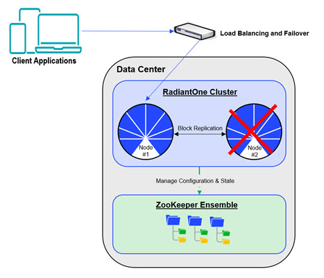

Figure 7.5: RadiantOne Service Failure

It is recommended that you use external monitoring with something like Nagios (a 3rd party tool) to be notified of machine level failures. If only the RadiantOne process fails on the machine, the administrator can be alerted via email by leveraging the RadiantOne monitoring capabilities. For details on monitoring RadiantOne, please see the RadiantOne Monitoring and Reporting Guide.

The administrator should troubleshoot the failure and restart the RadiantOne service. Once the process has restarted, it automatically connects to the leader node and picks up all data changes (Universal Directory stores or persistent cache) that occurred while it was down (via block replication). The hardware router should failback and again distribute the client load accordingly.

If the RadiantOne service failed on the leader node, a new node takes over as leader and registers in ZooKeeper. For persistent cache, the refresh process only runs on the leader node. Therefore, when a RadiantOne leader node fails, a new node takes over managing the persistent cache refresh process. This is depicted in the diagram below.


 
Figure 7.6: Change in RadiantOne Leader Node

>[!note] Once the failed RadiantOne service is back up on this node, it does not automatically become the leader again. It remains a follower node and connects to the current leader node to retrieve data changes (Universal Directory or persistent cache) that occurred while it was down.

If the machine is not able to be restarted and/or the RadiantOne processes won’t start, the administrator can install RadiantOne on another machine and have it join the cluster (during the install configuration, you define this). All cluster installation steps are described in the RadiantOne Installation Guide. Once this new machine starts up, the new RadiantOne node pulls the data from the current leader node automatically. The failed node that is unable to be recovered can be manually removed from the cluster configuration. Please see the RadiantOne Operations Guide for details.

### ZooKeeper

A RadiantOne cluster is managed by ZooKeeper which is a centralized service for maintaining configuration information. A server configuration change made on any of the RadiantOne nodes in the cluster is automatically shared across all nodes. In addition, ZooKeeper manages the RadiantOne nodes in regard to which is the leader and which are the follower nodes. Should the RadiantOne leader node fail, one of the other core nodes takes over and registers in ZooKeeper as the new leader.

**High Availability**

In production, to ensure high availability, the ZooKeeper service is deployed in an ensemble of at least 3 nodes, which is external to the RadiantOne cluster. With a 3-node ensemble, the ensemble can support the failure of one ZooKeeper process/machine. With a 5-node ensemble, two ZooKeeper processes/machine failures are supported. When ZooKeeper loses contact with over half of the other ZooKeeper servers in the ensemble, it enters a read-only mode. This is the default behavior and allows the RadiantOne service to continue to process search operations even when the ZooKeeper quorum is lost. However, the RadiantOne service will deny any write operations by returning LDAP error code 53: Unwilling to Perform to the client. Also, no configuration changes can be made while ZooKeeper is in this state. Administrators cannot login to the Control Panel during this time. If an administrator is logged into the Control Panel when ZooKeeper enters read-only mode, a warning message appears at the top and no configuration changes are allowed. To recover from read-only mode, make sure ZooKeeper is restarted on over half of the cluster nodes. Once the quorum is re-established, the RadiantOne cluster recovers automatically.

As an alternative to the default read-only mode, ZooKeeper can be configured for SHUTDOWN mode when the quorum is lost. In this case, the RadiantOne service on all cluster nodes shuts down. This might be preferable if multiple clusters are deployed because the load balancer in front of the cluster nodes (that are in READ_ONLY state due to ZooKeeper failures) will detect that no RadiantOne services are available and failover to another cluster/site. To configure this behavior, set the onZkWriteLossVdsServerBehavior to a value of SHUTDOWN. This can be set from the Main Control Panel -> Zookeeper tab (requires [Expert Mode](00-preface#expert-mode)). From the Zookeeper tab, navigate to /radiantone/<version>/<cluster_name>/config/vds_server.conf and click **Edit Mode**. Locate the “onZkWriteLossVdsServerBehavior” property and replace the default value (READ_ONLY) with SHUTDOWN. If the property is not listed, add it. Make sure the value is followed by a comma unless it is the last property in the list.

```
"onZkWriteLossVdsServerBehavior" : "SHUTDOWN",
```

This property can also be updated via command line using the vdsconfig utility:

vdsconfig.sh set-property -name onZkWriteLossVdsServerBehavior -value SHUTDOWN

For more information on this utility, see the RadiantOne Command Line Configuration Guide.

**Fault Tolerance and Recovery**

If a ZooKeeper process or entire machine fails, clients are unaffected as they do not connect to ZooKeeper. The ZooKeeper ensemble (consisting of the other two nodes) maintains the integrity of the cluster. The cluster is still maintained, but in a fragile state and couldn’t support the failure of another ZooKeeper process without compromising the cluster configuration integrity.


 
Figure 7.7: ZooKeeper Process Fails

The Dashboard tab in the Main Control Panel indicates if the ZooKeeper process is down. Other external monitoring techniques are also available. Please see the RadiantOne Monitoring and Reporting Guide for details. An administrator should troubleshoot the failure and restart ZooKeeper. ZooKeeper can be restarted with <RLI_HOME>/bin/runZooKeeper.bat (runZooKeeper.sh on UNIX platforms). Once the ZooKeeper process is back up, it synchronizes the configuration state maintained in the ensemble. If the ZooKeeper service and/or the machine won’t restart, a new machine/ZooKeeper server should be added to the ensemble to maintain the 3-node minimum. 

>[!note] For complete machine failure notifications, use something like Nagios, which is a 3rd party tool, not included with RadiantOne.

## Migration to Production

This section describes the process of moving your current configuration into a clean, new target production environment only. After the first migration, you should keep the production environment updated with configuration changes by following the steps detailed in the RadiantOne Operations Guide.

As you migrate from a development environment to QA and finally to production, the following items should be considered.

1.	Installing RadiantOne (same exact version/buildID or newer version used in the environment you are migrating from is required).

2.	Migrating Configuration Files

3.	(Optional) If the target RadiantOne version is newer, manually copy the custom project folder to the target machine and rebuild the jar files. If the target RadiantOne version is the exact same version/buildID as the source machine, the custom project is migrated automatically.

4.	Managing Server Certificates

5.	Installing Servers to Run as Services

6.	Modifying Connection Strings

7.	Changing Log levels

8.	Reviewing Interception Scripts

9.	Increasing RadiantOne Memory

10.	Configuring and Initializing Persistent Cache

11.	Configuring Monitoring

12.	(Optional) Configuring Inter-Cluster Replication.

13.	(Optional) If Global Identity Builder is used, perform an upload of identities into the global profile and configure persistent cache. See RadiantOne Global Identity Builder Guide.

14.	(Optional) Enabling FIPS Mode. See RadiantOne FIPS Mode Guide.

15.	(Optional) Configure multiple instances of RadiantOne.

Each step is described in more details below.

### Installing RadiantOne

Install RadiantOne on the first production machine. All machines must have either the same version/build ID (or a newer patch release), and the same port settings that were used in the development/QA environment that you are migrating from. The ports can be updated in the target environment after migration if needed. Do not try to upgrade the RadiantOne version (e.g. moving from v7.3 to v7.4) when migrating to production. 

>[!note] the admin passwords for the RadiantOne administrator (e.g. cn=directory manager), and ZooKeeper administrator that were defined during installation are not impacted in the migration of configuration. The passwords that were defined in the target environment are not overwritten when the configuration is imported.

Typically, you should plan on having between 2-5 RadiantOne servers running in a production cluster. After installing the first RadiantOne node, import the configuration from the QA environment onto this node. Steps for this are detailed in [Migrating Configuration](#migrating-configuration---migration-utility) section. Then, proceed to install the other nodes of the cluster. This way they automatically inherit the configuration.

During the install, the first RadiantOne node establishes the cluster name. Then, when installing additional nodes, they join the existing cluster.

>[!warning] To ensure proper access permissions are used, the same operating system user account name should be used to install RadiantOne on all machines playing a role in migration. For example, on Windows platforms, an Administrator account must install RadiantOne on all machines. Then, during migration, launch the Migration Utility as this user. On Linux platforms, the user account used to launch the Migration Utility should be the one that installed RadiantOne.

### Migrating Configuration - Migration Utility

The RadiantOne configuration is stored in various files which makes the task of manual migration a painful and error prone process. The Migration Utility automates the process of moving the configuration files from one RadiantOne machine/cluster to another. The configuration can be exported from one machine/cluster and imported into another. The export needs to happen on only one node in a cluster (as all nodes share the same config) and only needs to be imported on one node in the cluster of the new environment.

After installing RadiantOne on the production machine, migrate the configuration files from Development/QA.
To use the migration utility to export the configuration from the Development/QA server and import it into the production machine, follow the steps below which are sufficient for most cases. If you want greater granularity over what data and virtual views are migrated, you can customize the migration plan. For details on customizing the migration plan, see the RadiantOne Migration Utility Guide.

1.	Download the latest migration utility (at least v2.1) from the Radiant Logic support site and unzip it on both the source machine (from where you are exporting) and the target machine (where you plan on importing). Contact Support (support@radiantlogic.com) for credentials and location of the Migration Utility.

2.	On the Development/QA machine, lock configuration changes to ensure no changes are being made while the configuration is exported. Log into the Main Control Panel as a directory administrator and go to Settings tab -> Configuration -> Configuration Lock and toggle the option to the Locked position. Click Save.

3.	On the primary/source machine, from a command prompt navigate to the location where you unzipped the migration utility.

4.	Run the following command (modifying the version of the migration tool and the location of the export file to match your needs):
C:\r1\migration\radiantone-migration-tool-2.1.0\migrate.bat export C:/tmp/export.zip

5.	Copy the export file to the production machine and with the RadiantOne services stopped (all except for ZooKeeper), from a cmd prompt, run the import command (assuming you saved the exported file to C:/tmp on the target production machine).

	>[!warning] ensure all RadiantOne services EXCEPT ZooKeeper are stopped on the target machine prior to importing. ZooKeeper servers in the ensemble must be running prior to importing.

```
C:\r1\migration\radiantone-migration-tool-2.1.0\migrate.bat import C:\tmp\export.zip cross-environment
```

6.	After the import, start the needed RadiantOne services on the new machine.

7.	On the Development/QA machine remove the lock on configuration changes. Log into the Main Control Panel as a directory administrator and you are prompted to unlock the configuration. Click Unlock.

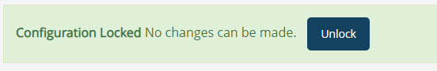
 
Figure 7.8: Prompt for Configuration Unlock

**Logs**

If there are problems with the export or import, check the migration log files located at `<Migration_Utility_Home>/logs/migration-tool-<version>.<timestamp>`.log.

### (Optional) Migrate Custom Project

If the target RadiantOne minor/patch version is newer than the one on the Dev/QA machine, manually copy the custom project folder to the target machine and rebuild the jar files. If the target RadiantOne version is the exact same version/buildID as the source machine, the custom project is migrated automatically.

To migrate the custom project, which includes custom data sources, and interception scripts, copy <RLI_HOME>\vds_server\custom from the Dev/QA environment and overwrite the <RLI_HOME>\vds_server\custom folder on the target production machine. Then, rebuild the jar files on the production machine using the ANT task described below (for simplicity, most of the output of the script has been excluded below).

C:\radiantone\vds\vds_server\custom>c:\radiantone\vds\ant\bin\ant.bat buildjars 
Buildfile: build.xml 
.
.
.
[propertyfile] Creating new property file: C:\radiantone\vds\vds_server\custom\build.txt 
buildjars: 
[jar] Building jar: C:\radiantone\vds\vds_server\custom\lib\customobjects.jar
[jar] Building jar: C:\radiantone\vds\vds_server\custom\lib\intercept.jar 
[jar] Building jar: C:\radiantone\vds\vds_server\custom\lib\fidsync.jar 
[jar] Building jar: C:\radiantone\vds\vds_server\custom\lib\changeMessageConvertors.jar 
BUILD SUCCESSFUL 
Total time: 9 seconds

### Managing Server Certificates

If you are using CA-signed server certificate for the RadiantOne service, the Migration Tool cannot generate new ones for the target machine. New certificates must be configured manually if you do not want the server to use the certificate defined during the install. For steps on configuring and installing server SSL/TLS certificates, please see the RadiantOne System Admin Guide.

### Installing Servers to Run as Services

The Migration Tool does not install (or uninstall) the Init Script or Windows Service for you. This operation requires manual configuration. For steps on configuring and installing the RadiantOne services to startup automatically, see [Starting and Stopping Components](06-starting-and-stopping-components-and-services).

### Modifying Data Source Connection Strings

Data sources store connection strings that are required for RadiantOne to establish a connection to the backend. Typically, the backend data sources in a development/QA environment are different servers than are in the production environment. Therefore, the connection strings need to be changed as you migrate to production. 

>[!warning] one purpose of having a data source defining the connection is to isolate the connection string from the metadata files (.dvx and .orx). It is strongly recommended that you use generic data source names that can remain (be relevant) as you migrate from a development to production environment where you only need to change the connection information.

Data sources can be edited from the Main Control Panel or from the command line using the vdsconfig utility. Using the Main Control Panel is described below. For information on using the vdsconfig utility, please see the RadiantOne Command Line Configuration Guide.

**Main Control Panel**

Data sources can be edited from the Main Control Panel -> Settings Tab -> Server Backend section. Select the relevant sub-section (LDAP, Database or Custom Data Sources) and select the data source on the right side. Select the data source and click EDIT. Update the data source and click Save.

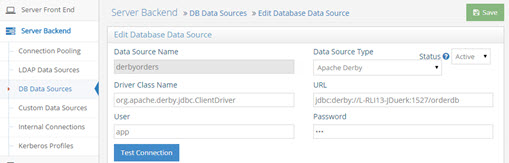

Figure 7.9: Example - Editing a Database Data Source

### Changing Log levels

For production environments, typically log levels are reduced to avoid unnecessary verbose logging. Log levels can be modified from the Main Control Panel -> Settings tab -> Logs section.


Figure 7.10: Changing Log Levels to Improve Performance

### Reviewing Interception Scripts

Interception scripts are powerful and offer a lot of flexibility. However, this logic is executed inside the RadiantOne process, so caution should be taken to ensure no undesirable affects. It is highly recommended that if you choose to write your own interception logic that you get it approved by Radiant Logic prior to deploying it in production.

## Setting the Java Virtual Memory Size for the RadiantOne Service

Often, the memory requirements of the RadiantOne service are larger in production environments than for Development/QA environments. If this is the case, you can increase the memory size. By default, the memory allocated to the RadiantOne JVM process expands up to ¼ of the machine memory. For example, if the machine memory is 16 GB, then the JVM process expands to up to 4 GB. Once the memory requirements are known for your deployment, ensure the minimum and maximum memory allocations are the same to prevent the heavy process of heap resizing at runtime. To define a minimum and maximum JVM heap memory size, you can define it with the -Xms and -Xmx settings as described below.

>[!warning] It is recommended to keep the maximum memory (-Xmx) under 32 GB to ensure the JVM uses compressed OOPs as a performance enhancement. If this is exceeded, the pointers switch to ordinary object pointers which grow in size, are more CPU-intensive and less efficient. Also, -Xms and -Xmx should be set to the same value to help avoid the performance-costly process of garbage collection from happening too frequently.

>[!warning]For RadiantOne deployments involving only Universal Directory stores, you can set maximum memory limits to leave more machine memory available for the store. A -Xmx of 2 GB allocated to the RadiantOne process is often enough to support a Universal Directory store containing 10 million entries.

**On Windows Platforms**
If you run the RadiantOne service as a Windows Service or from the Main Control Panel (Dashboard tab), increase the JVM size in the %RLI_HOME%/bin/VDSServer.config file. To define a minimum memory size, edit or insert a line containing the -Xms setting. The following example sets the minimum to 1 GB.

```
vmparam –Xms1024m
```

To define a maximum memory size, edit or insert a line containing the -Xmx setting. The following example sets the maximum to 2 GB.

```
vmparam –Xmx2048m
```

**On Linux Platforms**

Edit the runVDSServer.sh file before running and change the -Xms and -Xmx settings. The following examples set the minimum and maximum to 2 GB.
-Xms2048m 
-Xmx2048m

### Reconfiguring Persistent Cache 

If you have decided to configure a persistent cache from your underlying data sources, you must reconfigure and reinitialize the cache in your production environment (or every time you move through environments where the data set is different). As you migrate your files to production, the data stored in the persistent cache may become irrelevant because the information stored in the cache is development/QA data (which may not be the same as production data). 

>[!note] if you are using a persistent cache with periodic refresh, you do not need to reconfigure the periodic refresh in the target environment. Only a reinitialization of the data is needed in the target environment. If you are using a persistent cache with real-time refresh, you need to reconfigure and reinitialize the data in the target environment.

To configure a persistent cache:

1.	From the Main Control Panel -> Directory Namespace tab, click the cache node and select the branch to configure as persistent cache. Complete the steps to configure the branch as cache.

2.	Expand below the Cache node and click the persistent cache branch you want to initialize. 

3.	On the Refresh Settings tab, configure the refresh type.

4.	Click the Initialize button.

5.	Choose to either initialize the cache by creating an LDIF file or from an existing LDIF file. Typically, you would always use the default option which is to create an LDIF file. The only time you will choose to use an existing file is if you already have an up to date LDIF file containing all of the needed entries.

6.	Click OK. A task is launched to initialize the persistent cache. The task can be monitored and managed from the Server Control Panel > Tasks tab (of the RadiantOne leader node).

7.	After initializing, click **Save** in the upper right corner and click **OK** to apply the changes to the server.

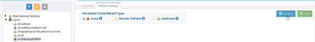
 
Figure 7.11: Initializing Persistent Cache

If you are initializing large numbers of entries, the memory required to process this task increases. By default, the memory allocated to the task expands up to ¼ of the machine memory. For example, if the machine memory is 16 GB, the memory of the task expands to 4 GB. If you would prefer to control the maximum amount of memory allocated for the task, you can define it at the level of the JVM. To do this, click  next to the task and add in the JVM parameters an -Xmx value that accommodates your cache size.


 
Figure 7.12 JVM Parameters for a Task

### Configuring Monitoring 

It is essential to configure monitoring and alerts for production environments. Although there are many different aspects of RadiantOne that can be monitored, memory and disk space are two of the most important. Monitoring can also be extremely helpful in determining how to properly tune your RadiantOne environment. For example, paying close attention to how disk space and memory are growing during the first week of deployment in production can help to put in place the right archiving and memory allocations.

For details on monitoring, please see the RadiantOne Monitoring and Reporting Guide.

### (Optional) Configuring Inter-Cluster Replication 

If you have multiple data centers/sites in production, configure inter-cluster replication for all needed Universal Directory stores and/or persistent caches. 

### (Optional) Performing Upload in Global Identity Builder 

If the Global Identity Builder was used in the Dev/QA environment, perform an upload of identities into the global profile and configure persistent cache in the production environment. See the RadiantOne Global Identity Builder Guide for steps to upload identities and configure persistent cache.

### (Optional) Enabling FIPS Mode

FIPS Mode settings are not migrated with the migration utility. To enable FIPS Mode in production, see the RadiantOne FIPS Mode Guide.

### (Optional) Configuring Instance Subclusters of RadiantOne

>[!note] As of RadiantOne v7.4.2, instances are no longer created and deleted via the Main Control Panel. Instead, they are now installed and uninstalled using the RadiantOne Instance Manager utility. For details on installing Instances, see the RadiantOne Installation Guide.

RadiantOne instance subclusters are used to address a very small set of use cases:

-	RadiantOne virtualizing (by proxy) two different directory backends that contain the exact same root naming context (but different hierarchies). With a proxy virtualization approach, a single root naming context in RadiantOne can only connect to one backend directory (mounted at the root), and you can’t have the same root naming context represent two different virtual views. 

-	RadiantOne must enforce different global properties (e.g. require mutual authentication) per client application.

#### Managing RadiantOne Instances

Instances of RadiantOne can be managed from the Main Control Panel or the Instance Manager command line utility. Both options are described in this section. For information on installing RadiantOne instance subclusters, refer to the Installation Guide.

##### RadiantOne Main Control Panel

The Main Control Panel  Clusters tab allows you to view subclusters.

Once a new instance subcluster is defined, you can click on the Open link to launch the Control Panel for that instance. Since instances do not benefit from shared configuration with the main cluster, they must each be managed individually. Launch the Control Panel associated with the instance to configure the subcluster.

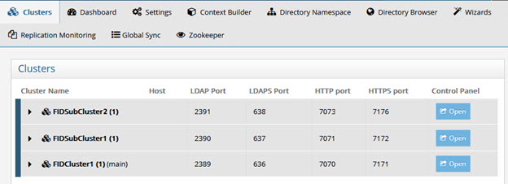

Figure 7.13: The Main Control Panel’s Clusters Tab

##### RadiantOne Instance Manager Command Line Utility

The InstanceManager command line utility can be used to:
-	Update an existing instance

-	Delete an existing instance

-	Change the RadiantOne FID directory manager password 

To start the InstanceManager, from a command prompt, navigate to <RLI_HOME>/bin and execute instancemanager. You are prompted with the options as follows:

Usage: InstanceManager {-u -d} -n `<instanceName> -D <manager dn> {-w <manager password> -W <encoded manager password>} -p [ldap port] -S <ssl_port> -T -F <server_cert> 
-t <server_cert_type> -P <server_cert_password> -Q <cert encoded password> -a <cert alias> 
-k <sched port> --vds-http-port <port> --vds-https-port <port> --vds-admin-http-port <port> 
--vds-admin-https-port <port> -l <http port> -o <https port> -Z <ZK connection string> 
-C <cluster name> --main-cluster <cluster name> -V <true/false> -L <ZK leader port> - M <ZK ensemble port> -N <ZK client port> --zk-jmx-port <port> -r <true/false> -U <true/false> 
--zk-login <zk login> --zk-password <zk password> --zk-password-encoded <zk encoded password> -h <hostname> -j <jre path> -H <instance directory> -s --setup-install <properties file path>`

Command arguments:

>[!note] Some command arguments have both long and short options, whereas some arguments have only a long option. If an argument has both a long and short option, this section lists only the short option. If a long option is listed, no short option exists for the argument.

Options:

-u: Update an existing instance.
-d: Delete an existing instance.
-n: Name of the instances.
-D: Manager DN (root user) for the instance.
-w: Password for the manager DN.
-W: Encoded password for the manager DN.
-p: LDAP port of the instance.
-S: This is the SSL port number on which the server is supposed to listen.
-T: Is start TLS extension enabled?
-F: Specify the location of the keystore.
-t: Specify the type of the keystore for the server certificate.
-P: The password associated with your certificate when it was generated.
-Q: The encoded certificate password.
-a: The certificate alias.
-k: The scheduler port.
--vds-http-port: The RadiantOne instance HTTP port.
--vds-https-port: The RadiantOne instance HTTPS port.
--vds-admin-http-port: The RadiantOne instance Admin service HTTP port.
--vds-admin-https-port: The RadiantOne instance Admin service HTTPS port.
-l: The Control Panel HTTP port.
-o: The Control Panel HTTPS port.
-Z: The ZooKeeper connection string.
-C: The cluster name.
--main-cluster: Main cluster.
-V: Use local ZooKeeper?
-L: The ZooKeeper leader election port.
-M: The ZooKeeper ensemble port.
-N: The ZooKeeper client local port.
--zk-jmx-port: The ZooKeeper JMX port.
-r: Follower only?
-U: Remote read-only?
--zk-login: The ZooKeeper login.
--zk-password: The ZooKeeper password.
--zk-password-encoded: The encoded ZooKeeper password.
-h: Host Name (use to change the host name)
-j: JRE path
-H: Home directory for the instance
-s: Install as a service (only for Windows)
--setup-install: Installation setup from properties file 

When updating an instance, you would pass -u -n newvdsinstance with new user ID, new password, or new port. If you don’t want to change one of the parameters (-D, -w, or -p), then just enter the current value. 

>[!note] if you want to change the port of the instance, you must stop the RadiantOne service before running the update command.

For example, to change the port for newvdsinstance, make sure that the RadiantOne instance is stopped and then use the following to change the port to 6389:

```
C:\radiantone\vds\bin>instancemanager -u -n newvdsinstance -p 6389 -D "cn=directory manager” -w secret
```

When deleting an instance, you would pass -d -n <name of instance>. For example, to delete newvdsinstance use:

```
C:\radiantone\vds\bin>instancemanager -d -n newvdsinstance
```

### Manually Keep Configuration Synchronized

When RadiantOne is deployed in a classic active/active or active/passive architecture, and not deployed in a cluster, configuration changes (e.g. server settings, new views…etc.) are not automatically shared/synchronized across all servers. Every time changes are made to one production server, they must be made on the other production servers. Refer to the RadiantOne Operations Guide, section titled: Migrating Configuration Changes across Existing Environments for details.

## Multiple Clusters/Data Centers

When deploying RadiantOne in multiple data centers, each data center is configured as its own cluster (set of clusters). RadiantOne Universal Directory stores in each cluster should be configured for inter-cluster replication. Persistent cache architectures must be configured appropriately depending on whether the authoritative backends are accessible by all sites/data centers. These topics are discussed in this section.

Although data (Universal Directory stores or persistent cache) can be replicated across clusters, configuration changes are not. Configuration changes must be manually migrated every time a change is made in the primary data center. Refer to the RadiantOne Operations Guide, section titled: Migrating Configuration Changes across Existing Environments for details.

### Inter-cluster Replication for Universal Directory Stores

Configure the [basic architecture](#basic-architecture) in each data center. Then, configure inter-cluster replication for all applicable Universal Directory stores.

>[!warning] When installing multiple clusters, use different cluster names. Inter-cluster replication relies on the names to identify replication events.

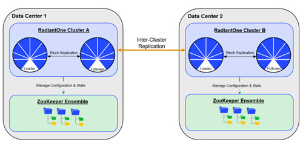

Figure 7.14: Inter-cluster Replication

Each RadiantOne leader node plays the role of a “writer” in the replication and publishes their changes into a journal. Each leader is also responsible for periodically checking the journal for changes that they need to apply locally. Should conflicting change events occur, a combination of timestamps and sequence numbers associated with the conflicting events are used to resolve the conflict.

>[!note] on startup, the RadiantOne service first applies any missed change events from the replication journal and only after these changes have been applied is it able to serve as an active server.

RadiantOne Universal Directory stores also support subtree replication architectures. A main cluster is configured for and maintains the image for all replicas and houses the replication journal. Each replica can be a subset of containers from the main image. An example is depicted in the diagram below where Cluster 1 maintains the global namespace and Cluster 2 is a replica of the ou=Site1 subtree and Cluster 3 is a replica of the ou=Site2 subtree.

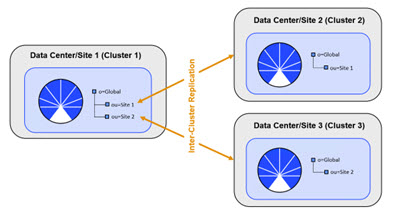
 
Figure 7.15: Subtree Replication

The main cluster may also contain subtrees that are not replicated to any other clusters. An example is depicted in Figure 7.16 below where Cluster 1 maintains the global namespace and Cluster 2 is a replica of the ou=Site1 subtree and Cluster 3 is a replica of the ou=Site2 subtree. Subtrees ou=local and ou=temp are not replicated. To indicate the subtrees to be replicated, navigate to the Main Control Panel -> Zookeeper tab and browse to /radiantone/<version>/<cluster_name>/config/namings/<root_naming_context>. Click Edit Mode and edit the replicationSubtreeDomains property to indicate a comma-separated list of subtrees that should be replicated. Any subtrees not in this list are not replicated across clusters. The example shown below indicates that ou=Site1 and ou=Site2 should be replicated across clusters.
"replicationSubtreeDomains" : [ "ou=Site1,o=global", "ou=Site2,o=global" ]


 
Figure 7.16: Configure Replication for Specific Subtrees

A data source named replicationjournal is included in the RadiantOne install and plays the role of the journal. This data source points to the default cn=replicationjournal store installed with RadiantOne and should not be deleted or deactivated.


 
Figure 7.17: The Journal Leveraged by Multi-master Replication

To configure multi-master replication for RadiantOne Universal Directory stores, follow the steps below.

#### Modify the replicationjournal Data Source

For inter-cluster replication, the replicationjournal data source for all clusters must be configured to point to the same journal. For example, if there are three RadiantOne clusters, and the first cluster is where the journal is located, the replicationjournal data source in all other clusters must point to the cn=replicationjournal naming context in the first cluster.

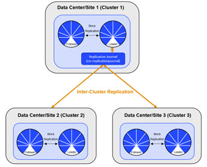
 
Figure 7.18: Configuration of Multi-Master Replication

To modify the replicationjournal data source, launch the Main Control Panel associated with the server and login as the super user (e.g. cn=directory manager). From the Settings Tab-> Server Backend section -> LDAP Data Sources sub-section, click the replicationjournal data source and click Edit. Modify the hostname and port to point to the replicationjournal running in site one. The base DN should be cn=replicationjournal.

>[!warning] Make sure the port used in the replicationjournal settings can be accessed from all servers and that firewall rules do not prevent the servers from reading and writing into the replication journal.

><span style="color:red">**If your architecture uses subtree replication, the replication journal must be hosted on the main cluster that is configured for and maintains the image for all replicas.**

#### Configure the Universal Directory Store in Each Cluster

The same naming context and Universal Directory store must be configured in each cluster. If the store did not exist prior to the initial migration/cloning of the additional clusters, you must define the store in each cluster with the steps below.

To create a new Universal Directory store:
1.	On one of the RadiantOne nodes, go to the Main Control Panel > Directory Namespace Tab and click .

2.	Enter the new naming context (e.g. ou=replication_test) and select the Universal Directory (HDAP) Store option. 

3.	Click **Next**.

4.	Click **OK**.

5.	Click **OK** again to close the New Store window.

6.	Repeat these steps on one node in each RadiantOne cluster.

#### Initialize the Replicas

Before enabling replication, all replicas must have the same initial image: either an empty store or an initialized store based on the export of the Universal Directory store at the primary data center. When you export the store on the primary data center, you must have the option “Export for Replication” checked. If you want to use fractional replication, make sure you set the excluded attributes (that you don’t want replicated) in the “Replication Excluded Attributes” property. When you export the store from the primary data center, the LDIF file will not have the excluded attributes in it. For more details on fractional replication, see the RadiantOne Namespace Configuration Guide.

If your architecture uses sub-tree replication, you can export a specific container/sub-tree (instead of the entire root naming context) and use it to initialize the replica. You must have the option “Export for Replication” checked when doing the export to ensure the uuid attribute is properly included in the export and handled during the import into the replica cluster.

To initialize a replica:

1.	On the RadiantOne leader node of a cluster, go to the Main Control Panel > Directory Namespace tab and below the root naming context node click the naming context representing the Universal Directory store. 

2.	(Optional) If you are using fractional replication, in the Properties tab on the right, enter the excluded attributes in the “Replication Excluded Attributes” property and click **Save**. The values for this property must be the same on all replicas. For more details on fractional replication, see the RadiantOne Namespace Configuration Guide.

3.	In the Properties tab on the right, click on the Initialize button at the bottom of the screen and choose a location for the LDIF you want to initialize your store with. The LDIF file should come from an export of the Universal Directory store on the primary data center. Make sure the “Export for Replication” option is checked during the export to ensure the UUID attribute is handled properly when this image is used to initialize the target Universal Directory store. This also ensures that the LDIF file excludes any attributes listed in the “Replication Excluded Attribute” property.

4.	Select “From a local file” or “From a file on the server” and browse to the location where the LDIF file is stored. Select the file and click **OK**.

5.	Click **OK** and the initialization is launched as a Task which can be viewed from the Sever Control Panel > Tasks tab associated with the RadiantOne node you are initializing. Once the task completes, the store is initialized.

6.	Repeat these steps on the RadiantOne leader node in each cluster.

#### Enable Multi-Master Replication

After the Universal Directory stores are initialized in each cluster, inter-cluster replication must be enabled. 

To enable replication for a Universal Directory store:

1.	On one of the RadiantOne nodes, go to the Main Control Panel > Directory Namespace tab and below the root naming context node click the naming context representing the Universal Directory store. 

2.	On the Properties tab on the right, check the box for Inter-cluster Replication as shown in the screenshot below. 


Figure 7.19: Enabling a Universal Directory Store for Inter-Cluster Replication

3.	Click **Save**.

4.	Repeat these steps on one RadiantOne node in each cluster.

>[!note] Monitor inter-cluster replication from Main Control Panel > Replication Monitoring tab.

##### Push Mode Replication

To address a very small subset of use cases, namely where a global load balancer directs client traffic across data centers/sites, where the inter-cluster replication architecture might be too slow, you have the option to enable an additional, more real-time replication mode where changes can be pushed directly to intended targets. For example, an update made by a client to one data center might not be replicated to other data centers in time for the client to immediately read the change, if the read request it sent to a different data center than where the update was. This is depicted in the diagram below.


Figure 7.20: Push Replication Scenario

This is generally not a best practice distribution policy when working with distributed systems. Load balancing is best deployed across multiple nodes within the same site/data center.

In any event, to address scenarios like this, a push replication mode is available to directly send the changes to intended targets. The targets must be other RadiantOne servers defined as LDAP data sources. The LDAP data source definition could represent all nodes in the target cluster by indicating one as the primary and the rest of the nodes as failover, or it could point to a load balancer which in turn is configured to distribute requests across the cluster nodes.

>[!warning] Push Replication is an advanced setting. Consult with a Radiant Logic Solution Architect to get assistance on the needed architecture and configuration. Push replication should not be enabled on all clusters. Generally, push replication should only be enabled on the cluster that hosts the replication journal.

Pushing replication events can make the changes available in other data centers faster than waiting for the publish/subscribe method. There are two modes to push events: default and ensured push mode. The default push mode is a broadcast of the changes to the configured targets. There is no waiting for acknowledgement that the targets can be reached prior to returning the modify response to the client. The server that receives the write operation pushes the change to all configured targets, updates its local store, writes the change to the replication journal and responds to the client with a modify response. With the ensured push mode, the server sends the changes to the configured targets and waits for an acknowledgement about whether the target(s) could be reached or not. Enabling this mode provides a certain level of assurance that the target(s) have received the changes without any guarantee that they were actually able to update their replica. However, this can reduce the throughput of the RadiantOne service because it does not respond to the client’s modify request until it gets an acknowledgment from all configured targets. If a target server is not responding with an acknowledgement, the “Write Operation Timeout” configured for LDAP connection pooling can indicate that RadiantOne should skip that target, update its own image, publish the change to the replication journal and send a modify response back to the client.

>[!note] The intended targets receive the changes from the replication journal whether the changes were successfully replicated with push mode.

### Persistent Cache Configuration

Persistent caches and Universal Directory stores both use the same underlying data storage layer. The biggest difference is that the data in a persistent cache view is a customized copy of data coming from any number of authoritative backends and it has a built-in refresh mechanism. This means, when data changes in the authoritative sources, the data in the persistent cache view is refreshed automatically. Universal Directory data doesn’t have this notion of dependent backends and automatic refresh.

#### Backends Accessible by All Sites

If each site (e.g. data center) has access to the backend data sources (either directly or a replica), the recommended approach is to have each data center/cluster be responsible for its own persistent cache refreshes. The data sources (backends) themselves must be configured for replication (depicted by the purple line in the diagram below). The leader node in each cluster is responsible for handling the cache refresh (depicted by the green line in the diagram below). Other respective cluster nodes receive changes via block replication (depicted by the black-dashed line in the diagram below).


 
Figure 7.21: Persistent Cache Configuration for Multi-Cluster/Data Center Deployments

##### Configuration

Perform the following steps on each cluster.

1.	On the RadiantOne cluster leader node, go to the Main Control Panel > Directory Namespace tab.

2.	Click the cache node and select the branch to configure as persistent cache. Complete the steps to configure the branch as cache.

3.	Expand below the Cache node and click the persistent cache branch you want to initialize.

4.	On the Refresh Settings tab, configure the refresh type.

5.	Click **Initialize**.

6.	Choose to either initialize the cache by creating an LDIF file or from an existing LDIF file. Typically, you would always use the default option which is to create an LDIF file. The only time you will choose to use an existing file is if you already have an up-to-date LDIF file containing all of the needed entries.

7.	Click **OK**. A task is launched to initialize the persistent cache. The task can be monitored and managed from the Server Control Panel > Tasks tab (of the RadiantOne leader node).

8.	After initializing, click **Save** in the upper right corner and click **OK** to apply the changes to the server.

### Handling Client Writes

If client applications issue modify requests (e.g. updates, adds, deletes), these are forwarded directly to the backend(s) for processing and once successful, the persistent cache image is refreshed independently in each data center.

#### Backends Inaccessible by All Sites

If each site (e.g. data center) does not have access to the backend data sources (either directly or a replica), or if the number of virtual views and integration logic is very complex, the recommended approach is to have a primary data center where all write operations and persistent cache refreshes are handled and a replica of the cache image in all other data centers that are responsible for servicing client requests. This is depicted in the diagram below.

>[!note] the cluster responsible for the persistent cache refreshes doesn’t necessarily need to be in its own data center as depicted in the diagram below. Speak with a Radiant Logic Solution Architect for advice on how best to achieve your throughput needs.

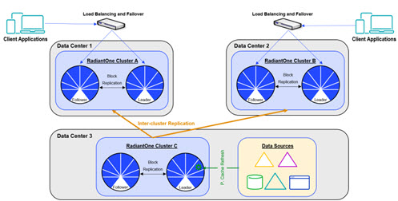
 
Figure 7.22: Multiple Clusters and Sites for Persistent Cache Deployments

#### Configuration

The RadiantOne leader node in the main (cache refresh) cluster plays the role of the authoritative cache image. This node publishes the changes to the persistent cache into a replication journal. The leader nodes in the other clusters are responsible for periodically checking the journal for changes that they need to apply locally. Should conflicting change events occur, a combination of timestamps and sequence numbers associated with the conflicting events are used to resolve the conflict.

>[!note] on startup, a RadiantOne leader node first applies any missed change events from the replication journal and only after these changes have been applied will it be able to serve as an active node in the cluster.

A data source named replicationjournal is included in the RadiantOne install and plays the role of the journal. This data source points to the default cn=replicationjournal store installed with RadiantOne and should not be deleted or deactivated. You can decide to have the journal running on one of the clusters that is participating in replication, or run a separate cluster whose only role is to house the journal. Having the journal housed in an Universal Directory store deployed in a cluster ensures high availability of this repository. The replicationjournal data source should indicate a primary server/node in the cluster and the failover servers should point to the other cluster nodes.


 
Figure 7.23: The Journal Leveraged for Inter-cluster Replication

>[!warning] You do not need to use the default cn=replicationjournal store installed with RadiantOne as the journal. You can choose to install a separate cluster for the sole purpose of housing the central journal. If you do this, you must make sure the replicationjournal data source in each cluster points to the same journal.
 	
To configure replication across sites, follow the steps below.

>[!warning] When installing multiple clusters (either on the same site/data center or different sites/data centers), use different cluster names if you intend to use inter-cluster replication. Inter-cluster replication relies on the names to identify replication events.

>[!warning]Also, it is recommended to NOT start the persistent cache refresh process on the primary cluster until you have the Universal Directory stores in the new cluster(s) properly setup (as exact replicas of the persistent cache). This ensures the stores will have the current image of the persistent cache from the primary cluster initially and no changes are logged into the replication journal yet for this “domain” (naming context).

1.	Designate one data center as the primary/main. At this site, define the virtual views, persistent cache and desired refresh. 

>[!warning] Make sure the port used by RadiantOne that houses the replication journal (2389 by default) can be accessed from all clusters and that firewall rules do not prevent the cluster from reading and writing into the journal.

2.	Install the first cluster node at the new data center. Be sure the name of the cluster you create at this site is different than the cluster name used in the primary site/data center.

3.	From the Main Control Panel > Directory Namespace tab of the first cluster node, define a root naming context of type Universal Directory (HDAP) store and name it the same as the persistent cache naming context in the primary/main cluster.

4.	On the primary/main data center, export the store/cache from the Main Control Panel > Directory Namespace tab. Make sure the option “Export for Replication” is selected (to ensure the UUID attribute is properly handled).

5.	Copy the exported LDIF file from the primary data center and use it to initialize the Universal Directory store in the target data center.

6.	Once the first cluster node in the target data center is initialized with the LDIF file from the primary cluster, install additional RadiantOne nodes on the new site and have them join this new cluster. With this approach, the new nodes automatically inherit the current configuration and data from the primary node. Generally, a cluster that is handling client requests should have between 2-5 nodes.

7.	On any cluster node of the new site(s), edit the replicationjournal data source to point site/cluster that is hosting the replication journal. This can be done from the Main Control Panel > Settings Tab > Server Backend section > LDAP Data Sources sub-section. Click on the replicationjournal data source and click **Edit**. Modify the hostname and port to point to the load balancer that sits in front of the nodes that host the replicationjournal. Click **Save**.

8.	On any cluster node of the new site(s), configure the Universal Directory stores to support Inter-cluster Replication. This is a single-writer replication model from the primary cluster to this new site. Once a leader node receives changes from the primary (cache refresh) site, those changes are replicated out to the follower/follower-only nodes of the cluster. On the leader node, go to the Main Control Panel > Directory Namespace Tab and select the applicable Universal Directory store. On the Properties tab on the right, check the box for Inter-cluster replication. Click **Save**.

9.	For internal replication monitoring, configure an LDAP data source named VDSLB that points to the local cluster’s RadiantOne nodes. This can be done from the Main Control Panel > Settings Tab > Server Backend section > LDAP Data Sources sub-section. Click **Add**. Enter VDSLB for the data source name. Enter the hostname and port that point to the load balancer that sits in front of the nodes of the cluster at this site. Click **Save**.

10.	Repeat step 9 for each cluster. Each site/cluster should have a VDSLB data source that points to the load balancer for the local cluster. This data source is used for internal replication.

11.	(Optional) For optional use cases like redirecting operations (e.g. binds and writes) to the primary/main (cache refresh) cluster, configure an LDAP data source named VDSLBCache that points to the cache refresh cluster’s nodes. This can be done from the Main Control Panel > Settings Tab > Server Backend section > LDAP Data Sources sub-section. Click **Add**. Enter VDSLBCache for the data source name. Enter the hostname and port that point to the load balancer that sits in front of the nodes of the cache refresh cluster site. Click **Save**.

12.	If you did step 11, repeat the steps for each replica cluster. Each site/cluster should have a VDSLBCache data source that points to the load balancer for the cache refresh cluster. This data source is used for redirecting operations. See step 13 below and the section on [Handling Client Writes](#handling-client-writes) for more information on redirecting operations.

13.	 (Optional) If the [Use Cache for Authentication](02-tuning-tips-for-caching-in-radiantone#use-cache-for-authentication) option is not enabled on the persistent cache in the primary/main site, then passwords are not replicated to the Universal Directory stores in the additional site(s). Therefore, you must redirect bind operations to the primary/main (cache refresh) site, which will redirect the credentials to the backend(s) accordingly. On the leader node of (each) new replica site, go to the Main Control Panel > Settings Tab > Interception section > Redirections sub-section (requires [Expert Mode](00-preface#expert-mode)). Select the naming context representing the Universal Directory store and click **Edit**. In the “Redirect Bind Operations to” drop-down list, select the data source that represents the RadiantOne nodes in the primary (cache refresh) site (use the VDSLBCache data source that was defined in step 11 above). If you do not have a data source configured that points to the RadiantOne nodes in the primary site, go to the Server Backend section, LDAP Data Sources sub-section and create one that points to the load balancer configured in front of the nodes at the primary/cache refresh site. Then go back to the Interception section, Redirections sub-section and define that all Binds be redirected to the data source associated with the primary site.

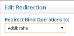
 
Figure 7.24: Option to Redirect Binds to the Cache Refresh Site

>[!note] if the ‘[Use Cache for Authentication](02-tuning-tips-for-caching-in-radiantone#use-cache-for-authentication)’ option is enabled for the persistent cache in the primary (cache refresh) site, the passwords are stored in the cache and authentication is handled locally by RadiantOne as opposed to being delegated to the backend. In this scenario, the passwords are replicated to the Universal Directory stores located on all other sites. This allows the Universal Directory stores on these sites to handle bind operations locally and not require a bind redirect to the primary (cache) site.

14.	On the leader node of the primary/main (cache refresh) site, configure the persistent cache to support Inter-Cluster Replication. Go to the Main Control Panel -> Directory Namespace Tab. Expand the Cache node and select the applicable persistent cache. On the Properties tab on the right, check the box for Inter-cluster replication. Click **Save**.


 
Figure 7.25: Inter-cluster Replication for Persistent Cache

### Handling Client Writes

If client applications (consuming the replicas) perform write operations (add, updates and/or deletes), these operations should be redirected to the main data center/cluster that is responsible for processing updates and cache refreshes. See the configuration steps below for information on how to redirect requests.

1.	(Optional) If the new site(s) must be able to accept write operations from clients, these operations must be redirected to the primary/main (cache refresh) site for processing. On the RadiantOne leader node of the replica site(s), go to the Main Control Panel > Settings Tab > Interception section -> Redirections sub-section (requires [Expert Mode](00-preface#expert-mode)). Select the naming context representing the Universal Directory store and click **Edit**. In the “Redirect Write Operations (Add, Modify, Delete) to” drop-down list, select the data source that represents the RadiantOne nodes in the primary (cache refresh) site (you can use the VDSLBCache data source that was defined in step 11 in the previous section). If you do not have a data source configured that points to the RadiantOne nodes in the primary cache refresh site, go to the Server Backend section, LDAP Data Sources sub-section and create one that points to the load balancer configured in front of the nodes at the primary/cache refresh site. Then go back to the Interception section, Redirections sub-section and define that all Write Operations be redirected to the data source associated with the primary site. After the cache image is updated, these changes are logged into the replication journal and are picked up and applied to other sites/clusters. It is the responsibility of the leader nodes in the other sites/cluster to pick up the applicable changes from the replication journal.

2.	(Optional) When you configure the redirection of write operations to the primary site/cluster as described in the previous step, you also can indicate the local write behavior. This offers an option to write the change locally in addition to redirecting it to the primary site/cluster allowing for the change to be reflected faster on the site that received the change as opposed to waiting for it to be reflected in/picked up from the replication journal. The options for local writes are as follows:

**Write locally after reading from redirected source (default behavior)**

The write request is redirected and if it is successful the local store is written to after reading from the remote source.

**No local write**

The write request is redirected to the remote data source. There is no immediate update made to the local store. 

**Write locally based on the request**

The write request is redirected and if it is successful the local store is written to immediately.

>[!note] In all cases, the local entry is updated (later) through inter-cluster replication when the leader node picks up the changes from the replication journal.

3.	(Optional) If the new replica site(s) must be able to accept write operations from clients, and you require a more real-time replication mode where changes are pushed directly to intended targets, click on the “Configure Push Mode” button and select the data sources representing the intended RadiantOne targets. For more information on the use case where this might be applicable, please see [Push Mode Replication](#push-mode-replication).
