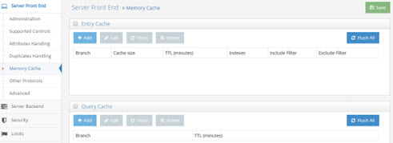

## Memory Cache

A memory cache (requires [Expert Mode](00-preface#expert-mode)) can be configured for any virtual directory view and there are two different types of memory caching available: [Entry Memory Cache](#configuring-entry-memory-cache) and [Query Memory Cache](#configuring-query-cache). They can be used together or individually. 

>[!warning] 
>If you plan on using both entry and query cache on the same view/branch, be aware that the query cache is searched first.

### Configuring Entry Memory Cache

This model of caching leverages two types of memory: Main and Virtual. Main memory is the real memory where a certain number of most recently used entries reside. Virtual memory is memory on disk where all entries that exceed the amount allowed in the main memory reside. The swapping of entries from Virtual to Main memory (and vice versa) is managed by RadiantOne.

First, enable the Entry Memory Cache. In the Main Control Panel > Settings Tab > Server Front End section > Memory Cache sub-section (requires [Expert Mode](00-preface#expert-mode)), on the right side, check the Entry Cache box. Click Save in the top right corner.

>[!warning] 
>If you plan on caching (either entry memory cache or persistent cache) the branch in the tree that maps to an LDAP backend, you must list the operational attributes you want to be in the cache as “always requested”. Otherwise, the entry stored in cache would not have these attributes and clients accessing these entries may need them. For details on how to define attributes as “always requested” please see the RadiantOne System Administration Guide.

Entry cache is for caching every entry (a unique DN) of the specified tree. This kind of cache works well on trees where the volatility (update rate) is low (the likelihood of this data changing during the lifetime of this cache is low). This type of cache is optimized for and should only be used for finding specific entries (e.g. finding user entries during the “identification” phase of authentication) based on unique attributes that have been indexed in the cache setting, and base searches. The attributes you choose to index for the cache are very important because the value needs to be unique across all entries in the cache. For example, if you index the uid attribute, then all entries in the cache must have a unique uid (and be able to be retrieved from the cache based on this value). On the other hand, an attribute like postalcode would not be a good attribute to index (and search for entries based on) because more than one entry could have the same value for postalcode.
 	
>[!warning]
>The DN attribute is indexed by default. DNs are unique for each entry which is the reason why base searches can be optimized with the entry cache.

For example, to populate/pre-fill the entry cache with unique user entries, you can preload with a query like:

```
ldapsearch -h localhost -p 2389 -D “uid=myuser,ou=people,dc=vds” -w secret -b “ou=people,dc=vds” -s sub (uid=*)
```

With this type of LDAP search, all entries (containing uid) are stored in the entry memory cache. Therefore, if a client then searched for:

```
ldapsearch -h localhost -p 2389 -D “uid=myuser,ou=people,dc=vds” -w secret -b “ou=people,dc=vds” -s sub (uid=lcallahan)
```

The entry could be retrieved from the entry cache and the underlying source would not need to be accessed.

Also, since all DNs in an LDAP tree are unique, base searches can benefit from entry cache. Continuing with the example above, if a client performed a base search on uid=lcallahan,ou=people,dc=vds, the entry could be retrieved from the entry cache.

>[!warning]
>Entry Memory Cache works for BASE searches on entries as well as on One Level and Sub Tree searches. However, for One Level and Sub Tree searches, whether the entry is returned from cache depends on whether the filter is "qualified" or not. Qualified means that the attribute in the filter is one that is indexed in your cache. Remember, only UNIQUE attributes can be indexed in your cache. You could index something like cn, which is fine if it is unique across all your entries. You cannot however index something like objectclass as more than one entry could be of the same objectclass.

For example, if your entry cache settings indexed the cn attribute, a search like the following (using the ldapsearch command line utility) doesn’t qualify to return the entry from entry cache even though it may be in the cache:

```
ldapsearch -h localhost -p 2389 -D "cn=directory manager" -w secret -b "cn=Laura Callahan,ou=Active Directory,dc=demo" -s sub (objectclass=*)
```

However, both of the following searches WOULD return the entry from the memory cache (because one uses a subtree search requesting a filter based on the indexed attribute, and one is a base search):

```
ldapsearch -h localhost -p 2389 -D "cn=directory manager" -w secret -b "cn=Laura Callahan,ou=Active Directory,dc=demo" -s sub "(cn=Laura Callahan)"

ldapsearch -h localhost -p 2389 -D "cn=directory manager" -w secret -b "cn=Laura Callahan,ou=Active Directory,dc=demo" -s base "(objectclass=*)"
```

To configure an entry memory cache, follow the steps below (requires [Expert Mode](00-preface#expert-mode)).
1.	On the Main Control Panel > Settings Tab > Server Front End section > Memory Cache sub-section, on the right side click Add in the Entry Cache section.
2.	Select a starting point location in the virtual tree. All entries queried below this point are cached. The maximum number of entries allowed in the main memory is specified in the Number of Cache Entries parameter.
3.	Enter values for the Number of Cache Entries, Time to Live, Indexed attributes, and include/exclude filters. Details about these settings can be found below.


 
Figure 2.2: Entry Cache Settings

*Time to Live*

The amount of time that entries should remain in cache. After the time has been reached, the entry is removed from the cache. The next request for the entry is sent to the underlying data store(s). The result of the request is then stored in the memory cache again. This value is specified in minutes. The default value for this parameter is 60 (1 hour).

*Indexes*

Enter the attribute names in the cache that should be indexed. The values need to be separated with a comma. The attribute names must represent unique values for all entries across the entire cache. You must only index attributes that have unique values, otherwise the response from the cache can be unpredictable. For example, if you indexed the postalCode attribute, your first request with a filter of (postalCode=94947) may return 50 entries (because the query would be issued to and returned from the underlying source). However, your second request would only return 1 entry (because RadiantOne expects to find only one unique entry in the cache that matches a postalCode=94947, and this is typically the last entry that was added to the cache). If this functionality does not meet your needs, you should review the query cache and persistent cache options.

*Include Filter*

Enter a valid LDAP filter here that defines the entries that should be included in the cache. Only entries that match this filter are cached. 

As an alternative approach, you can indicate what entries to exclude by using the Exclude filter described below.

*Exclude Filter*

Enter a valid LDAP filter here that defines the entries that should be excluded from the cache. All entries that match this filter are not cached. 

As an alternative approach, you can indicate what entries to include by using the Include filter described above.

*Number of Cached Entries*

The total number of entries kept in main memory. The entry cache can expand beyond the main memory and the entries are swapped as needed. The default value for this parameter is 5000. This means that up to 5000 most recently used entries are put in the main memory cache. As the number of entries exceeds 5000, they are stored as virtual memory (memory on disk) and swapped as needed. The default value of 5000 is usually sufficient.

### Memory Cache Size Requirements

**For Entries**

As a rule of thumb, you should take the average size of one of your entries and multiply by the number of entries you want to store in main memory. Then multiply this total number (the size for all entries) by 2.5. This gives you the amount of main memory you should allocate to store the entries.

**For Indexes**

>[!note] 
>This value is the total number of pages for each indexed attribute. The default size is 1000 pages. Which means there are, at most, 1000 index pages for each attribute you have indexed.

For each indexed attribute, the amount of memory consumed per page is calculated by taking the average size of an indexed value x 3 x 64.

You should keep in mind that dn is always indexed (although it doesn’t appear in the index list). Therefore, the dn attribute by itself consumes the following (assuming the dn is an average of 200 bytes in size):

200 x 3 x 64 = 38,400 bytes (approximately 39 KB per index page)

The default of 1000 index pages, consumes about (1000 x 39 KB) 39 MB in memory for the dn attribute.

Now, calculate the amount for each attribute you have indexed and add it to the 39 MB.

For example, if you index the attribute uid, and the average uid is 20 characters, you would have 20x3x64 = 3840 byes (approximately 4 KB per index page).

With 1000 index pages (1000 x 4 KB), about 4 MB in memory is consumed for the uid attribute.

If you have 10 attributes indexed (all on average of 20 characters), the total consumption of memory would be about 40 MB + 39 MB (for the dn attribute) for a total of 79 MB.

**Total Memory Size Requirements**

Add entry memory cache requirements and index memory cache requirements together to get the total memory size required for your cache.

### Configuring Query Memory Cache

Query cache is sensitive to syntax. To benefit from the query cache, it must be the exact same query (from the same person, ACI, asking for the same information). This type of caching is good for repetitive queries (of the same nature).

Query cache is only applicable on naming contexts that are not configured as persistent cache.

First, enable the Query Memory Cache (requires [Expert Mode](00-preface#expert-mode)).

1.	On the Main Control Panel > Settings Tab > Front End section > Memory Cache sub-section, on the right side, check the box in the Query Cache section.

2.	Click **Add** in the Query Cache section.

3.	Select a starting point location in the RadiantOne namespace. All queries below this point are cached. 

4.	Enter a Time to Live (in minutes). This is the amount of time that entries should remain in cache. After the time has been reached, the entry is removed from the cache. The next request for the entry is sent to the underlying data store(s). The result of the request is then stored in the memory cache again. This value is specified in minutes. The default is 60 (1 hour).

5.	Click **OK**.

6.	Click **Save** (located in the top right hand corner) to save your settings.

>[!warning] 
>The user and ACI information are also part of the query. This is why it was mentioned above that the query cache is sensitive to syntax. If User A issues a query, and then User B issued a query asking for the exact same information, this would count as two queries in the Query Cache.

### Populating the Memory Cache

**Entry Cache**
The entry memory cache is filled as the RadiantOne service receives queries. The first time the server receives a request for an entry, the underlying data store(s) is queried and the entry is returned. The entry is stored in the entry memory cache. The entry remains in cache for the time specified in the Time to Live setting.

**Query Cache**

The query memory cache is filled as the RadiantOne service receives queries. The first time the server receives a request, the query is added to the query memory cache, and the underlying data store(s) is queried to retrieve the entries. The entries resulting from the query are also stored in the cache.

### Refreshing the Memory Cache

A time-to-live parameter can be set for both the entry cache and the query cache. The time starts when the entry/query is added into memory. Once the time-to-live value is reached, the entry/query is removed from the cache. The next time a query is received for the entry, RadiantOne issues a query to the underlying store(s), retrieves the latest value and the entry is stored in the entry memory cache and/or the query memory cache again.

You also have the option to flush the entire memory cache from the Main Control Panel > Settings Tab > Server Front End section > Memory Cache section (requires [Expert Mode](00-preface#expert-mode)). On the right side, click on the “Flush All” button next to the type of cache you are interested in clearing.


 
Figure 2.3: Memory Cache Settings
