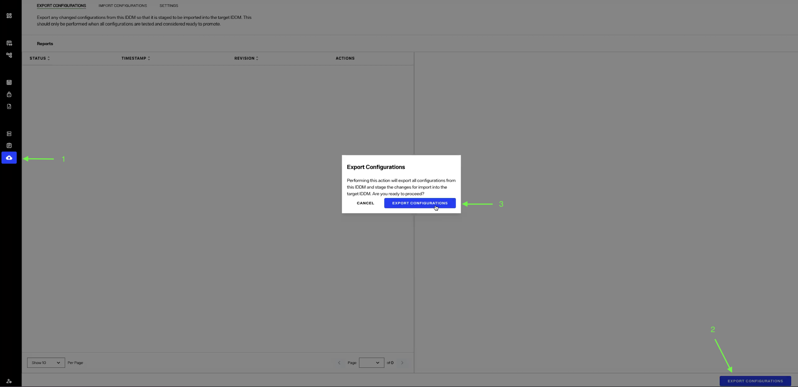
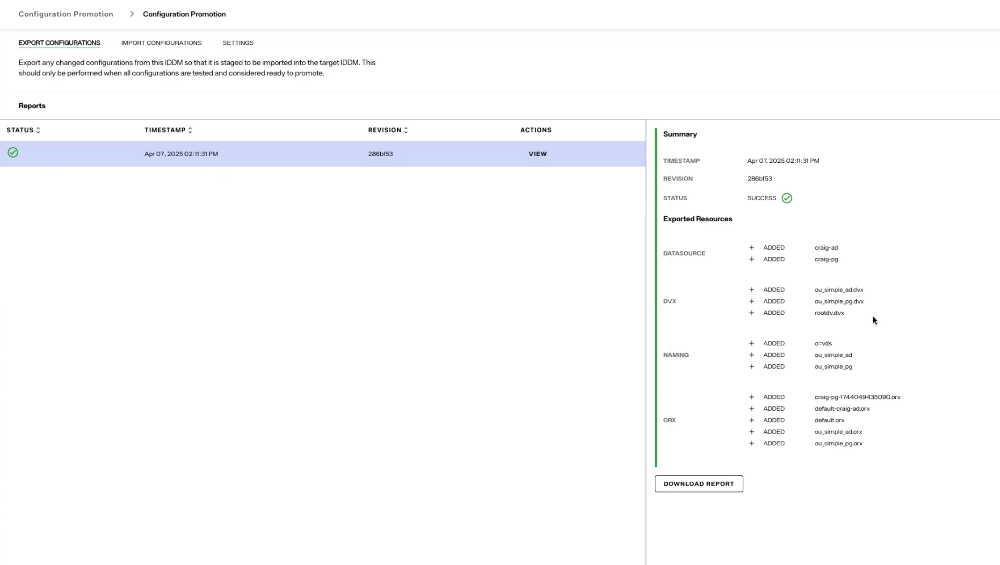
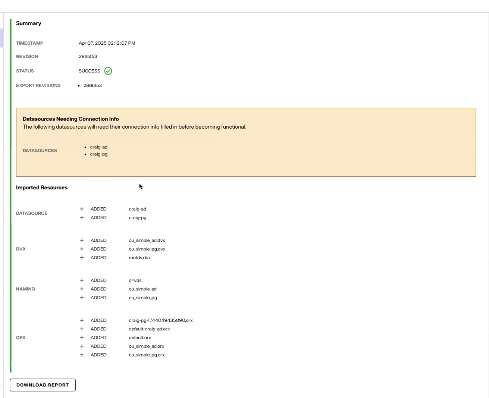

## Overview

Radiant Logic's configuration promotion feature allows you to seamlessly transfer configuration changes across different Identity Data Management instances. This enables you to synchronize updates from one environment to another, such as promoting changes from a development environment to QA or production environments. This feature is available in Identity Data Management version 8.1.4 and higher.

> This feature is intended solely for promoting configuration changes and requires the target Identity Data Management environment’s version to be the same as the source environment’s version. 

## Supported configurations

This feature promotes all supported changes to resource configurations (creations, updates or deletions). Selective promotion of configurations is currently not supported. Below is the list of supported configurations:

- Data Sources  
- Database Templates  
- Custom Templates  
- Schemas  
- Naming Contexts  
- Caches  
- Synchronization Pipelines 
- Interception scripts

## Unsupported configurations

Promotion of the following configuration changes is not supported:

- Inter-cluster Replication
- Special attributes  
- ACIs  
- Client certificates  
- Password policies  
- RadiantOne LDAP schema  
- Data source connection settings (including credentials)

## Prerequisites

Before you begin the migration process, ensure the following:

### 1. Configure promotion pipeline

- For SaaS Identity Data Management environments, customers must [configure their promotion pipeline](/../../../eoc/latest/promotion-pipelines/configuration-promotion.md) in the Environment Operations Center (EOC). Note that this feature is supported in EOC version 1.4.0 or higher. 

- For Self-Managed Identity Data Management environments, customers must [set up their Git repository](../installation/config-promotion.md) to configure their pipeline.

## Steps to promote configurations

### 1. Implement configuration changes and export them

To initiate the migration process, implement the desired configuration changes and export these configurations from the source environment by following these instructions:

#### Login to the source Identity Data Management instance

a. Access the Identity Data Management source environment from which you want to export configuration changes.

> For example, you may make changes in the development environment for testing and wish to promote finalized changes to the production environment. In this case, the development environment serves as the source environment.  
>  
> Example workflow:

i. Create a new data source or modify an existing data source in your source Identity Data Management instance. You may also create a new naming context or make some other changes to the supported configurations.

ii. If you modified a schema, mount your backend and extract the new schema. Save and review these changes before proceeding with the export.

#### Export configurations

a. In your source Identity Data Management environment, click on the Configuration Promotion icon in the left navigation bar.

b. Open the Export Configurations tab and click on the Export Configurations button.  

c. Once the export is successful, a summary will appear, and you can also download the export report.  

### 2. Import configuration changes

Next, follow the steps listed below to import the exported configurations into the destination Identity Data Management instance.

#### Login to the target Identity Data Management

a. Access the Identity Data Management environment where you want to import the configurations.

#### Initiate import

a. Click on the Configuration Promotion icon in the left navigation bar.

b. From the Import Configurations tab, click on the Import Configurations button and confirm that you would like to proceed.

#### Manage any warnings that may appear

a. For specific resources, like connection strings, the import process might require additional information. In such cases, a warning will be displayed, outlining the necessary steps to proceed. Follow the provided instructions to resolve these warnings.

The image below shows an example of what this may look like:  

After providing the missing values, the import will be automatically successful.

## Things to consider

- Source and target environments must be running the same version of the Identity Data Management software. Before exporting or importing configurations, ensure all environments are patched to the same version. 

- Any caches impacted by import will be automatically disabled. In such cases, after an import, you will see a warning notice that asks you to reinitialize the cache.

  As you may have to reinitialize and reconfigure persistent cache, we recommend that you only perform configuration promotions during maintenance windows.

- Any changes in the interception script (global or context related) will require a restart of your Identity Data Management software.

- The promotion flows support One-to-One and One-to-Many configurations. Many-to-One promotions are not supported and will result in failures within the target IDDM.

- You should avoid manually altering configurations in the target environment that imports configurations from a source environment, as any manual changes will be overwritten during the import process. The only exception to this is configurations that are not supported by this feature.

- The state of the source environment is mirrored on the target. If the source environment contains broken or non-functional configurations, these will be transferred to the target in the same degraded state.

- Synchronization pipelines will be promoted based on their current state on the source system. This means that if the pipeline is running on the source, it will continue running on the target immediately after import; if it's stopped on the source, it will also be stopped on the target post-import.

- For the initial deployment of a production environment, we recommend using a backup from your dev/QA. You can then use this exported backup file during the installation of the production environment.

  Once all environments are set up, configuration changes can be applied to target environments using the process described in this document.

## Conclusion

The configuration promotion process makes it easy to transfer changes between Identity Data Management environments. While some manual setup may be needed initially, such as filling in any missing information, following the steps above will help ensure a smooth and successful configuration promotion.
