## Overview

Deployment options will be discussed with your Radiant Logic Account Representative and a Solution Consultant.  This chapter provides high-level details about the most common deployment architecture.

For details on creating environments and installing RadiantOne, see the [Environment Operations Center](/environment-operations-center-guide/environments/environment-overview/environments/).

For details on integrating with on-premise data sources through a Secure Data Connector, see the [Secure Data Connector Deployment Guide](/environment-operations-center-guide/secure-data-connectors/data-connectors-overview/).

## Basic Production Architecture

A basic architecture for a production deployment of the RadiantOne platform consists of two or more environments. One primary cluster/environment and one for disaster recovery (which could be a client-consuming cluster as well, and not just reserved for DR).

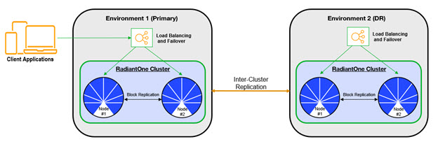
 
Once the primary and DR environments are created, configure RadiantOne in the primary environment. Then, use the migration tool to export the configuration and import it into the DR environment. Finally, configure inter-cluster replication for all RadiantOne Directory stores that need to be kept in sync across both environments.

>[!note]
>Configuration changes are not automatically synchronized across cluster. These must be manually migrated. 

If the data sources integrated in the RadiantOne platform are accessible in the cloud, no extra components are needed. If the data sources are deployed on-premises or inside a different network than the SaaS service, use a Secure Data Connector. These options are depicted in the diagram below. See the Secure Data Connector Deployment Guide for details.

>[!note]
>Site-to-Site VPN or VPC Peering can be alternatives to using the Secure Data Connector. Speak with your Radiant Logic Solution Consultant about these options.

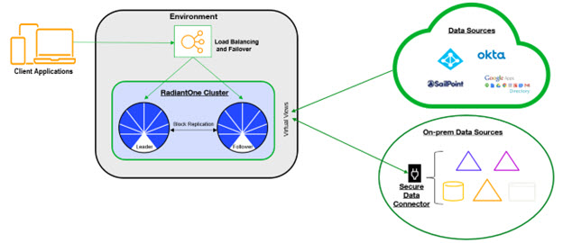

### Inter-cluster Replication for RadiantOne Directory Stores

After RadiantOne is configured in each environment, configure inter-cluster replication for all applicable directory stores.

>[!warning]
>When installing multiple clusters, use different cluster names. Inter-cluster replication relies on the names to identify replication events.  

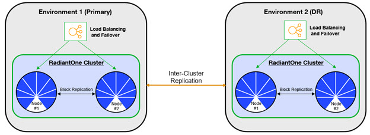
 
Each RadiantOne leader node in the cluster plays the role of a “writer” in the replication and publishes their changes into a journal. Each leader is also responsible for periodically checking the journal for changes that they need to apply locally. Should conflicting change events occur, a combination of timestamps and sequence numbers associated with the conflicting events are used to resolve the conflict.

>[!note]
>On startup, the RadiantOne service first applies any missed change events from the replication journal and only after these changes have been applied is it able to serve as an active server.

A data source named replicationjournal is included in the RadiantOne install and plays the role of the journal. This data source points to the default cn=replicationjournal store installed with RadiantOne and should not be deleted or deactivated. 

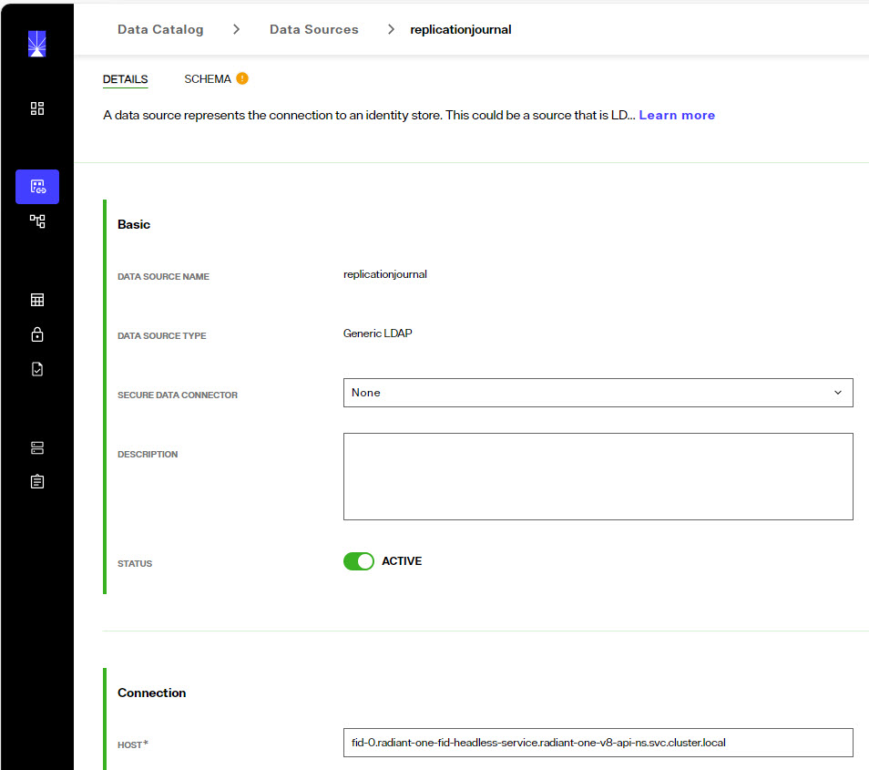

The default *replicationjournal* LDAP data source (and cn=replicationjournal naming context) are associated with the default super user account (e.g. cn=Directory Administrator). This user allows access controls checking to be avoided for inter-cluster replication events. If you do not want the super user account associated with the replication journal data source (and inter-cluster replication events), you can set a different Bind DN/user account for the replicationjournal LDAP data source and add this user as a member of the Directory Replicators group. Members of this group have the privilege of by-passing ACI checking when used to establish the connection for inter-cluster replication.

The group entry is located in the RadiantOne namespace at:
cn=Directory Replicators,ou=globalgroups,cn=config

To configure multi-master replication for RadiantOne Directory stores, follow the steps below.

**Modify the replicationjournal Data Source**

For inter-cluster replication, the replicationjournal data source for all clusters must be configured to point to the same journal. For example, if there are three RadiantOne clusters, and the first cluster is where the journal is located, the replicationjournal data source in all other clusters must point to the cn=replicationjournal naming context in the first cluster.

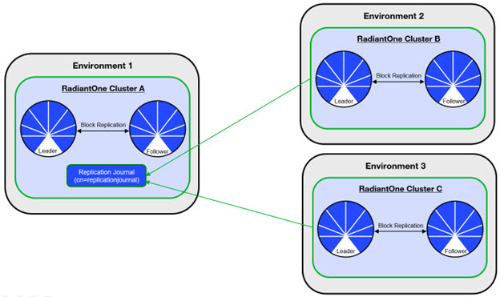

To modify the replicationjournal data source, go to the Control Panel associated with the cluster and login as a directory administrator (e.g. superadmin). From the Setup > Data Catalog > Data Sources section, click the replicationjournal to edit it. Modify the hostname and port to point to the replicationjournal running in site one. The base DN should be cn=replicationjournal, but can be left empty (it will default to cn=replicationjournal).

**Configure the Directory Store in Each Cluster**

The same naming context and RadiantOne directory store must be configured in each cluster/environment. If the store did not exist prior to the initial migration/cloning of the additional clusters, you must define the store in each cluster with the steps below.

To create a new RadiantOne directory store:

1.	On one of the RadiantOne nodes in one environment, go to the Control Panel > Setup > Directory Namespace > Namespace Design click .

2.	Enter the new naming context label and click **SAVE**.

3.	Click .

4.	Choose the **RadiantOne Directory** type and click **SELECT**.
5.	Choose to activate the store or not (it can be activated later after it has been initialized).
6.	Click **MOUNT**.
7.	Repeat these steps on one node in each RadiantOne cluster/environment.

**Initialize the Replicas**

Before enabling replication, all replicas must have the same initial image: either an empty store or an initialized store based on the export of the RadiantOne directory store at the primary data center. When you export the store on the primary data center, you must have the option “Export for Replication” checked to ensure the uuid attribute is properly included in the export and handled during the import into the replica cluster.  Download the file as you go through the export process.

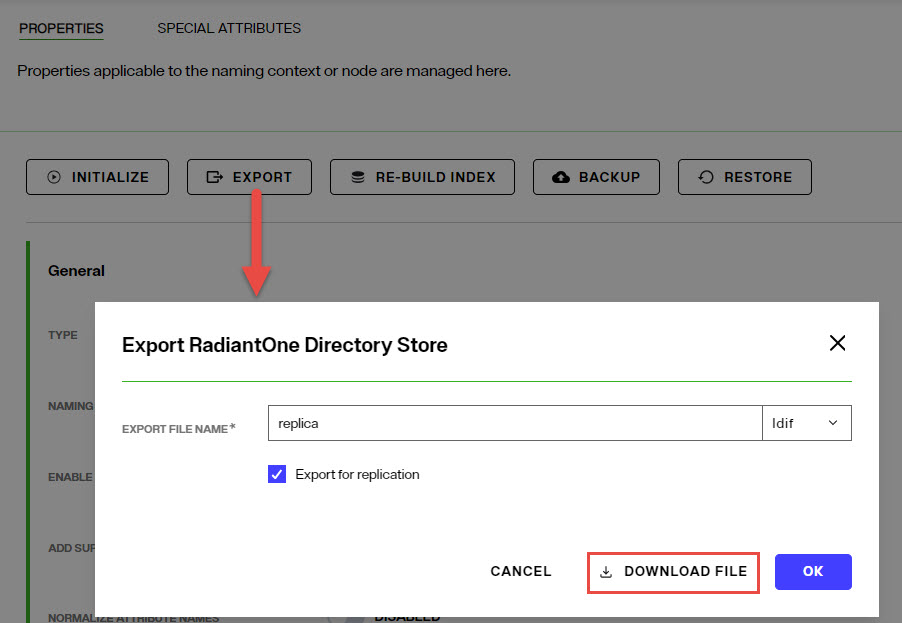

To initialize a replica:

1.	On a replica cluster/environment, go to the Control Panel > Manage > Directory Namespace > Namespace Design and below the root naming contexts select the naming context representing the RadiantOne directory store.

1.	In the Properties tab on the right, click the **INITIALIZE** button and choose the “Upload file” option. Select the LDIF file that you exported/downloaded from the primary cluster/environment.

    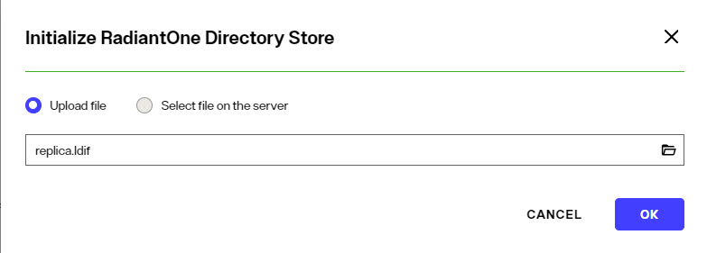

1.	Click **OK** and the initialization is launched as a Task which can be viewed from the Control Panel > Manage > Tasks. Once the task completes, the store is initialized.

1.	Repeat these steps on all other RadiantOne clusters in the needed environments.

**Enable Inter-cluster Replication**

After the directory stores are initialized in each cluster, inter-cluster replication must be enabled. 

To enable inter-cluster replication for a directory store:

1.	Go to the Control Panel > Setup > Directory Namespace > Namespace Design and below the root naming contexts select the naming context representing the RadiantOne directory store.

1.	On the Properties tab on the right, check the box for Inter-cluster Replication as shown in the screenshot below.

 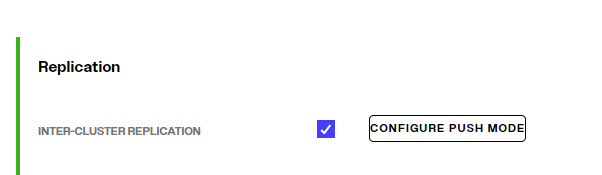

1.	Click **SAVE**.

1.	Repeat these steps on one RadiantOne node in each cluster/environment.

>[!note]
>Monitor inter-cluster replication from Classic Control Panel > Replication Monitoring tab.

>[!warning]
>If you are replicating a persistent cache store in one environment to a RadiantOne directory store in another environment, it is recommended to NOT start the persistent cache refresh process on the primary environment until you have the RadiantOne directory stores in the new cluster/environment properly setup (as exact replicas of the persistent cache). This ensures the stores will have the current image of the persistent cache from the primary cluster initially and no changes are logged into the replication journal yet for this “domain” (naming context).

## Migrating Configuration

## Managing the State of the RadiantOne Service

When deployed as SaaS, you can manage the state of the RadiantOne service from the [Environment Operations Center](/environment-operations-center-guide/environments/environment-details/environment-overview/). Select the environment and use the options shown when clicking on  to start/stop/restart the service.

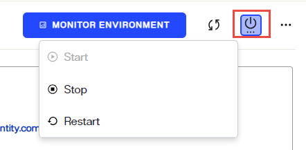

## Managing the State of Synchronization Pipelines

Synchronization pipelines can be managed from the Classic Control Panel > Synchronization tab. Select the topology from the list on the left. Click **START** to start synchronization for all pipelines. 

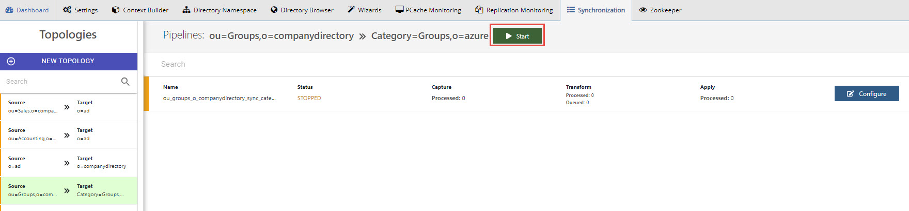

If a topology has more than one pipeline, you can start synchronization for each independently. To resume a single pipeline, click CONFIGURE and select the APPLY component. Click **START** on the Run tab.

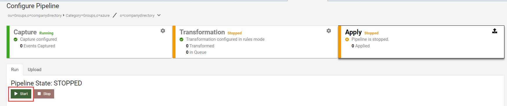
 

