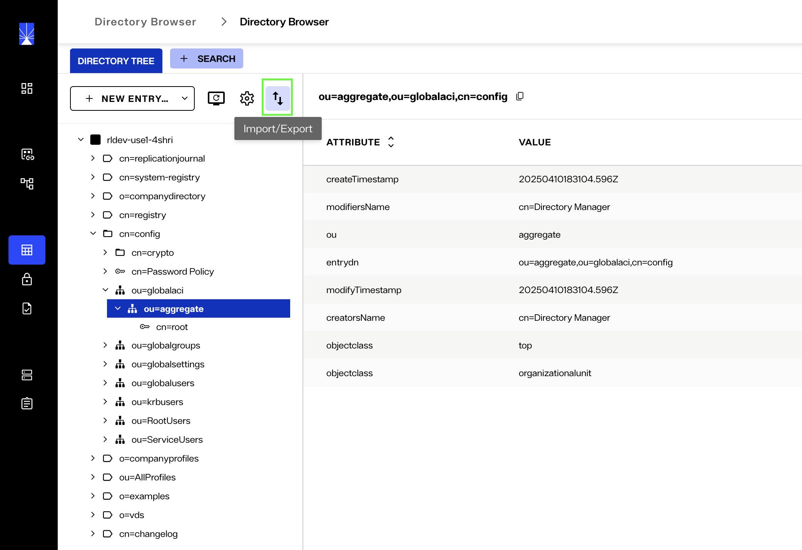
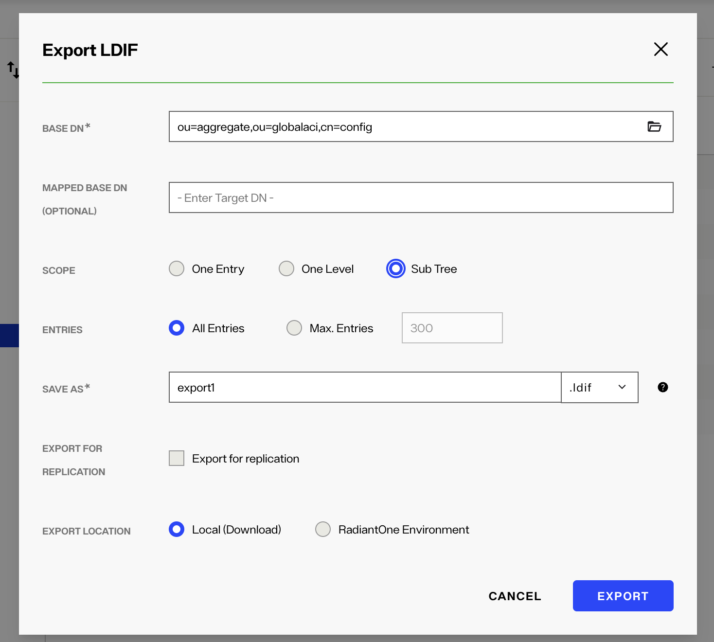
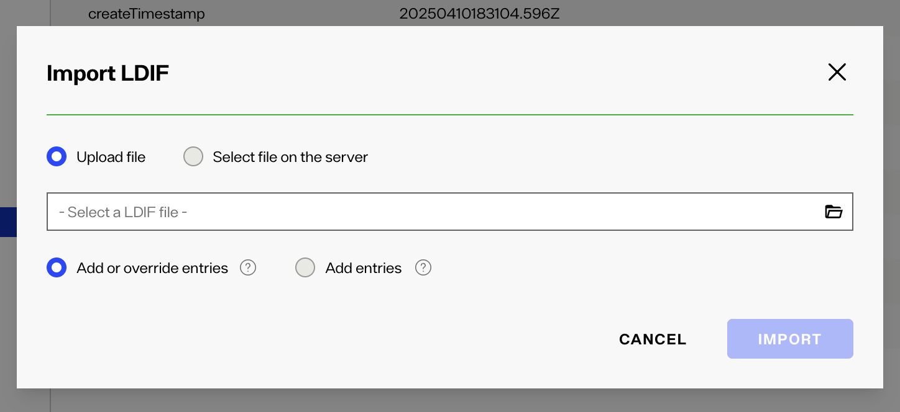

# Migrate Access Control Instructions (ACIs) in Bulk

This guide explains how to export and import ACIs in bulk between two Identity Data Management environments.

## Using the Control Panel

### Export ACIs from the Source Environment

1. Log in to your source Identity Data Management environment, where the ACIs you want to export are located.
2. Open **Directory Browser** and select the branch:  
   `cn=config,ou=globalaci`

   > **Tip:** To export only a subset, select a specific sub-branch under `cn=config,ou=globalaci,ou=aggregate`.

3. Click the **Import/Export LDIF** arrows (above the Namespace tree).

    

4. In the **Export LDIF** dialog:

    i. Leave **MAPPED BASE DN** blank.  
    ii. Select **Sub Tree** for **Scope**.  
    iii. Choose **All entries** under **Entries in file**.  
    iv. Provide a file name in the **Save as** field.  
    v. Leave **Export for replication** unchecked.  
    vi. Choose the **Local (Download)** option for **Export Location**.

     

5. Click **EXPORT** to export the LDIF file. A task will run and display the file.

### Import ACIs to target Environment

1. Open **Directory Browser** and select the same branch used during export:  
   `ou=globalaci,cn=config`

2. Click the **Import/Export LDIF** arrows (above the Namespace tree) and select **Import LDIF**.

3. In the **Import LDIF** dialog:
      i. Select the **Upload File** option.  
      ii. Browse to the exported LDIF file.  
      iii. Choose one of the following:  
           - **Add or override entries** (to update all ACIs), or  
           - **Add entries** (to only add new ACIs)

     

4. Click **IMPORT** to import the file. A task will run and show a confirmation once completed.
5. Refresh the DIT to view the updated ACI entries.
