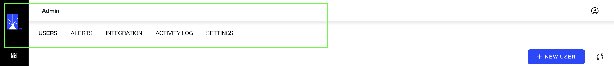
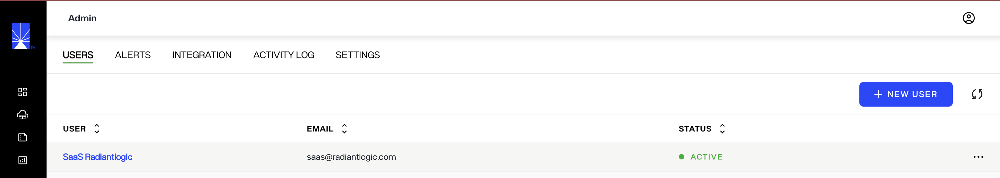
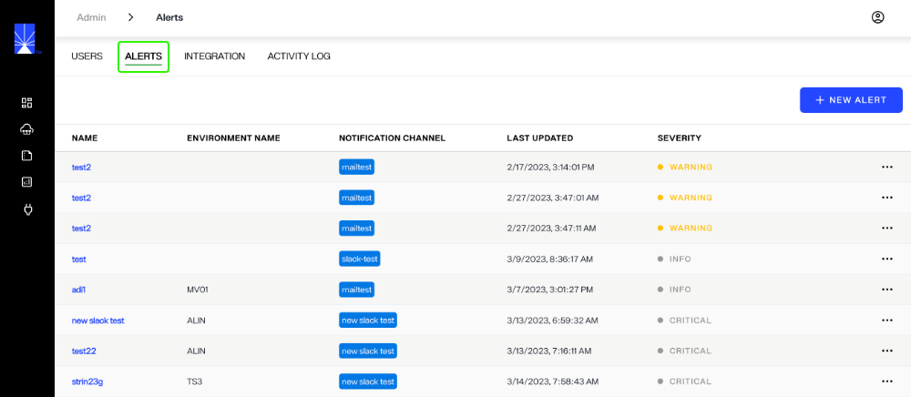
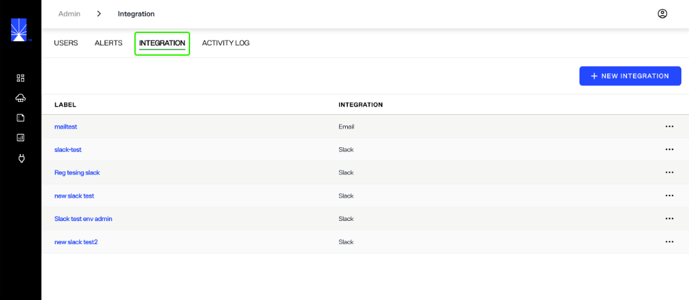
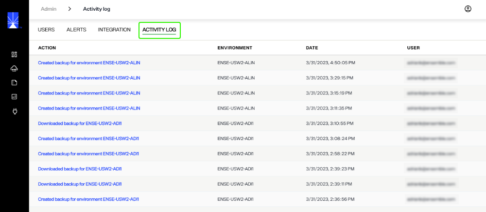

---
keywords:
title: Admin Overview
description: Learn more about the administrative functions that can be performed in the Environment Operations Center. This includes how you can access tabs to manage your account settings, Environment Operation Center users, environment alerts and integrations, and monitor cluster health.
---
# Admin Overview

This guide provides an overview of the *Admin* home screen and its features. From the *Admin* screen, you can access tabs to manage your account settings, Environment Operation Center users, environment alerts and integrations, and monitor cluster health.

All Env Ops Center users can access the *Admin* screen, but view and edit permissions differ depending on a user's assigned role. For details on role-based permissions, see the [role-based permissions](role-based-permission/role-based-permissions.md) guide.

## Getting started

To navigate to the *Admin* screen, select **Admin** () located at the bottom of the left navigation.

## Top navigation

A navigation bar is located at the top of the *Admin* home screen and is visible from all tabs in the *Admin* view. The top navigation allows you to access several account and user management tools through the following tabs:

- Users
- Alerts
- Integration
- Activity Log
- Settings

### Users

The *Users* tab allows you to manage all users within your Environment Operation Center instance. From here you can view a user's name, email address, and status.

For details on managing Environment Operation Center users, including their roles and permissions, see the [user management](/user-management/create-user) guide.

### Alerts

From the *Alerts* tab you can monitor and create alerts for your environments. The main *Alerts* screen displays all of your current alerts including their associated environment, notification channel, a time and date stamp of the last update to the alert, and the severity status.

For more information on alert management, see the [alert management](/alert-management/alert-management-overview) guide.

### Integration

From the *Integrations* tab you can manage your connections to external applications to send alerts from Environment Operations Center. The *Integrations* tab displays the integration "Label", indicating the integrations purpose, and the "Integration", indicating the external application the integration is connected to.

For details on managing integrations, see the [managing integrations](integrations/manage-integrations.md) guide.

### Activity Log

The *Activity Log* provides an overview of all create, update, and delete activities performed for all environments, including the action, environment, date and time stamp of the activity, and the user who performed the activity.

### Settings

The **settings** provides options to setup release channels and also automatic/manual update checks for the channel

## Next steps

After reading this guide you should be able to navigate the *Admin* home screen and understand its main features including the top navigation. For details on updating your account settings, review the [account settings](account-settings/update-account.md) guide. To learn how to create a new user, review the [create a new user](user-management/create-user.md) guide.
