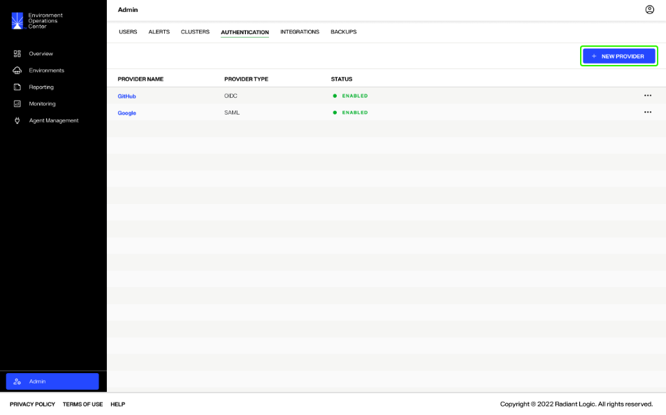
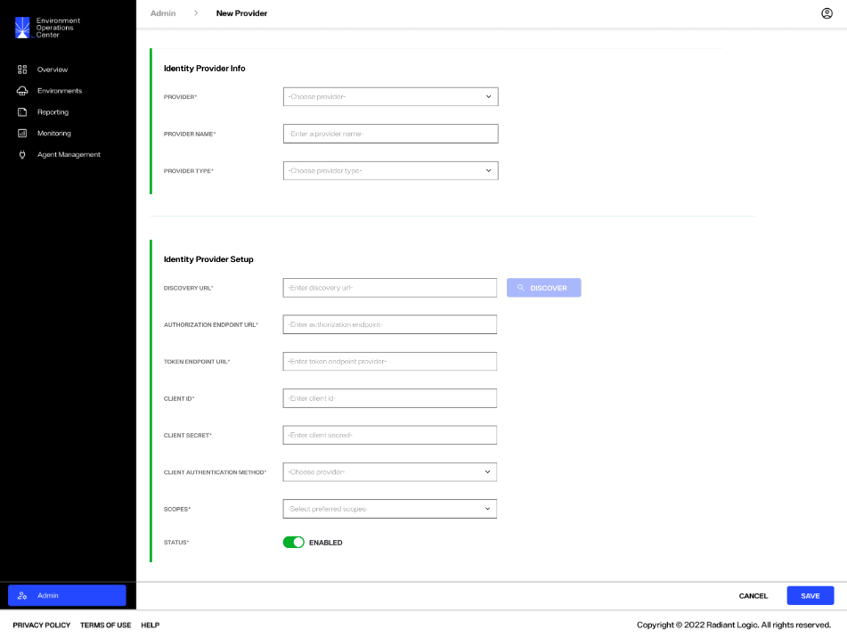
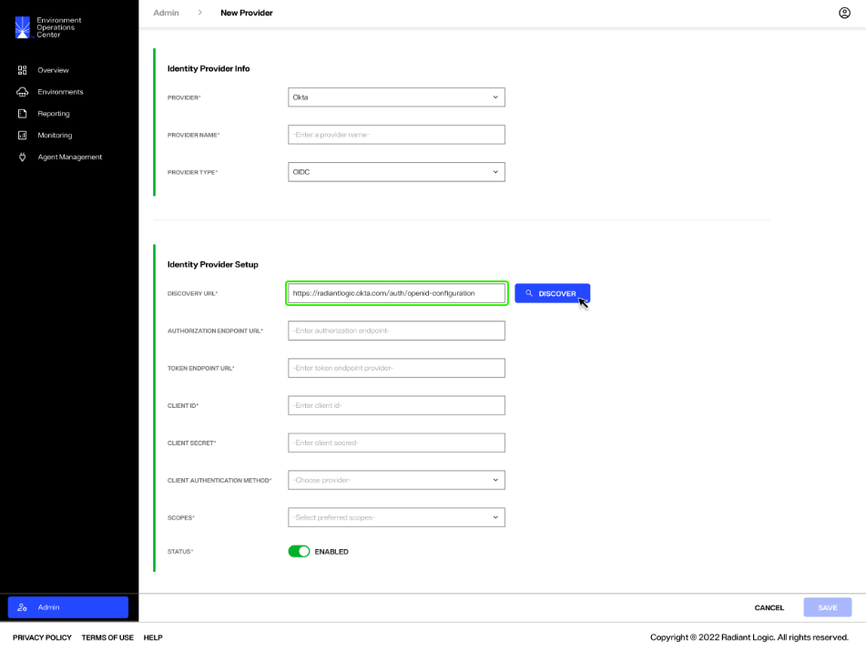
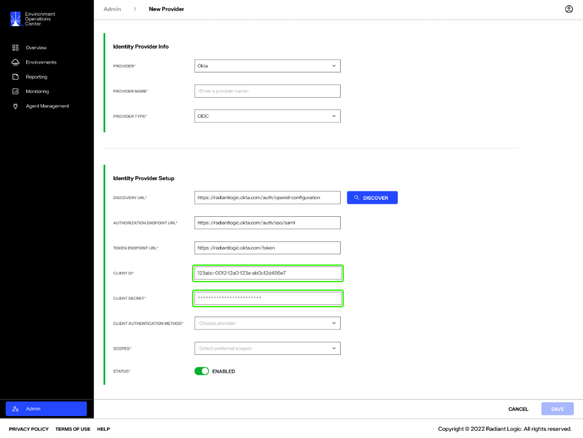
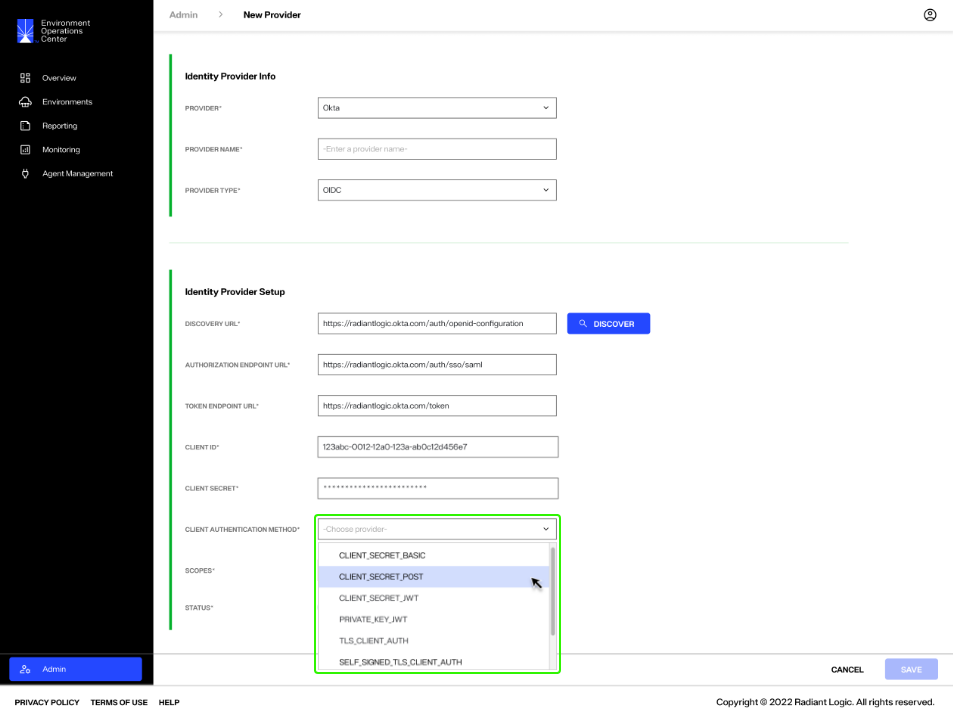
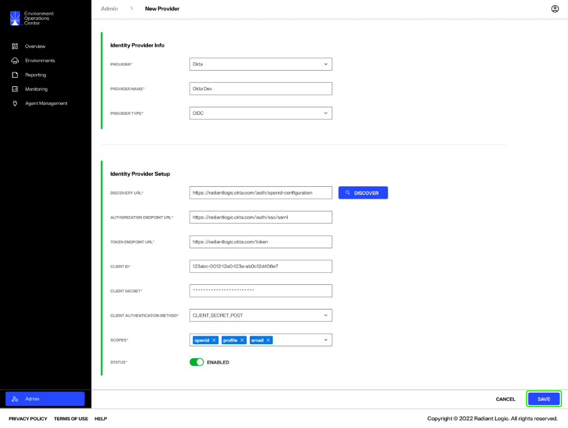
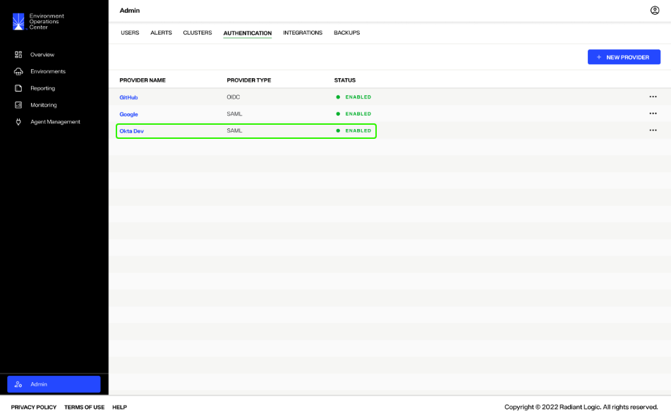

---
keywords:
title: Add an Identity Provider
description: Learn how to add a new authentication identity provider for logging into Environment Operations Center. GitHub and Google are configured by default.
---
# Add an Identity Provider

This guide outlines the required steps to add a new authentication identity provider in Environment Operations Center.

[!note] An external identity provider must be configured before it can be added to Environment Operations Center. Before proceeding with the following steps, please ensure you have followed the steps outlined by your selected provider to configure authentication for Env Ops Center.

## Getting Started

To begin adding a new identity provider, select **New Provider** from the *Authentication* tab in the *Admin* section.

The *New Provider* form contains all required input fields to add a new identity provider. The following sections outline how to complete these fields.

## Identity provider info

The *Identity Provider Info* section contains three required fields, the provider, provider name, and provider type.

Select a provider from the **Provider** dropdown menu, which lists all accepted identity providers.

Enter a name for the new provider in the space next to **Provider Name**. This is the name that will display in the list of configured providers on the *Authentication* tab.

Once the provider is selected, the **Provider Type** will automatically populate with "OIDC" or "OAuth". If you need to change the provider type, select the **Provider Type** dropdown menu and select a type.

## Identity provider setup

The required fields listed in the *Identity Provider Setup* section will differ depending on if the provider type is OIDC or OAuth. For OIDC providers, the required fields include:

- Discovery URL
- Authorization Endpoint URL
- Token Endpoint URL
- Client ID
- Client Secret
- Client Authentication Method
- Scopes
- Status

[!note] Details for OAuth-specific identity provider set up are outlined in the following section.

### URL fields

For OIDC providers, the **Discovery URL** field automatically populates after the **Provider** is selected in the *Identity Provider Info* section. This also renders the **Discover** button active. 

Select **Discover** to populate the **Authorization Endpoint URL** and the **Token Endpoint URL**.

### Client details

Client details include client ID, secret, and authentication method. In the spaces provided, enter your **Client ID** and **Client Secret** that you received after configuring Env Ops Center authentication with your chosen provider.

Select the **Client Authentication Method** from the provided dropdown list.

### Scope

Set the required scopes from the **Scope** dropdown menu. More than one entry can be selected. Select all scopes that are applicable to your login process.

### Status

Adjust the **Status** toggle to "Active" to ensure the provider is activated after the form is saved.

## OAuth-specific provider setup

OAuth providers require a different set of authentication details than other provider types. For OAuth providers, the required setup fields include:

- Authorization Endpoint URL
- Client ID
- Client Secret
- Status

Enter the **Authorization Endpoint URL**, **Client ID**, and **Client Secret** in the spaces provided.

Adjust the **Status** toggle to "Active" to ensure the provider is activated after the form is saved.

## Save new provider

Once you have completed all required fields in the *New Provider* form, select **Save** to add the new provider.

The new identity provider is added to the list of available providers in the *Authentication* tab with a status of "Enabled".

The new provider is also added to the Environment Operations Center login screen.

## Next steps

After reading this guide you should have an understanding of the steps required to add a new identity provider for user authentication. To learn how to edit, disable, or delete identity providers, see the [manage providers](manage-identity-providers.md) guide.

