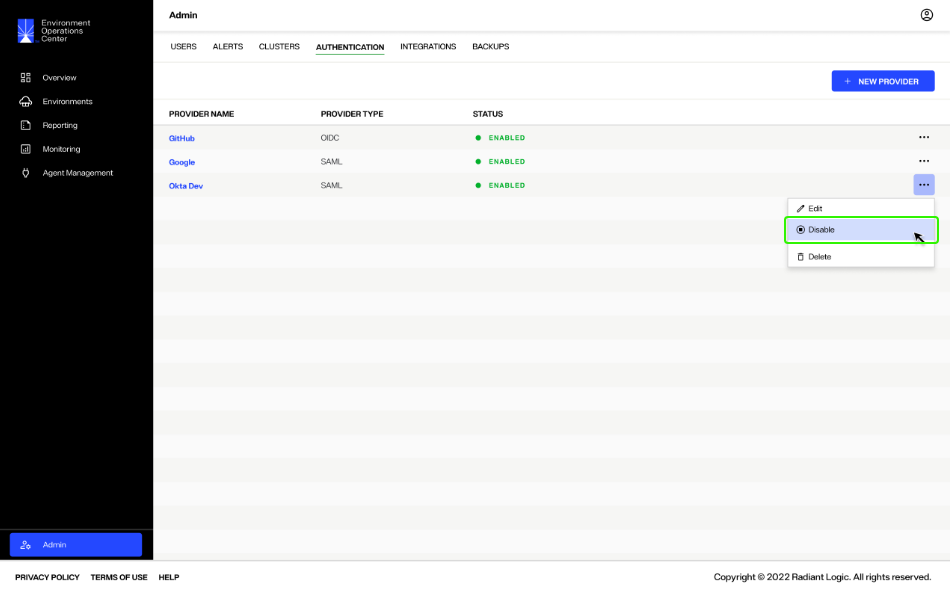
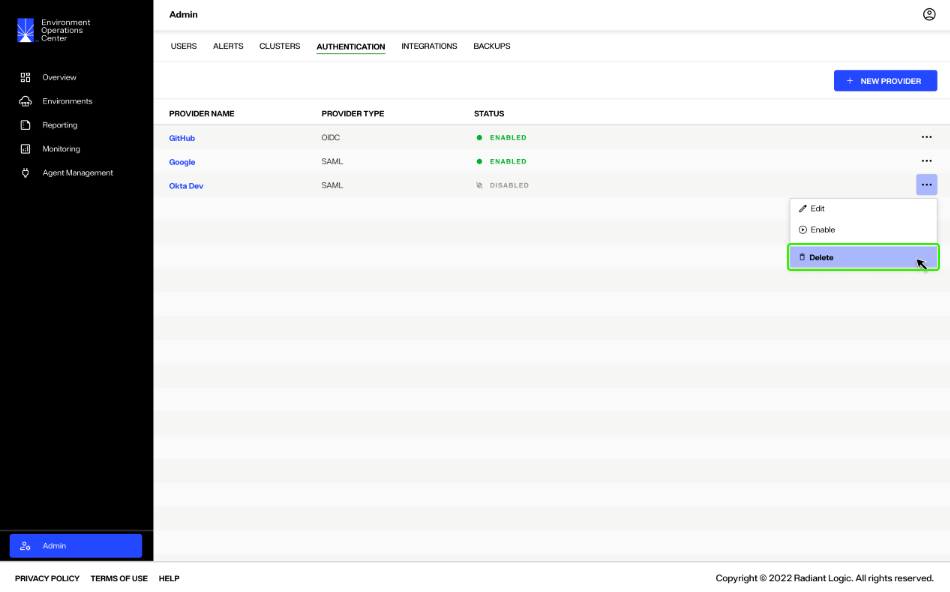
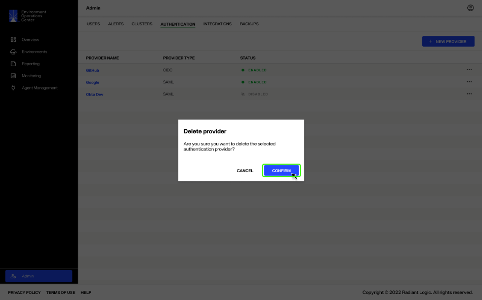

---
keywords:
title: Manage Identity Authentication Providers
description: Learn how to edit, disable, or delete identity providers in Environment Operations Center.
---
# Manage Identity Authentication Providers

Identity authentication providers are managed from the *Authentication* tab in the *Admin* section. This guide outlines the required steps to edit, disable, or delete identity providers.

## Getting started

To access the management operations for an identity provider, locate the provider from the list displayed on the *Authentication* tab. Select the **Options** (**...**) menu associated with the provider to expand the list of actions that can be performed.

## Edit a provider

To open the *Edit Provider* screen, select **Edit** from the **Options** (**...**) menu.

The *Edit Provider* form contains the same sections and fields as the *New Provider* form. Adjust the fields as required and select **Save** to update the provider information. The provider details will update immediately.

For further details on the fields contained in the form, see the [add a provider](add-identity-provider.md) guide.

[!note] The fields displayed in the *Identity Provider Setup* section will differ depending on the **Provider Type**. Further information on the provider types is available in the [add a provider](add-identity-provider.md) guide.

## Update provider status

If you would like to remove a provider but maintain its configuration for future use, you can update the provider status to "Disabled".

To disable a provider, select **Disable** from the **Options** (**...**) menu.

The status of the provider will update to "Disabled" on the main *Authentication* tab and the provider will no longer appear on the login screen.

To switch the status back to "Enabled", select **Enable** from the **Options** (**...**) menu.

## Delete a provider

To permanently delete a provider, select **Delete** from the **Options** (**...**) menu.

A confirmation message will appear requesting you to confirm if you would like to delete the selected identity provider. Select **Confirm** to delete the provider.

You will receive a confirmation message that the provider has been deleted and it will no longer be listed on the *Authentication* tab.

The provider will also be removed from the login page.

## Next steps

After reading this guide you should have an understanding of the steps required to edit, disable, or delete an identity provider. To learn how to add a new identity provider, see the [add a provider](add-identity-provider.md) guide.
