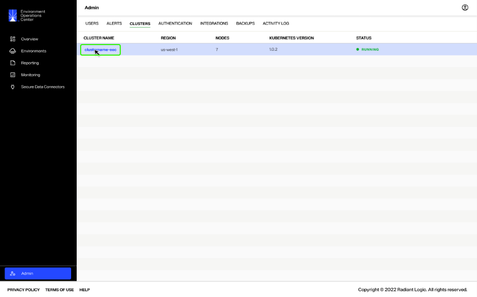
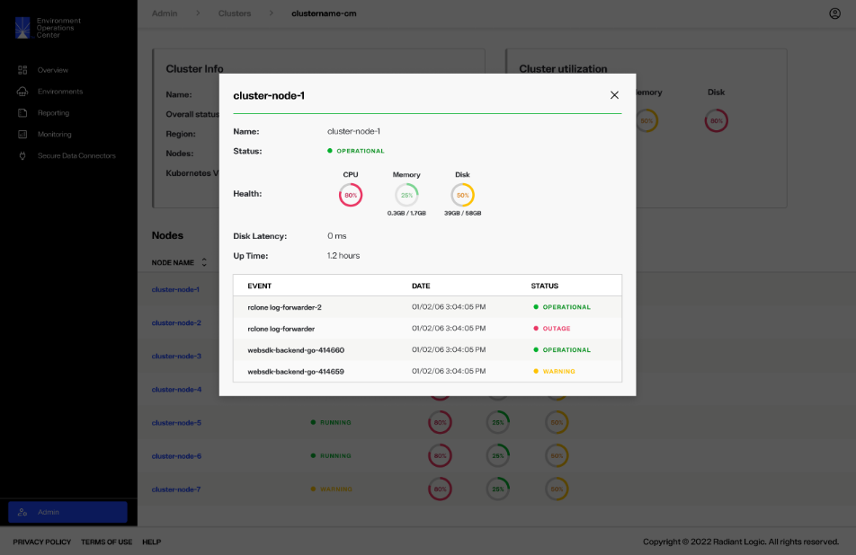

---
keywords:
title: Cluster Monitoring
description: Cluster monitoring
---
# Cluster Monitoring

The status of each cluster and all of its nodes can be monitored from the *Clusters* tab in the *Admin* section of Environment Operations Center. This guide outlines how to review the status and details of a cluster and how to review the status of all nodes within a cluster.

## Getting started

On the *Clusters* tab, each cluster is listed including its region, number of nodes, Kubernetes version, and status.

Depending on the operational health of a cluster its status will be listed as:

> **RL QUESTION: Requested definitions and confirmation for the following statuses**

- Ready:
- Running:
- Warning:
- Operational:

## View Cluster details

To view further details about a cluster and its nodes, select the cluster name.

The detailed view of a cluster provides details for Cluster info, Cluster utilization, and Nodes. Each of these sections is describe in more detail in the following sections.

### Cluster info

General cluster details are listed under "Cluster Info" including:

> **RL QUESTION: Requested definitions and confirmation for the following statuses**

- Name:
- Overall status: The current operational status of the cluster. This will either be "Ready", "Running", "Warning", or "Unavailable".
- Region: The region where the cluster servers are located.
- Nodes: The number of nodes that make up the cluster.
- Kubernetes Version: Which version of Kubernetes the cluster is operating on.

### Cluster utilization

Cluster utilization lists the operating status of the cluster, including:

> **RL QUESTION: Requested definitions and confirmation for the following items and status color codes**

- CPU: The amount of CPU used by the cluster.
- Memory: The amount of memory used by the cluster.
- Disk: The amount of disk usage by the cluster.
- Deployments:
- Jobs:

The status of CPU, Memory, and Disk are color coded to indicate the amount of space used. The color indicators are:

- Green:
- Yellow:
- Red:

### Nodes

The "Nodes" section lists all nodes in the cluster, as well as their individual status, CPU, Memory, and Disk usage.

## View node status

To view further details about a specific node, select the node name.

Selecting an individual node opens the node details dialog, which provides the following information:

> **RL QUESTION: Requested clarification for the following items**

- Name:
- Status:
- Health: Displays the amount of CPU, Memory, and Disk used by the node.
- Disk Latency:
- Up Time:
- Events:

## Next steps

You should now have an understanding of the steps to monitor cluster and node health. For details on reviewing Env Ops Center logs or reports to troubleshoot areas of concern, review the guides on [logging](../../environments/logging/environment-logs.md) and [reporting](../../reporting/reporting-overview.md), respectively.
