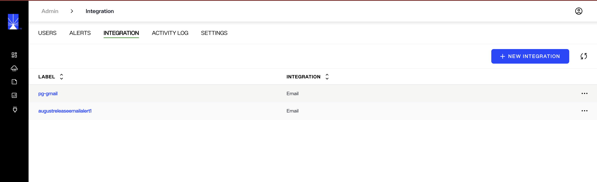
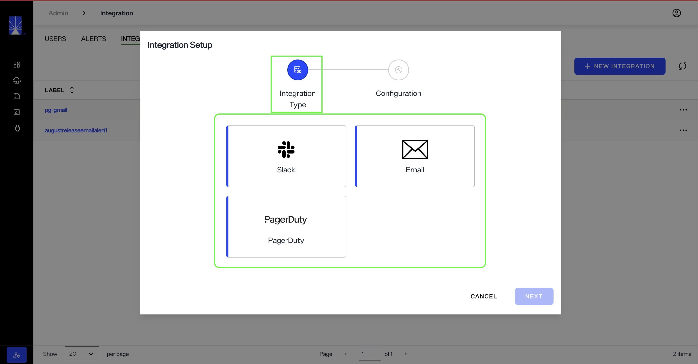
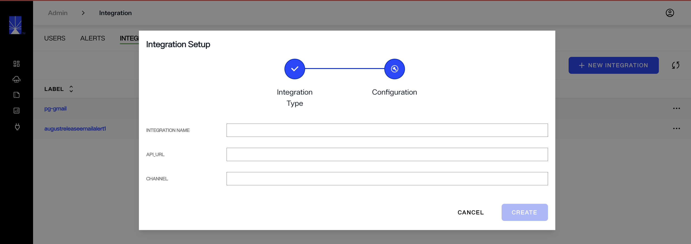
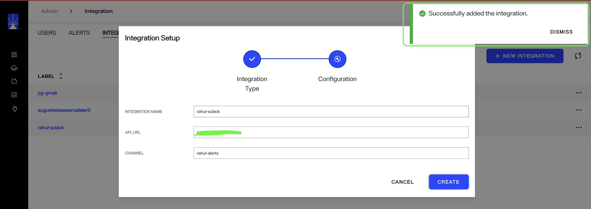
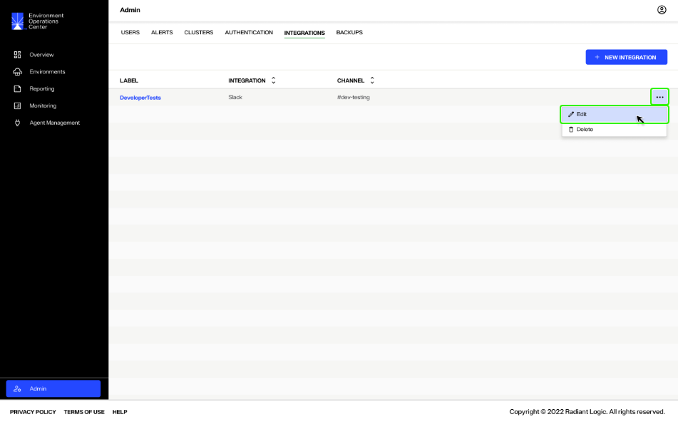
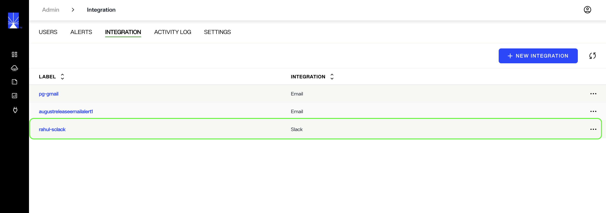
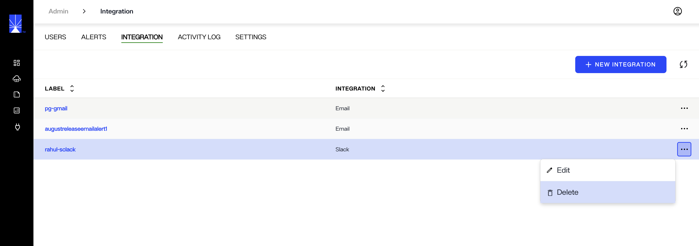
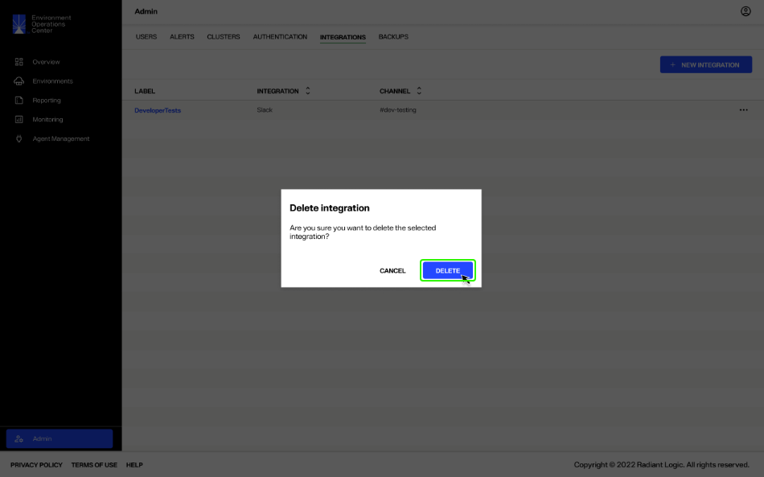
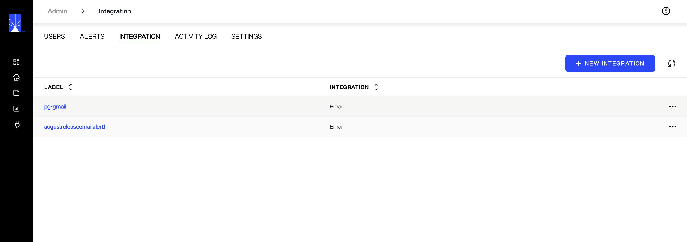

---
keywords:
title: Manage Integrations
description: Learn how to integrate with external notification services (e.g. Slack, Email, PagerDuty) to send alerts about monitored events in Environment Operations Center.
---
# Manage Integrations

External communication channels can be integrated with Environment Operations Center to receive alerts or notifications about changes of state. From the *Integrations* tab in the Admin section, Administrators can add, edit, or delete integrations. This guide outlines the required steps to manage communication channel integrations.

## Getting started

The *Integrations* tab provides an overview of existing integrations and lists the label, integration type, and channel for each integration.

## Configure a new integration

To add a new integration, select **New Integration** which opens the *Integration Setup* dialog. To complete the integration setup, you must provide an integration type and configuration details.

### Integration type

Select an **Integration Type** from the available channels listed and select **Next** to continue.

### Configuration Details

The required configuration details differ depending on the type of configuration selected. Complete the required configuration fields and select **Create** to finish setting up the new integration.

If the integration is successfully created, you will receive a confirmation message and the integration will be added to the list of integrations on the *Integrations* tab.

> [!note] For the integration to become active, you will need to configure the applicable alerts to send to the channel. See the [alert management](../alert-management/alert-management-overview.md) guide to learn how to set up alerts to send via the integration.

## Edit an integration

Each integration listed on the *Integrations* tab has an **Options** (**...**) dropdown menu. From the dropdown, select **Edit** to begin editing the integration.

The workflow to edit an integration is the same as the *New Integration* workflow. You can select a new integration type and add the required configuration details. Alternatively, you can keep the same integration type and proceed to adjust the configuration details.

> [!note] When updating an integration, ensure any alerts that have been created for the channel are also updated with the correct channel information. See the [alert management](../alert-management/alert-management-overview.md) documentation for details on editing alerts.

If the integration successfully updates, a confirmation message displays, and the details are updated on the *Integrations* tab.

## Delete an integration

To delete an integration, select **Delete** from the the **Options** (**...**) menu.

A message displays, asking you to confirm that you would like to delete the selected integration. Select **Delete** to delete the integration.

The integration is removed from the *Integrations* tab, and alerts are no longer sent to the communication channel.

## Next steps

You should now have an understanding of the steps to add integrations to receive Environment Operations Center alerts in external channels. To learn how to create alerts to send to the configured channels, see the [alert management](../alert-management/alert-management-overview.md) guide.

