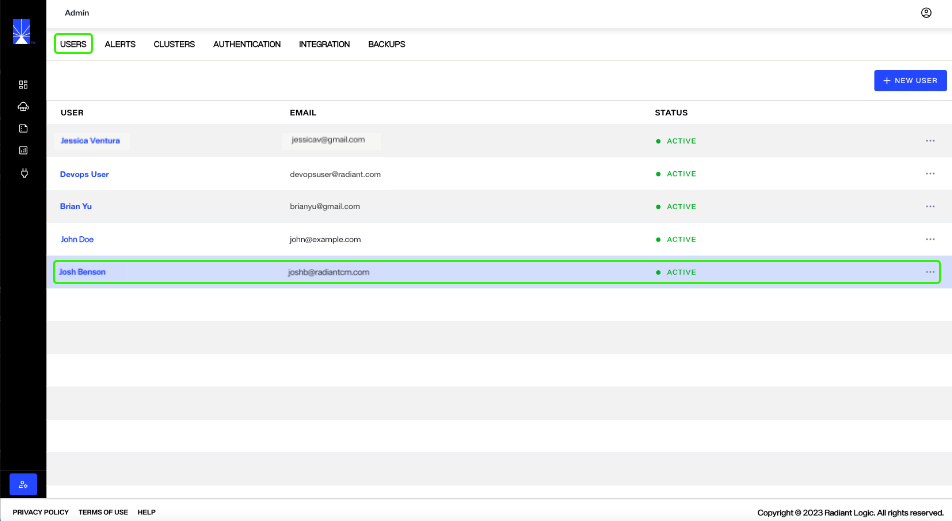
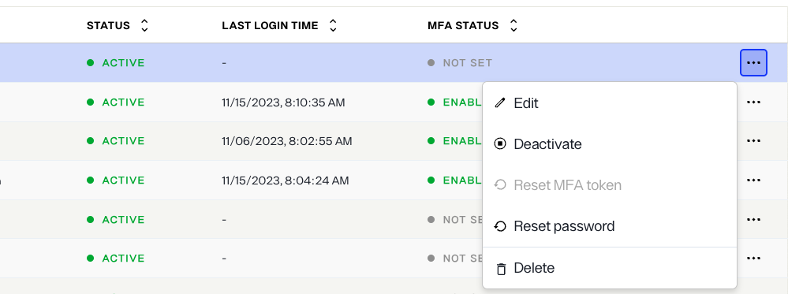
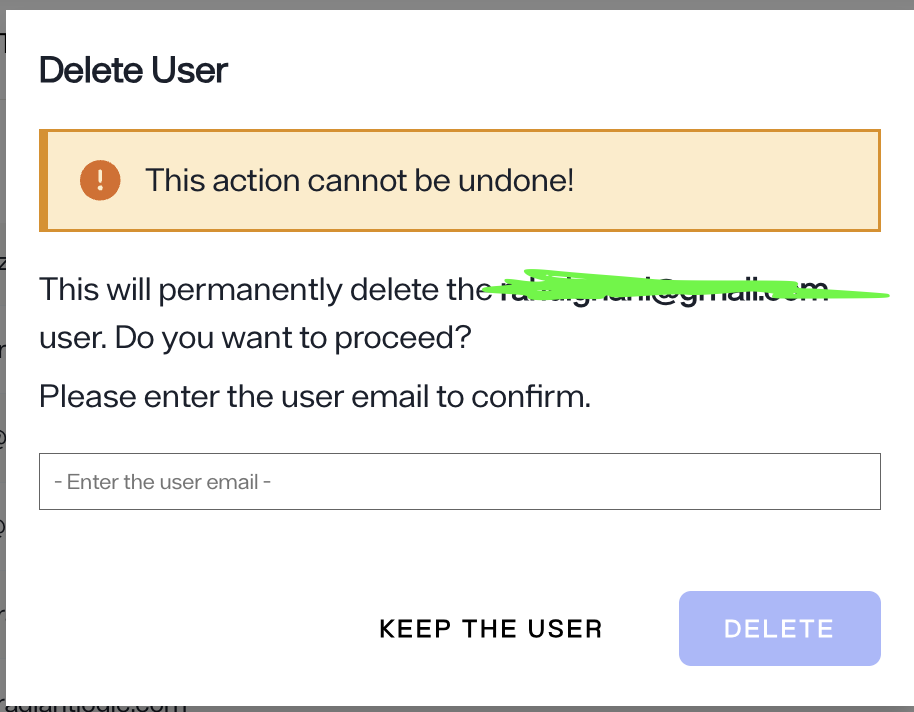

---
keywords:
title: Delete a User
description: Learn how to delete a user in Environment Operations Center.
---
# Delete a User

This guide outlines the required steps to delete a user in Environment Operations Center.

[!warning] Deleting a user is a permanent operation and cannot be undone.

If you would prefer to deactivate a user, see the [edit a user](edit-user.md) guide for details on deactivating a user's account.

## Getting started

To delete a user, locate the user from the list of users displayed on the *Users* tab in the *Admin* section.

Select the **Options** (**menu**) associated with the user. From the options dropdown, select **Delete** to open the *Delete User* confirmation dialog.

## Delete user

The *Delete User* dialog displays the email address associated with the user you are deleting and a warning message that the action cannot be undone.

To proceed with deleting the user, enter the email address associated with their account in the space provided and select **Delete**.

To keep the user and exit out of the *Delete User* dialog, select **Keep The User**. You will return to the admin *Users* tab.

## Confirmation

If the user is successfully deleted, you will receive a confirmation message, the user will no longer be listed on the *Users* tab, and their account will no longer be active.

If the user cannot be successfully delete you will receive and error message notifying you the user could not be deleted. The user will still be listed on the *Users* tab and their account will remain active.

## Next steps

You should now have an understanding of the steps required to delete a user in Environment Operations Center. To learn more about user management see the [create a user](create-user.md) guide or the [edit a user](edit-user.md) guide.

