---
keywords:
title: Edit a User
description: Learn how to edit the details, status, role, and environment assignments for users in Environment Operations Center.
---
# Edit a User

This guide outlines the steps to edit the details, status, role, and environment assignments for a specific user in Environment Operations Center.

## Getting started

From the *Users* tab in the *Admin* section of Environment Operations Center, there are two ways to begin the workflow to edit a user. You can either select the **Options** (**...**) menu associated with the user or select the user's name to access the *Edit User* screen.

### Edit from options menu

To edit a user from the **Options** (**...**) menu, select **Edit** from the **Options** (**...**) drop-down menu associated with the user.

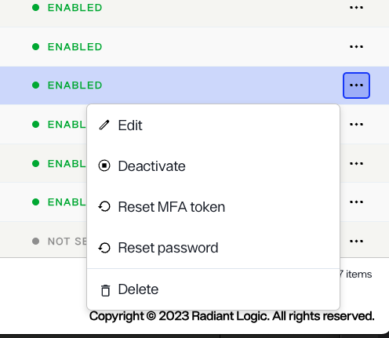

This opens the *Edit User* screen where you can update the details and role assignments of a user.

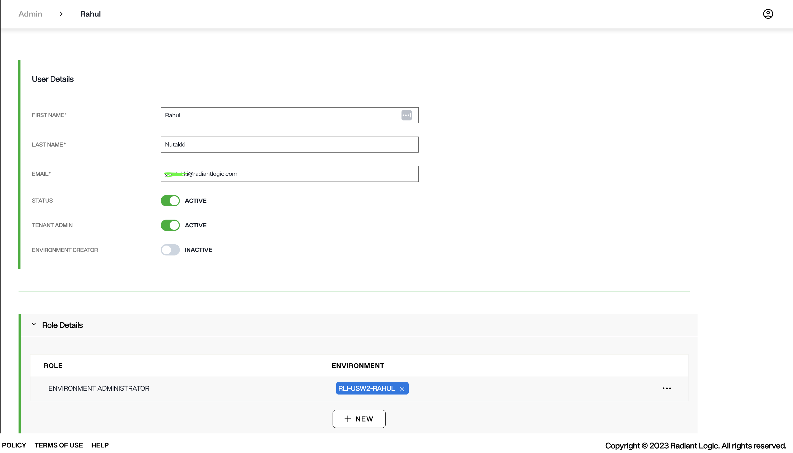

### Edit from user name

To access the *Edit User* screen by directly selecting the user, select the user name from the list of users on the *Admin* *User* tab.

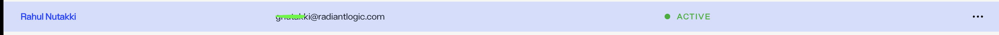

This brings you to the *Environment Access* tab in a detailed overview of the user. This view lists all the environments and associated roles assigned to the user. From the *Environment Access* tab, click **Edit User** to open the *Edit User* screen.

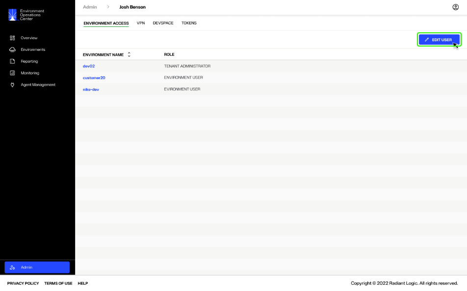

## Update user details

From the *Edit User* screen, you can update a user's first name, last name, and email address in the *User Details* section. Enter the updated information in the associated field provided and select **Save** to update the user's details.

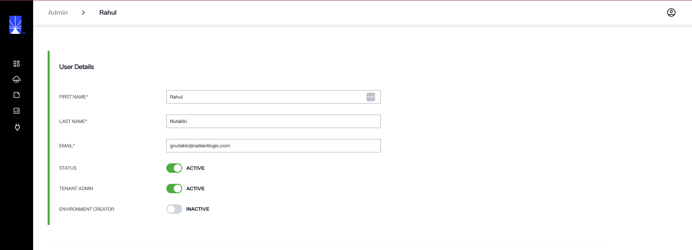

## Update user status

There are two ways to update the status of a user, either from the **Options** (**...**) menu on the *Admin* *Users* tab or from the *Edit User* screen.

### Update status from options menu

To update a user's status from the *Users* tab, select the **Options** (**...**) menu located next to the user who you would like to deactivate or activate.

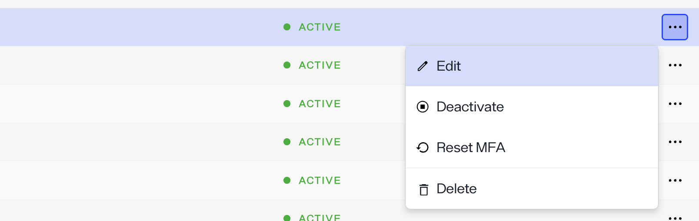

From the **Options** (**...**) drop-down, select **Deactivate**.

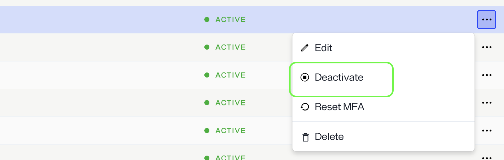

You will receive a message confirming deactivation of the user.

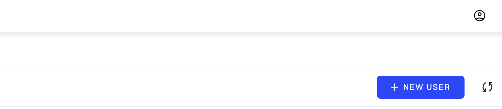

The user's status changes from "Active" to "Inactive"

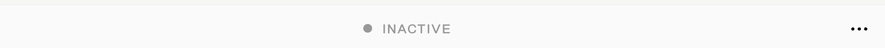

### Update status from Edit User screen

To update a user's status from the *Edit User* screen, adjust the *Status* toggle in the *User Details* section to the "Active" or "Inactive". Select **Save** to update the user's status.

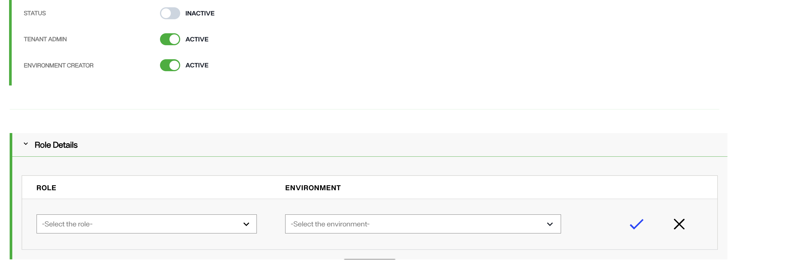

After selecting save, the *Users* tab indicates that the user status has been updated accordingly to the status you selected.

## Update role details

To update the role or environment assignments of a user, from the *Edit User* screen select the **Options** (**...**) menu next to the role and environment pairing to be edited. Select **Edit** from the drop-down to enable editing for the role and environment fields.

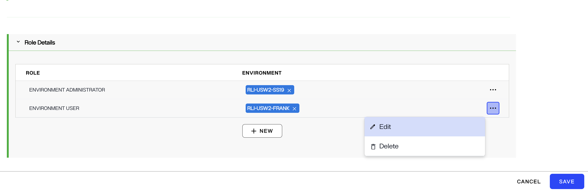

### Update user role

To update the user role, select the down arrow located in the *Role* field to expand the drop-down menu.

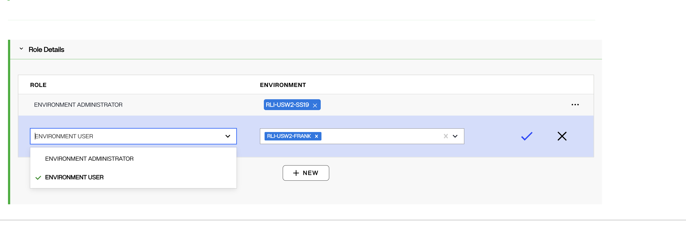

From the list of roles, select the role to assign to the user.

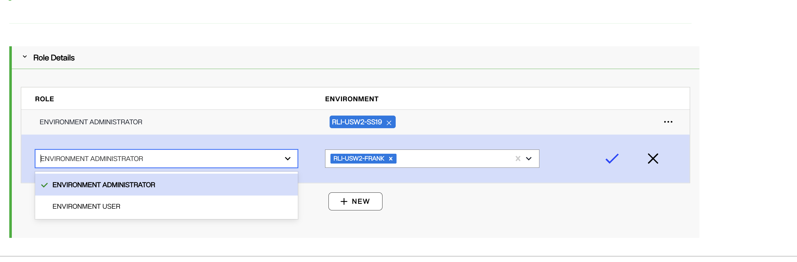

Select the checkmark icon (check mark icon) to set the new role.

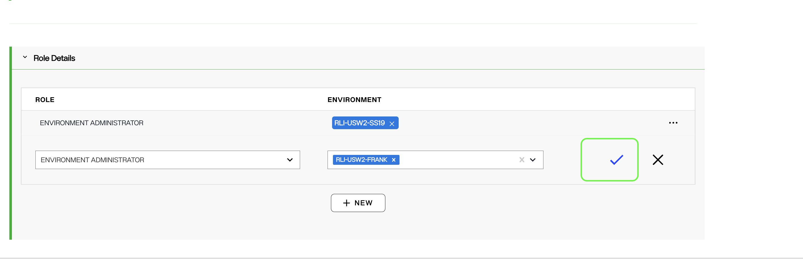

Select **Save** to update the user role.

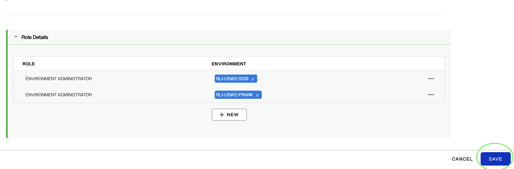

### Update environment assignments

To update environment assignments for a user, select the down arrow located in the *Environment* field to expand the drop-down menu.

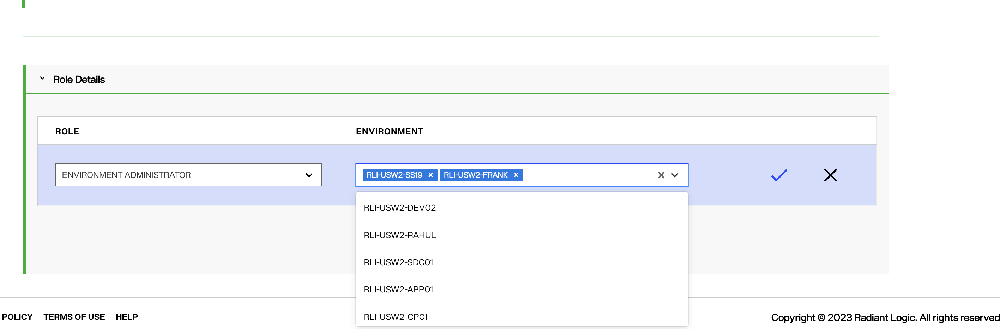

To add new environments, select the environments from the drop-down menu. Multiple environments can be assigned to a user for a given role. After you have selected all of the required environment assignments, select the upward arrow in the *Environment* field to close the drop-down.

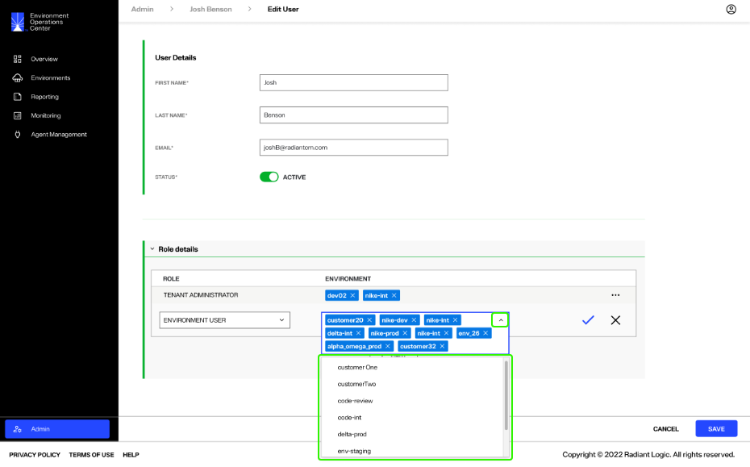

To remove assigned environments, select the **X** located next to the environment name.

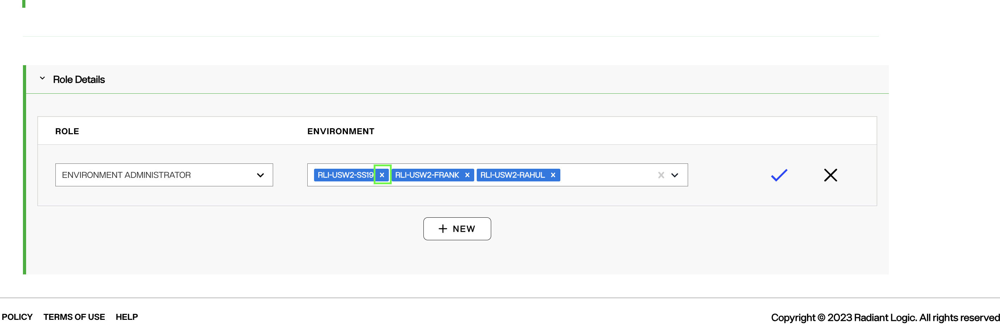

Once you have updated the user environment assignments, select the **checkmark** to set the new environment assignments.

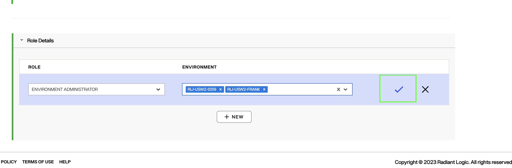

Select **Save** to update the user environment assignments.

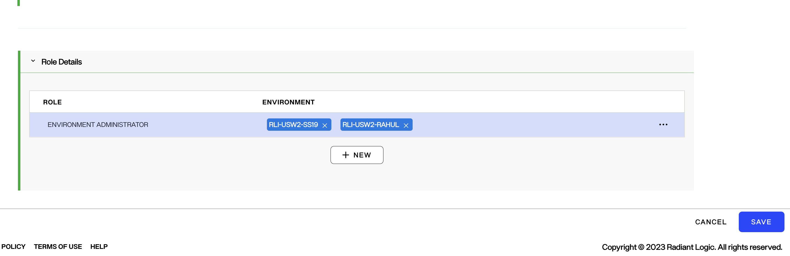

### Review user roles and environments

You can review the role and environment assignments for a user from the *Environment Access* tab. From the *Users* tab, select the name of a user in order to review the roles and environments assigned to that user.

The *Environment Access* tab of a user lists the environments they have been assigned to and their role associated with a specific environment. Review this list to ensure all role and environment assignments reflect your updates.

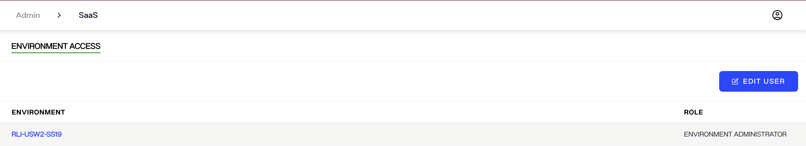

### Reset MFA Token

To reset the MFA token associated with an user, go to the options menu for that user and click on the  **Reset MFA token** . This resets the MFA token for that user and the MFA status changes from "ENABLED" to "NOT SET".

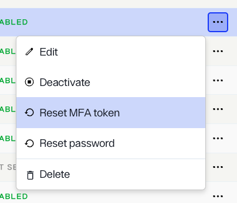

A message box appears on the top right corner of the EOC page, saying the MFA reset has been successful.

The "MFA STATUS" for the user changes to "NOT SET".

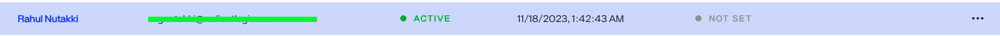

### Reset User Password

To reset the password for an user, from the options menu of the user, click **Reset Password**. A pop up asks you confim the reset of password for that user. To confirm, click **Reset password**.

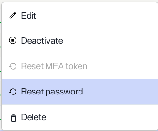

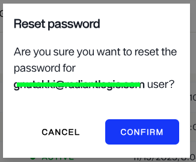

After a successful reset of the password, a message confirms the password reset for the selected user.

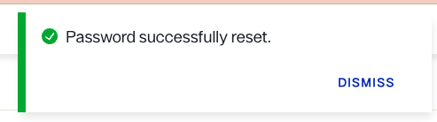

## Next steps

After reading this guide you should have an understanding of the steps required to edit an existing Environment Operations Center user, including their user details, status, role, and assigned environments. To learn how to delete a user, review the [delete a user](...) guide.
