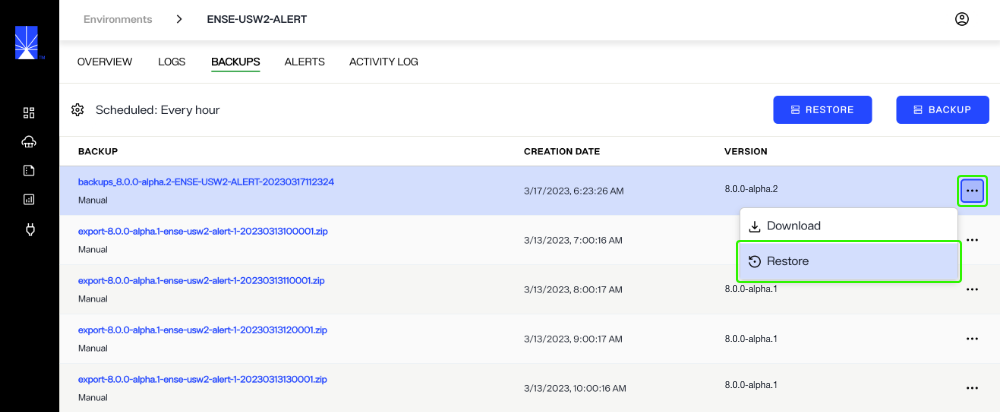
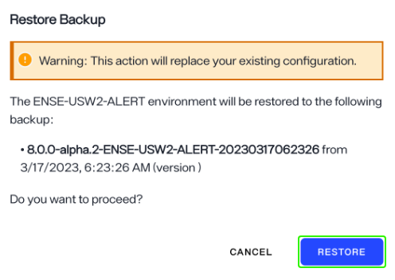
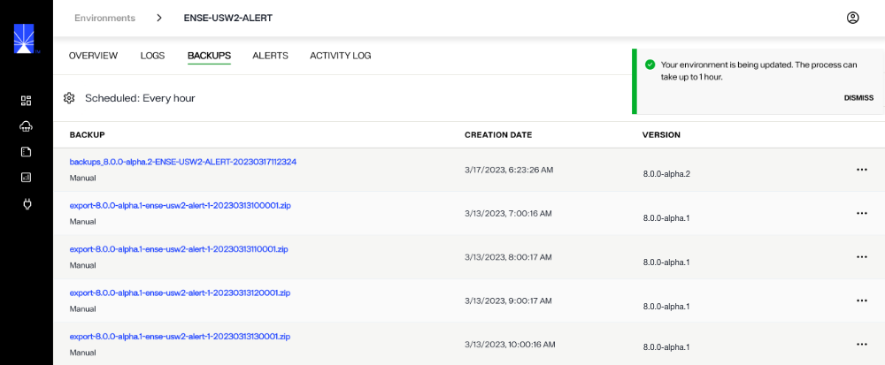
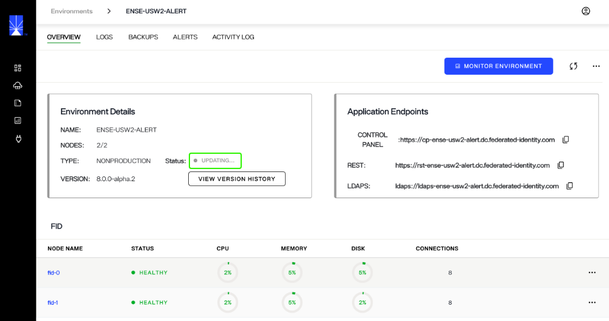
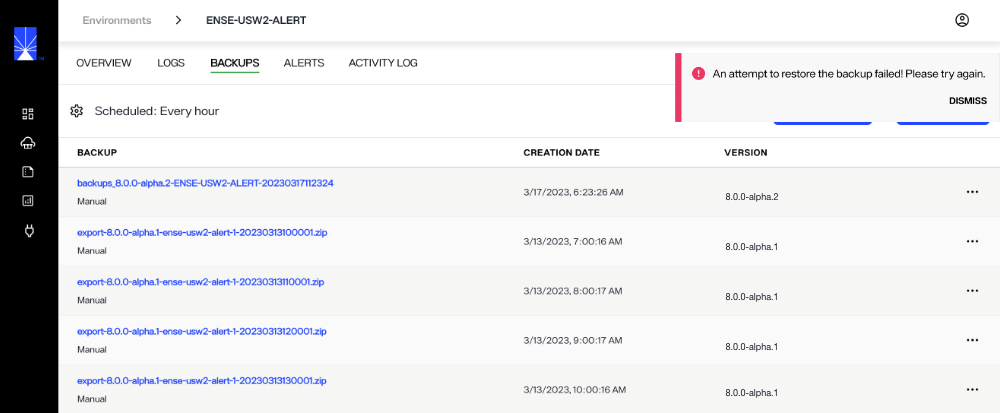
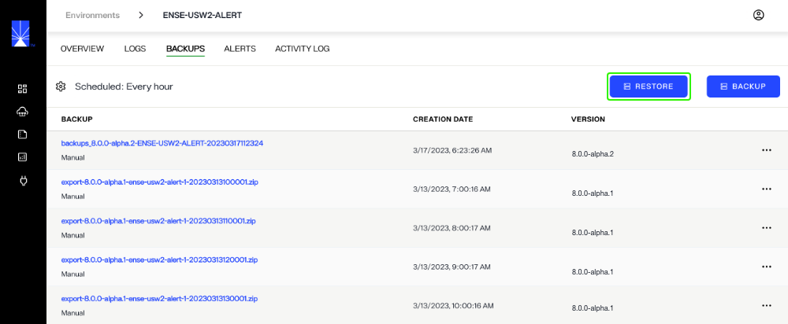
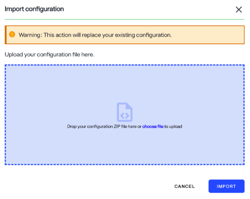
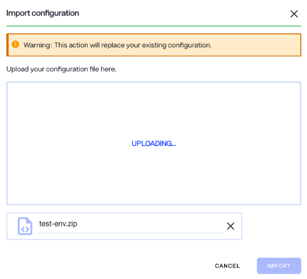
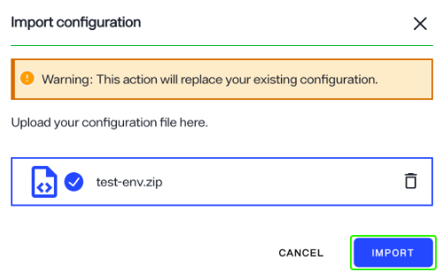
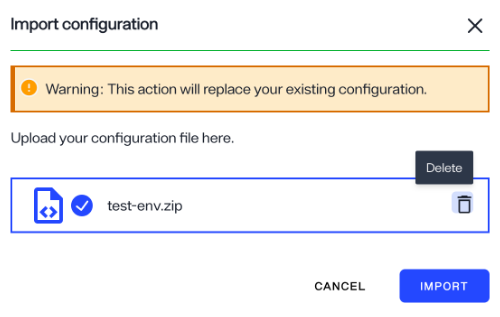

---
keywords:
title: Restore an Environment from a Backup
description: Learn how to manually restore backups of environments in Environment Operations Center.
---
# Restore an Environment from a Backup

An environment can be restored from a backup version saved to Environment Operations Center or by uploading an environment configuration file. This guide provides an overview of the steps for both methods to restore an environment to a previously backed up environment state.

## Restore an Env Ops Center backup

To begin restoring an environment from a backup version saved to Env Ops Center, locate the backup from the list and select the corresponding **Options** (**...**) menu.

From the **Options** (**...**) menu, select **Restore** to open the *Restore Backup* dialog.

### Restore backup

The *Restore Backup* dialog displays a warning notifying you that restoring a previous backup will erase your existing configuration.

[!note] Ensure you have created a backup of your current environment configuration before proceeding. For details on creating a backup, see the [create a backup](create-backup.md) guide.

The environment backup you are restoring is displayed, along with its creation date and version number. To proceed with restoring the backup, select **Restore**.

[!note] You cannot restore a backup with a version number that does not match the current version number of the environment. If the environment and backup versions don't match, you will receive a notification prompting you to update the environment. Select **OK** to close the notification and proceed to update the environment before trying to restore the backup again.

For details on updating an environment, see the [update environment](../environment-details/update-environment.md) guide.

### Confirmation

After selecting **Restore**, you will return to the *Backups* view. A message will display here confirming that the environment is being updated and the process can take up to one hour. Select **Dismiss** to close the updating notification.

While the environment is updating, the environment status will change to "Updating". This status is visible on both the *Overview* screen of the specific environment and on the main *Environments* screen next to the environment that is updating.

If the backup is successful:

- You will receive a success notification confirming that the environment has been restored to the selected backup version.
- The environment details on the environment's *Overview* screen will update to reflect the details of the restored backup.
- A restored backup action is added to the Activity Log along with the corresponding date and time stamp, and the user who performed the backup restore.

If the backup is unsuccessful, you will receive an error message indicating the backup failed and the environment status will change to "Update Failed". Select **Dismiss** to close the error message and proceed to try restoring the backup again.

## Restore from a configuration file

To restore an environment from a configuration file backup, select **Restore**.

### Import configuration

In the *Import configuration* dialog, either drag and drop the configuration file into the upload space or select **choose file** to locate the file on your system.

[!warning] Importing a configuration file will erase your current environment configuration. Ensure you have created a backup of your current environment configuration before proceeding. For details on creating a backup, see the [create a backup](create-backup.md) guide.

While the configuration uploads, an upload message will replace the upload box and a progress bar displays with the configuration file name.

Once the upload is complete, the configuration file name is displayed in the *Import configuration* dialog. Select **Import** to begin restoring the environment.

If the wrong file was uploaded, select the trash bin icon to delete the file.

### Confirmation

After selecting **Restore**, you will return to the *Backups* view. A message will display here confirming that the environment is being updated and the process can take up to one hour. Select **Dismiss** to close the updating notification.

While the environment is updating, the environment status will change to "Updating". This status is visible on both the *Overview* screen of the specific environment and on the main *Environments* screen next to the environment that is updating.

If the backup is successful:

- You will receive a success notification confirming that the environment has been restored to the selected backup version.
- The environment details on the environment's *Overview* screen will update to reflect the details of the restored backup.
- A restored backup action is added to the Activity Log along with the corresponding date and time stamp, and the user who performed the backup restore.

If the backup is unsuccessful, you will receive an error message indicating the backup failed and the environment status will change to "Update Failed". Select **Dismiss** to close the error message and proceed to try restoring the backup again.

## Next Steps

After reading this guide you should have an understanding of the steps required to restore an environment to a previously backed up state. To learn how to create an environment backup, review the guide on [creating a backup](create-backup.md).
