---
keywords:
title: Schedule Automated Environment Backups
description: Learn how to schedule automated backups of environments in Environment Operations Center.
---
# Schedule Automated Environment Backups

This guide provides an overview of the steps required to schedule automated backups for a specific environment. For details on manually creating backups, see the [create a backup](create-backup.md) guide.

## Getting started

By default the backup schduled option is set to disabled

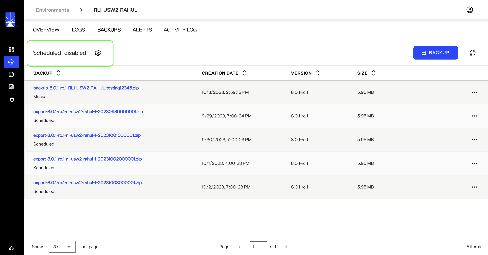

From the *Backups* tab, select the gear icon () to navigate to the *Backup Settings* screen.

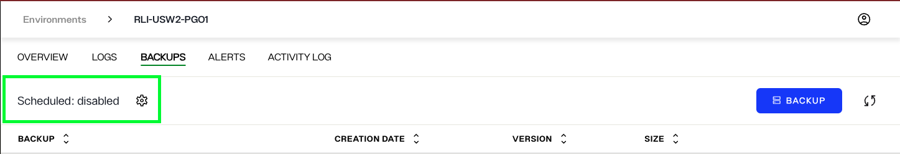

The *Backup Settings* view contains all of the fields required to create a scheduled backup.

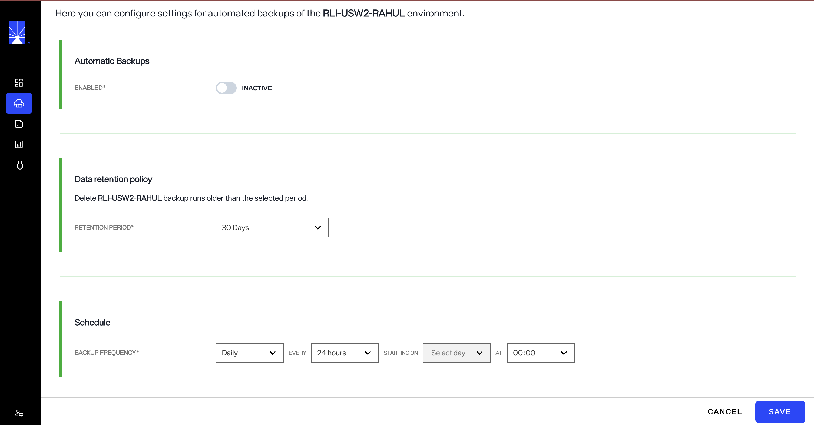

## Backup settings

To create a scheduled backup, you must complete the sections outlined on the *Backup Settings* screen. This includes "Data retention policy", "Automatic Backups" and "Schedule".

### Automatic Backups

The **Automatic Backups** section provides toggle options to enable/disable the automatic backups

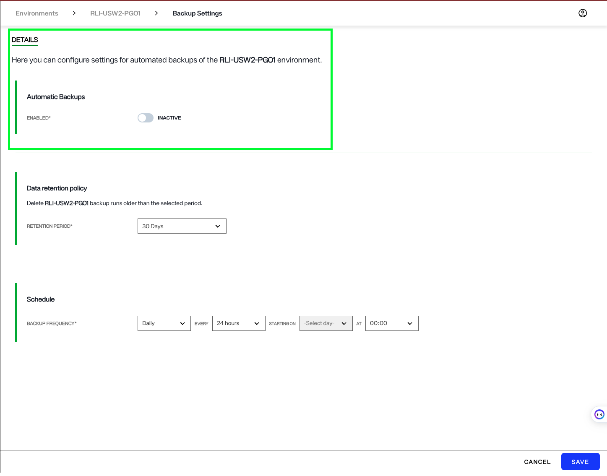

### Data retention policy

The data retention policy specifies when to delete previously created backups. To set the retention period for your scheduled backups, select a time period from the dropdown menu.

Scheduled backups can be stored for 10, 20, 30 or 60 days.

### Schedule

In the "Schedule" section you will set the frequency, period, and start time for the scheduled backup to run.

To set the frequency, select the dropdown menu and select a frequency from the list. A backup can be scheduled to run daily, weekly, or monthly.

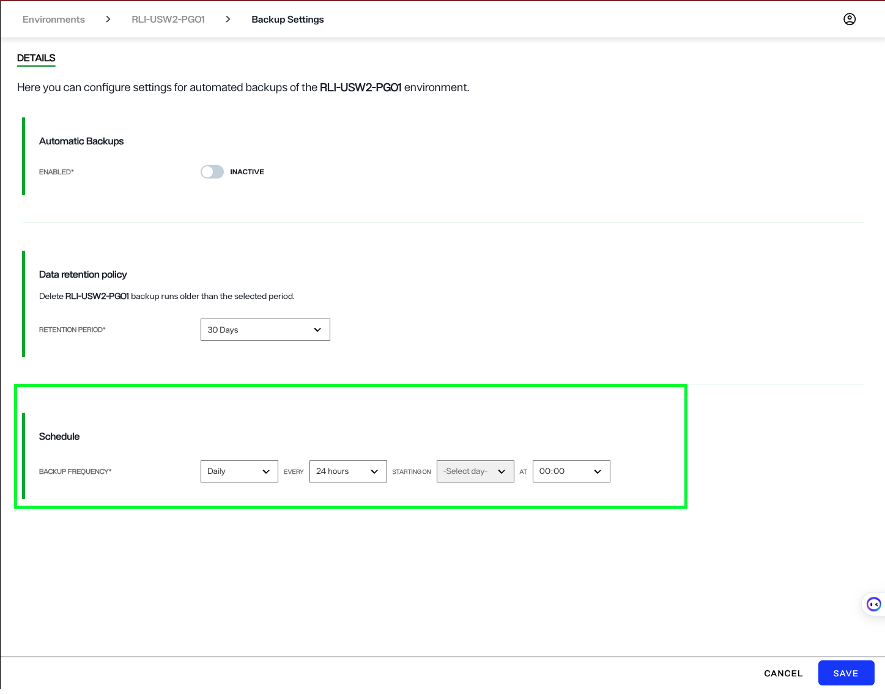

To set the backup either daily, weekly or monthly select the options from the drop-own menu

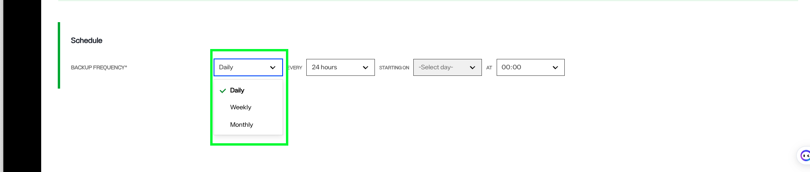

To set the backup period, select the dropdown menu and select a number of days from the list.

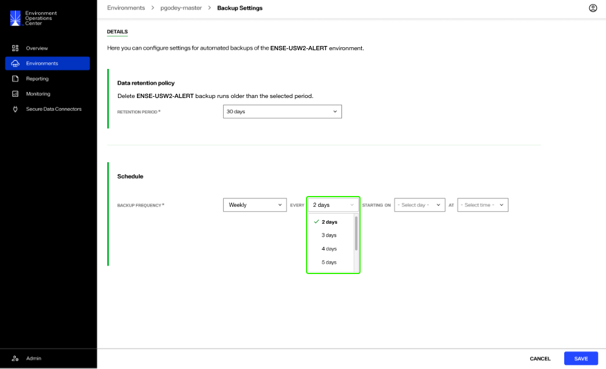

To set the backup start date, select the dropdown menu and select a week day from the list.

> **NOTE:** Backup day option is available only when Monthly is choosen for frequency

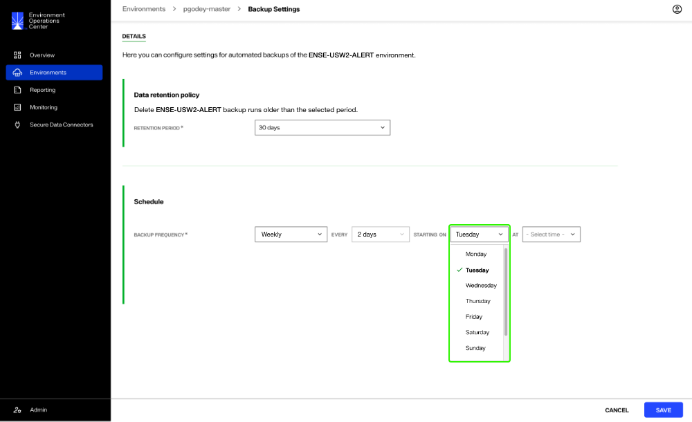

To set the backup start time, select the dropdown menu and select a time from the list. Once all fields are complete, select **Save** to create the scheduled backup.

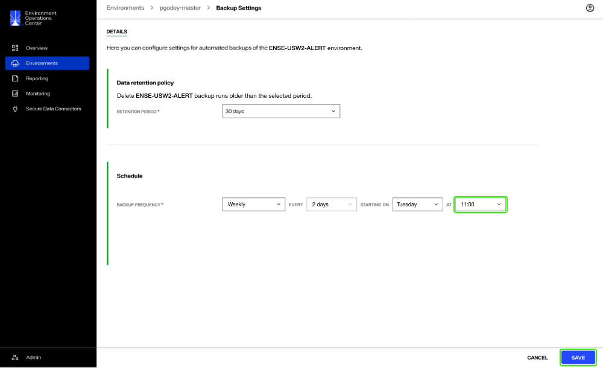

## Confirmation

Once you have saved the environment backup settings, you will return to the *Backups* tab. If the scheduled backup was successfully created you will receive a confirmation message. Select **Dismiss** to close the confirmation message.

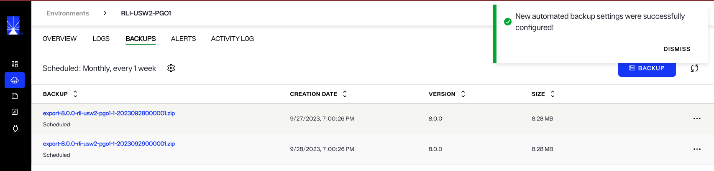

If the scheduled backup could not be created, you will receive an error message indicating that creating the scheduled backup failed. Select **Dismiss** to close the error message and proceed to try creating the scheduled backup again.

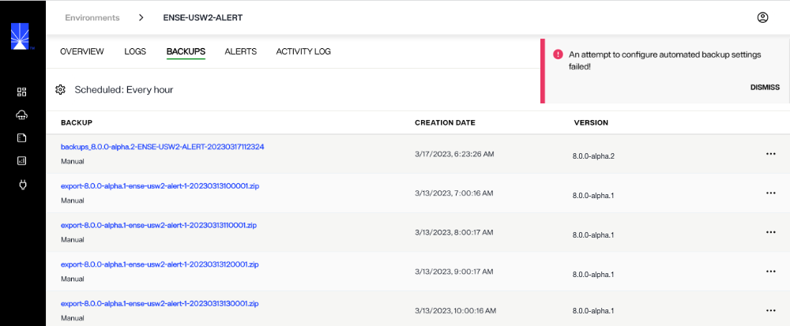

## Next steps

After reading this guide you should have an understanding of the steps required to schedule automated environment backups. To learn how to restore an environment to a previously backed up version, review the guide on [restoring an environment backup](create-backup#advanced-setup).
