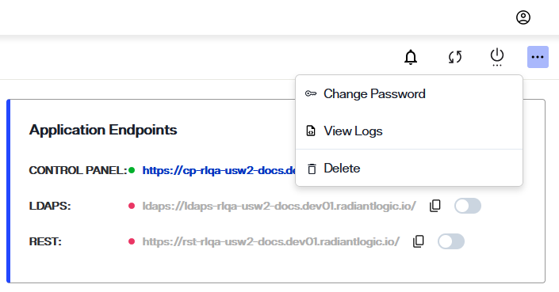
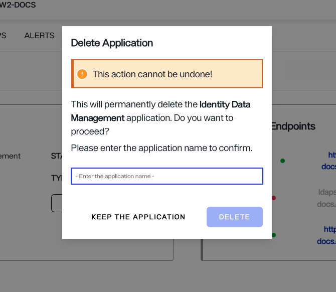

---
keywords:
title: Delete an Environment from its Detailed View
description: Steps required to delete a specific environment from its detailed view
---
# Delete an Environment from its Detailed View

This guide outlines the required steps to delete an environment from a specific environment's *Overview* screen. For details on deleting an environment from the *Environments* home screen that lists all environments, review the [delete an environment guide](../environment-overview/delete-an-environment.md).

[!note] Only non-production environments can be deleted by users. To delete a production environment, please contact Radiant Logic.

## Getting started

To begin the workflow to delete the environment, select the ellipsis next to **Monitor Environment** to expand the **Options** menu. From the **Options** menu, select **Delete**. This will open the delete environment dialog box.

## Enter environment details

[!warning] Deleting an environment is a permanent action and cannot be undone once submitted.

To delete the selected environment, enter the name of the environment in the space provided in the dialog box and select the **Delete** button. The environment name entered must match the actual environment name exactly, otherwise you will receive an error message and will not be able to submit the delete request.

If you would like to keep the environment and exit out of the confirmation dialog, select **Keep the Environment** to return to the *Overview*  screen.

## Confirmation

After selecting **Delete** in the confirmation dialog you will return to the *Environments* home screen. Here, you'll receive a confirmation message that the environment was successfully deleted and the environment will be removed from the environments list.

If the environment could not be deleted, you will return to the environment *Overview* screen and receive an error notification indicating that the attempt to delete the environment failed. Select **Dismiss** to close the error notification.

## Next steps

After reading this guide you should have an understanding of the steps required to delete an existing environment. If you would prefer to update the environment, please refer to the guide on [updating an environment](update-an-environment.md).
