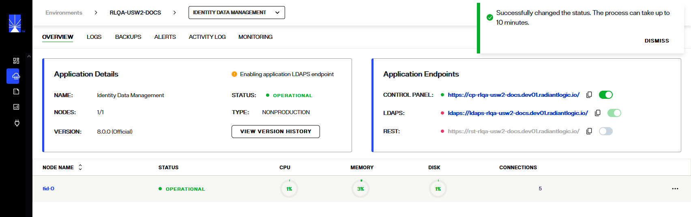
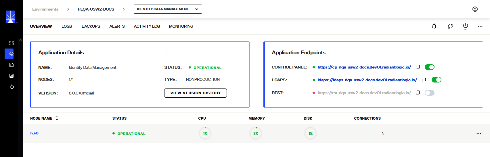
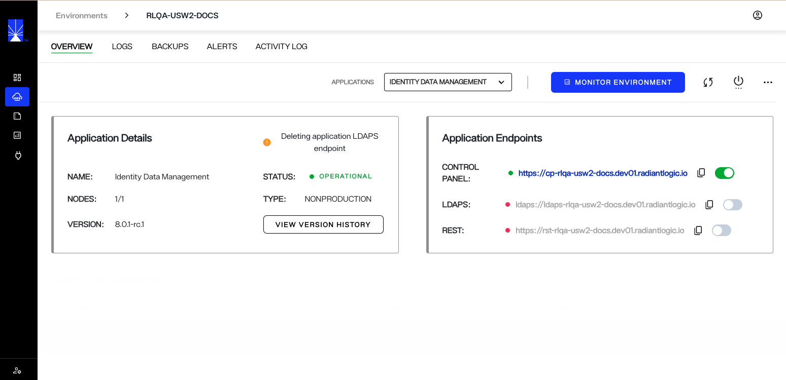
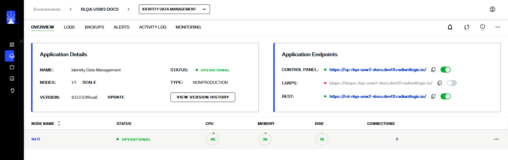
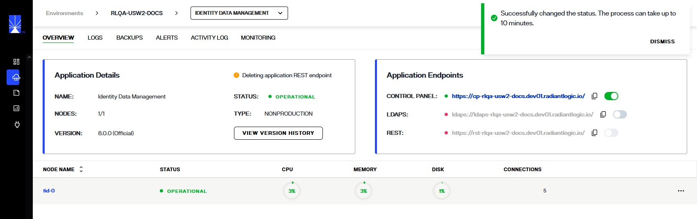

---
keywords:
title: Enable/Disable Endpoints in an Environment from its Detailed View
description: Learn how to enable/disable endpoints of environments in Environment Operations Center.
---

# Endpoints

There are three major endpoints provided through EOC and can be disbaled / enabled as required

> [!note]Enabling/Disabling endpoints should be done one endpoint at a time.

## Control Panel

The **CONTROL PANEL** endpoints provides access to the Main Control Panel of FID and is enabled by default after the environment is created.

The URL can be clicked directly and new window opens with control panel sign in page or the URL can be copy pasted into a browser

## LDAPS

The **LDAPS** endpoint provides access to the fid through LDAPS protocol
The LDAPS is disabled by default, and can be enabled by using toggle button.

When the endpoint is enabled, the toggle turns green and a message appears on the **Environment Details** panel thats says **Enabling environment LDAPS endpoint**

The endpoint enabling process takes about 5-10 minutes for an endpoint to be successfully enabled

### Disabling LDAPS

To disable the LDAPS endpoint, toggle the LDAPS endpoint (which is green)

A message appears on the Environment Details Panel that says **Deleting environment LDAPS endpoint**

## REST

The **REST** endpoint provides API access to the fid.
The REST endpoint is disabled by default, and can be enabled by using toggle button.

When the endpoint is enabled, the toggle turns green and a message appears on the **Environment Details** panel thats says **Enabling environment REST endpoint**

The endpoint enabling process takes about 5-10 minutes for an endpoint to be successfully enabled

### Disabling REST

To disable the REST endpoint, toggle the LDAPS endpoint (which is green)

A message appears on the Environment Details Panel that says **Deleting environment REST endpoint**

> If the status of the endpoint does not change and the enabling message still sppears, refresh the envrionments page.
