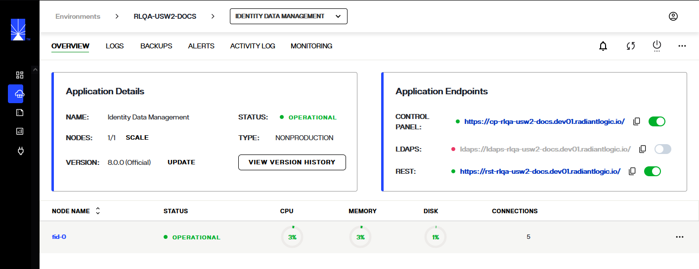
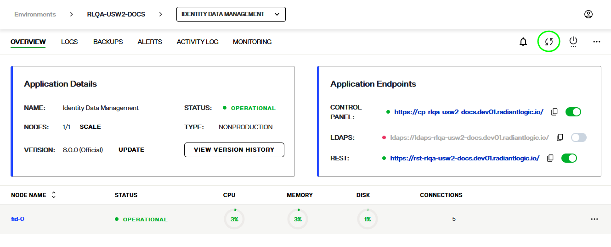
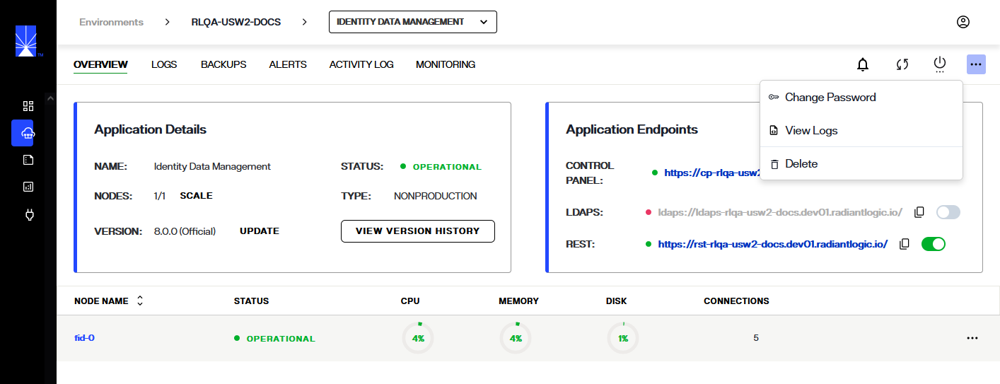
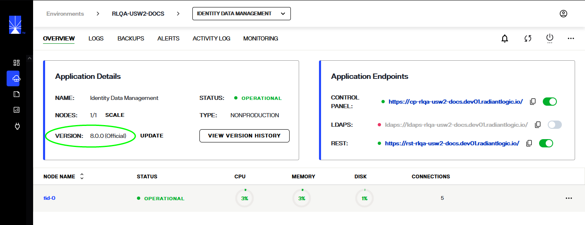
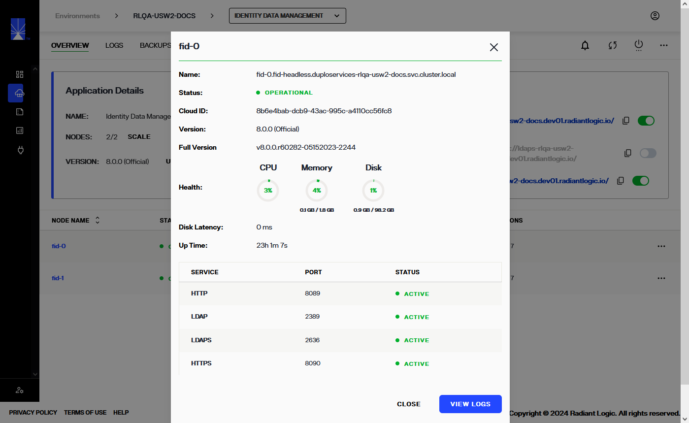

---
keywords:
title: Environment Details
description: Get a quick introduction to navigating environments in Environment Operations Center. This includes where to see an overview, how to access logs, how to create backups, how to configure alerts and where to see the activity log.
---

# Environment Details

Each environment has a detailed view where you can see further information about the environment, monitor its status, and perform various operations on the environment. This guide outlines the detailed view of an environment as seen in the environment *Overview* screen. For an overview of the *Environments* screen that lists all available environments, see the [environments overview guide](../environment-overview/environments-overview.md).

## Getting started

To navigate to the detailed view of an environment, select the environment name from the list of environments displayed on the *Environments* screen.

This brings you to the environment's *Overview* screen that displays a summary of the environment details and operation statuses. Further monitoring and updating tools for the environment are accessible from the navigation bar located at the top of the page.

## Top navigation

A navigation bar is located at the top of the *Overview* screen and is visible from all tabs in the environment details view. The top navigation allows you to access several monitoring and updating tools through the following tabs:

- Overview
- Logs 
- Backups
- Configuration
- Activity Log

### Logs

The *Log* tab allows you to view an environment's log details, imported from Elastic.

For further details on reviewing environment logs, see the [Environment Logs](../logging/environment-logs.md) guide.

### Backups

From the *Backups* tab, you can save a backup of the current environment configuration and view previous backups.

For information on managing your environment backups, refer to the [backup and restore documentation](../backup-and-restore/backup-restore-overview.md).

### Alerts

The *Alerts* tab provides an overview of all alerts that have been triggered for the environment including the alert message, the channel the alert was sent to, date, and status. 

For details on creating environment alerts, see the [alert management](../../admin/alert-management/alert-management-overview.md) guide.

### Activity log

Under the *Activity Log*, you can view a list of all actions performed on an environment. Each action has a corresponding time and date stamp of when it was performed and the user who performed the action is also listed.

## Monitor environment

A **Monitor Environment** button is located near the top of the *Overview* screen. Select **Monitor Environment** to navigate to the monitoring section with the current environment selected.

For further details on monitoring environments, see the [monitoring](../../monitoring/monitoring-overview.md) guide.

## Refresh Environment Details

A refresh button is located next to **Monitor Environment**. Select **Refresh** to display the most up to date details for the environment.

## Environment options

An expandable **Options** (**...**) menu is located next to the **Monitor Environment** button. Selecting the **Options** (**...**) dropdown menu displays the options to **Update**, **Scale**, or **Delete** the environment.

To learn how to update or delete the environment, review the respective [delete environment](delete-environment.md) or [updated environment](update-environment.md) guides. For details on monitoring and adjusting nodes, see the [update and monitor nodes](node-details.md) guide.

## Environment details

The *Environment Details* section outlines the environment name, scale, type, status and version number.

### Status

The environment status will change depending on the state of the environment. Statuses include:

- Operational: The environment is fully operational with 100% of services running.
- Warning: There are services down. This can range from 10%-90% of services.
- Outage: There are too many services down for the environment to operate. Less than 10% of services are running.

### Version

If the environment version is out of date, an "Update Now" message appears next to the version number. 

For details on updating the environment, review the [update environment](update-environment.md) guide.

You can view the environment's version history by selecting the **View Version History** button in the lower right corner of the *Environment Details* box. 

See the guide on [version history](version-history.md) for further details on reviewing and restoring an environment's previous versions.

## Endpoints

The *Application Endpoints* section lists all of the environment endpoints.

## Node monitoring

The lower section of the *Overview* page displays monitoring sections for the FID nodes of an environment. The status, CPU, memory, disk space, and number of connections are provided for each node.

Node status will be listed as "Healthy", "Warning, or "Outage", indicating that the node is either operational, experiencing a partial outage, or experiencing a complete outage.

CPU, memory, and disk are all displayed as color-coded percentages to indicate their health.

- Green: Indicates the component is operational.
- Yellow: Indicates the component has a partial outage.
- Red: Indicates a full outage.

An expandable **Options** (**...**) menu is available for each node. Selecting the **Options** dropdown menu displays the options to **View Details** or **View Logs** for the selected node. 

For further details on reviewing nodes details, see the [node details](node-details.md) guide.

## Next steps

After reading this guide you should be able to navigate the *Overview* screen of an environment and understand its main features including the top navigation, Environment Details, Application Endpoints, and Node Monitoring. For details on updating the environment, review the guide to [update an environment](update-environment.md).
