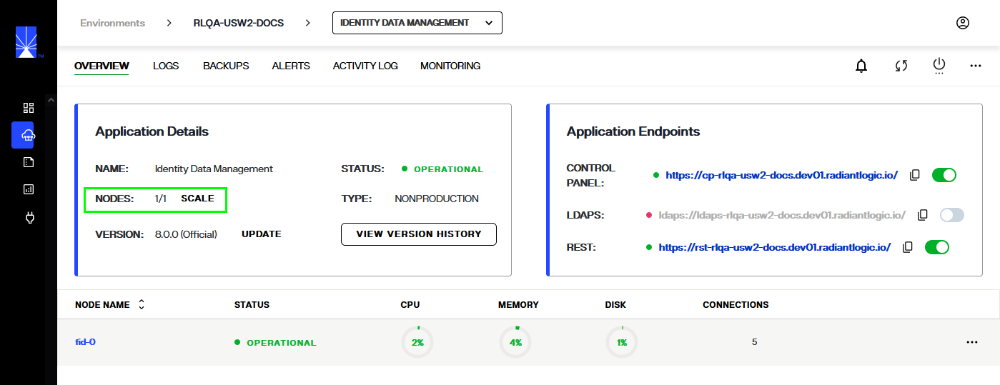
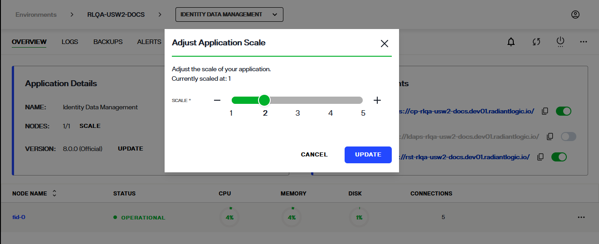
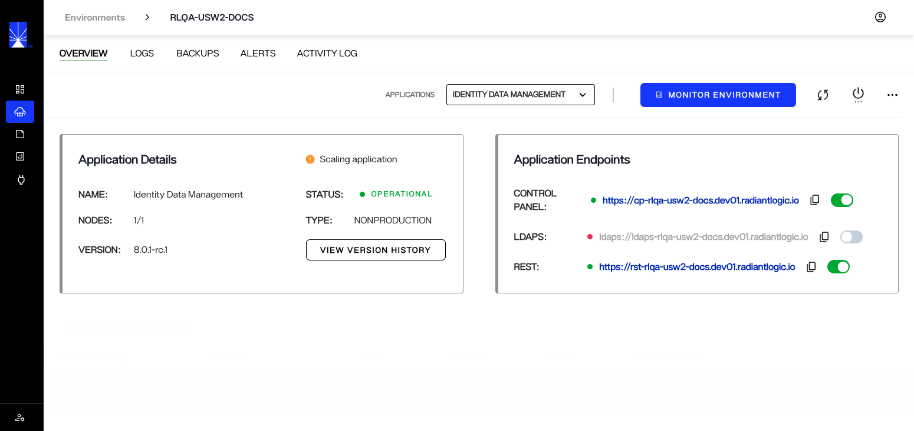
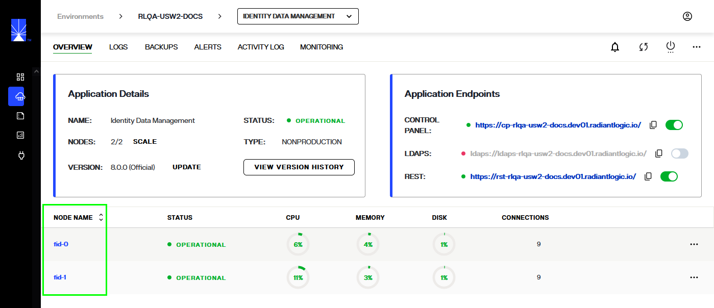
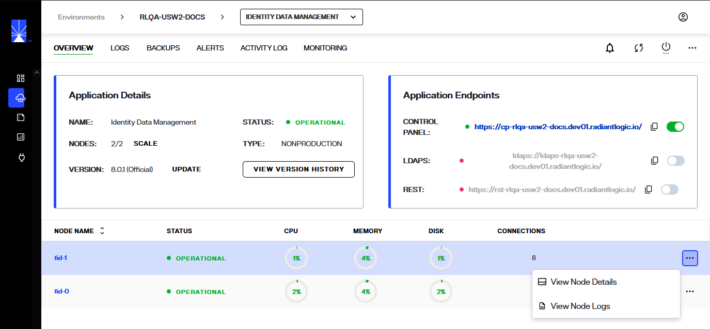
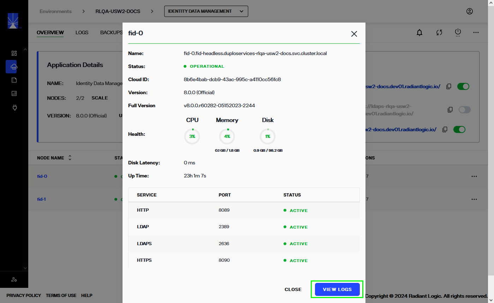
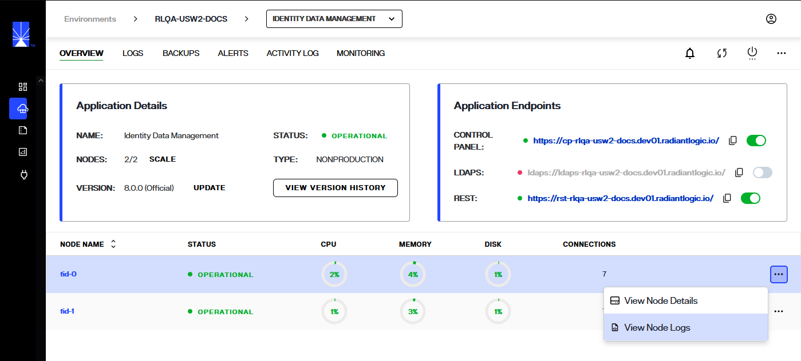

---
keywords:
title: Update and Monitor Environment Nodes
description: Learn how to adjust the number of nodes in a RadiantOne cluster and to monitor the status details of a specific node.
---
# Update and Monitor Environment Nodes

This guide describes how to adjust the number of nodes in an environment and to monitor the status details of a specific node. The *Overview* tab provides a high-level view of all FID node statuses for quick monitoring of cluster health. Each individual node has a detailed view that provides further information on the status and health of a given node.

## Adjust number of nodes

To set the number of FID nodes contained in an environment, select the  **Scale** option under "Application Details"

In the *Adjust Environment Scale* dialog, use the slider to increase or decrease the quantity. Alternatively, you can select either the minus (**-**) or plus (**+**) sign on either side of the slider to increase or decrease the number of FID nodes to display.

By default the scale reflects the number of nodes at the current state. Adjust the scale to required number of nodes.

Click **UPDATE** to confirm your selection.

A message indicates that the environment scale is in process.

The number of nodes in the environment increases or decreases accordingly.

## View node details

There are two ways to access the status details for a specific node: select the node name to open node details or select the **Options**(**...**) menu.

You can select the node name to open the node details dialog.

Alternatively, you can select the **Options** (**...**) menu located in the node row to expand the drop-down menu. From the **Options** menu select **View Node Details** to open the the node details dialog.

### FID node details

The FID node details dialog provides the following information for the selected node:

| Node Details | Definition |
| ------------ | ---------- |
| Name | The name assigned to the specific FID node. |
| Status | Indicates if the node is operational, experiencing a partial outage, or experiencing a full outage. Displays as "Healthy", "Warning", or "Outage". |
| Cloud ID | The unique ID of the node within the cluster of an environment. |
| Version | The environment version number. |
| Health | The status of the CPU and quantity used of memory and disk space. |
| Disk Latency | The node performance. |
| Up Time | How long the application has been running. |
| Services | Lists the internal ports and their statuses. |

## View node logs

Each node has associated log files that contain further information about the node's health and status alerts. The log files for a specific node can be accessed from the node details dialog or from the **Options** (**...**) drop-down of a node.

To access log files from a node's details dialog, select **View Logs** in the dialog.

Select **Close** to exit the node details dialog.

Alternatively, the log files of a node can be accessed by selecting **View Logs** from the associated **Options** (**menu**).

> [!note] For further details on reviewing logs, see the [environment logs](../logging/environment-logs.md) guide.

## Next steps

After reviewing this guide, you should have an understanding of how to review the status and health of specific FID nodes. For information on reviewing environment logs, see [environment logs](../logging/environment-logs.md).
