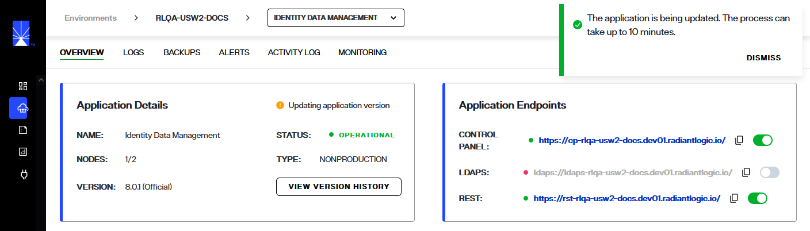

---
keywords:
title: Update an Environment from its Detailed View
description: Learn how to manually update the RadiantOne version running in an environment.
---
# Update an Environment from its Detailed View

When version updates are applied to your Environment Operations Center instance, your environments are not updated automatically. There are two ways that you can manually update the version of individual environments: From the *Environments* home screen or the *Overview* screen of the environment that you wish to update. This guide outlines the steps required to update an environment from its *Overview* screen. For details on updating an environment from the *Environments* home screen, review the overview guide on [updating an environment](../environment-overview/update-an-environment.md).

> **NOTE:** Before getting started, make sure you know the current version of Environment Operations Center and the required number of FID nodes to display for each environment that requires updating.

## Managing environment updates

When an environment requires updating, an **Update** message appears next to the environment version number under "Environment Details".

### Begin update

There are two ways to begin the environment update workflow from the *Overview* screen, either from the **Options** menu (**...**) or by selecting the **Update** message.

To update using the **Options** menu, select the ellipsis (**...**) located next to the **Monitor Environment** button to display the environment's **Options** menu. From the dropdown menu, select **Update** to open the *Update Environment* dialog box.

Alternatively, you can select the **Update Now** message located next to the environment's version number. This will also open the *Update Environment* dialog box.

### Update version number

The *Update Environment* dialog box contains a **Version** dropdown field to update the environment version. To update your version number, select the correct number from the **Version** drop down menu. Your currently installed version number is displayed just above the dropdown menu for reference.

> **NOTE:** Environment versions can only be updated incrementally. You must select the version number that immediately succeeds your current environment version.

Once you have selected the correct version number, select **Update** to begin updating the environment.

To quit the update and return to the environment *Overview* screen, select **Cancel**.

### Environment update confirmation

After selecting **Update** you will return to the *Overview* screen. An updating confirmation message displays notifying you that the update is in progress and could take up to 1 hour.

While the environment is updating its status will display as "Updating", the **Update Now** message will no longer be visible, and the **Options** (**...**) menu will be greyed out and unable to be selected.

If the environment updates successfully, you will receive a success notification and the environment status will change to "Operational".

If the environment update is unsuccessful, you will receive an error notification and the environment status will change to "Update Failed". Select **Dismiss** to close the notification and proceed to retry updating the environment.

## View version history

To view updates previously applied to an environment, select **View Version History** located in the *Environment Details* section.

The *Version History* dialog lists all updates applied to the environment by their version number in chronological order. Each update also has a time and date stamp for when the update was applied and lists the user who performed the update.

## Next steps

After reading this guide you should have an understanding of the steps required to update an environment. To learn how to adjust the number of environment nodes, see the [update and monitor environment nodes](node-details.md) guide. For details on backing up and restoring environment versions, see the [backups overview](../backup-and-restore/backup-restore-overview.md).
