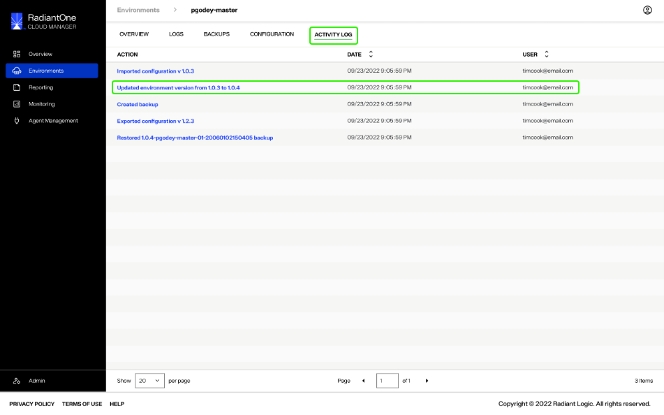

---
keywords:
title: Individual Environment Version History
description: Guide to view and revert to an environment's version history
---
# Individual Environment Version History

Environment Operations Center maintains a chronological record of all updates applied to each environment. This allows you to review previous updates and revert to an earlier version of the environment if required. 

This guide outlines the steps to review the version history of an environment. For details on restoring an environment to a previous version, see the [restore an environment backup](../backup-and-restore/restore-backup.md) guide.

## View version history

You can review the version history of an environment either by selecting the **Version History** button under *Environment Details* on the *Overview* screen or by selecting the **Activity Log** tab from the top navigation.

### Version history

Selecting **Version History** from *Environment Details* opens the *Version History* dialog box. 

The *Version History* dialog lists all updates applied to the environment by their version number in chronological order. Each update also has a time and date stamp for when the update was applied and lists the user who performed the update.

### Activity log

The *Activity Log* screen displays a chronological record of all actions that have been performed on the environment, including previous updates. This screen lists the action, the date and time stamp of when it was performed, and the user who performed the action.

Environment version updates will be clearly labeled with "Updated environment version from '*x*' to '*y*'".

## Next steps

After reading this guide you should be able to review an environment's version history from the *Version History* dialog or from the *Activity Log*. For information on monitoring node statuses, see the guide on [node details](node-details.md).

