---
keywords:
title: Create an Environment
description: Learn how to create a new environment in Environment Operations Center.
---
# Create an Environment

This guide provides an overview of the steps required to create a new environment in Environment Operations Center.

An environment is where a RadiantOne product lives. Each environment is completely isolated and contains endpoints to access different applications. Each instance of Env Ops Center has a predefined number of production and non-production environments that can be created for production, development, quality assurance, and staging purposes.

## Getting Started

Before setting up your environment, you need the following:

- The version number that corresponds with your instance.
- If you are importing a configuration file, ensure you have the correct file type saved and ready to go.

The new environment setup requires you to define the environment type, details, and provides an optional step to upload a configuration file from another environment.

## New environment set up

To create a new environment, select **New Environment** on the *Environments* home screen or from the *Overview* home screen.

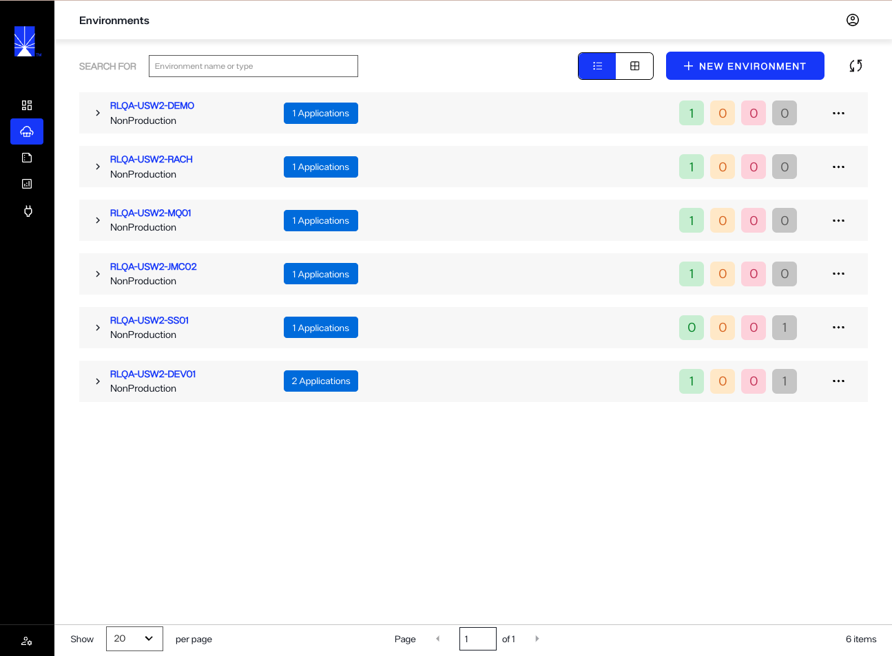

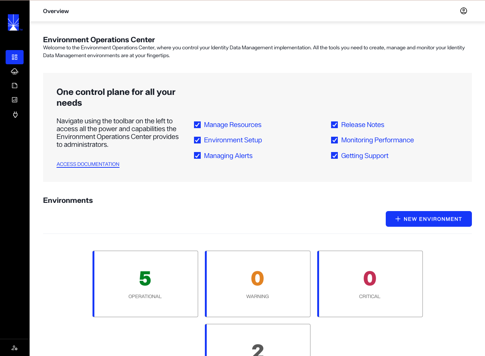

This takes you to the *New Environment* page that contains all the input fields for the information required to create a new environment. The following sections outline how to complete these required fields.

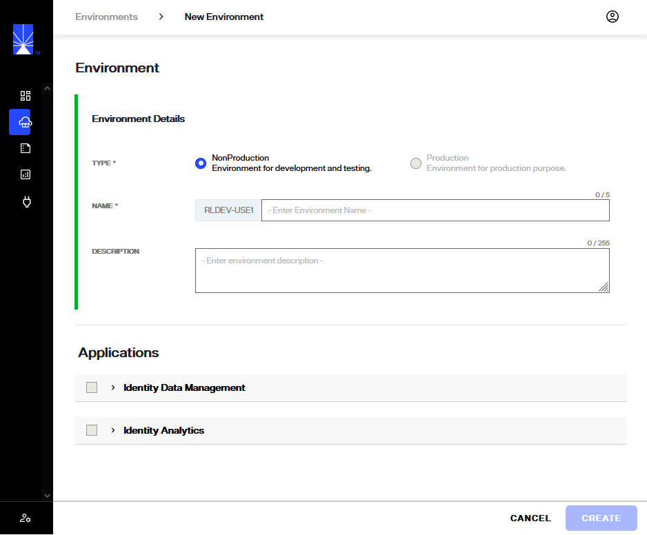

### Define Environment Type

Start by selecting the required **Environment Type**.

#### Environment type

To set the **Environment Type**, use the radio buttons to select either **Non-production**, for development and testing, or **Production**, for production purposes.

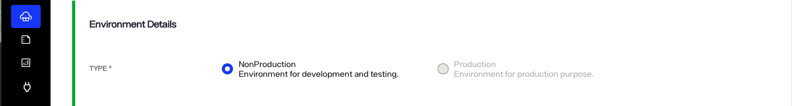

#### Environment Name

To set the **Environment Name**, enter a unique name in the space provided. Names must follow the naming convention: can be alphanumeric, can contain underscores and hyphens, cannot contain any other special characters, and can contain 18 characters or less.

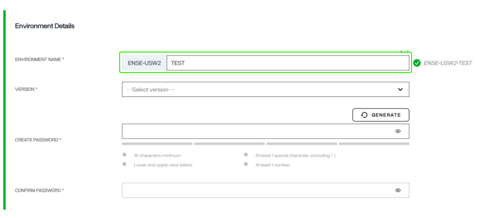

#### Applications

To deploy an IDM (Identity Data management) application select the box adjacent to "Identity Data management" this deploys FID and when expanded you will need fill in the Application Details.

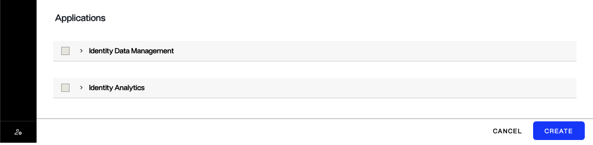

#### Application Details

Under the **Application Details** section, set the version, password , confirm password. Password can also be auto generated by clicking on **GENERATE** button

Also under the **Application Details** are the options to **INSTALL SAMPLES** and **ADVANCED SETUP** which are toggle buttons and provide options to install sample stores in the application and also create an applicatin using a migration export from another environment.

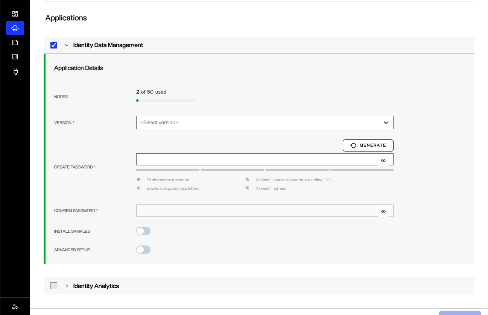

#### Version

To set the Environment **Version**, select the version drop down to display all available versions. Select the value that corresponds with your organization's version of Environment Operations Center.

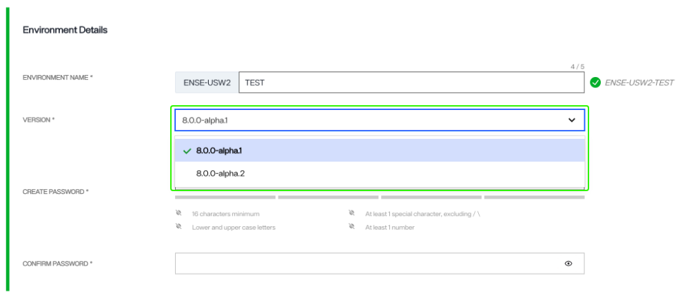

#### Password

Select a password by either entering your chosen password in the space provided, or by selecting the **Generate** button to have a password automatically generated for you.

> Passwords must be a minimum of 12 characters, contain at least 1 special character, contain lower and upper case letters, and contain at least 1 number.

Depending on the complexity and strength of your password, you will receive a notification that your password is "Weak", "Fair", "Good", or "Strong". It is recommended that you adjust the password until you receive a "Strong" rating. Adjust your password accordingly to ensure you have entered a strong password before proceeding to the confirmation step.

To confirm your password, reenter or copy and paste your password in the confirmation space provided. If you selected to have a password automatically generated, the password will also automatically populate in the confirmation text box.

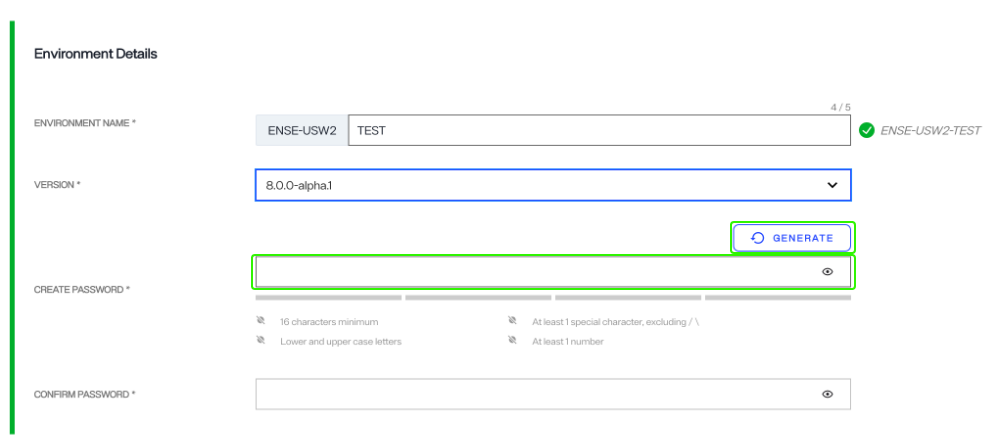

To reveal your original or confirmation password, select the eye icon () located within the text field you wish to view.

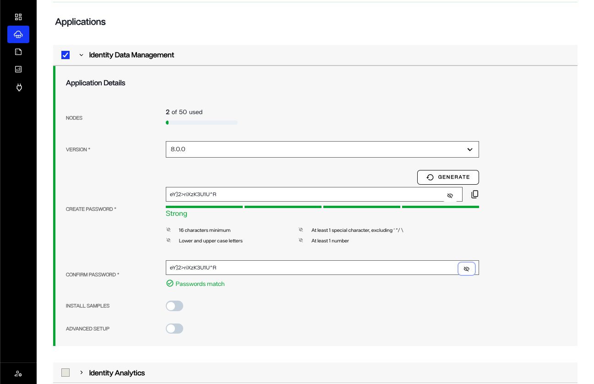

#### Create the new environment

Completing the steps outlined in the *Environment Type* and *Application Details* sections are all that is required to set up your new environment. Once both sections are complete, select **Create** to create the new environment.

> If you would like to upload a configuration file from an external environment, proceed to the *Advanced Setup* section.

### Advanced Setup

An optional advanced setup is available if you would like to upload a configuration ZIP file from another environment or create the environment using samples. Enable advanced setup by toggling on **Advanced Setup**.

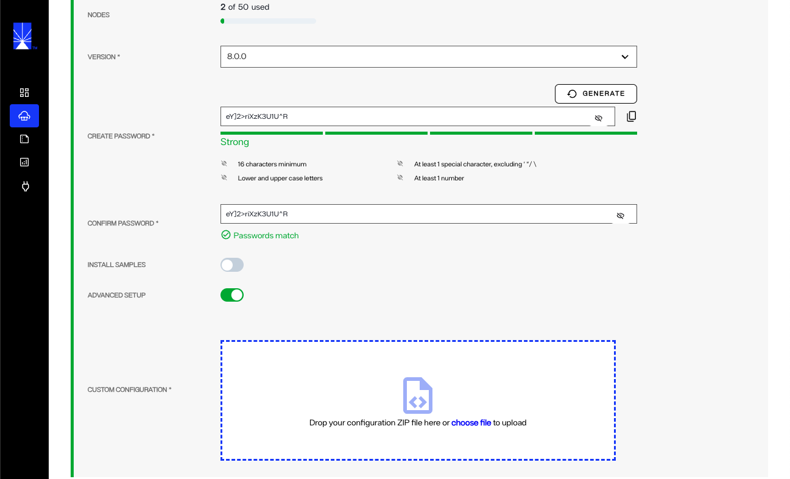

The **Install Samples** option imports sample data. See the [quick start](../../../quick-start-guide/02-understanding-default-configuration-and-samples.md) guide for further details about sample data.

#### Custom Configuration

To import a configuration file, select the configuration ZIP file to upload. You can locate the file on your system and drag and drop it into the provided space. Alternatively, you can select **choose file** within the upload box to open your system's file manager and locate the file to upload.

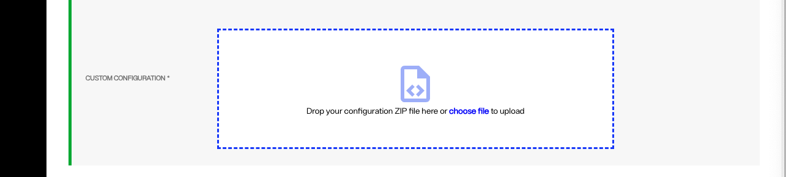

While your file is uploading, an **Uploading** message displays in the file upload box, along with a progress bar. You can cancel the file upload while it is in progress by selecting the **X** located in the progress bar box.

Once your configuration file has successfully loaded, the file name displays in place of the file upload box. Select **Create** to create the new environment.

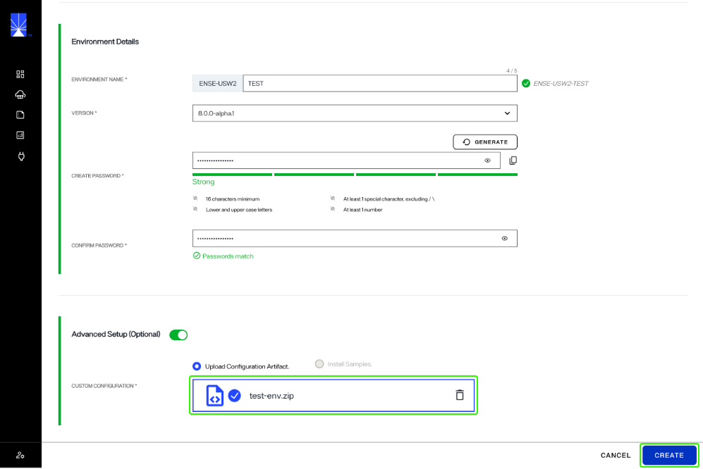

To delete the file and return to the file upload screen, select the trash can icon located in the same box as the successful file upload.

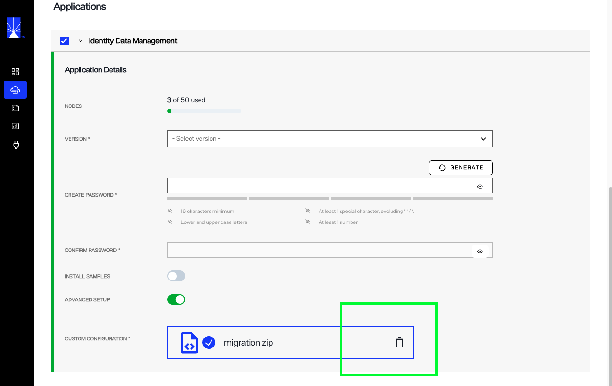

If the file upload is not successful, the configuration upload box displays with a red dashed outline and an error message appears just below. Review your file type to ensure you have selected the correct configuration file for upload and try again.

## New environment confirmation

After saving the New Environment details form, you return to the *Environments* home screen. A confirmation message appears noting that your environment is being created and that the process can take up to 1 hour. The status of your new environment shows as "Creating". Select **Dismiss** to close the confirmation message.

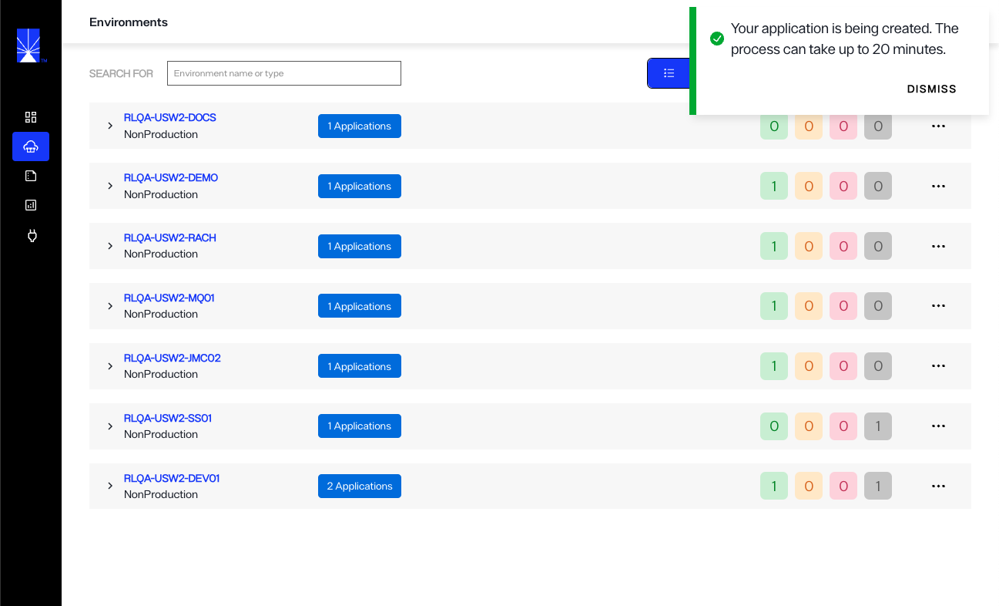

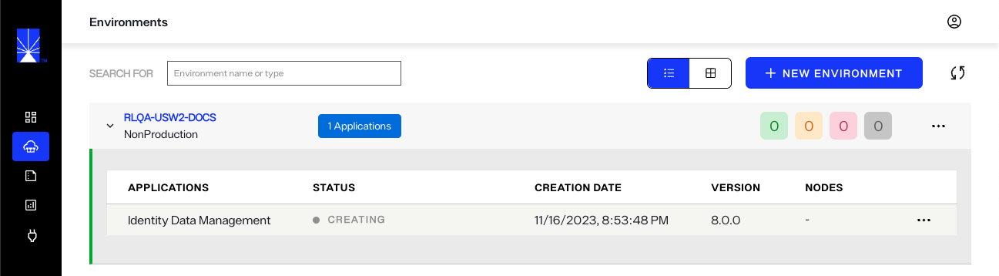

Once the environment has been successfully created, the environment's status changes to "Operational".

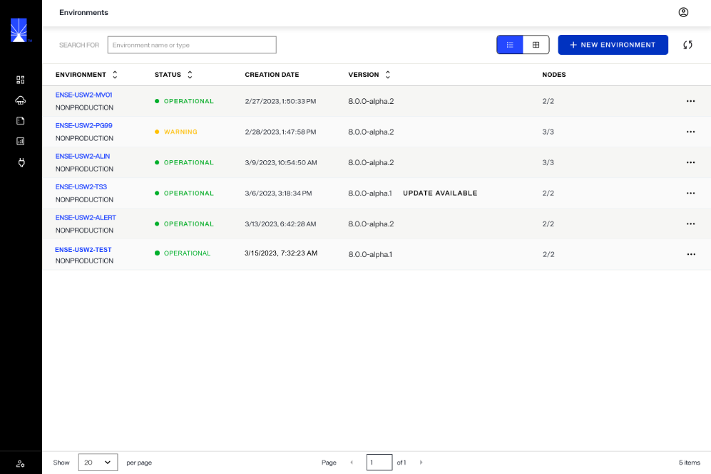

### Form submission failure

If there is an issue with the form submission, an error message states that the new environment creation failed and the new environment will no longer be visible in the environment list on the *Environments* home screen. Select **Dismiss** to close the error message and proceed to restart the workflow to create a new environment.

### Failure to create new environment

If there is an error and the environment cannot be created, the environment status changes to "Creation Failed".

Select the ellipsis (**...**) in line with the environment to display a list of options. Options include:

- **Submit Again**: resubmit the same form without editing any of the fields.
- **View Logs**: troubleshoot where the error may have occurred while the form data was processing.
- **Delete**: if the environment hasn't been successfully created, delete the failed instance.

## Next Steps

After reading this guide you should have an understanding of the steps required to create a new environment and optionally how to upload a configuration file during new environment creation. To learn how to update an existing environment, review the guide on [updating an environment](update-an-environment.md).
