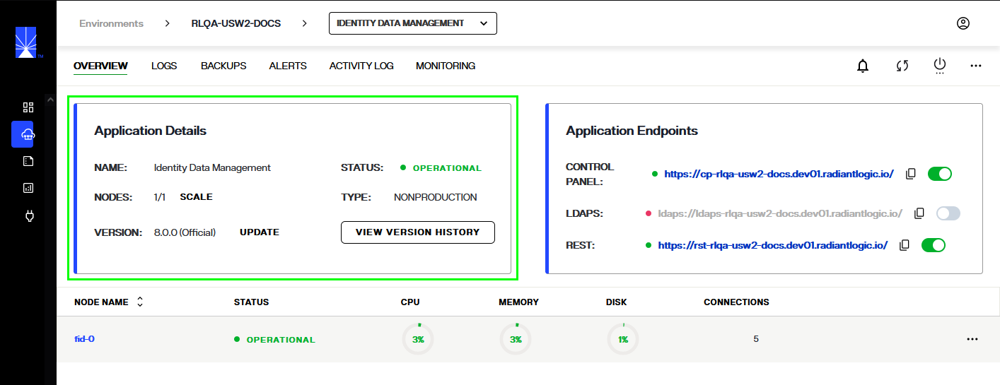

---
keywords:
title: Environments Overview
description: Learn how to access environment details and status in Environment Operations Center, and understand the topics accessible in the options menu.
---
# Environments Overview

This guide provides an overview of the *Environments* home screen and its features. To navigate to the *Environments* home screen, select **Environments** in the left navigation.

The *Environments* home screen provides an overview of all your organization's available environments. Each environment is displayed with a set of 4 blocks, each with a different color, and provides information about the applications like if they are in operational, warning, critical or offline state.

Two environment display views are available, either list- or grid-view. In the list-view, environments are organized by row with the associated environment details contained in the row.

In the grid-view, environments are organized in a card format with associated details for an environment contained within the card.

Each environment has its own **Options** menu (**...**) that allows you to either ADD or DELETE the environment.

In the list-view, the options menu is located at the end of an environment row.

In the grid-view, the options menu is located in the upper corner of an environment card.

A **Search For** bar at the top of the *Environments* screen can be used to filter the listed environments. Enter an environment name, specific characters, or words in the space provided to quickly filter through the environments.

A refresh button is located in the upper right corner of the *Environments* screen. Select the refresh icon to pull up to date information about the environments.

## Environment details

To access further details about an environment, select the name of the environment you wish to view.

This brings you to the environment's *Overview* screen, where you can view further information about a given environment, such as node status or connections, and perform monitoring and updating actions.

> To learn more about the environment *Overview* features, review the [environment details](environments/environment-details/environment-details-ui.md) guide.

## Environment status

The environment **Status** indicates the current state of the environment. Statuses automatically change as operations are performed on an environment or if any errors have occurred. Environment statuses include:

- Operational: Indicates all FID and Zookeeper nodes are running.
- Warning: There are nodes not running, but the minimum number of nodes required for an environment to operate are running.
- Critical: This indicates that there is some issue with the application.
- Offline: This indicates that the application has been stopped and is in offline state.
- Outage: The minimum number of nodes required for an environment to operate are not running.
- Update failed: An attempt to update the environment failed.
- Creation failed: An attempt to create a new environment failed.
- Import failed: An attempt to import a configuration file failed.
- Updating: The environment is currently updating (this can take up to 1 hour).
- Creating: The environment is currently being created (this can take up to 1 hour).

## Environment creation date

The **Creation Date** indicates the date and time when the environment was created.

## Environment version

**Version** indicates the current version of the environment. The version number is set by the environment administrator during environment setup. If the environment version number no longer matches the current available version of Environment Operations Center, an "Update" notification is displayed next to the version number prompting you to update the environment.

To learn more about updating an environment, review the [update an environment](update-an-environment.md) guide.

## Environment nodes

**Nodes** indicates the number of nodes in the environment. The number of nodes is set by the environment administrator during environment setup. An environment Administrator can increase or decrease the number of nodes in an environment at any time.

To learn more about adjusting the number of nodes in an environment, see the [update and monitor nodes](../environment-details/node-details.md) guide.

## Options Menu

To view a list of operations that can be performed on a given environment, select the ellipsis (**...**) in the environment row or card to expand the **Options** menu. Options include:

- **View Details**: takes you to an environment's *Overview* screen where you can view further details about the environment. To learn more about the environment *Overview*, review the [environment overview guide](../environment-details/environment-details-ui.md).
- **View logs**: takes you to an environment's *Logs* screen where you can view log files for a given date range. To learn how to review logs, visit the environment details [logs](../environment-details/environment-logs.md) guide.
- **Delete**: opens the dialog to being the workflow to delete an environment. For information on deleting an environment, review the [delete and environment](delete-an-environment.md) guide.

## New environment

The **New Environment** button allows you to quickly start creating a new environment from the home screen. For details on how to create a new environment, review the guide on [creating a new environment](create-an-environment.md).

## Access Permissions

Depending on your role, your administrator may set your access permissions to read-only for certain environments. If you have read-only access:

- You will not be able to create new environments and the **New Environment** button will be deactivated.
- Certain environments will be hidden if you have not been assigned either read-only or editing permissions.
- You will not be able to edit or update the environments that you have read-only access to and the **Options** menu (**...**) will no longer be visible next to the environment. You can still view the details for these environments by selecting the environment name to navigate to their respective "Overview" screens.
- An administrator can assign editing permission to you for specific environments. This allows you to edit, update, or delete the environments they have specified, while others remain hidden or read-only.

## Next Steps

After reading this guide you should have an understanding of how to navigate the *Environments* home screen and its main features. To begin setting up a new environment, review the documentation on [creating a new environment](create-an-environment.md).
