---
keywords:
title: Stop an Environment
description: Learn how to stop an environment in Environment Operations Center.
---
# Stop an Environment

This guide outlines the required steps to stop an environment while on the *Environments* home screen in Environment Operations Center.
<!-- For information on deleting an environment from its detailed view, see the [delete an environment from its detailed view](../environment-details/delete-environment.md) guide. -->

> [!note] Only non-production environments can be stopped by users. To stop a production environment, please contact Radiant Logic.

## Select the environment

From the *Environments* home screen, locate the environment you would like to stop from the list of environments. Go the specific environment and, on the right top corner, click on the power icon.

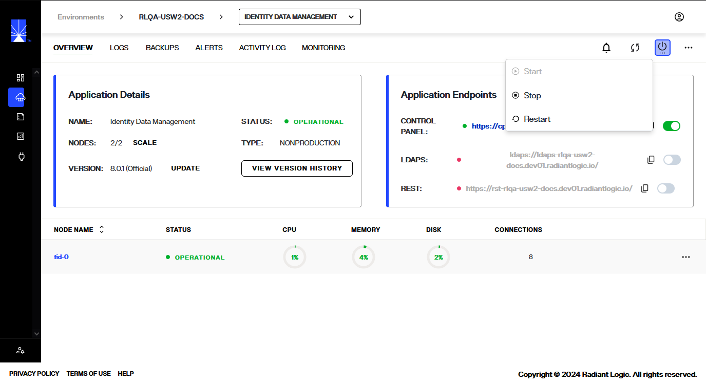

From the list of options elect **STOP** to stop the environment.

> [!note] When an environment is stopped, no data is lost. The environment can be started back to the state before it was stopped.

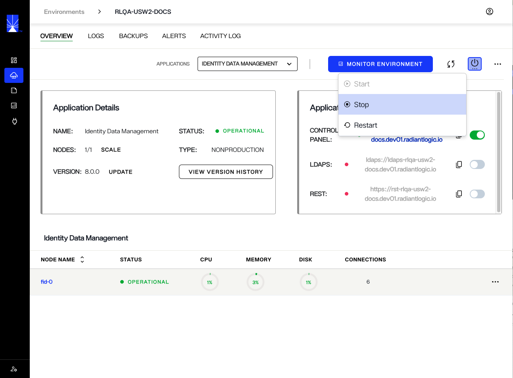

A pop up appears asking to confirm Stopping the environment, click **CONFIRM** to stop the environment, or click **CANCEL** to cancel the operation.

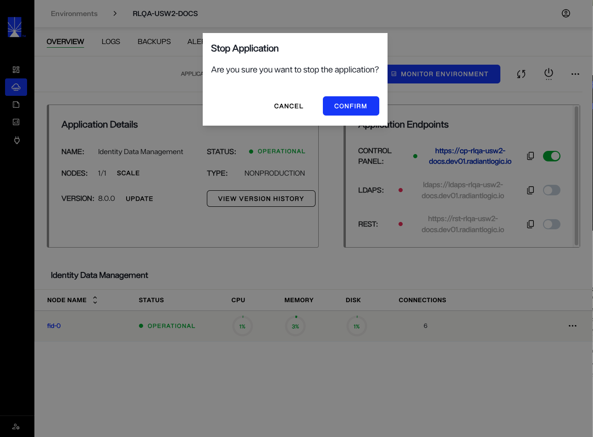

In the upper-right corner of the environment overview page, a message indicates the environment is being stopped.

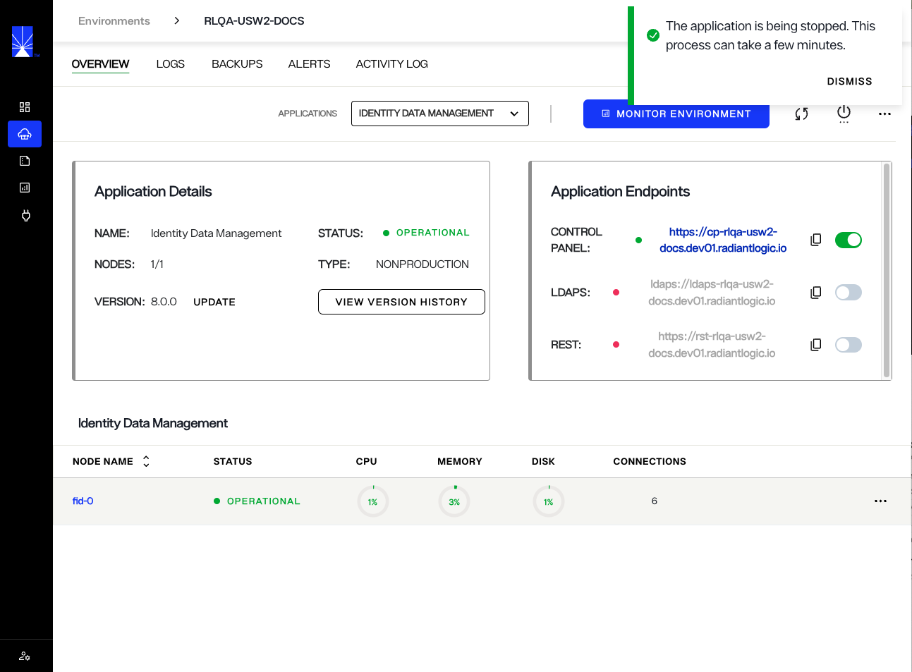

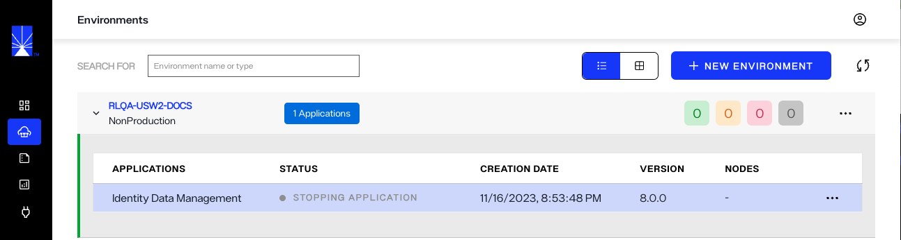

When the environment is successfully stopped, the status on the overview page changes to **OFFLINE**.

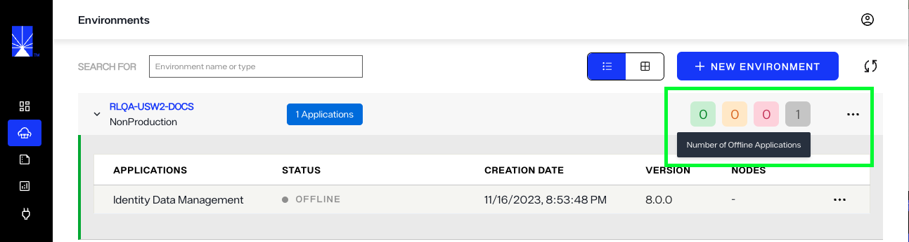

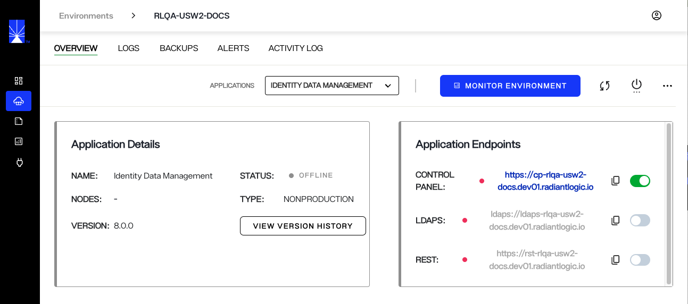

## Start environment

> [!note] Starting an environment is only available when a environment is created and stopped.

To start the selected environment, click the power icon in the upper-right corner of the *Overview* page.

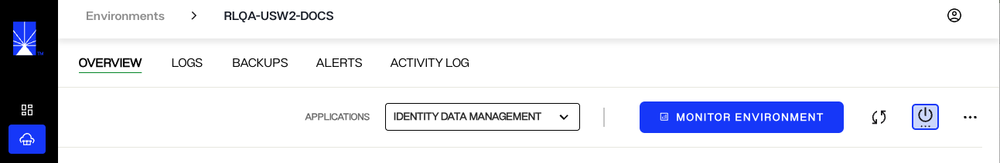

From the options under power, click **Start**.

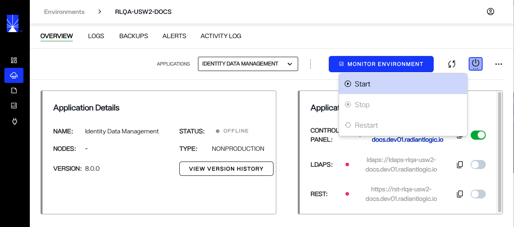

A message prompts you to confirm the **Start Environment**. Click **Confirm** to start the environment, or to go back click **Cancel**.

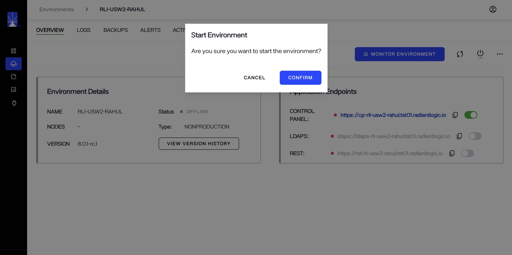

A "Starting environment" message displays on the environment *Overview* page.

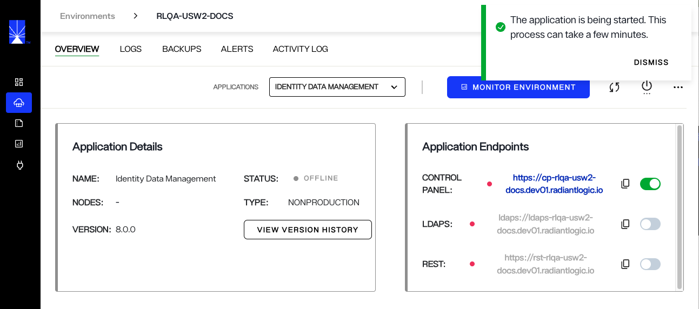

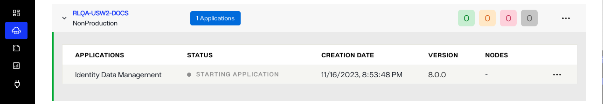

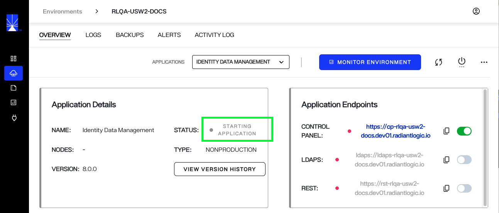

> [!note] The process of starting an environment may take up to 10 minutes.

## Confirmation

After a successful restart of the environment, status of the environment turns to **OPERATIONAL** on the environment *Overview* page.

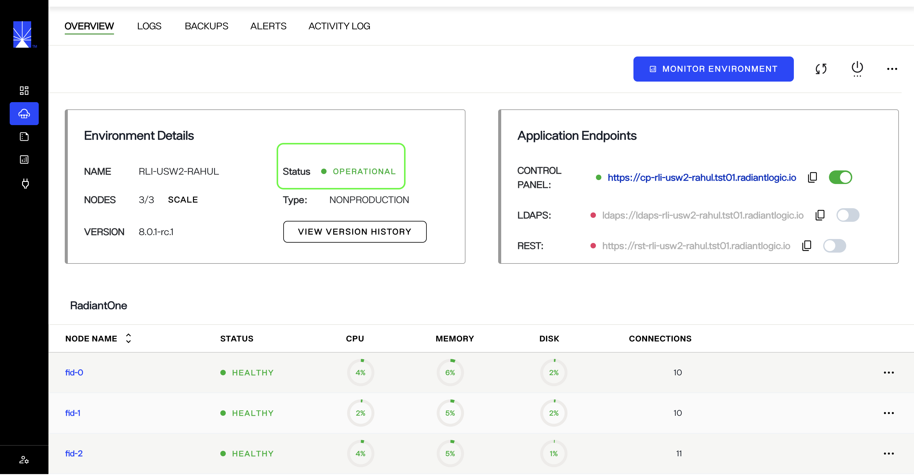

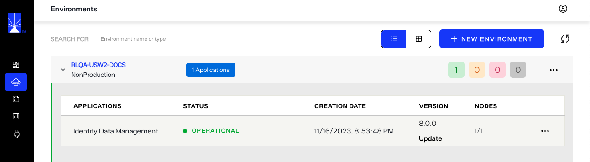
