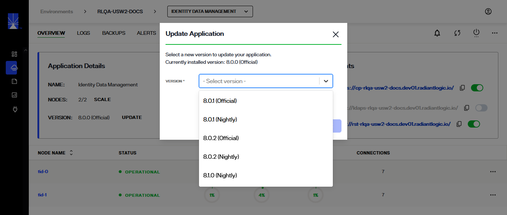

---
keywords:
title: Update an Environment
description: Learn how to manually update the RadiantOne version running in an environment.
---
# Update an Environment

When version updates are available for environments in your Environment Operations Center instance, you will receive an *Update Now* notification. You can update your environments from the *Environments* home screen or you can update a specific environment from its *Overview* screen. This guide outlines the steps required to update your environments from the *Environments* home screen. For details on updating an individual environment from its detailed view, review the environment details guide on [updating an environment](../environment-details/update-environment.md)

[!note] Before getting started, make sure you have your current version of Environment Operations Center and the required number of FID nodes to display for each environment that requires updating.

## Managing environment updates

When an environment requires updating, an **Update Available** message appears next to the environment's version number.

### Begin update

There are two ways to begin the environment update workflow from the home screen, either from the **Options** menu (**...**) or by selecting the **Update Available** message.

To update using the **Options** menu, locate the environment you would like to update and select the corresponding ellipsis (**...**) to display the environment's **Options** menu. From the menu, select **Update** to open the **Update Environment** dialog box.

Alternatively, you can locate the environment you would like to update and directly select the **Update Available** message located next to the environment's version number. This will also open the **Update Environment** dialog box.

### Update version number

Once you have started the environment update workflow, a dialog box appears containing the field required to update the environment version. To update your environment, select the next available version number that is ahead of your current environment version. Your currently installed version number is displayed just above the dropdown menu for reference.

[!note] Environment versions can only be increased incrementally. You cannot select a version that is more than one level ahead of your current version. 

Once you have set the correct version number, select **Update** to begin updating the environment.To quit the update and return to the main *Environments* screen, select **Cancel**.

### Environment update confirmation

After selecting **Update** you will return to the main *Environments* screen. The status of the environment being updated will display as "Updating". A confirmation message will appear indicating that the environment is updating and the process can take up to 1 hour.

If the environment updates successfully, you will receive a success notification and the environment's status will change to "Operational".

If the environment update is unsuccessful, you will receive an error notification and the environment's status will change to "Update Failed".

## Previous updates

You can view updates previously applied to an environment from the *Version History*, located within a specific environment's details view.

### View previous updates

To navigate to an environment's details section, select the environment name from the *Environments* home screen.

This brings you to the environment *Overview* screen. From here, select **View Version History** in the *Environment Details* section to open the *Version History* dialog.

The *Version History* dialog will display a chronological list of all previous updates including the version number, the date the update was applied, and the user who applied the update.

### Revert to a previous update

To be able to revert to a previous environment update, you must have first created a backup of the environment after it was updated. For details on creating environment backups, see the [create a backup](../backup-and-restore/create-backup.md) guide.

To revert to a previous update, follow the same steps to restore an environment backup. Ensure the version number of the back up matches the version number that you would like to restore the environment to. For details on restoring an environment from a backup, see the [restore a backup](../backup-and-restore/restore-backup.md) guide.

## Next steps

After reading this guide you should have an understanding of the steps required to update an environment. To learn how to import a configuration file to an existing environment, review the guide on [importing a configuration file](import-configuration-file.md).

