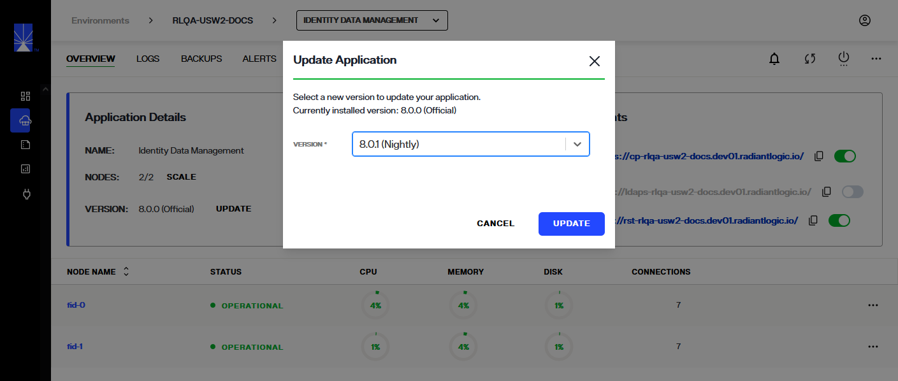
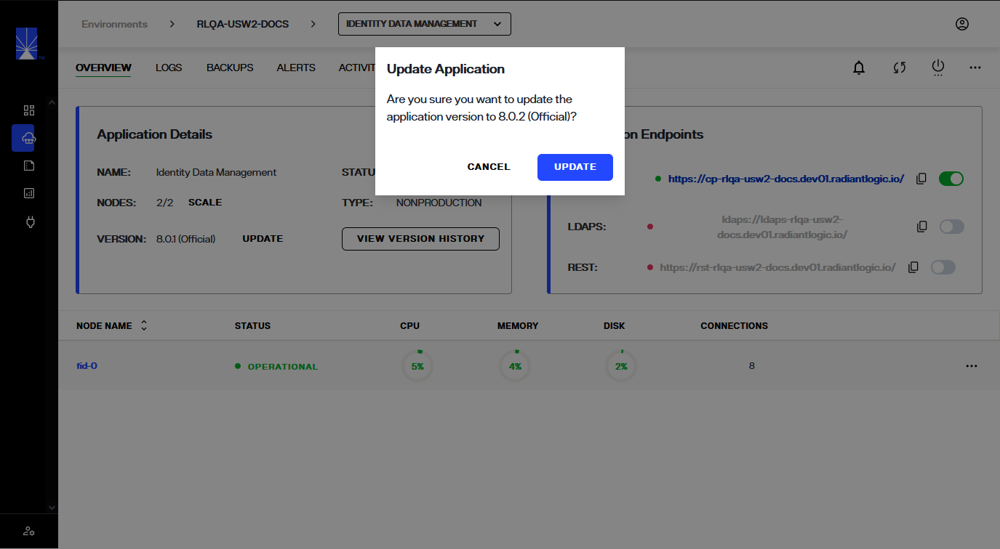
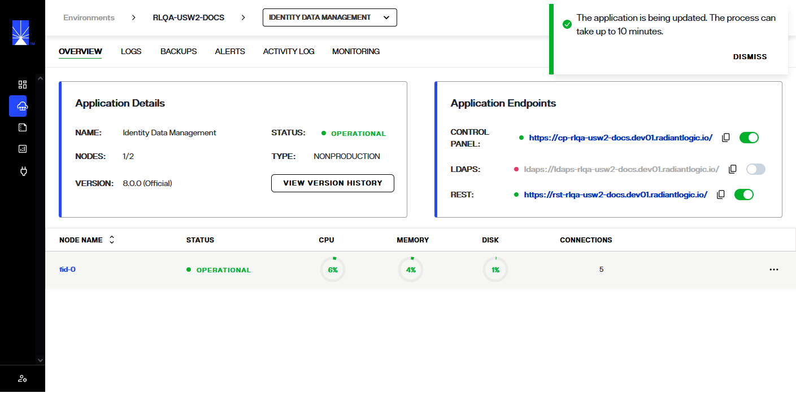
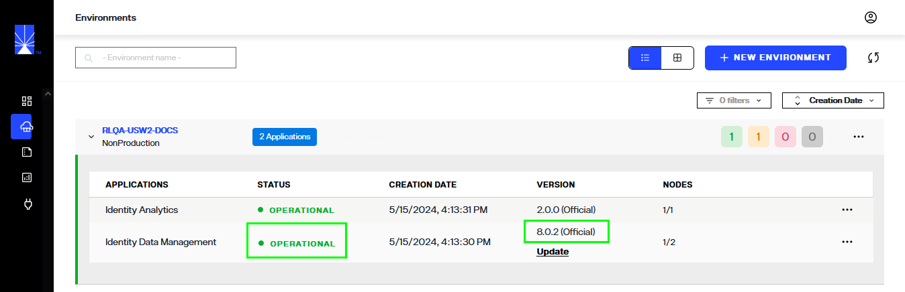
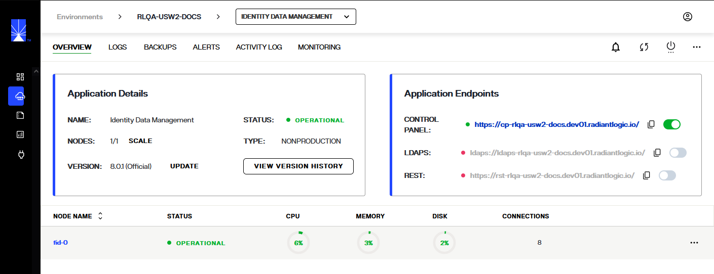
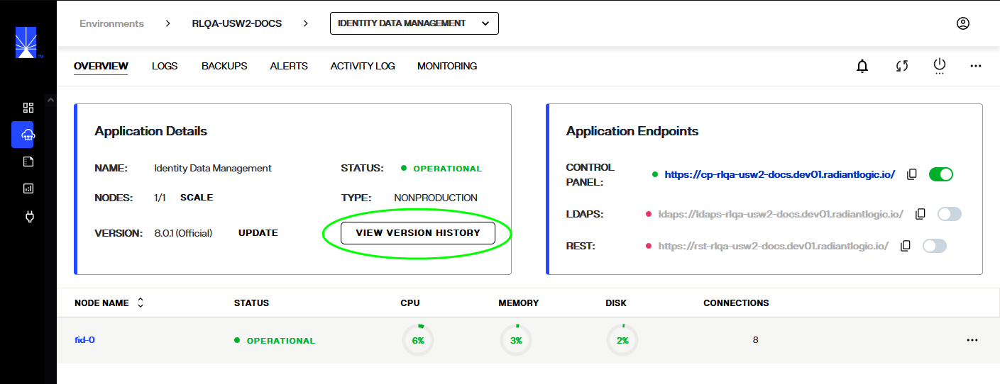
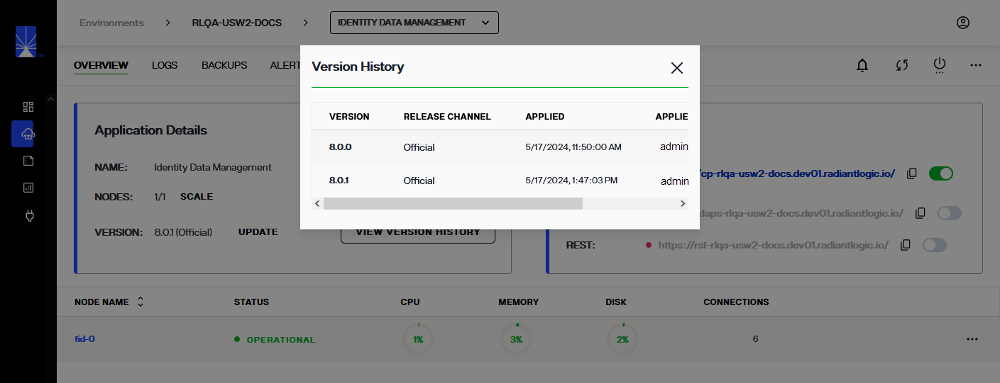

---
keywords:
title: Update an Environment
description: Learn how to manually update the RadiantOne version running in an environment.
---
# Update an Application in an Environment

When version updates are available for an application running in an environment in your Environment Operations Center instance, you will see an *Update* notification. You can update your application from the *Environments* home screen or you can update a specific environment from its *Overview* screen. This guide outlines the steps required to update your environments from the *Environments* home screen. For details on updating an individual environment from its detailed view, review the environment details guide on [updating an environment](../environment-details/update-environment.md).

> [!note] Before getting started, make sure you have your current version of Environment Operations Center and the required number of RadiantOne nodes to display for each environment that requires updating.

## Managing Application Updates

When an application requires updating, an **Update** message displays next to the application's version number.

### Begin update

Begin the application update workflow from the home screen by selecting the **Update** message. The designated environment page displays, and the **UPDATE** option is avaiable next to the **VERSION** number. This also opens the **Update Environment** dialog box.

Clicking on **UPDATE** from environments page opens the detailed overview page for the selected environment.
In the detailed overview for the environment page, you can see the current version and an **UPDATE** option beside it.

Alternatively, you can locate the environment you would like to update and directly select the **UPDATE** message located next to the environment's version number, which again opens the **Update Environment** dialog box.

### Update version number

Once you have started the environment update workflow, a dialog box appears containing the field required to update the environment version. To update your environment, select the next available version number that is ahead of your current environment version. Your currently installed version number is displayed just above the dropdown menu for reference.

> [!note] Environment versions can only be increased incrementally. You cannot select a version that is more than one level ahead of your current version.

Once you have set the correct version number, click **Update*. In the next dialog, click **UPDATE**. To quit the update and return to the main *Environments* screen, select **Cancel**.

### Environment update confirmation

After selecting **Update**, the main *Environments* page displays. The status of the environment being updated displays as "Updating". A confirmation message displays, indicating that the environment is updating both on the envrionement overview as well as on the envrionments page.

When the application is updating, the status of application under the environment, in environments page shows up as offline.

If the environment updates successfully, a success notification displays, and the environment's status changes to "Operational".

If an environment update is unsuccessful, an error notification displays, and the environment's status changes to "**Update Failed**".

## Previous updates

You can view updates previously applied to an environment from the *Version History*, located within a specific environment's details view.

### View previous version updates

To navigate to an environment's details section, select the environment name from the *Environments* home screen.

This brings you to the environment *Overview* screen. From here, select **View Version History** in the *Environment Details* section to open the *Version History* dialog.

The *Version History* dialog displays a chronological list of all previous updates including the version number, the date the update was applied, and the user who applied the update.

### Revert to a previous version

To be able to revert to a previous environment update, you must have first created a backup of the environment after it was updated. For details on creating environment backups, see the [create a backup](../backup-and-restore/create-backup.md) guide.

To revert to a previous update, follow the same steps to restore an environment backup. Ensure the version number of the back up matches the version number that you would like to restore the environment to.

## Update Identity Data Management Super User Credentials

When an environment is created where the RadiantOne Identity Data Management product is installed, the Super User credentials are defined.  To update these credentials in Environment Operations Center,  select the environment name > Identity Data Management application from the *Environments* home screen.
Choose the **Change Password** option from the "..." menu.

Enter the new password, confirm the value and click **Apply Password**. You can click *Generate* to autogenerate a password as an alternative to entering your own value. If you choose to auto-generate a value, remember to click the *Copy to Clipboard* icon to share the new value with your RadiantOne Adminstrator.

## Next steps

After reading this guide you should have an understanding of the steps required to update an environment.

