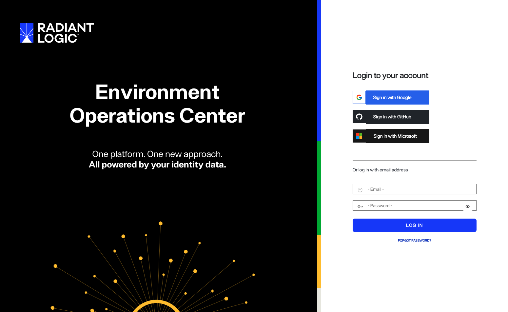
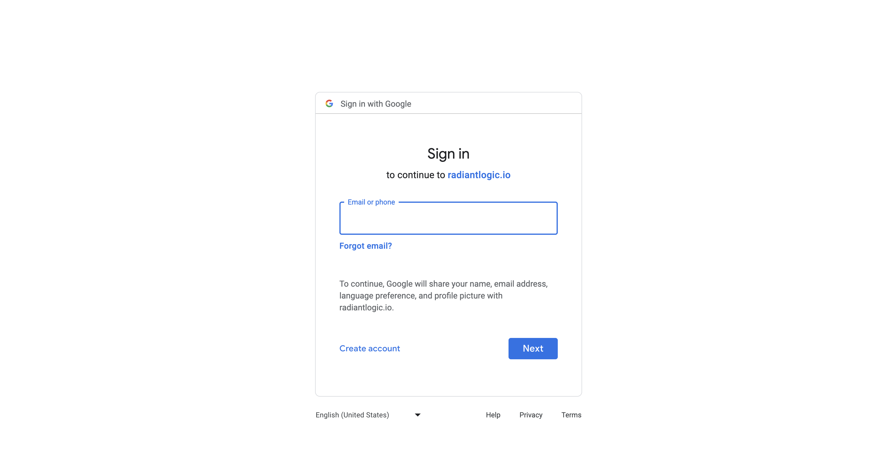
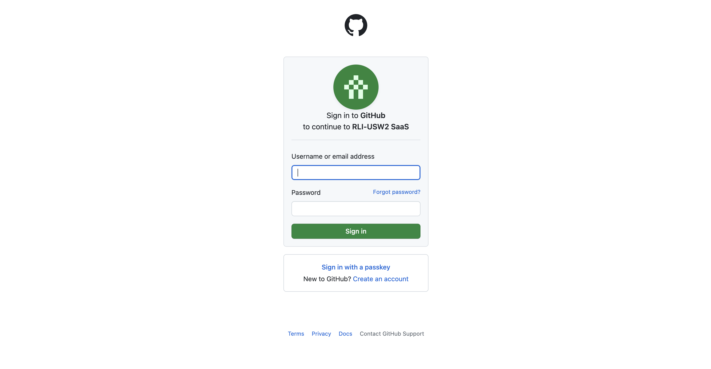
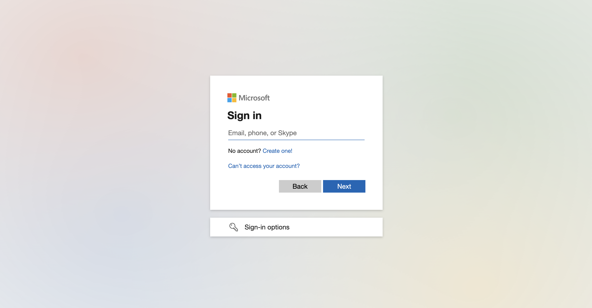

---
keywords:
title: Login Page
description: This Guide provides the information about logging in into Environment Operations Center
---

# Login

This guide provides the overview of options to login into Environment Operations Center

Environment Operations Center provides three different Single Sign On options to login

- **Sign in with Google**
- **Sign in with GitHub**
- **Sign in with Microsoft**

## Getting Started

- Your admin account for the initial user login will be created by Radiant Logic , based on the email id provided by the respective user.
- An initial user will be provided with **Tenant Admin** rights.
- The rights and the access to rest of team members can be provided by the initial user.

> [!note] The user should be added by an admin and provided with necessary access, before logging in.

### Sign In with Google

### Sign in with GitHub

### Sign in with Microsoft

Loggin in with microsoft will require additional authorization from Azure end.

