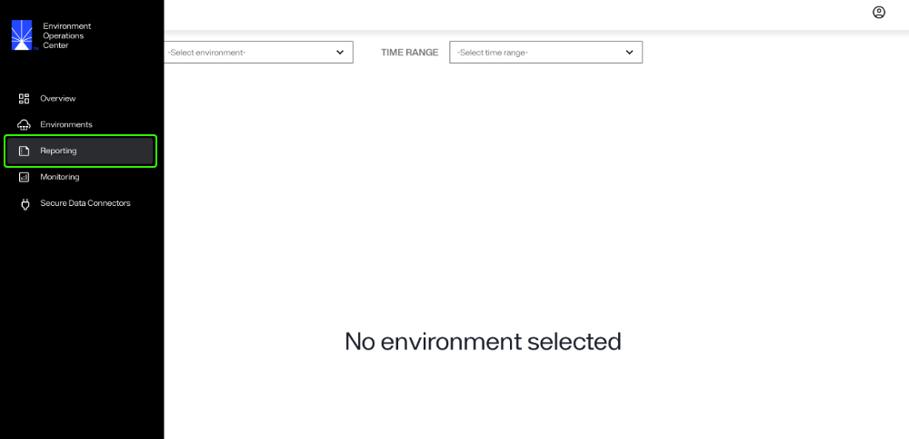
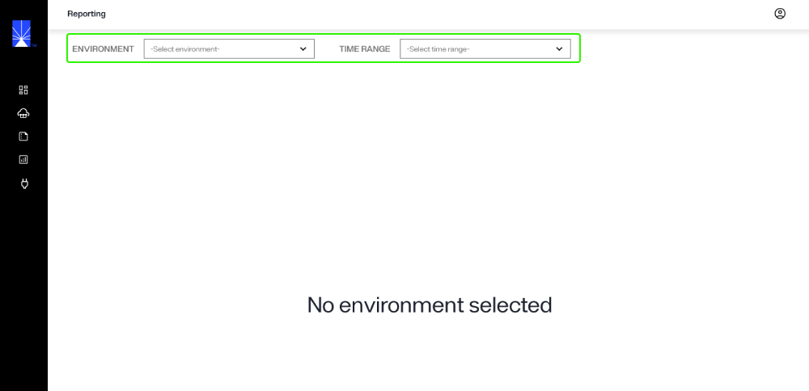
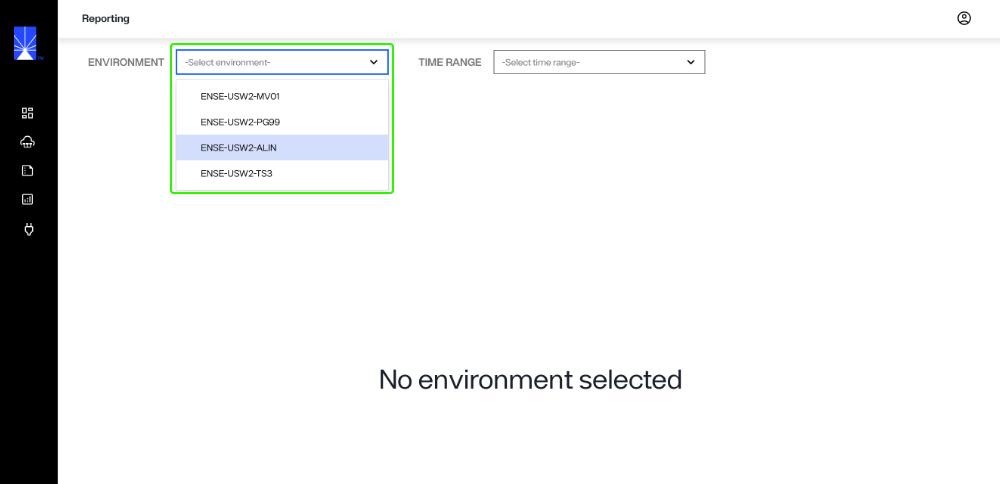
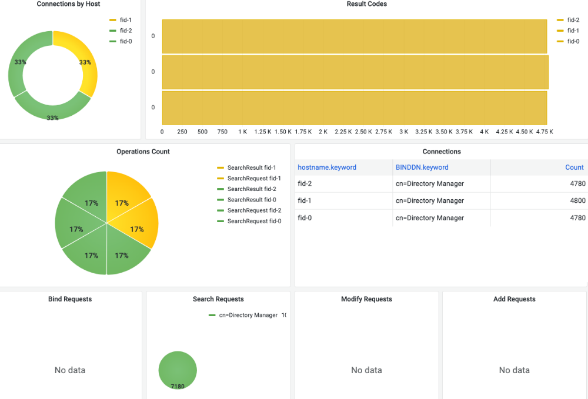
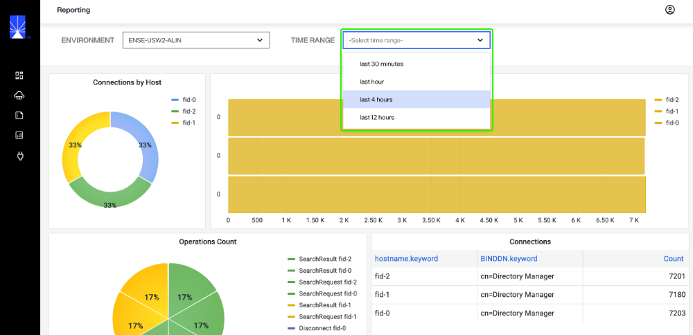

---
keywords:
title: Reporting Overview
description: Reporting overview
---
# Reporting Overview

From the *Reporting* screen, you can generate various reports to assist in monitoring performance and operations within your environments. This guide provides an overview of the *Reporting* section in Environment Operations Center, including its features and how to generate reports. 

[!note] Reports should be generated frequently to maintain a clear understanding of performance, load, configuration updates, and user activity.

## Getting started

To navigate to the *Reporting* screen, select **Reporting** () from the left navigation.

## Generate a report

To generate a report you must select an environment to generate the report for. Optionally, you can also select a time range to filter the data for a specified period of time. 

### Select an environment

From the **Environment** dropdown, select the environment to generate the report for.

A detailed overview of the various components of the environment, their status, and operational health will display.

For further details on the components of each report, see the [report types](report-types.md) guide.

### Filter data by time range

You can filter the report data by time range, allowing you to narrow down the data to target a specific time frame.

To filter by time, select a range from the **Time Range** dropdown.

## Next steps

After reading this guide you should have an understanding of how to generate environment reports to review the operations and health of your environments. For details on reviewing detailed environment logs, see the [environment logs](../environments/logging/environment-logs.md) guide. To learn how to monitor RadiantOne components, see the [monitoring](../monitoring/monitoring-overview.md) guide.
