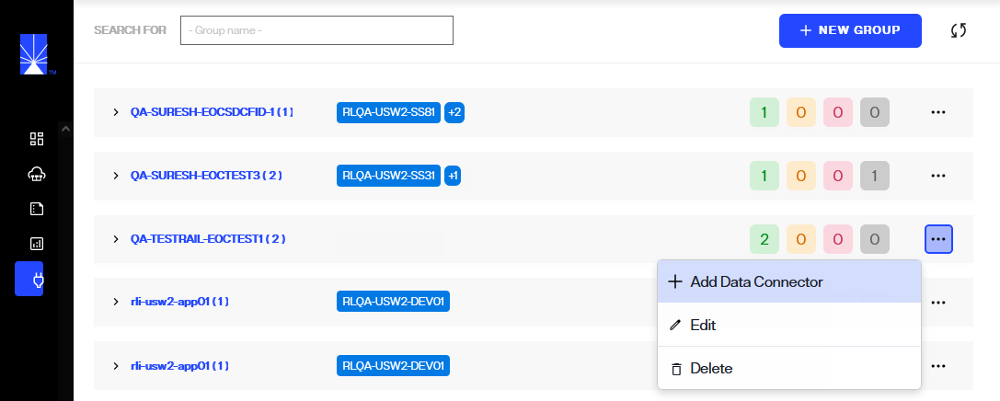
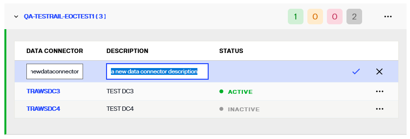

---
keywords:
title: Add a Data Connector
description: Learn how to add a Secure Data Connector to deploy a secure tunnel for integrating data from data sources on-premises to RadiantOne FID running in the cloud environment.
---
# Add a Data Connector

The process to create a new secure data connector and establish a connection with a data source requires the following high-level steps:

- The data connector group must be created in Environment Operations Center.
- Atleast a data connector must be added to the group.
- The secure data connector client must be deployed on the local machine.
- The data source must be defined in the FID Control Panel. 

This guide outlines the steps to add a new secure data connector in Environment Operations Center. For details on deploying the secure data connector client, see the [deploy a secure data connector client](deploy-sdc-client.md) guide. For details on connecting to an on-premise backend from the control panel, see the [connect to an on-premise backend](...) guide.

## Getting started

To establish a connection between Env Ops Center and an on-premises network, a data connector must first be created in Env Ops Center.

To add a new group, select **New Group** from the *Secure Data Connectors* home screen.

## Add Group info

In a **new row**, enter the group name and select one or multiple environments from the list of available environments in the provided group and environment fields.

[!note] Group and Environment are required fields and must be entered to create the group.

| Group Info | Description |
| ------------------- | ----------- |
| Group Name | Provide a group name that is relevant to how secure data connectors will be grouped under this group. Groups provide failover and load balancing for the network. |
| Environment | A minimum of one environment must be associated to a group.  Select environment(s) from the **Environment** dropdown list, a group can be associated to multiple environments. |

Once you have entered these fields, select :white_check_mark: to add the new group.

Once the group is successfully created, it will appear in the list of available groups on the *Secure Data Connectors* home screen.

Now that **group** being created, next step is to add a new data connector. Select **...** from last column of selected group to get list of options, from these options select ***Add Data Connector***.

## Add data connector info

In the *New Data Connector* row, enter the data connector information in the provided name and description fields.

[!note] Name is a required field and must be entered to create the connector.

| Data Connector Info | Description |
| ------------------- | ----------- |
| Name | Provide a name that is relevant to the network being connected to. |
| Description | The description field is optional but is recommended to provide any details that are relevant about the network. This helps with maintaining data connectors. |

Once you have completed entering the required fields for new data connector, select :white_check_mark: to add the new connector.

If the data connector is successfully created, it will appear in the list of available data connectors under the *Group*.

The *Status* of the new data connector will display as "UNREGISTERED". A connection needs to be established between a new data connector and the on-prem or cloud network for the connector to become "Active". For details on deploying the secure data connector client, see the [deploy a secure data connector client](deploy-sdc-client.md) guide.

## Next steps

You should now have an understanding of the steps to create a secure data connector in Environment Operations Center. For details on managing data connectors in Env Ops Center, see the [manage data connectors](manage-data-connectors.md) guide. To learn how to deploy the secure data connector client, see the [deploy a secure data connector client](deploy-sdc-client.md) guide.
