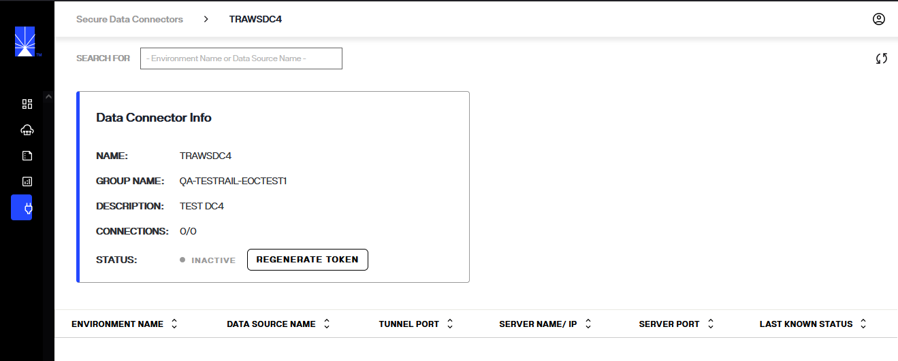

---
keywords:
title: Secure Data Connectors Overview
description: Get a quick introduction to using Secure Data Connectors for connecting data from sources on-premises or private cloud environments to RadiantOne SaaS.
---
# Secure Data Connectors Overview

Secure data connectors allow data to flow from your on premises or private cloud environments to Environment Operations Center. This guide provides an overview of the *Secure Data Connectors* home screen in Env Ops Center and its features. 

## Getting started 

To navigate to the *Secure Data Connectors* home screen, select **Secure Data Connectors** () from the left navigation.

## Secure data connector home screen

The *Secure Data Connector* home screen provides an overview of all your organization's configured data connectors and allows you to start the workflows to add and manage data connectors.

All existing data connectors are listed on the home screen including the group, environments, data connector name, description, and status, grouped under the expand/collapsible groups.

### Add a new data connector

You can start adding new data connectors from the *Secure Data Connector* home screen by selecting the **New Group** button.

Or by selecting ***Add Data Connector*** from the options(...) menu of a selected group.

To learn how to add a data connector, see the [add a data connector](add-data-connector.md) guide.

### Manage data connectors

Each data connector has an **Options** (**...**) dropdown menu that allows you to manage the connector. For details on managing data connectors, see the [manage data connectors](manage-data-connectors.md) guide.

## View data connector details

A detailed view is available for each data connector and provides additional data connector information, registration status, and connection statuses.

Data connector details can be accessed in two ways. One way is to select the data connector name from the list shown on the Secure Data Connectors screen.

Another way to access data connector details is to select **View Details** from the **Options** (**...**) dropdown menu of the corresponding data connector.

### Data connector info

The *Data Connector Info* section in the data connector detailed view outlines the following information about the connector:

| Data Connector Info | Description |
| ------------------- | ----------- |
| Name | The unique name provided for the connector during setup. |
| Group Name | The group the connector was assigned to during set up. There are a minimum of two connectors per network environment to enable load balancing.|
| Description | Additional details about the data connector provided during setup. |
| Connections | The number of on-prem or cloud backend connections made to the data connector. |
| Status | Indicates if the data connector is "Active", "Paused", "Inactive" or "Unregistered". |

### Connection details

All of the on-premise or cloud connections made to the data connector are listed on the data connector details tab. The information listed for each connection includes:

| Connection details | Description |
| ------------------ | ----------- |
| Environment Name | The name of the Env Ops Center environment the connector is associated with. |
| Data Source Name | The given name of the on-premise or cloud data source connected to the data connector. |
| Tunnel Port | The high port where the connection is initiated. |
| Server Name/IP | The IP of the on-prem or cloud data source that has been connected. |
| Server Port | The port of the on-prem or cloud data source where the connection was made. |
| Status | Indicates if the connection is "Connected" or "Disconnected". |
| Last Updated Time | The date and time when the data source status was last updated. |

## Next steps

After reading this guide you should be familiar with the features of the *Secure Data Connectors* screen. For details on adding a data connector in Environment Operations Center, see the [add a data connector](add-data-connector.md) guide.

