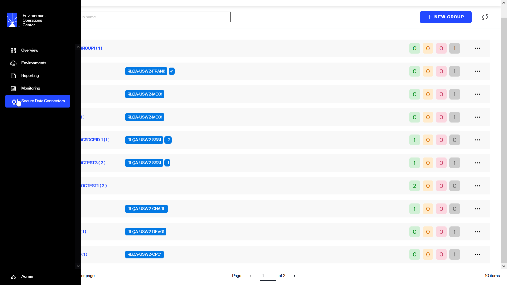
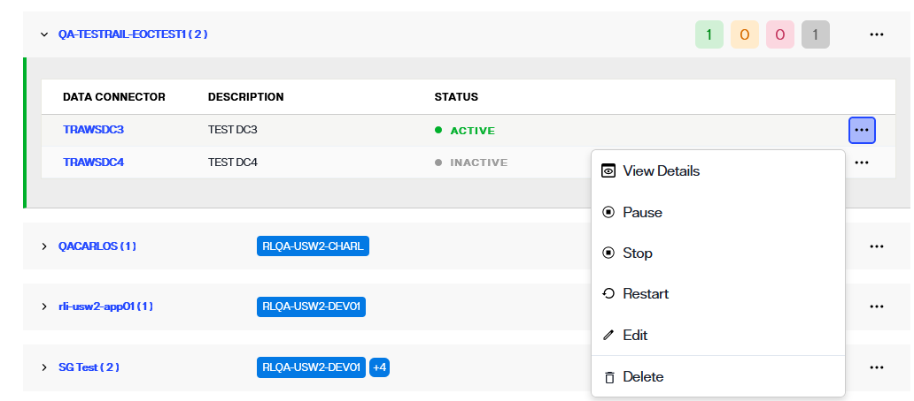
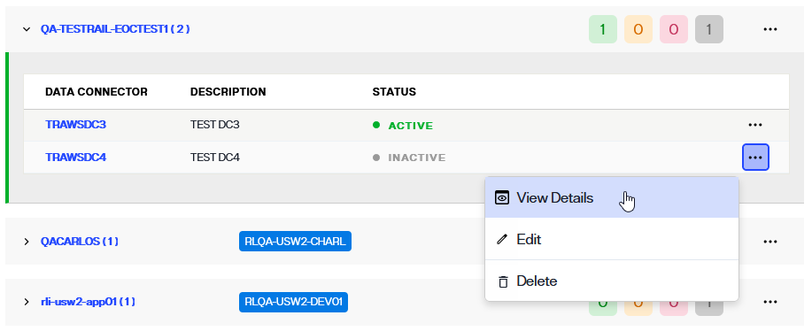

---
keywords:
title: Secure Data Connectors Overview
description: Get a quick introduction to using Secure Data Connectors for connecting data from sources on-premises or private cloud environments to RadiantOne SaaS.
---
# Secure Data Connectors Overview

Secure data connectors allow data to flow from your on premises or private cloud environments to your RadiantOne SaaS environment. This guide provides an overview of the *Secure Data Connectors* home screen in Environment Operations Center and its features. 

## Getting started 

To navigate to the *Secure Data Connectors* home screen, select **Secure Data Connectors** () from the left navigation bar.

## Basic Concepts

### Secure Data Connector

A secure data connector (SDC) provides a secure channel for all TCP-based communication (LDAP, SQL, etc.) between your cloud-based RadiantOne environments and your on-premise or private cloud data sources. One or more secure data connectors can be deployed in your on-premises network.The SDC has been designed and architected with security as its first concern. Here are a few key points concerning security:
- All communications between the SDC and the RadiantOne cloud environments occur over a TLS-only secured WebSocket tunnel. The data exchanged over this channel is encrypted and protected from unauthorized access.
- The initial connection between the SDC and the RadiantOne cloud environments must be initiated from the SDC (on-premise client). The RadiantOne cloud environment cannot initiate this connection.
- The connection between the SDC and the RadiantOne cloud environment requires authentication based on a token generated from the EOC. Attempts at establishing unauthenticated connections from unrecognized SDCs or other clients are rejected. 

### Group

Secure data connectors are organized in **groups**. A group is a logical grouping of one or more secure data connectors that connect to the same set of data sources. By adding more than one secure data connector to a group, you can ensure high availability. Traffic is load-balanced equally to all data connectors that belong to the same group. If one or more secure data connectors within a group fail or become unresponsive, the remaining secure data connectors will automatically ensure connectivity is not interrupted. 

## Secure Data Connector Home Screen

The *Secure Data Connector* home screen provides an overview of all your organization's configured data connectors and allows you to manage them.

The list of data connectors is organized by group. Each group has a set of RadiantOne environments that are allowed to use the data connectors belonging to that group.
Each group contains a list of data connectors and their associated information (name, description, status). You can expand/collapse each group to show or hide the associated data connectors.

### Adding a New Data Connector

Before you can add new data connectors, you must first add a **group**. This can be done by selecting the **New Group** button.

After creating a group, you can add a new data connector by clicking the "..." button on the selected group and selecting ***Add Data Connector***.

For more details on adding a new data connector, please refer to the [Add a Data Connector](add-data-connector.md) guide.

### Manage Data Connectors

Each data connector has an **Options** (**"..."**) menu that allows you to manage the connector. For more details on managing data connectors, please refer to the [Manage Data Connectors](manage-data-connectors.md) guide.

## View data connector details

A detailed view is available for each data connector and provides additional data connector information, registration status, and connection statuses.

Data connector details can be accessed in two ways. One way is to select the data connector name from the list shown on the Secure Data Connectors screen.

Another way to access data connector details is to select **View Details** from the **Options** (**...**) dropdown menu of the corresponding data connector.

### Data connector info

The *Data Connector Info* section in the data connector detailed view outlines the following information about the connector:

| Data Connector Info | Description |
| ------------------- | ----------- |
| Name | The unique name provided for the connector during setup. |
| Group Name | The group the connector was assigned to during set up. There are a minimum of two connectors per network environment to enable load balancing.|
| Description | Additional details about the data connector provided during setup. |
| Connections | The number of on-prem or cloud backend connections made to the data connector. |
| Status | Indicates if the data connector is "Active", "Paused", "Inactive" or "Unregistered". |

### Connection details

All of the on-premise or cloud connections made to the data connector are listed on the data connector details tab. The information listed for each connection includes:

| Connection details | Description |
| ------------------ | ----------- |
| Environment Name | The name of the Env Ops Center environment the connector is associated with. |
| Data Source Name | The given name of the on-premise or cloud data source connected to the data connector. |
| Tunnel Port | The high port where the connection is initiated. |
| Server Name/IP | The IP of the on-prem or cloud data source that has been connected. |
| Server Port | The port of the on-prem or cloud data source where the connection was made. |
| Status | Indicates if the connection is "Connected" or "Disconnected". |

## Next steps

After reading this guide you should be familiar with the features of the *Secure Data Connectors* screen. For details on adding a data connector in Environment Operations Center, see the [add a data connector](add-data-connector.md) guide.

